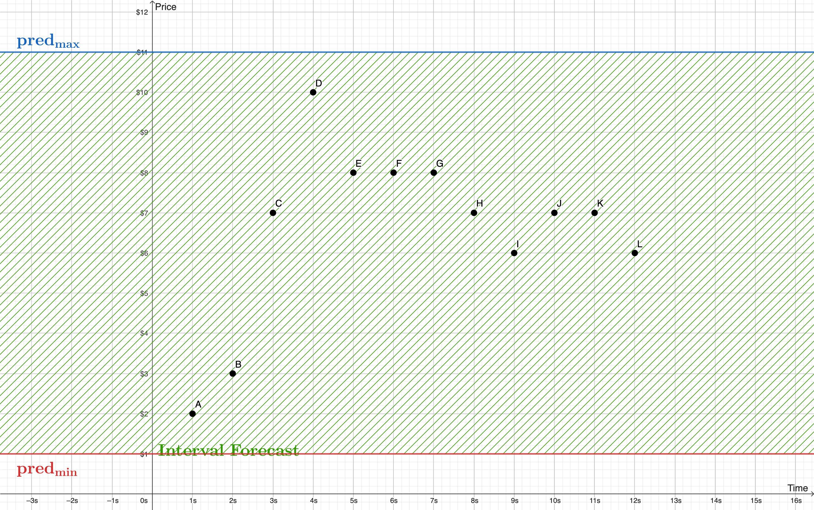
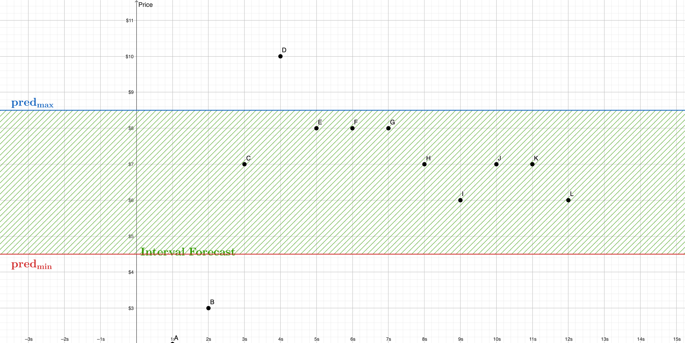
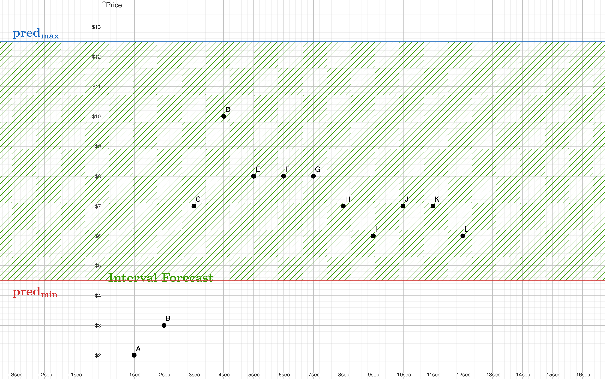

# Interval Score Examples

The process used to score and rank the Interval Forecasts is relatively straightforward if observed graphically. Below we’ve drawn three examples of hypothetical forecasts along with 12 “observed” price points to illustrate the calculation. The y-axis below represents “Price (USD)” and the x-axis is “Time (sec)”

## Wide Interval

The first example shows the score when the forecast price interval is excessively wide.  The inclusion-factor is 100%, but the width-factor penalizes the final score:

<figure><figcaption></figcaption></figure>

As shown, the maximum and minimum observed price, along with the predicted max and min are given by:

```
max_price = 10
min_price = 2
pred_max = 11
pred_min = 1
```

Therefore, in this case the effective top and bottom are both determined by the observed price:

```
eff_top = min(max_price, pred_max) = 10
eff_bot = max(min_price, pred_min) = 2
```

Leading to a weight factor of 0.8, an inclusion factor of 1.0, and a final Interval Score of 0.8:

```
f_w = (eff_top - eff_bot) / (pred_high - pred_min)
    = 8 / 10 = 0.8
    
f_i = (12 points  included) / (12 points total) = 1.0
r_ivl = 0.8 * 1.0 = 0.8
```

## Narrow Interval

\
By contrast, when the interval forecast does not include the entire price time series, the width-factor can reach 100%, because none of the prediction is “wasted”; however the inclusion factor lowers the final score.

<figure><figcaption></figcaption></figure>

The maximum and minimum observed price, along with the predicted max and min are given by:

```
max_price = 10
min_price = 2

pred_max = 8.5
pred_min = 4.5
```

Therefore, in this case the effective top and bottom are both determined by the predicted interval:

```
eff_top = min(max_price, pred_max) = 8.5
eff_bot = max(min_price, pred_min) = 4.5
```

Leading to a weight factor of 1.0, an inclusion factor of 0.75, and a final Interval Score of 0.75:

```
f_w = (eff_top - eff_bot) / (pred_high - pred_min)
    = 4 / 4 = 1.0
    
f_i = (9 points  included) / (12 points total) = 0.75
r_ivl = 1.0 * 0.75 = 0.75
```


## Offset Interval

As a final example, it is of course possible for both the width and inclusion factors to be sub-optimal at the same time. This happens when part of the Interval Forecast is wasted, but it also fails to include the entire observed time series. Note the reduced score, even though the width of the forecast and the observed range is the same ($8):

<figure><figcaption></figcaption></figure>

The maximum and minimum observed price, along with the predicted max and min are given by:

```
max_price = 10
min_price = 2

pred_max = 12.5
pred_min = 4.5
```

In this case the effective top and bottom are by the prediction and observed prices, respectively:

```
eff_top = min(max_price, pred_max) = 10
eff_bot = max(min_price, pred_min) = 4.5
```

Leading to a weight factor of 0.6875, an inclusion factor of 0.8333, and a final Interval Score of approximately 0.573:

```
f_w = (eff_top - eff_bot) / (pred_high - pred_min)
    = 5.5 / 8 = 0.6875
    
f_i = (10 points  included) / (12 points total) = 0.8333
r_ivl = 0.6875 * 0.8333 ~ 0.573
```
