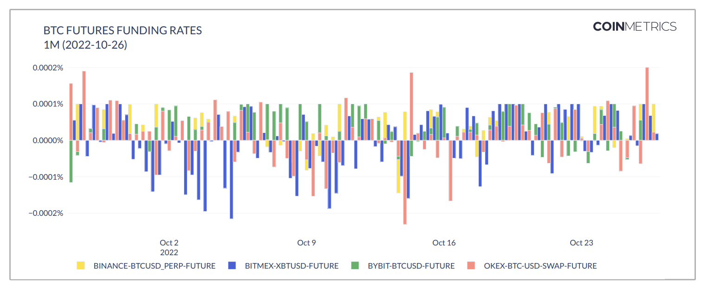

# Funding Rates

## **Definition**

Funding rates are a mechanism used by exchanges to keep the price of perpetual futures contracts aligned with the underlying spot market price. Unlike traditional futures, perpetual futures have no expiration date, which means they can deviate from the spot price indefinitely. The funding rate system addresses this by facilitating periodic payments between long and short position holders. These payments incentivize traders to take positions that bring perpetual futures prices closer to the underlying spot price.

Many exchanges report two different funding rates. The realized funding rate represents the actual funding rate calculated over the previous funding interval that is used in determining the funding payment. The predicted funding rate is the current estimate of what the funding rate will be at the end of the current funding interval. Some exchanges refer to the predicted funding rate as the real-time funding rate or the next funding rate. Any references to the term “funding rate” here refer to the realized funding rate. For more information on the predicted funding rate, please see [Market Predicted Funding Rates](predicted-funding-rates.md).

## **Details**

In traditional futures markets, contracts have a set expiration date. At expiration, the futures price converges with the spot price of the underlying asset. This natural convergence ensures that the contract reflects the true market value of the asset when it settles.

However, perpetual futures contracts differ in that they do not expire. Without an expiration date, there is no natural point of convergence with the spot price. To prevent persistent price divergence, exchanges introduced the **funding rate mechanism**.

Under this system:

* When the perpetual futures price exceeds the underlying spot price, the funding rate is positive. In this case, traders holding long positions pay funding fees to those holding short positions.
* When the perpetual futures price trades below the spot price, the funding rate is negative, meaning short position holders pay funding fees to long position holders.

This mechanism creates a financial incentive for traders to open positions that bring the perpetual futures price closer to the spot price. For example:

* If the price of a perpetual contract is too high, short sellers are rewarded with funding payments, encouraging more short positions and pushing the price down.
* Conversely, if the price is too low, long traders receive funding payments, motivating more buying activity and pushing the price up.

While the exact formula for calculating the funding rate varies by exchange, it generally consists of two key components:

* Interest Rate Differential: The difference between the borrowing rates of the two assets involved (e.g., USD and BTC).
* Premium/Discount: The deviation between the perpetual futures price and the spot price.

The funding rate is usually calculated at regular intervals (e.g., every 8 hours on many major exchanges) and applied periodically.

## **Chart**

<figure><figcaption><p>Source: CM <a href="https://coinmetrics.io/insights/state-of-the-market/">State of the Market</a></p></figcaption></figure>

## API Endpoints

Funding rates can be accessed using the `timeseries/market-funding-rates` endpoint.


[openapi.yaml](../../../.gitbook/assets/openapi.yaml)




```shell
curl --compressed "https://api.coinmetrics.io/v4/timeseries/market-funding-rates?markets=binance-BTCUSDT-future&limit_per_market=1&api_key=<your_key>"
```



```python
import requests
response = requests.get('https://api.coinmetrics.io/v4/timeseries/market-funding-rates?markets=binance-BTCUSDT-future&limit_per_market=1&api_key=<your_key>').json()
print(response)
```



```python
from coinmetrics.api_client import CoinMetricsClient

api_key = "<API_KEY>"
client = CoinMetricsClient(api_key)

print(
    client.get_market_funding_rates(
        markets=["binance-BTCUSDT-future"], limit_per_market=5
    ).to_dataframe()
)
```



## **Example**

A sample of the funding rates data from the `binance-BTCUSDT-future` market from our [`/timeseries/market-funding-rates`](https://docs.coinmetrics.io/api/v4#operation/getTimeseriesMarketFundingRates) API endpoint is provided below.

```
{
  "data": [
    {
      "market": "binance-BTCUSDT-future",
      "time": "2025-03-21T08:00:00.000000000Z",
      "database_time": "2025-03-21T08:03:38.782388000Z",
      "rate": "0.00005324",
      "period": "08:00:00",
      "interval": "08:00:00"
    },
    {
      "market": "binance-BTCUSDT-future",
      "time": "2025-03-21T16:00:00.000000000Z",
      "database_time": "2025-03-21T16:03:37.280592000Z",
      "rate": "0.00002518",
      "period": "08:00:00",
      "interval": "08:00:00"
    }
  ]
}
```

* **`market`**: The id of the market. Market ids use the following naming convention: `exchangeName-baseAsset-quoteAsset-spot` for spot markets, `exchangeName-futuresSymbol-future` for futures markets, and `exchangeName-optionsSymbol-option` for options markets.
* **`time`**: The exchange-reported time in ISO 8601 date-time format with nanoseconds precision.
* **`rate`**: The funding rate expressed as a percentage over the period. For example, if the funding rate is 0.10%, expressed as an 8 hour rate and calculated over the past 8 hours, the `rate`is `0.0010`.
* **`period`**: The periodicity of the funding rate. If the rate is `0.0010`then this rate would be applied every period defined by this field. In other words, every period, the funding rate payments are calculated and the funding rate payments are exchanged between long and short position holders.
* **`interval`**: The interval of time over which the funding rate is calculated.
* **`database_time`**: The timestamp when the data was saved in the database in ISO 8601 date-time format with nanoseconds precision.

## **Frequently Asked Questions**

### **Can you help me understand the difference between the `period` and `interval` fields?**

Each exchange has its own methodology for calculating the funding rate. Many exchanges use either a 1 hour or 8 hour interval of time where input data is measured used in the calculation of the funding rate. This interval of time is captured in the `interval` field. Some exchanges calculate the funding rate instantaneously and for these exchanges we set the interval to `00:00:00.001` by convention.

Exchanges also differ in how they report the rate. For some exchanges, the rate represents an 8 hour rate. For others, it represents a 1 hour rate. This means that the funding rate is applied and funding payments are calculated and exchanged between long and short position holders every period as defined by the `period` field.

### **Since exchanges follow different conventions, how can I annualize the funding rate so that funding rates across exchanges can be compared?**

You can use the `period` field. The formula is to annualize the funding rate is `rate * (1 year) / (period in years)`. Please note that funding payments are always applied to the value of the long or short position and represent a payment that does not change the value of the long or short position, so funding rates are not compounded.

### What determines the frequency of funding rates data?

Our funding rates data updates based on the funding interval.

### **Why are there so many funding rate values of 0 for Bitfinex?**

Bitfinex funding rate allows for 0% funding rates or no funding payments. [Bitfinex's funding rate methodology](https://www.bitfinex.com/legal/derivative/funding) states that an obligation to make a funding payment arises whenever the average spread is greater than 0.05% or less than -0.05%. When the average spread over the funding period is equal to or within -0.05% and 0.05%, a funding payment will not be required.

## **Harmonization Discussion**

Exchanges differ in their funding rate mechanism design and how they report the data through their API. This section will discuss the key differences between exchanges and our approach to creating a harmonized data model.

* **Funding rate period:** Interest rates represent the return over a defined period of time. Many interest rates we encounter are reported on an annualized basis (a period of one year), but exchanges can differ on the funding rate period that they use. For many exchanges, the funding rate represents an 8 hour interest rate, meaning that the rate represents the return based on the funding payment over an 8 hour period. To ensure accurate cross-exchange analysis, we store the funding rate period as a separate field in our data model. With this information, a user can compare funding rates between exchanges that have different funding rate periods by converting the funding rates to a common funding period.
* **Funding interval:** The funding interval represents how often the funding rate and funding payments are calculated. For many exchanges, a funding rate is produced every 8 hours and it is calculated based on the difference between the perpetual futures price and the spot price over the previous interval. In this case, the funding interval is 8 hours. For some exchanges, the funding rate and funding payments are calculated on a continuous basis, so the funding interval is set to 1 millisecond by convention.
* **Exchange-reported timestamp:** Exchanges differ in the how they report the timestamp associated with funding rates. Many exchanges report the funding rate as a timeseries, that is, a series of data points with timestamps that are equally spaced through time. The timestamps represent the time when the funding rate and funding payments are calculated. Other exchanges report the funding rate as a snapshot in time and the exchange-reported timestamp represents the timestamp of the query. This method of reporting the funding rate requires some transformation to convert it to a timeseries. Regardless of how the exchanges report the timestamp, we store the funding rates as a timeseries, with one observation at the end of every funding interval.

## **Availability**

The previous 24 hours of funding rates data is available through our community API. Community data is available via HTTP API only and is limited to 10 API requests per 6 seconds per IP address. All of our funding rates data is available through our professional API with higher rate limits.

### **Availability by Market**



### Availability by Exchange

| Exchange | Start Date |
| -------- | :--------: |
| Binance  | 2019-09-10 |
| Bitfinex | 2020-12-02 |
| BitMEX   | 2020-06-18 |
| Bybit    | 2018-11-15 |
| Deribit  | 2019-04-30 |
| dYdX     | 2025-02-13 |
| FTX      | 2019-03-06 |
| Huobi    | 2020-03-25 |
| Kraken   | 2018-08-31 |
| OKEx     | 2020-10-30 |
