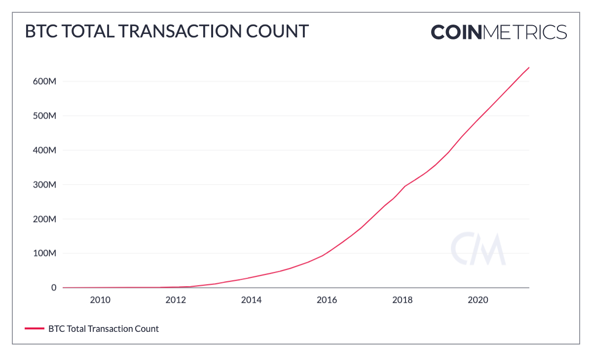
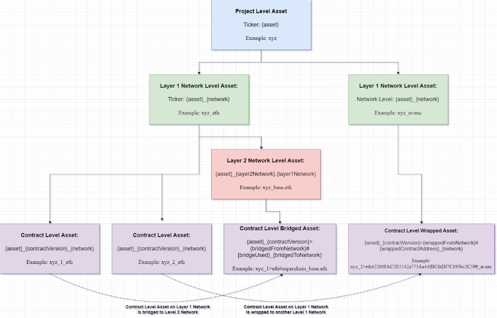

# Network Data FAQs

### **Why don’t you have Coinbase deposits/withdrawals (on-chain flows) supply data?**

We don't have on-chain metrics for Coinbase addresses because they don't reuse addresses. At this time, no data providers can get an accurate measurement on their on-chain activity.

That said, we do offer full market data coverage for Coinbase through our Market Data Feed if you would like visibility into their trading volume.

### **Do your aggregate exchange deposit/withdrawal and supply (on-chain flows) metrics include any Coinbase flows?**

Our aggregate on-chain exchange metrics (eg. FlowOutExInclUSD or FlowOutExInclUSD) do include some Coinbase cold storage addresses. However, relative to the inputs from other constituent exchanges the the impact on the total aggregate flows is minimal.

### **Why is your Current Supply (SplyCur) of XLM different from the supply reported on Stellar’s Dashboard? (**[**https://dashboard.stellar.org**](https://dashboard.stellar.org)**)**

This difference is due to how we treat the 55 billion tokens that the Stellar Development Foundation “burned”, or more accurately, rendered un-spendable. They sent the tokens to an address that cannot sign transactions. The public key that can sign for it has a weight set to 0, which makes transactions invalid. Since they technically still exist on the ledger, our Current Supply (SplyCur) includes them.

### **What is the latency of block-by-block network data?**

The end-to-end latency for BTC BBB metrics is at most 54 seconds with a median of 14 seconds and an average of 20 seconds. For ETH BBB, this is at most 31 seconds with a median of 5 seconds.

### **Why does your Market Capitalization metrics differ so heavily from other data providers?**

Generally, there is a great deal of inconsistency in the market with respect to Market Capitalization calculations. As a result, we have several Market Capitalization metrics. Our metric labeled [Market Cap](network-data-overview/market/market-capitalization.md) uses the [Current Supply](network-data-overview/supply/current-supply.md) (sum of all native units ever created and currently visible on the ledger) in its formulation. Unlike some other data providers, it does not exclude illiquid supply held in escrow or foundation accounts. Our [Free Float Market Cap](network-data-overview/market/market-capitalization.md#e), however, does exclude native units held by company insiders, controlling investors and long term strategic holders.

Another way to think about our Market Cap is to equate it to the Fully Diluted Market Cap, while other many other market caps metrics use reported or an approximation of circulating supply - similar to our Free Float supply, but often not using reported, not on-chain data to validate the approximations.

### **Do you have metrics for total blockchain size?**

No, but we do have a metric for [Sum Block Size (in bytes)](network-data-overview/network-usage/blocks.md#blksizebyte) (BlkSizeByte), which you can sum up to get blockchain size. You can also use our runningTotal function in our Formula Builder to show the size over time.

.png)

### **Do you have metrics for total transactions?**

No, we don’t have total transactions, but we have [Tx Cnt](network-data-overview/transactions/transactions.md#txcnt) (TxCnt or Transactions per interval), which you can sum up to get total transactions. You can also use our runningTotal function in our Formula Builder to show total transactions over time.



### **How can you calculate total transfer value on the Ethereum Blockchain (ETH + other ERC20s)?**

You can calculate this manually by summing the [transfer value](network-data-overview/transactions/transfers.md) for ETH and ERC20s. You can all use our charting tool to create a stacked view of all ERC20s' Transfer Values, or our formula builder to create an aggregate.

.png)

### **What is the best source for daily volume for Tether-Omni, Tether-ERC20, USDC and DAI?**

We have a [Trusted Volume ](../market-data/market-data-overview/volume/volume_trusted.md)metric in Network Data Pro for stablecoins (USDT, USDC, DAI, PAX, BUSD, TUSD, etc.), which represents the volume for these assets on the most trusted exchanges (a subset of our coverage universe).

We also have trading volume that occurs on centralized exchanges for every market in our coverage universe available via our Market Data feed.

One note: Centralized exchanges do not differentiate between Tether-Omni, Tether-ERC20, and Tether-TRON markets. They lump all the variants of Tether into one tradeable asset. So it's not possible to break out the trading volume of the different variants of Tether on centralized exchanges.

### **Is there a way to approximate the number of users for a specific blockchain?**

You can use the "[Address Count with Balance](network-data-overview/addresses/address-balances.md)" metrics to approximate this, although you should keep in mind that users may have multiple addresses and certain addresses (e.g., custodian or exchange addresses) may represent multiple users. For day to day use, you can use our active addresses metrics. We provide aggregate [active address metrics](network-data-overview/addresses/active-addresses.md#active-addresses) (AdrActCnt) as well as aggregates for [receiving](network-data-overview/addresses/) and [sending](network-data-overview/addresses/active-addresses.md#adractsent) addresses (AdrActRecCnt and AdrActSentCnt).

### **Do you have a metric for the number of days BTC is held between transactions?**

Since the BTC network uses a UTXO-based data model, we can calculate the number of days BTC is held between transactions by looking at unspent transaction outputs. Our [UTXOAgeMean](network-data-overview/network-usage/utxos.md#utxoagemean) metric calculates the average number of days a UTXO-based asset is held between transactions, whereas our [UTXOAgeMed](network-data-overview/network-usage/utxos.md#utxoagemed) calculates the median.

It's important to note that these metrics are only calculable for UTXO-based networks, so they won't work for account based networks such as Ethereum.

### **Why does your FeeTotNtv metric for BTC slightly differ from other data providers?**

This discrepancy is likely the result of using differing timestamps. We use the median block timestamp for BTC, while many other providers calculate this using the miner timestamp.

### **How are your aggregated Exchange Flows calculated?**

Exchange flows are estimated using the [common-input-ownership heuristic](https://en.bitcoin.it/wiki/Common-input-ownership_heuristic), which assumes that addresses that are inputs to the same transaction share an owner. This technique is precise, but requires at least one seed address for every exchange, limiting coverage to a predetermined universe of exchanges. The heuristic is also broken by [CoinJoins](https://en.bitcoin.it/wiki/CoinJoin) and [peeling chains](https://en.bitcoin.it/wiki/Privacy#Change_address_detection). You can find a bit more context around these methodologies in this [research piece](https://coinmetrics.io/following-flows-ii-where-do-miners-sell/).

### **How are your aggregated Miner Flows calculated?**

Miner flows are estimated by basing clustering on an address’s distance in hops from the coinbase transaction. Addresses that have received a coinbase reward, or 0-hop addresses, are assumed to belong to mining pools. 1-hop addresses that have received payment from a 0-hop address are tagged as belonging to miners. This heuristic is less precise than the common-input-ownership heuristic, but roughly [mirrors the structure](https://braiins.com/blog/when-and-why-bitcoin-miners-sell-btc) of mining pool wallets and provides better coverage. You can find a bit more context around these methodologies in this [research piece](https://coinmetrics.io/following-flows-ii-where-do-miners-sell/).

### What are the exchanges that serve as constituents for your Trusted Volume metric?

Our trusted volume metric is an aggregation of the reported volume from exchanges that we consider the most accurate and trustworthy. The full list of constituent exchanges included in our Trusted Volume is [here](https://coinmetrics.io/special-insights/trusted-exchange-framework-2-1/).

### **Is there a way to calculate ETH staking yield metrics with your Consensus Layer metrics?**

A validator’s expected annual percentage return (APR) from staking rewards accumulated on the Consensus Layer, assuming perfect performance and uptime, can be estimated with the formula below based on protocol parameters ([source for derivation](https://eth2book.info/altair/part2/incentives/issuance#validator-rewards)):

$$
2940.21 \div \, \sqrt[]{ValidatorActOngCnt}
$$

For example, with 423,000 active validators as of September 9, 2022 this comes out to a 4.52% expected return on a validator’s 32 ETH effective balance. The expected annual protocol issuance can also be calculated from the following formula ([source for derivation](https://eth2book.info/altair/part2/incentives/issuance#overall-issuance)):

$$
940.87 \times \, \sqrt[]{ValidatorActOngCnt}
$$

With 423,000 active validators this comes out to 611,927 ETH issued per year.

After The Merge, validators will also receive user priority transaction fees on the Execution Layer – sometimes referred to as ‘tips’ – for proposing blocks. The magnitude of this additional source of yield can be inferred from the existing FeePrioTotNtv metric on the Execution Layer. Using a [30-day moving average of tips paid per block](https://charts.coinmetrics.io/formulas/#4308), we can estimate the impact of tips to the validator APR from CL awards above.

**First**, finding the average tips paid per block, which fluctuates greatly depending on the demand for Ethereum blockspace:

$$
sma(FeePrioTotNtv / BlkCnt, 30)
$$

This comes out to 0.07 ETH over the last 30 days.

**Next**, from the equation above we can find the yearly per-validator expected ETH reward from participating on the Consensus Layer with a specified number of active validators:

$$
940.87 \times \sqrt[]{ValidatorActOngCnt} \div ValidatorActOngCnt
$$

​This comes out to an average 1.45 ETH in yearly rewards with 423,000 active validators.

**Then**, with 2,629,800 chances to propose blocks on the Consensus Layer each year, the average number of times a validator will get the opportunity to propose a block (and collect tips) can be found from:

$$
(1/ValidatorActOngCnt) \times (2,629,800)
$$

​This comes to 6.22 with 423,000 active validators (assuming they all have an equal 32 ETH effective balance there is a 1 in _ValidatorActOngCnt_ chance of being selected to propose at a given slot on the CL).

**Finally**, taking this all together:

$$
100\times(((32 +1.45 + (0.07\times6.22))/32) - 1)
$$

​This comes out to 5.89%, an increase of roughly 140 basis points to the APR from Consensus Layer rewards.

However, it is important to note that the information above is purely an expected and theoretical yield given the current number of validators and historical demand for Ethereum blockspace. In practice, individual validator returns will vary by chance as well as performance. We anticipate releasing realized staking yield metrics that take into account validators’ actual observed performance.

To learn more, make sure to check out the Validator Economics section of our [Mapping out The Merge report.](https://coinmetrics.io/special-insights/ethereum-merge/)

### What asset ticker naming conventions does Coin Metrics use?

Coin Metrics assigns a unique ticker to each asset in our coverage universe. However, what might be considered as one asset can actually exist in various forms and across multiple networks. The naming convention we use must consider a number of situations.

* An asset may be represented by tokens on more than one layer one network. For instance, Tether exists on 16 different networks, such as Ethereum, Solana, and Tron. Similarly, an asset may also exist on multiple versions of a layer two network deployed across multiple layer one networks.
* An asset may undergo a contract upgrade to enable new features or address security flaws. This involves deploying a new smart contract to create a new token. Existing holders of the old token can exchange their old tokens for new tokens. Both new and old versions of an asset can exist simultaneously.
* An asset may begin its existence as a token represented as a smart contract on a network but then migrate to being represented as a native asset on another network or as a smart contract on another network. Both forms of the asset can exist simultaneously.
* Centralized exchanges allow users to deposit various forms of an asset. Users are then credited with a generic form of the asset and are able to trade the generic form of the asset on the exchange. For instance, an exchange may allow users to deposit Tether tokens on the Ethereum network and Tether tokens on the Solana network. Users would be credited with generic Tether and trade generic Tether. Centralized exchanges do not have one set of markets for Tether tokens on Ethereum and a separate set of markets for Tether tokens on Solana.
* Units of an asset may be bridged from a Layer 1 network (L1) to a Layer 2 network (L2) or another Layer 1 network through a blockchain bridge. A blockchain bridge can be a centralized entity or a smart contract that allows units of an asset on a Layer 1 network to be locked and an equivalent amount of the asset to be issued on a Layer 1 or 2 network. Sometimes the asset that is bridged is referred to as a wrapped version of the asset.
* For some assets, there is no industry-wide convention on the ticker. A centralized exchange may decide to use a ticker to refer to a specific asset that differs from another centralized exchange. Multiple assets may also share the same ticker.

We assign assets into four different levels: project, layer one network, layer two network, and contract. They follow a hierarchy.

* Project: Represents the asset across all networks and contract instances. This is the broadest classification. Data collected from centralized exchanges are assigned to assets at the project level.
* Layer One Network: Represents the asset on a specific layer one network, encompassing all contract instances and layer two networks on that network. Network data is assigned to this level.
* Layer Two Network: Represents the asset on a specific layer two network, encompassing all the contract instances on the layer two network. Network data is also assigned to this level.&#x20;
* Contract: Represents the asset at the individual smart contract level on a specific network. This is the lowest level of classification. Data from decentralized exchanges is assigned to this level.

<figure><figcaption></figcaption></figure>

We use an asset ticker naming convention that generalizes to the situations described above:


```
asset[_fullName][_contractVersion][>bridgedFromNetwork|>wrappedFromNetwork][#bridgeUsed|#wrappedContractAddress][_network|_layer2Network.layer1Network|_bridgedToNetwork]
```


Each component in brackets are optional components.

* `[_fullName]`: If a ticker conflict exists, we append the full name of the asset immediately after the asset, to make the ticker unique.
* `[_contractVersion]`: If an asset is at the contract level and has multiple smart contract implementations, we append the contract version to uniquely identify each contract level asset. The contract version is a sequential integer starting with 1.&#x20;
* `[>bridgedFromNetwork|>wrappedFromNetwork]`: If an asset is a bridged asset, we append the network from which the asset is bridged from using `>bridgedFromNetwork`. If an asset is a wrapped asset, we append the network from which the asset originally existed using `>wrappedFromNetwork`.
* `[#bridgeUsed|#wrappedContractAddress]`: If the asset is a bridged asset, we append the bridge that was used using `#bridgeUsed`. If the asset is a wrapped asset, then we append the wrapped contract address using `#wrappedContractAddress`.
* `[_network|_layer2Network.layer1Network|_bridgedToNetwork]`: If the asset represents the asset on a specific network, we append the network using `_network`. If the asset represents a bridged asset using `_bridgedToNetwork`. Please note that `_bridgedToNetwork` takes the naming convention of `layer2Network.layer1Network` like `base.eth` if the bridged to network is a layer 2 network.

**Why are their multiple versions of the same asset, such as `usdt` and `usdt_eth` and `usdt_sol`?**

What is typically thought of as one asset can actually exist in various forms and across multiple networks. Coin Metrics will append the network as a suffix to the asset ticker to indicate the asset on a specific asset. For instance, Tether exists as an ERC-20 token on Ethereum as well as a Solana Token on Solana, and we assign the tickers `usdt_eth` and `usdt_sol` to these tokens, respectively.

Using Tether as an example, we refer to the ticker `usdt` as the project level asset, and we refer to the tickers `usdt_eth` and `usdt_sol` as network level assets.

Network data that is specific to an asset on a specific network, such as a swap that occurs on a decentralized exchange, is assigned to network level asset tickers. Network data that can be aggregated across multiple networks is assigned to the project level asset. Market data is also assigned to the project level asset.

For a more complete description of our asset ticker naming conventions, please see [What asset ticker naming conventions does Coin Metrics use?](network-data-faqs.md#what-asset-ticker-naming-conventions-does-coin-metrics-use)
