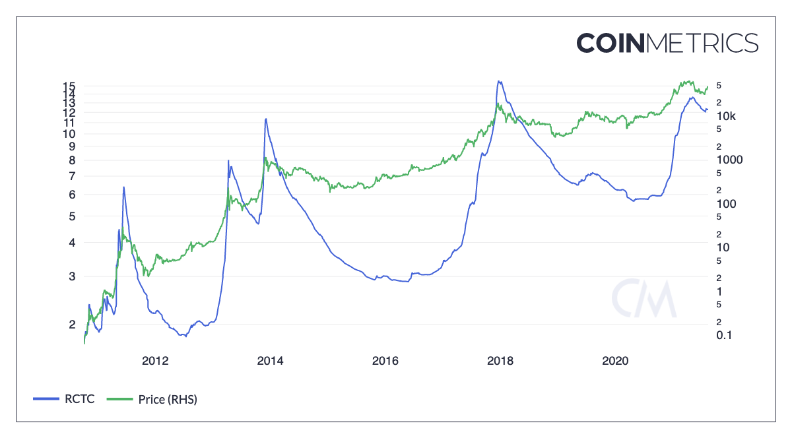
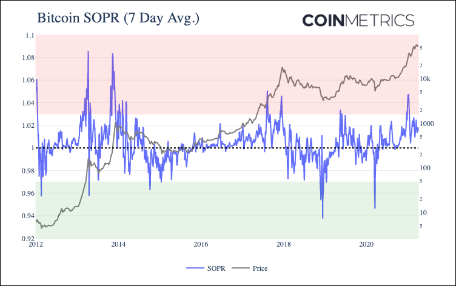

# Valuation

### Contents

* [Network Value to Transactions (NVTAdj)](valuation.md#nvt)
* [Network Value to Transactions Free Float (NVTAdjFF)](valuation.md#nvtff)
* [Realized Cap to Thermo Cap (RCTC)](valuation.md#rctc)
* [RVT Ratio (RVT)](valuation.md#rvt)
* [Spent Output Price Ratio (SOPR)](valuation.md#sopr)
* [Net Unrealized Profit/Loss (NUPL)](valuation.md#nupl)

## Network Value to Transactions <a href="#nvt" id="nvt"></a>

### Definition

The ratio of the network value (or market capitalization, current supply) divided by the adjusted transfer value. Also referred to as NVT.

| Name                  | MetricID                                                                  | Unit          | Interval |
| --------------------- | ------------------------------------------------------------------------- | ------------- | -------- |
| NVT                   | [NVTAdj](https://coverage.coinmetrics.io/search-results?query=NVTAdj)     | Dimensionless | 1 day    |
| NVT 90-day Moving Avg | [NVTAdj90](https://coverage.coinmetrics.io/search-results?query=NVTAdj90) | Dimensionless | 1 day    |

### Details

* This metric uses the native units network value and adjusted transaction volume. It is therefore available at the asset’s genesis, unlike if it was using USD values.
* It can be thought of as a rough P/E (price to earnings) ratio proxy for crypto assets.
* First conceptualized by Willy Woo (2017) with the introduction of the network value to transactions (NVT) ratio, calculated as a cryptoasset’s market capitalization divided by its daily value transacted over the network. The logic behind the ratio is that value transacted over an asset’s network represents the utility of a cryptoasset. High values of the NVT ratio have detected bubbles and low values have indicated attractive entry points in the past.
* NVTAdj90 is computed as the current market cap over the 90-day moving average of USD adjusted transfer volume.
* Inspired by Kalichkin’s work. [Kalichkin (2018a)](https://medium.com/cryptolab/https-medium-com-kalichkin-rethinking-nvt-ratio-2cf810df0ab0) extended the idea behind the NVT ratio by introducing additional smoothing to correct for certain shortcomings in the original formulation that prevent it from being used as a real-time trading indicator.

### **Release History**

* Released in the 1.0 release of NDP

### Interpretation

NVT has been much discussed; in short, it compares market capitalization to on-chain transactional usage. Blockchains with low usage relative to market cap have a higher NVT. In this sense it can be understood as the opposite of velocity. Due to structural dissimilarities in blockchain usage modes, NVTs among all assets are not directly comparable. Our formulation employs adjusted transaction volume, as we understand this to be a purer measure of the actual usage of the chain.

### Availability for Assets





## Network Value to Transactions Free Float <a href="#nvtff" id="nvtff"></a>

### Definition

The ratio of the free float network value (or market capitalization, free float) divided by the adjusted transfer value. Also referred to as FFNVT.

| Name                             | MetricID                                                                  | Unit          | Interval |
| -------------------------------- | ------------------------------------------------------------------------- | ------------- | -------- |
| Free Float NVT                   | [NVTAdjFF](https://coverage.coinmetrics.io/search-results?query=NVTAdj)   | Dimensionless | 1 day    |
| Free Float NVT 90-day Moving Avg | [NVTAdjFF90](https://coverage.coinmetrics.io/search-results?query=NVTAdj) | Dimensionless | 1 day    |

### Details

* This metric provides an important adjustment to the Network Value to Transaction (NVT) Ratio using Free Float Supply (SplyFF)
* For more details on the significance of this improvement, please refer to the following [blog post](https://coinmetrics.io/introducing-free-float-supply/).
* This metric uses the native units network value and adjusted transaction volume. It is therefore available at the asset’s genesis, unlike if it was using USD values.
* It can be thought of as a rough P/E (price to earnings) ratio proxy for crypto assets.
* NVT was first conceptualized by Willy Woo (2017) with the introduction of the network value to transactions (NVT) ratio, calculated as a cryptoasset’s market capitalization divided by its daily value transacted over the network. The logic behind the ratio is that value transacted over an asset’s network represents the utility of a cryptoasset. High values of the NVT ratio have detected bubbles and low values have indicated attractive entry points in the past.

### **Release History**

* Release Version: NDP-EOD 4.8 (Nov, 2020)

### Interpretation

NVT has been much discussed; in short, it compares market capitalization to on-chain transactional usage. Blockchains with low usage relative to market cap have a higher NVT. In this sense it can be understood as the opposite of velocity. Due to structural dissimilarities in blockchain usage modes, NVTs among all assets are not directly comparable. Our formulation employs adjusted transaction volume, as we understand this to be a purer measure of the actual usage of the chain.

### See Also

* [NVT](../../economics/nvtadj.md)
* [Free Float NVT 90-day Moving Avg](../../economics/nvtadjff90.md)

### Availability for Assets


[\
](https://docs.coinmetrics.io/asset-metrics/economics/nvtadjff)


## Realized Cap to Thermo Cap (RCTC) <a href="#rctc" id="rctc"></a>

### Definition

The ratio of the Realized Cap over Thermo Cap at the end of that interval. [Realized Cap](broken-reference/) (CapRealUSD) is defined as the sum USD value based on the USD closing price on the day that a native unit last moved (i.e., last transacted) for all native units. Thermo Cap is calculated as RevAllTimeUSD and it represents the USD value of all funds disbursed to miners at the time of issuance.

| Name                              | IMetricD                                                          | Unit          | Interval |
| --------------------------------- | ----------------------------------------------------------------- | ------------- | -------- |
| Realized Cap to Thermo Cap (RCTC) | [RCTC](https://coverage.coinmetrics.io/search-results?query=RCTC) | Dimensionless | 1 day    |

### Details

* Like [MVRV](broken-reference/), RCTC can be used to better understand the market cycle as it identifies the ralationship between the network's overall cost basis (CapRealUSD) relative to the USD amount issued to miners by the protocol (RevAllTimeUSD).
* When evaluating market tops, RCTC provides a view on the realization of profits relative to the liquidity that is being issued to miners.
* Miners are speculators as they are naturally exposed to the price of the currency they are mining. As such, they collectively make buy or sell decisions that ultimately impact the market.

### Chart



### Interpretation

* This metric fundamentally showcases the impact of miner liquity in the overall market. When the USD value of miner income is low relative to what is being realized on-chain, this could be interpreted as a sign of market tops.
* This metric could also be interpreted as the profit margin that might be realized by miners as it showcases the gap between profit taking.
* Historically, a threshold of 10 has been indicative of market tops as a wide profit margins are being realized relative to the USD value being issued to miners.

### Asset-Specific Details

Only applicable to assets for which we have RevAllTimeUSD and CapRealUSD.

### Release History

* Release Version: NDP 5.0 (August, 2021)

### See Also:

* [MCRC (Market Cap / Realized Cap)](../../economics/miner-cap-to-realized-cap-mcrc.md)
* [MVRV (Market Cap / Realized Market Cap)](broken-reference/)

### Availability for Assets



## RVT <a href="#rvt" id="rvt"></a>

### Definition

The ratio of the network's realized value to its adjusted transfer value. Also referred to as RVT.

| Name                  | MetricID                                                                  | Unit          | Interval |
| --------------------- | ------------------------------------------------------------------------- | ------------- | -------- |
| RVT                   | [RVT](https://coverage.coinmetrics.io/search-results?query=RVTAdj90)      | Dimensionless | 1 day    |
| RVT 90-day Moving Avg | [RVTAdj90](https://coverage.coinmetrics.io/search-results?query=RVTAdj90) | Dimensionless | 90 days  |

### Details

* Computed as realized value (aka realized market cap) over adjusted transfer value.
* [Checkmate (2019)](https://medium.com/@_Checkmatey_/the-bitcoin-rvt-ratio-a-high-conviction-macro-indicator-615b68715b77) formulates the realized capitalization to transaction value (RVT) ratio which uses the same fundamental principles behind the NVT ratio but uses realized capitalization instead of market capitalization in the numerator of the ratio.
* RVTAdj90 is computed as the network's realized value (aka realized market cap) over the 90-day moving average of USD adjusted transfer volume.

### Release History

* Release Version: NDP-EOD 4.8 (Nov, 2020)

### Interpretation

RVT is based on the same principles as NVT but uses Realized Cap in the numerator. Realized Cap can be a smoother measure of network valuation than the Market Cap as it is concerned with the price at which the coin was last moved on-chain. As a result, both Realized Cap and the RVT are shielded from day-to-day market sentiment and speculation that are reflected in Market Cap.

RVT can be a slower moving, higher conviction signal tuned to the macro sentiment of HODLers.

### See Also

* [Realized Market Cap (USD)](broken-reference/)
* [RVT 90-day Moving Avg](../../economics/rvtadj90.md)

### Availability for Assets



## Spent Output Profit Ratio (SOPR) <a href="#sopr" id="sopr"></a>

### Definition

The ratio of the sum of spent value over the sum of creation value of all spent and created outputs for that interval. There are two versions of this metric. For this version, a spent output’s “spent value” is the market value of the sum of all native units of that output (i.e., price multiplied by the sum of native units). A created output’s “creation value” is the market value of the sum of all native units of that output (i.e., price multiplied by the sum of native units).

| Name     | MetricID                                                             | Unit          | Interval |
| -------- | -------------------------------------------------------------------- | ------------- | -------- |
| SOPR     | [SOPR](https://coverage.coinmetrics.io/search-results?query=SOPR)    | Dimensionless | 1 day    |
| SOPR Out | [SOPROut](https://coverage.coinmetrics.io/search-results?query=SOPR) | Dimensionless | 1 day    |

### Details

* (Sum of spent value) / (Sum of creation value) of all spent and created outputs for that interval)
* Sum of creation value = Sum of all transactional outputs that interval multiplied by the closing price for that interval
* SOPR was introduced by Renato Shirakashi.
* It oscillates around 1, if below it, people spending are realizing losses, above it, realizing gains.
* SOPROut is our first implementation of SOPR which doesn’t weight outputs by their value.
* SOPROut oscillates around 1, if it is below 1, people spending are realizing losses, above 1, realizing gains.

### Asset-Specific Details

* This metric is not available for assets that have full privacy, like Monero, Grin.
* For assets that have opt-in privacy features, like ZCash, it only takes the non-private balances into account.

### Chart



The chart above shows the combined SOPR ratio of all UTXOs spent, aggregated on a daily basis. The metric is also smoothed with a 7-day rolling average as SOPR tends to be relatively volatile.

On January 8th 2021, as BTC price topped $40K, BTC SOPR (7-day average) reached 1.048, its highest level since December 2017. The following day BTC price began to decline, and SOPR bottomed out at 1.004 on January 26th with BTC price at $32.6K. It has since rebounded to about 1.015.

### Example

* If in a given day, 3 outputs are spent:
  * \*\* Output A, value 10 BTC, created when BTC was worth $10
  * \*\* Output B, value 1 BTC, created when BTC was worth $500
  * \*\* Output C, value 2 BTC, created when BTC was worth $20,000
* If market price is $7,500, SOPR for that day is computed as:
  * \*\* Sum creation values: $10 \* 10 BTC + $500 \* 1 BTC + $20,000 \* 2 BTC = $40,600
  * \*\* Sum spent values: $7,500 \* 10 BTC + $7,500 \* 1 BTC + $7,500 \* 2 BTC = $97,500
  * \*\* SOPR = $97,500 /$40,600 = 2.4014

### Release History

* Released in the 5.0 release of NDP

### Interpretation

Spent Output Profit Ratio (SOPR) gives another vantage point into bitcoin market cycles. Introduced [by Renato Shirakashi in 2019](https://medium.com/unconfiscatable/introducing-sopr-spent-outputs-to-predict-bitcoin-lows-and-tops-ceb4536b3b9), SOPR can act as a proxy for gauging whether holders are selling at a profit or at a loss.

SOPR is a ratio of bitcoin’s price at the time UTXOs are spent to its price at the time they were created. In other words, it’s a proxy for price sold divided by price paid. Every time a transaction occurs, we can compare bitcoin’s price at the time the UTXOs in that transaction were created to the price at which they were spent. Creating a ratio of the two gives a simple way to estimate whether the bitcoin in the UTXO was sold at a profit or loss.

SOPR can be computed for individual UTXOs, but it can also be computed for a group of UTXOs.

Historically, a high SOPR has signaled that bitcoin price is reaching a local maximum. Conversely, a low SOPR theoretically signals that holders are selling at a loss, which has historically indicated a good time to buy. A SOPR of 1 is also particularly important to watch, as it signals the tipping point from selling in profit to selling at a loss.

### Availability for Assets



## Net Unrealized Profit/Loss (NUPL) <a href="#nupl" id="nupl"></a>

### Definition

NUPL measures the proportion of an asset's market cap that represents unrealized profit or loss among all coins in circulation.&#x20;

| Name | MetricID | Unit          | Interval |
| ---- | -------- | ------------- | -------- |
| NUPL | NUPL     | Dimensionless | 1 day    |

### Details

* Calculated as: (CapMrktCurUSD - CapRealUSD)/CapMrktCurUSD

### Interpretation

It indicates whether the market, on average, is in a state of unrealized gain (positive) or loss (negative), reflecting investor sentiment and potential market phases.

### Availability for Assets



## API Endpoints

Address Balances can be accessed using these endpoints:

* `timeseries/asset-metrics`

and by passing in the metric ID's `NVT*` , `RVT*` and `SOPR*` in the `metrics` parameter.


[openapi.yaml](../../../.gitbook/assets/openapi.yaml)




```shell
curl --compressed "https://api.coinmetrics.io/v4/timeseries/asset-metrics?metrics=MCRC&assets=btc&pretty=true&api_key=<your_key>"
```



```python
import requests
response = requests.get('https://api.coinmetrics.io/v4/timeseries/asset-metrics?metrics=MCRC&assets=btc&pretty=true&api_key=<your_key>').json()
print(response)
```



```python
from coinmetrics.api_client import CoinMetricsClient

api_key = "<API_KEY>"
client = CoinMetricsClient(api_key)

print(
    client.get_asset_metrics(
        metrics="NVTAdj", 
        assets='btc',
    ).to_dataframe()
)
```


