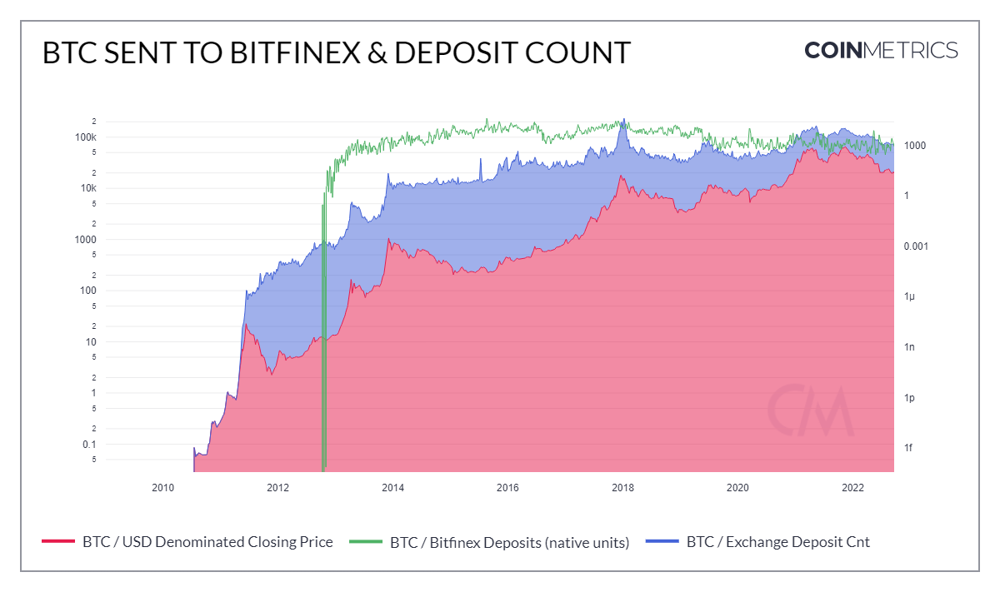

# Deposits

## Contents

* [Exchange Deposits (FlowInXNtv and FlowInXUSD)](deposits.md#flowin)
* [Exchange Deposit Count (FlowTfrInXCnt)](deposits.md#flowtfrin)

## Exchange Deposits <a href="#flowin" id="flowin"></a>

### Definition

The sum of assets sent to an exchange that interval.

| Name                             | MetricID     | Unit         | Interval       |
| -------------------------------- | ------------ | ------------ | -------------- |
| Bitfinex Deposits (native units) | FlowInBFXNtv | Native units | 1 block, 1 day |
| Bitfinex Deposits (USD)          | FlowInBFXUSD | USD          | 1 block, 1 day |
| BitMEX Deposits (native units)   | FlowInBMXNtv | Native units | 1 block, 1 day |
| BitMEX Deposits (USD)            | FlowInBMXUSD | USD          | 1 block, 1 day |
| Binance Deposits (native units)  | FlowInBNBNtv | Native units | 1 block, 1 day |
| Binance Deposits (USD)           | FlowInBNBUSD | USD          | 1 block, 1 day |
| Bitstamp Deposits (native units) | FlowInBSPNtv | Native units | 1 block, 1 day |
| Bitstamp Deposits (USD)          | FlowInBSPUSD | USD          | 1 block, 1 day |
| Bittrex Deposits (native units)  | FlowInBTCNtv | Native units | 1 block, 1 day |
| Bittrex Deposit (USD)            | FlowInBTXUSD | USD          | 1 block, 1 day |
| Gemini Deposits (native units)   | FlowInGEMNtv | Native units | 1 block, 1 day |
| Gemini Deposits (USD)            | FlowInGEMUSD | USD          | 1 block, 1 day |
| Huobi Deposits (native units)    | FlowInHUONtv | Native units | 1 block, 1 day |
| Huobi Deposits (USD)             | FlowInHUOUSD | USD          | 1 block, 1 day |
| Kraken Deposits (native units)   | FlowInKRKNtv | Native units | 1 block, 1 day |
| Kraken Deposits (USD)            | FlowInKRKUSD | USD          | 1 block, 1 day |
| Poloniex Deposits (native units) | FlowInPOLNtv | Native units | 1 block, 1 day |
| Poloniex Deposits (USD)          | FlowInPOLUSD | USD          | 1 block, 1 day |

### Details

* Native units are considered as sent to an exchange if they are sent to an address we identify as being owned by an exchange.
* USD flows are computed as FlowIn{Exchange}Ntv \* PriceUSD

### Chart

<figure><figcaption></figcaption></figure>

### Asset-Specific Details

* This metric might not be available for all assets. Either the exchange doesn’t support this asset, or we deemed that our coverage of the exchange was not complete enough to release the metric for it.
* For Bitcoin, this metric excludes the effect of change outputs:
  * If a transaction sends 90 BTC to exchange A but also withdraws 50 BTC from it, the flow is +40 BTC, not +90 BTC and -50 BTC.

### Examples

* During times of market stress or uncertainty, we see an uptick in BTC/funds being moved to exchanges. During the Luna collapse in spring 2021, we can see a rise in BTC being sent to both Bitfinex and Binance which is a precursor for more downside pressure as often times users are converting their funds into fiat or stable coins.

### Release History

* Released in the 4.0 release of NDP

### Interpretation

* This metric looks at the flow of funds being sent to Bitfinex and can give us a sense of market sentiment.

### Availability for Assets



## Exchange Depoosit Count <a href="#flowtfrin" id="flowtfrin"></a>

### Definition

The sum count of transfers to any address belonging to an exchange in that interval. If the sender address also belongs to Binfinex, the transfer is not counted.

<table><thead><tr><th>Name</th><th width="181">MetricID</th><th>Unit</th><th>Interval</th></tr></thead><tbody><tr><td>Bitfinex Deposit Cnt</td><td>FlowTfrInBFXCnt</td><td>Native units</td><td>1 block, 1 day</td></tr><tr><td>BitMEX Deposit Cnt</td><td>FlowTfrInBMXCnt</td><td>Native units</td><td>1 block, 1 day</td></tr><tr><td>Binance Deposit Cnt</td><td>FlowTfrInBNBCnt</td><td>Native units</td><td>1 block, 1 day</td></tr><tr><td>Bitstamp Deposit Cnt</td><td>FlowTfrInBSPCnt</td><td>Native units</td><td>1 block, 1 day</td></tr><tr><td>Bittrex Deposit Cnt</td><td>FlowTfrInBTXCnt</td><td>Native units</td><td>1 block, 1 day</td></tr><tr><td>Gemini Deposit Cnt</td><td>FlowTfrInGEMCnt</td><td>Native units</td><td>1 block, 1 day</td></tr><tr><td>Huobi Deposit Cnt</td><td>FlowTfrInHUOCnt</td><td>Native units</td><td>1 block, 1 day</td></tr><tr><td>Kraken Deposit Cnt</td><td>FlowTfrInKRKCnt</td><td>Native units</td><td>1 block, 1 day</td></tr><tr><td>Poloniex Deposit Cnt</td><td>FlowTfrInPOLCnt</td><td>Native units</td><td>1 block, 1 day</td></tr></tbody></table>

### Details

* Coinbase (i.e., miner reward) transactions are not counted.

### Asset-Specific Details

* For UTXO-based protocols, this metric does not count change outputs:
*
  * If the input addresses belong to Bitfinex, then the outputs belonging to Bitfinex are not counted as transfers to Bitfinex
* For account-based protocols, if both sender and recipient belong to Bitfinex, then the transfer is not counted.

### Release History

* Version 4.2 of CM Network Data Pro Daily Macro (End of Day)

### Availability for Assets



## API Endpoints

Exhange Deposits metrics can be accessed using these endpoints:

* `timeseries/asset-metrics`

and by passing in the metric ID's `FlowIn*` and `FlowTfrIn*` in the `metrics` parameter.


[openapi.yaml](../../../.gitbook/assets/openapi.yaml)




```shell
curl --compressed "https://api.coinmetrics.io/v4/timeseries/asset-metrics?metrics=FlowInBFXNtv&assets=btc&pretty=true&api_key=<your_key>"
```



```python
import requests
response = requests.get('https://api.coinmetrics.io/v4/timeseries/asset-metrics?metrics=FlowInBFXNtv&assets=btc&pretty=true&api_key=<your_key>').json()
print(response)
```



```python
from coinmetrics.api_client import CoinMetricsClient

api_key = "<API_KEY>"
client = CoinMetricsClient(api_key)

print(
    client.get_asset_metrics(
        metrics="FlowInBFXNtv", 
        assets="btc",
    ).to_dataframe()
)
```


