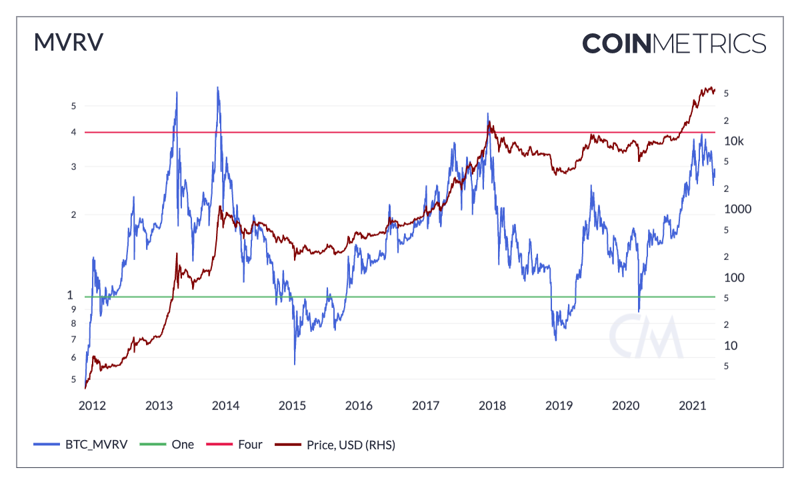

# Market Capitalization

### Contents

* [Capitalization, active supply, 1yr, USD](market-capitalization.md#a)
* [Capitalization, future expected supply, next 10yr, USD](market-capitalization.md#b)
* [Capitalization, market, current supply, USD](market-capitalization.md#c)
* [Capitalization, market, estimated supply, USD](market-capitalization.md#d)
* [Capitalization, market, free float](market-capitalization.md#e)
* [Capitalization, MVRV, free float](market-capitalization.md#g)
* [Capitalization, realized, USD](market-capitalization.md#h)

## Active Market Cap (1yr) (USD) <a href="#a" id="a"></a>

### Definition

The sum USD value of all active native units in the last year. Native units that transacted more than once are only counted once.

| Name                          | MetricID     | Unit | Interval |
| ----------------------------- | ------------ | ---- | -------- |
| Active Market Cap (1yr) (USD) | CapAct1yrUSD | USD  | 1 year   |

### Details

* The state of the ledger is the one at the last available block for that day.
* Only the native units balance is considered, on-top tokens (e.g., ERC-20) are not included.
* Addresses owning 0 native units are not considered.
* For UTX-based protocols, last activity is the date of creation of the output. Mining reward outputs are not considered active.
* For account-based protocols, last activity is defined as either the time of the last debit of native units from this account, or the time at which it was created (if that creation wasn’t due to a genesis event or mining).

### Asset-Specific Details

* This metric is not available for assets that have full privacy, like Monero, Grin.
* For assets that have opt-in privacy features, like ZCash, it only takes the non-private balances into account.

### Release History

* Version 1.0 of CM Network Data Pro Daily Macro (End of Day)

### Interpretation

In contrast with Capitalization, realized, USD,this metric counts as valid on the fraction of supply which has moved in the prior 12 months. The intuition is to devise a measure of the economic significance of liquid and market-available supply, as evidenced by units that have made recent on-chain transactions. This metric can be volatile as large tranches of supply fall out of the eligibility window or as large sections move for the first time in over a year.

### Availability for Assets



## Future Market Cap (USD) <a href="#b" id="b"></a>

### Definition

The sum USD value of all native units counting the current supply and including those that will be issued over the next 10 years if the current known issuance schedule is followed.

| Name                    | MetricID         | Unit | Interval |
| ----------------------- | ---------------- | ---- | -------- |
| Future Market Cap (USD) | CapFutExp10yrUSD | USD  | 10 years |

### Details

* Only continuous, predictable issuance is taken into account.
* Only information known at the time for which the metric is computed is used: unpredictable changes in monetary policy are taken into account only when they become effective. ETH’s reward changes from 5 ETH to 3 and from 3 ETH to 2 are not taken into account for values of the metric computed before they became effective. This metric doesn’t add forward knowledge.
* Price used is the daily close.
* The state of the ledger used is the one at the last available block for that day.
* It’s computed as SplyFutExp10yr \* PriceUSD

### Asset-Specific Details

* For ETH/ETC, uncle rate is fixed at 0.90625 uncle per block

### Release History

* Released in the 1.0 release of NDP

### Availability for Assets



## Market Cap (USD) <a href="#c" id="c"></a>

### Definition

The sum USD value of the current supply. Also referred to as network value or market capitalization.

| Name             | MetricID      | Unit | Interval |
| ---------------- | ------------- | ---- | -------- |
| Market Cap (USD) | CapMrktCurUSD | USD  | 1 day    |

### Details

* Computed as SplyCur \* PriceUSD
* The price used is the daily close price

### Asset-Specific Details

* For XRP, amounts under escrow are included in current supply

### Release History

* Released in the 1.0 release of NDP

### Interpretation

Informally called ‘market cap,’ our formulation differs in that we do consider all historically issued supply and does not exclude illiquid supply held in escrow or foundation accounts. In this respect, our formulation of this metric diverges from other sources who discount coins held in escrow or treasuries.

### Availability for Assets



## Estimated Market Cap (USD) <a href="#d" id="d"></a>

### Definition

The sum USD value of the circulating supply. Also referred to as network value or market capitalization. Circulating supply is reported by the projects or other derived sources.

| Name                       | MetricID      | Unit | Interval |
| -------------------------- | ------------- | ---- | -------- |
| Estimated Market Cap (USD) | CapMrktEstUSD | USD  | 1 day    |

### Details

* Computed as Circulating Supply \* PriceUSD
* The price used is the daily close price (PriceUSD) at 00:00:00 UTC
* The circulating supply used is sourced through third party APIs

### Asset-Specific Details

* For ERC-20 assets, the circulating supply is sourced from EtherScan via CoinGecko
* Where available circulating supply was sourced from the projects circulating supply API end point via CoinGecko

### Interpretation

Informally called ‘Market Cap,’ our Estimated Market Cap aligns with the industry convention for Market Cap. We called this "Estimated Market Cap" because this is a reported amount and not sourced directly from what is seen on-chain.

### Availability for Assets



## Free Float Market Cap (USD) <a href="#e" id="e"></a>

### Definition

The sum USD value of the free float supply. Also referred to as free float network value or free float market capitalization.

| Name                        | MetricID     | Unit | Interval |
| --------------------------- | ------------ | ---- | -------- |
| Free Float Market Cap (USD) | CapMrktFFUSD | USD  | 1 day    |

### Details

* Free Float Market Capitalization is a measure of the market value of an asset’s supply that is issued and available to market participants. This excludes supply that is held by company insiders, controlling investors and long term strategic holders.
* This metric is calculated by multiplying SplyFF by PriceUSD.
* For more details on Free Float Supply, please refer to our blog post [Introducing Free Float Supply](https://coinmetrics.io/introducing-free-float-supply/)

### Asset-Specific Details

* Only applicable to assets for which we have Free Float Supply (SplyFF) data available.
* ETH Free Float Supply includes tokens on the Consensus Layer and Execution Layer

### Release History

* Release Version: NDP-EOD 4.8 (Nov, 2020)

### See Also

* Free Float Supply

### Availability for Assets



## MVRV (Market Cap / Realized Market Cap) <a href="#f" id="f"></a>

### Definition

The ratio of the sum USD value of the current supply to the sum "realized" USD value of the current supply.

| Name                                    | MetricID   | Unit          | Interval |
| --------------------------------------- | ---------- | ------------- | -------- |
| MVRV (Market Cap / Realized Market Cap) | CapMVRVCur | Dimensionless | 1 day    |

### Details

* Computed as CapMrktCurUSD / CapRealUSD

### Chart

<figure><figcaption></figcaption></figure>

### Asset-Specific Details

* This metric is not available for assets that have full privacy, like Monero, Grin.
* For assets that have opt-in privacy features, like ZCash, it only takes the non-private balances into account, see Realized Cap’s entry for more details

### Release History

* Conceptualized by [Adaptive Capital](https://medium.com/adaptivecapital/bitcoin-market-value-to-realized-value-mvrv-ratio-3ebc914dbaee)
* Released in the 1.0 release of NDP

### Interpretation

Market value to realized value (MVRV) has historically been one of the most reliable on-chain indicators of bitcoin market tops and bottoms. MVRV is calculated by dividing bitcoin’s market capitalization by its [realized capitalization](https://coinmetrics.io/realized-capitalization/). Realized capitalization can also be thought of as a gross approximation of bitcoin’s aggregate cost basis.

The intuition behind the creation of this ratio was to divide a price function by a ‘fundamental’ - Realized Capitalization. This gives you a ratio potentially indicating periods of overvaluation (when network value far exceeds its historical relationship to realized cap) and undervaluation.

Historically, a high ratio of market capitalization to realized capitalization has signaled that bitcoin price was near a local maximum, while a low ratio has indicated that price is near a local minimum. The few times that MVRV has dropped below one have historically been some of the best times to buy bitcoin. An increasing MVRV indicates that current sentiment is increasing fast relative to estimated aggregate cost basis, while decreasing MVRV signals the opposite.

### See Also

* Free Float MVRV

### Availability for Assets



## Free Float MVRV (Free Float Market Cap / Realized Market Cap) <a href="#g" id="g"></a>

### Definition

The ratio of the free float market capitalization (CapMrktFFUSD) to the sum "realized" USD value of the current supply (CapRealUSD).

| Name                                                          | IMetricD  | Unit          | Interval |
| ------------------------------------------------------------- | --------- | ------------- | -------- |
| Free Float MVRV (Free Float Market Cap / Realized Market Cap) | CapMVRVFF | Dimensionless | 1 day    |

### Details

* This metric provides an important adjustment to the how MVRV is calculated.
* It improves upon the Market Value numerator of the MVRV formula (Market Cap/Realized Cap) by proving a more accurate representation of liquidity via CapMrktFFUSD.
* For more details on the significance of this improvement, please refer to the following blog post [Introducing Free Float Supply](https://coinmetrics.io/introducing-free-float-supply/)

### Chart

<figure><figcaption></figcaption></figure>

### Asset-Specific Details

Only applicable to assets for which we have Free Float Supply (SplyFF) data available.

### Release History

* Release Version: NDP-EOD 4.8 (Nov, 2020)

### Interpretation

Market value to realized value (MVRV) has historically been one of the most reliable on-chain indicators of bitcoin market tops and bottoms. MVRV is calculated by dividing bitcoin’s market capitalization by its [realized capitalization](https://coinmetrics.io/realized-capitalization/). Realized capitalization can also be thought of as a gross approximation of bitcoin’s aggregate cost basis. In our variant of the MVRV calculation, we use free float market capitalization which is calculated using [liquid supply as opposed to total supply](https://coinmetrics.substack.com/p/coin-metrics-state-of-the-network-7d0).

Historically, a high ratio of market capitalization to realized capitalization has signaled that bitcoin price was near a local maximum, while a low ratio has indicated that price is near a local minimum. The few times that MVRV has dropped below one have historically been some of the best times to buy bitcoin. An increasing MVRV indicates that current sentiment is increasing fast relative to estimated aggregate cost basis, while decreasing MVRV signals the opposite.

### See Also

* MVRV (Market Cap / Realized Market Cap)

### Availability for Assets



## MVRV Z-Score <a href="#g" id="g"></a>

### Definition

The ratio of the current market capitalization minus the realized market capitalization to the standard deviation of the current market capitalization.

| Name         | IMetricD | Unit          | Interval |
| ------------ | -------- | ------------- | -------- |
| MVRV Z-Score | CapMVRVZ | Dimensionless | 1 day    |

### Details

* This metric is calculated as: (CapMrktCurUSD - CapRealUSD) / std(CapMrktCurUSD)
* MVRV Z-Score adjusts for the long-term volatility in market cap, making it easier to compare across different market cycles and identify extreme deviations from historical norms.
* Unlike regular MVRV (CapMVRVCur) or Free Float MVRV (CapMVRVFF), which are a raw ratio of market to realized value, MVRV Z-Score tells you how unusually high or low that relationship is compared to the asset's own historical behavior.

### Interpretation

The MVRV Z-Score measures how far Bitcoin’s market cap deviates from its realized cap, normalized by the historical volatility of market cap. It highlights periods where Bitcoin may be significantly overvalued or undervalued relative to its past trends, making it useful for spotting potential market tops and bottoms.

### See Also

* MVRV (Market Cap / Realized Market Cap)
* Free Float MVRV (Free Float Market Cap / Realized Market Cap)

### Availability for Assets



## Realized Market Cap (USD) <a href="#h" id="h"></a>

### Definition

The sum USD value based on the USD closing price on the day that a native unit last moved (i.e., last transacted) for all native units.

| Name                      | MetricID   | Unit | Interval |
| ------------------------- | ---------- | ---- | -------- |
| Realized Market Cap (USD) | CapRealUSD | USD  | 1 day    |

### Details

* This metric takes the ledger state of the asset, assigns a date of last movement for each account/unspent output, multiplies the balance of the account/value of the output by the price at the date of last movement and sums all of those numbers for the asset’s ledger.
* The state of the ledger is the one at the last available block for that day.
* Only the native units balance is considered, L2 tokens (ERC-20, etc.) are not taken into account.
* For UTXO chains, last activity is the date of creation of the output.
* For account-based chains, last activity is either the last date the account was the sender of a ledger change, or its time of creation, whichever is more recent.

### Chart

<figure><figcaption></figcaption></figure>

### Asset-Specific Details

* This metric is not available for assets that have full privacy, like Monero, Grin.
* For assets that have opt-in privacy features, like ZCash, it only takes the non-private balances into account. The realized cap is first computed over the non-private balances, then scaled so that ratios like MVRV can be computed: Realized Cap = Non-private realized Cap + Private Supply \* (Non-private realized cap/ (Total Current Supply - Private supply)) This can be understood as taking the non-private supply’s price implied by the realized cap (Non-private realized cap / Non private supply) and assigning that price to the private supply.

### Example

For an asset whose ledger is:

| Account | Balance | Time of last movement | Price at last movement | Realized balance |
| ------- | ------- | --------------------- | ---------------------- | ---------------- |
| A       | 100     | 2010-01-01            | $0                     | $0               |
| B       | 1000    | 2016-01-01            | $10                    | $10,000          |
| C       | 500     | 2019-01-01            | $100                   | $50,000          |

The realized cap would be $0 + $10,000 + $50,000 = $60,000

For assets like ZEC, assuming there’s 5M native units outstanding, 1M private, 4M non-private. If the realized cap of the non-private supply is $1B, the total realized cap is computed as: $1B \* (1M \* ($1B / (5M - 1M)) = $1.25B

### Release History

* Conceptualized by [Coin Metrics](https://coinmetrics.io/realized-capitalization/)
* Released in the 1.0 release of NDP

### Interpretation

Realized capitalization (sometimes referred to as Realized Value) is one of Coin Metrics’ flagship metrics, first introduced in a [talk by Nic Carter](https://medium.com/@RainDogDance/bitcoin-as-a-novel-market-institution-nic-carter-talk-at-baltic-honeybadger-2018-e085f163b213) in 2018. Realized cap aggregates units of supply according to their market price when they last moved on-chain. The original intent was to discount the weight of long-lost coins, in particular in Bitcoin, as a significant fraction of supply is inert and has not moved since 2010 (and can be presumed lost). Additionally, realized cap is a more faithful measure of economic significance for forks with limited uptake, as conventional measures like market cap naively presume that the entire stock of coins is liquid and market-available. Interpretations vary, but realized cap is perhaps best-understood as a metric which captures the average cost basis of all current holders. It has been used to devise popular oscillators and derivative metrics.

### See Also

* [Introduction to Realized Cap](https://coinmetrics.io/realized-capitalization/)
* [SOTN: Realized Cap Passes $100B](https://coinmetrics.substack.com/p/coin-metrics-state-of-the-network-fe8)

### Availability for Assets



### API Endpoints

Exhange Deposits metrics can be accessed using these endpoints:

* `timeseries/asset-metrics`

and by passing in the metric ID's `Cap*` in the `metrics` parameter.

<mark style="color:blue;">`GET`</mark> `undefined/timeseries/asset-metrics`



```shell
curl --compressed "https://api.coinmetrics.io/v4/timeseries/asset-metrics?metrics=CapAct1yrUSD&assets=btc&pretty=true&api_key=<your_key>"
```



```python
import requests
response = requests.get('https://api.coinmetrics.io/v4/timeseries/asset-metrics?metrics=CapAct1yrUSD&assets=btc&pretty=true&api_key=<your_key>').json()
print(response)
```



```python
from coinmetrics.api_client import CoinMetricsClient

api_key = "<API_KEY>"
client = CoinMetricsClient(api_key)

print(
    client.get_asset_metrics(
        metrics="CapAct1yrUSD", 
        assets="btc",
    ).to_dataframe()
)
```


