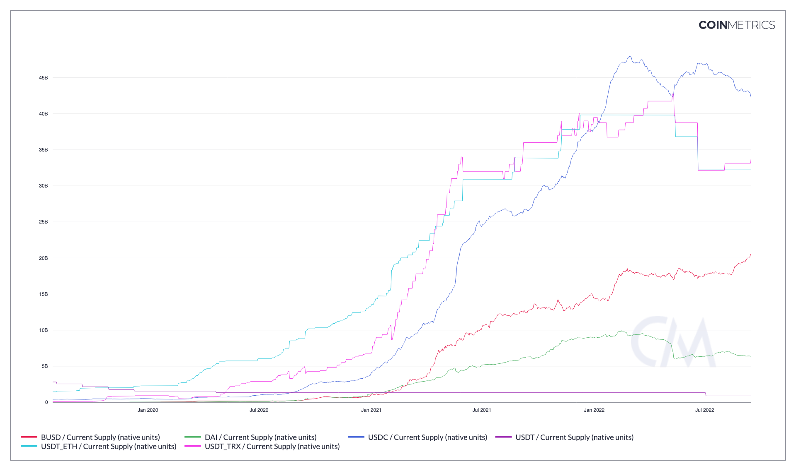

# Current Supply

## Contents

* [Total Base Fees Burnt](current-supply.md#splyburn)
* [NDF (Network Distribution Factor)](current-supply.md#ndf)
* [SER (Supply Equality Ratio)](current-supply.md#ser)
* [Value in Top X% of Addrs (native units)](current-supply.md#splyadrtoppct)
* [Value in Top 100 Addrs (native units)](current-supply.md#splyadrtop)

## Current Supply (native units) <a href="#splycur" id="splycur"></a>

### Definition

The sum of all native units ever created and currently visible on the ledger (i.e., issued) as of that day. For account-based protocols, only accounts with positive balances are counted.

| Name                          | MetricID | Unit         | Interval |
| ----------------------------- | -------- | ------------ | -------- |
| Current Supply (native units) | SplyCur  | Native units | All time |

### Details

* This metric might be also be characterized as “total issued supply” as it captures the sum of all native units visible in the ledger up until the metric calculation point
* For UTXO chains, current supply is the sum of all unspent output values.
* For account chains, current supply is the sum of all account balances.

### Chart

<figure><figcaption><p>Source: CM Network Data Charts</p></figcaption></figure>

### Asset-Specific Details

* For ZEC, it includes the shielded pools value
* For Ripple, escrows are counted towards total current supply.
* For privacy coins like Monero or Grin, total current supply is computed by summing up mining rewards.

### Release History

* Released in the 1.0 release of NDP

### See Also

* [Shielded Supply](https://docs.coinmetrics.io/asset-metrics/supply/splyshld)

### Availability for Assets



## NDF (Network Distribution Factor) <a href="#ndf" id="ndf"></a>

### Definition

The ratio of supply held by addresses with at least one ten-thousandth of the current supply of native units to the current supply.

| Name                              | MetricID | Unit          | Interval |
| --------------------------------- | -------- | ------------- | -------- |
| NDF (Network Distribution Factor) | NDF      | Dimensionless | 1 day    |

### Release History

* Released in the version 4.9 of Network Data Pro

### Interpretation

NDF is one way to assess Supply Dispersion. This ratio encompasses a broader economic group, perhaps equivalent to a combination of the middle and lower classes. It is calculated by assessing the aggregate supply in addresses holding more than 0.01% of a cryptoasset’s supply and dividing that figure by the total supply.

### Availability for Assets



## SER (Supply Equality Ratio) <a href="#ser" id="ser"></a>

### Definition

The ratio of supply held by addresses with less than one ten-millionth of the current supply of native units to the supply held by the top one percent of addresses.

| Name                        | MetricID | Unit          | Interval |
| --------------------------- | -------- | ------------- | -------- |
| SER (Supply Equality Ratio) | SER      | Dimensionless | 1 day    |

### Charts

.png>)

Of the assets shown above, Bitcoin has the highest SER, followed by Ether and Litecoin. The sustained increase in Bitcoin’s SER shows that, in spite of large institutions entering the space, Bitcoin is still very much a grassroots movement.

### Interpretation

Supply Equality Ratio (SER). It is analogous to the [20:20 Ratio](https://en.wikipedia.org/wiki/Income\_inequality\_metrics#20:20\_Ratio); a traditional wealth inequality metric that compares the average income of the richest 20% of a society to the poorest 20%. Instead of income, the SER looks at supply held by different accounts within a network. It compares the poorest accounts (the sum held by all accounts with a balance less than 0.00001% of the supply) against the richest accounts (the sum held by all the top 1% addresses).

A high SER signifies high distribution of supply.

While SER provides a novel look into supply distribution that is not possible with most traditional assets, an important caveat is that a single individual can own many cryptoasset addresses. As such, an individual might hold many addresses and supply distribution does not directly map to an individual’s holdings. Also, assets custodied by large financial institutions increases SER’s denominator and puts overall downward pressure on the ratio.

### Availability for Assets



## Value in Top X% of Addrs (native units) <a href="#splyadrtoppct" id="splyadrtoppct"></a>

### Definition

The sum of all native units held by the top X% addresses by balance at the end of that time interval.

| Name                                     | MetricID        | Unit         | Interval |
| ---------------------------------------- | --------------- | ------------ | -------- |
| Value in Top 1% of Addrs (native units)  | SplyAdrTop1Pct  | Native units | 1 day    |
| Value in Top 10% of Addrs (native units) | SplyAdrTop10Pct | Native units | 1 day    |

### Release History

* Release Version: NDP-EOD 4.8 (Nov, 2020)

### Availability for Assets





## Value in Top 100 Addrs (native units) <a href="#splyadrtop" id="splyadrtop"></a>

### Definition

The sum of all native units held by the richest 100 addresses at the end of that time interval.

| Name                                  | MetricID      | Unit         | Interval |
| ------------------------------------- | ------------- | ------------ | -------- |
| Value in Top 100 Addrs (native units) | SplyAdrTop100 | Native Units | 1 day    |

### Release History

* Release Version: NDP-EOD 4.8 (Nov, 2020)

### Availability for Assets



## API Endpoints

Current Supply metrics can be accessed using these endpoints:

* `timeseries/asset-metrics`

and by passing in the metric ID's `SplyCur` in the `metrics` parameter.


[openapi.yaml](../../../.gitbook/assets/openapi.yaml)




```shell
curl --compressed "https://api.coinmetrics.io/v4/timeseries/asset-metrics?metrics=SplyCur&assets=eth&pretty=true&api_key=<your_key>"
```



```python
import requests
response = requests.get('https://api.coinmetrics.io/v4/timeseries/asset-metrics?metrics=SplyCur&assets=eth&pretty=true&api_key=<your_key>').json()
print(response)
```



```python
from coinmetrics.api_client import CoinMetricsClient

api_key = "<API_KEY>"
client = CoinMetricsClient(api_key)

print(
    client.get_asset_metrics(
        metrics="SplyCur", 
        assets="eth",
    ).to_dataframe()
)
```


