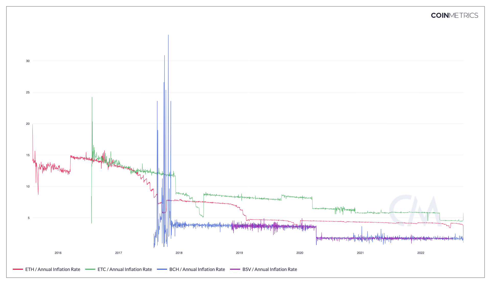
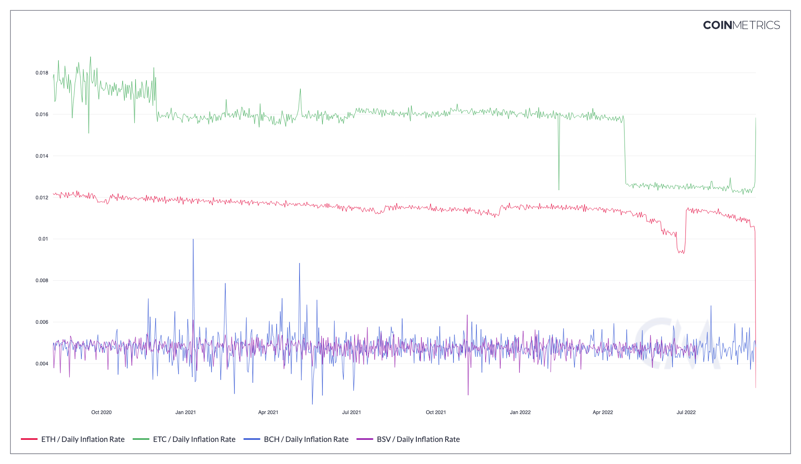

# Supply Issuance

## Contents

* [Annual Inflation Rate](supply-issuance.md#isscontpctann)
* [Daily Inflation Rate](supply-issuance.md#isscontpctday)
* [Coinbase Issuance (Continuous Issuance)](supply-issuance.md#isscont)
* [Total Issuance](supply-issuance.md#isstot)
* [Puell Multiple Total](supply-issuance.md#puellmultot)
* [Puell Multiple, Coinbase Issuance](supply-issuance.md#puelmulcont)

<!---->

* [Coinbase Issuance](supply-issuance.md#isscontntv)
* [Annual Inflation Rate](supply-issuance.md#isscontpctann)
* [Daily Inflation Rate](supply-issuance.md#isscontpctday)
* [Coinbase Issuance](supply-issuance.md#isscont)
* [Total Issuance](supply-issuance.md#isstot)
* [Puell Multiple Total](supply-issuance.md#puellmultot)
* [Puell Multiple, Coinbase Issuance](supply-issuance.md#puelmulcont)
* [Daily Supply Inflation Rates](supply-issuance.md#puellmultot-2)
* [Annual Supply Inflation Rates](supply-issuance.md#puellmultot-3)

## Annual Inflation Rate <a href="#isscontpctann" id="isscontpctann"></a>

### Definition

The percentage of new native units (continuous) issued on that day, extrapolated to one year (i.e., multiplied by 365), and divided by the current supply on that day. Sometimes referred to as the annual inflation rate.

| Name                  | MetricID      | Unit          | Interval |
| --------------------- | ------------- | ------------- | -------- |
| Annual Inflation Rate | IssContPctAnn | Dimensionless | 1 year   |

### Details

* This metric can be seen as the asset’s annualized inflation rate. Note that it only includes the predictable inflation, some other emission schedule could happen that would lead to this metric under-estimating the inflation.
* Computed as 100 \* IssContNtv \* 365 / SplyCur
* A value of 1.0 means that the asset’s supply will increase by 1% per year.
* This metric extrapolates the issuance rate from the current day’s issuance. It doesn’t take into account changes that will happen after the day of this metric’s computation like ETH unpredictable changes in monetary policy (no forward knowledge).

### Chart

<figure><figcaption><p>Source: CM Network Data Charts</p></figcaption></figure>

### Asset-Specific Details

* For XLM, the inflation process is considered continuous issuance as it is protocol mandated and predictable.

### Release History

* Released in the 1.0 release of NDP

### Interpretation

While colloquially referred to as the inflation rate, this should be understood as supply inflation, not the conventional understanding of inflation as a decline in purchasing power driven by new supply. This metric might more appropriately be called the annualized issuance rate. Coins already existing in circulation but held in an encumbered state (like XRP being released from escrow) are not included in the measure as they are already incorporated in supply.

### See Also

* [Daily Inflation Rate](https://docs.coinmetrics.io/asset-metrics/supply/isscontpctday#details)

### Availability for Assets



## Daily Inflation Rate <a href="#isscontpctday" id="isscontpctday"></a>

### Definition

The percentage of new native units (continuous) issued on that day divided by the current supply on that day. Also referred to as the daily inflation rate.

| Name                 | MetricID      | Unit          | Interval |
| -------------------- | ------------- | ------------- | -------- |
| Daily Inflation Rate | IssContPctDay | Dimensionless | 1 day    |

### Details

* This metric can be seen as the asset’s daily inflation rate. Note that it only includes the predictable inflation, some other emission schedule could happen that would lead to this metric under-estimating the inflation.
* Computed as 100 \* IssContNtv / SplyCur
* Also equivalent to IssContPctAnn / 365
* A value of 1.0 means that the asset’s monetary policy is a 1% daily inflation.

### Chart

<figure><figcaption><p>Source: CM Network Data Chart</p></figcaption></figure>

### Asset-Specific Details

* For XLM, the inflation process is considered continuous issuance as it is protocol mandated and predictable.

### Release History

* Released in the 1.0 release of NDP

### See Also

* [Annual Inflation Rate](https://docs.coinmetrics.io/asset-metrics/supply/isscontpctann?q=inflation)

### Availability for Assets



## Coinbase Issuance (Continuous Issuance) <a href="#isscont" id="isscont"></a>

### Definition

The sum of supply units issued that day. Only those native units that are issued by a protocol-mandated continuous emission schedule are included.

| Name                             | MetricID   | Unit         | Interval      |
| -------------------------------- | ---------- | ------------ | ------------- |
| Coinbase Issuance (native units) | IssContNtv | Native units | 1 day, 1 hour |
| Coinbase Issuance (USD)          | IssContUSD | USD          | 1 day         |

### Details

* Most protocols have a fixed monetary policy that describes how many native units must be issued per block. This metric tracks those policies.
* It includes founders and community rewards if their amounts are predictable.
* 1 hour frequency is available for ETH\_CL only.

### Asset-Specific Details

* For XLM, the inflation process is considered continuous issuance as it is protocol mandated and predictable.
* For ETH, prior to the Beacon Chain Launch, this metric captures the rewards issued from mining only. After the beacon chain launch and before the merge, this metric includes both rewards paid out as part of the mining process on the execution layer, as well as rewards paid out in the beacon chain as part of staking. Post merge, this metric captures rewards paid out on the consensus layer (and is equivalent to the value for ETH\_CL for this metric).
  * To get the rewards on the ETH Consnsus layer, refer to this metric for the ETH\_CL ticker.
* For SOL, counts all rewards paid as part of Voting or Staking rewards. Does not include Rent or Fee rewards

### Release Details

* Released in the 1.0 release of NDP

### Availability for Assets





## Total Issuance <a href="#isstot" id="isstot"></a>

### Definition

The sum of all new supply units issued that day.

| Name                          | MetricID  | Unit         | Interval      |
| ----------------------------- | --------- | ------------ | ------------- |
| Total Issuance (native units) | IssTotNtv | Native units | 1 day, 1 hour |
| Total Issuance (USD)          | IssTotUSD | USD          | 1 day         |

### Details

* In this metric, compared to the continuous one, all sources of issuance are taken into account.
* This metric is the gross issuance: if in the same day, 100 units are issued and 10 burned, this metric’s value will be 100, not 90 (which would be the net issuance).
* 1 hour frequency is available for ETH\_CL only.

### Asset-Specific Details

* For Ethereum total issuance differs between the eth and eth\_cl ticker.&#x20;
  * The total issuance for the eth ticker is the total amount of ETH tokens issued in the Ethereum network. This is equivalent to rewards issued on the network which are also captured in Coinbase Issuance.
  * The total issuance for the eth\_cl ticker represents all new ETH tokens issued on the consensus layer. This is equivalent to rewards issued plus any new deposits made to the consensus layer.

### Release History

* Released in the 1.0 release of NDP

### Availability for Assets





## Puell Multiple, Coinbase Issuance <a href="#puellmultot" id="puellmultot"></a>

### Definition

The ratio of the USD value of new issuance during the period to the 365-day moving average of the USD value of new issuance. Only those native units that are issued by a protocol-mandated continuous emission schedule are included (i.e., units manually released from escrow or otherwise disbursed are not included).

| Name                              | MetricID     | Unit          | Interval |
| --------------------------------- | ------------ | ------------- | -------- |
| Puell Multiple, Coinbase Issuance | PuellMulCont | Dimensionless | 365 days |

### Details

* Computed as IssContUSD/ma365(IssContUSD)

### Release History

* Release Version: NDP-EOD 4.8 (Nov, 2020)

### Interpretation

The Puell Multiple provides insight into market cycles from a mining revenue perspective. Because miners are sometimes considered compulsory sellers given their fixed costs (e.g., equipment, electricity), metric provides insight into the supply side of a cryptoasset's economy. The idea being, that periods where the Puell Multiple is extremely low could be buying opportunities for investors, and periods where it is extremely high could indicate a profit-taking/selling opportunities.

### See Also

* [Puell Multiple, Revenue](../../supply/miner-revenue.md#puellmulrev)

### Availability for Assets



## Puell Multiple, Total Issuance <a href="#puellmultot" id="puellmultot"></a>

### Definition

The ratio of the USD value of all new issuance during the period to the 365-day moving average of the USD value of all new issuance.

| Name                           | MetricID    | Unit          | Interval |
| ------------------------------ | ----------- | ------------- | -------- |
| Puell Multiple, Total Issuance | PuellMulTot | Dimensionless | 365 days |

### Details

* Computed as IssTotUSD/ma365(IssTotUSD)
* Created by David Puell

### Release History

* Release Version: NDP-EOD 4.8 (Nov, 2020)

### Interpretation

The Puell Multiple provides insight into market cycles from a mining revenue perspective. Because miners are sometimes considered compulsory sellers given their fixed costs (e.g., equipment, electricity), this metric provides insight into the supply side of a cryptoasset's economy. The idea being, that periods where the Puell Multiple is extremely low could be buying opportunities for investors, and periods where it is extremely high could indicate a profit-taking/selling opportunities.

### See Also

* [Puell Multiple, Revenue](../../supply/miner-revenue.md#puellmulrev)

### Availability for Assets



## Daily Supply Inflation Rates <a href="#puellmultot" id="puellmultot"></a>

### Definition

The percent one-day change in supply. Also referred to as the daily inflation rate. Also available at a 30, 90, 180 day and 1 year moving average.

| Name                           | MetricID      | Unit          | Interval |
| ------------------------------ | ------------- | ------------- | -------- |
| Daily Inflation Rate           | InfPct        | Dimensionless | 1d       |
| Inflation Rate 30-Day Average  | InfPct30dAvg  | Dimensionless | 1d       |
| Inflation Rate 90-Day Average  | InfPct90dAvg  | Dimensionless | 1d       |
| Inflation Rate 180-Day Average | InfPct180dAvg | Dimensionless | 1d       |
| Inflation Rate 1-Year Average  | InfPct1yAvg   | Dimensionless | 1d       |

### Details

* &#x20;$$InfPct=\frac{SplyCur(n-1)-SplyCur(n)}{SplyCur(n-1)}*100$$
* $$InfPct[N]Avg=\frac{SplyCur(n-N)-SplyCur(n)}{SplyCur(n-N)}*100$$ where N is the days over which to average. This means that for a 30-Day average the formula would be: $$InfPct30dAvg=\frac{SplyCur(n-30d)-SplyCur(n)}{SplyCur(n-30d)}*100$$

### Interpretation

The Inflation rate of the asset over the timeframe defined in the metric. For example, Inflation Rate 1-Year Average shows what the daily inflation rate was based on the supply 1y ago and today.

### Availability for Assets



## Annual Supply Inflation Rates <a href="#puellmultot" id="puellmultot"></a>

### Definition

The percent change in supply over 1 year. Also referred to as the annual inflation rate. Also available at a 30, 90, 180 day and 1 year moving average.

| Name                                                  | MetricID         | Unit          | Interval |
| ----------------------------------------------------- | ---------------- | ------------- | -------- |
| Annualized Compounding Inflation Rate                 | InfPctAnn        | Dimensionless | 1d       |
| Annualized Compounding Inflation Rate 30-Day Average  | InfPctAnn30dAvg  | Dimensionless | 1d       |
| Annualized Compounding Inflation Rate 90-Day Average  | InfPctAnn90dAvg  | Dimensionless | 1d       |
| Annualized Compounding Inflation Rate 180-Day Average | InfPctAnn180dAvg | Dimensionless | 1d       |
| Annualized Compounding Inflation Rate 1-Year Average  | InfPctAnn1yAvg   | Dimensionless | 1d       |

### Details

* &#x20;$$InfPctAnn=((1+\frac{InfPct}{100})^{365}-1)*100$$
* $$InfPctAnn[N]Avg=(1+\frac{InfPct[N]Avg}{100})^{365}-1$$ where N is the days over which to average. This means that for a 30-Day average the formula would be: $$InfPctAnn30dAvg=(1+\frac{InfPct30dAvg}{100})^{365}-1$$

### Availability for Assets



## API Endpoints

Supply Issuance metrics can be accessed using these endpoints:

* `timeseries/asset-metrics`

and by passing in the metric ID's `Iss*` in the `metrics` parameter.


[openapi.yaml](../../../.gitbook/assets/openapi.yaml)




```shell
curl --compressed "https://api.coinmetrics.io/v4/timeseries/asset-metrics?metrics=IssContNtv&assets=btc&pretty=true&api_key=<your_key>"
```



```python
import requests
response = requests.get('https://api.coinmetrics.io/v4/timeseries/asset-metrics?metrics=IssContNtv&assets=btc&pretty=true&api_key=<your_key>').json()
print(response)
```



```python
from coinmetrics.api_client import CoinMetricsClient

api_key = "<API_KEY>"
client = CoinMetricsClient(api_key)

print(
    client.get_asset_metrics(
        metrics="IssContNtv", 
        assets="btc",
    ).to_dataframe()
)
```


