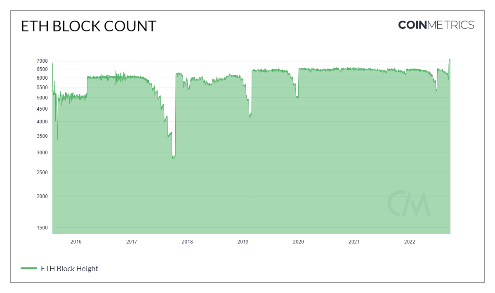
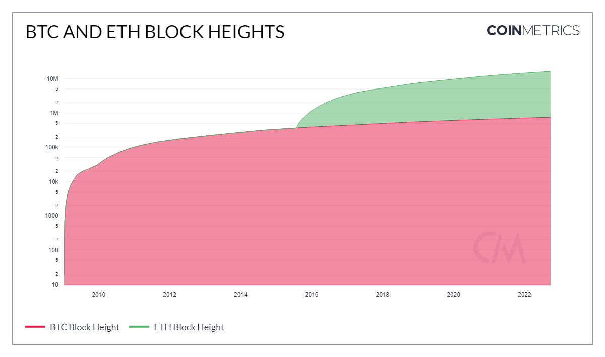
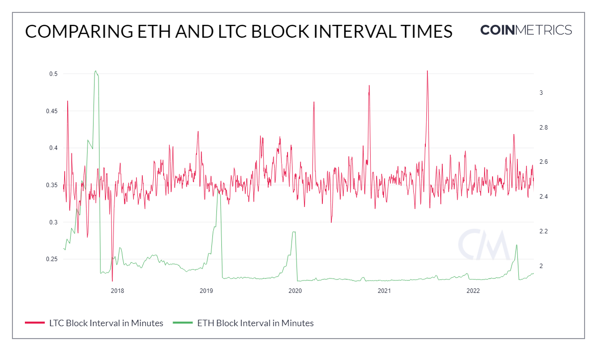
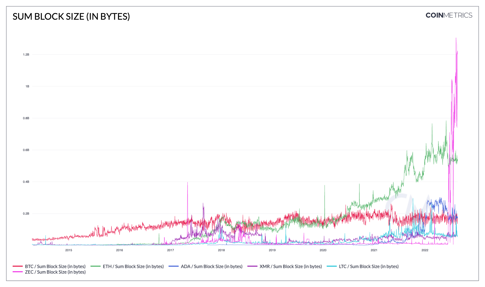
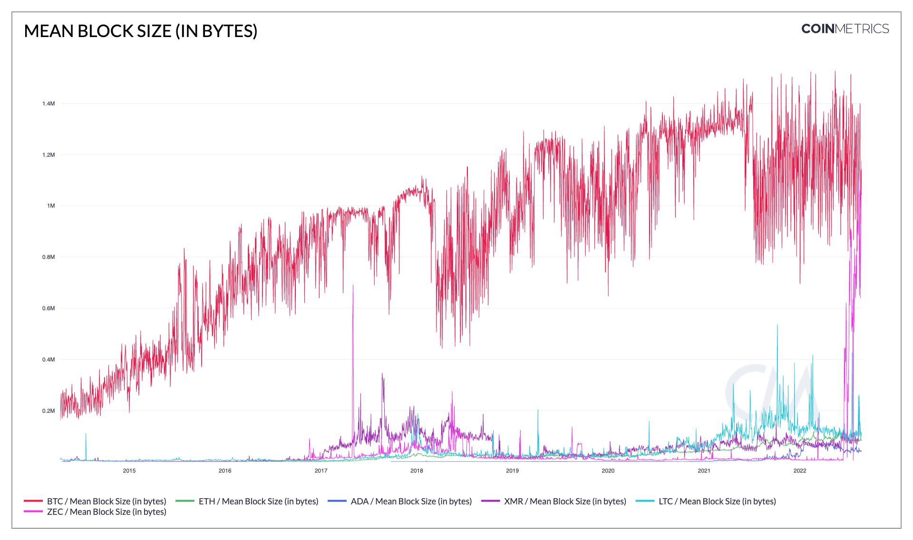
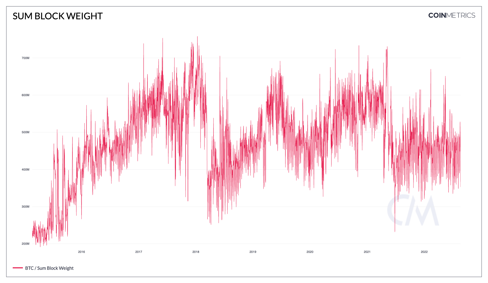
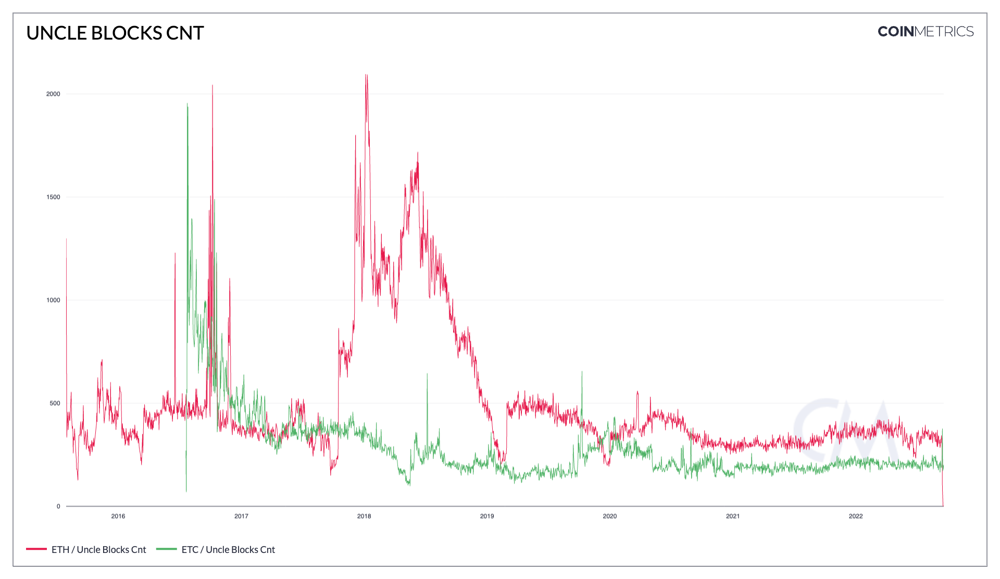
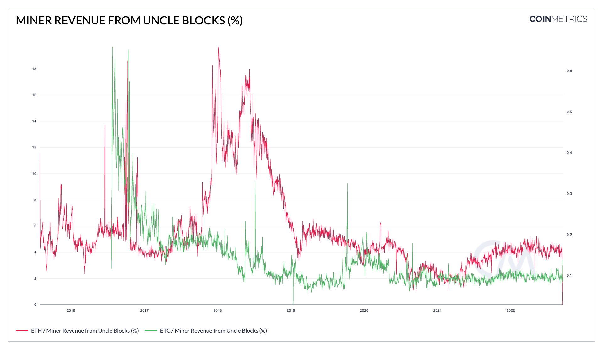
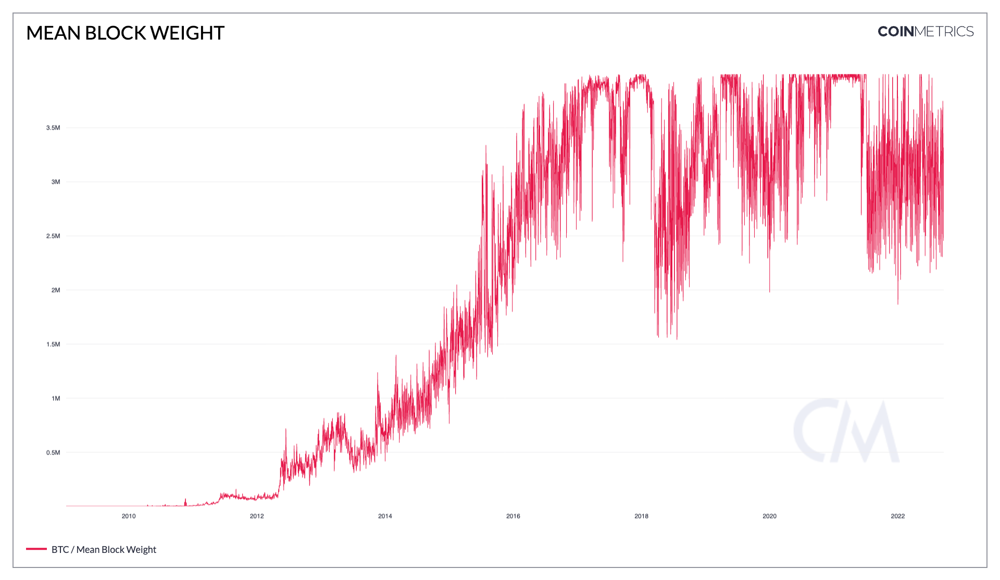

# Contents

* [Block Cnt](block.md#blkcnt)
* [Block Height](block.md#blkhgt)
* [Mean Block Interval (seconds)](block.md#blkintmean)
* [Sum Block Size (in bytes)](block.md#blksizebyte)
* [Mean Block Size (in bytes)](block.md#blksizemeanbyte)
* [Uncle Blocks Cnt](block.md#blkunccnt)
* [Miner Revenue from Uncle Blocks (%)](block.md#blkuncrevpct)
* [Uncle Reward](block.md#blkuncrwd)
* [Mean Block Weight](block.md#blkwghtmean)
* [Sum Block Weight](block.md#blkwghttot)

# Block Cnt<a href="#blkcnt" id="blkcnt"></a>

## Definition

The sum count of blocks created that interval that were included in the main (base) chain.

| Name      | MetricID | Category      | Subcategory | Type | Unit   | Interval      |
| --------- | -------- | ------------- | ----------- | ---- | ------ | ------------- |
| Block Cnt | BlkCnt   | Network Usage | Blocks      | Sum  | Blocks | 1 day, 1 hour |

## Details

* Only mainchain (non-orphaned/uncles) blocks are counted.
* For chains that use median time, the day is defined using it, otherwise, it’s defined using the block’s timestamps.

## Chart

<figure><figcaption></figcaption></figure>

## Asset-Specific Details

* Every blockchain will have a Block Count measurement as it's a fundamental aspect of the the distributed ledger technology.

## Examples

* The drawdowns in the ETH block counts can be explained by the numerous hard forks. Block difficulty would rise making it harder for miners to find the next block resulting in an increase in time between blocks therefore less blocks are created each day.

## Release History

* Released in the 1.0 release of NDP

## Interpretation

Block count is typically rather static, but can vary in blockchains which rely on a poisson process for finding new blocks. In proof-of-work chains with long difficulty adjustment windows and significant variance in block times, like Bitcoin, block count can diverge widely from the expected rate. This can happen during competitions for hashpower around the time of forks, or when a significant amount of hashpower is added or subtracted from the blockchain in a short period.

## Availability for Assets



# Block Height<a href="#blkhgt" id="blkhgt"></a>

## Definition

The count of blocks from the genesis (first) block to the last block of that interval on the main chain (in other words, the total number of blocks ever created and included on the chain).

## Dictionary

| Name         | MetriID | Category      | Subcategory | Type | Unit   | Interval               |
| ------------ | ------- | ------------- | ----------- | ---- | ------ | ---------------------- |
| Block Height | BlkHgt  | Network Usage | Blocks      | Sum  | Blocks | 1 block, 1 day, 1 hour |

## Details

* Only mainchain (non-orphaned/uncles) blocks are counted.
* For chains that use median time, the day is defined using it, otherwise, it’s defined using the block’s timestamps

## Chart

<figure><figcaption></figcaption></figure>

## Asset-Specific Details

* Every blockchain will have a Block Height measurement as it's a fundamental aspect of the the distributed ledger technology.

## Examples

* Depending on the blockchain, blocks can be produced at different intervals. The longer a blockchain has been in existence and the faster the blocks are produced, the larger the block height will be. ETH blocks are produced every 14 seconds compared to BTC where blocks are created every 10 minutes or so. Therefore, the block height for ETH will be significantly larger than BTC.

## Release History

* Released in the 4.3 release of NDP

## Interpretation

* New transactions are grouped and added to new blocks on the blockchain. Each block is linked to the previous one and they essentially are stacked together

## Availability for Assets




# Mean Block Interval (seconds)<a href="#blkintmean" id="blkintmean"></a>


## Definition

The mean time (in seconds) between all the blocks created that interval.

| Name            | MetricID   | Category      | Subcategory | Type | Unit    | Interval               |
| --------------- | ---------- | ------------- | ----------- | ---- | ------- | ---------------------- |
| Mean Time Block | BlkIntMean | Network Usage | Blocks      | Mean | Seconds | 1 block, 1 day, 1 hour |

## Details

* Only mainchain (non-orphaned/uncles) blocks are counted.
* For chains that use median time, the day is defined using it, otherwise, it’s defined using the block’s timestamps.
* The absolute interval is used (if block n+1 has a timestamp lower than block n, we use the absolute value of the difference in timestamps, see examples).
* For the block-by-block frequency, it can be interpreted as the amount of time between the publishing of the previous block and the most recent block.&#x20;
  * For example, Block 1 is published at a timestamp of 02:00:00 UTC, Block 2 is published at a timestamp of 02:10:00 UTC, so the BlkIntMean would just be 10m for Block 2.

## Chart

<figure><figcaption></figcaption></figure>

## Asset Specific Details

* On average, Litecoin produces blocks every 2.5 minutes where Ethereum takes around 14 seconds on average

## Example

If for a day, the blocks are:


The value of BlkIntMean would be (120 + 20 + 160 + 60) / 4 = 90 seconds

## Release History

* Released in the 1.0 release of NDP

## Interpretation

Blockchains with shorter block time (and hence a larger sample size per day) will typically have less variance in mean block interval.

## Availability for Assets




---
description: /timeseries/asset-metrics
---

# Sum Block Size (in bytes)<a href="#blksizebyte" id="blksizebyte"></a>


## Definition

The sum of the size (in bytes) of all blocks created that interval.

## Dictionary

| Name                      | MetricID    | Category      | Subcategory | Type | Unit  | Interval               |
| ------------------------- | ----------- | ------------- | ----------- | ---- | ----- | ---------------------- |
| Sum Block Size (in bytes) | BlkSizeByte | Network Usage | Blocks      | Sum  | Bytes | 1 day, 1 block, 1 hour |

## Details

* Only mainchain (non-orphaned/uncles) blocks are counted.
* For chains that use median time, the day is defined using it, otherwise, it’s defined using the block’s timestamps.

## Chart

<figure><figcaption><p><em>Source:</em> <a href="https://charts.coinmetrics.io/network-data/#4297"><em>CM Network Data Charts</em></a></p></figcaption></figure>

## Asset-Specific Details

* This metric is not available for all assets, as some node’s RPC APIs do not expose the size of the blocks.

## Release History

* Released in the 1.0 release of NDP

## Interpretation

* Can be used to measure and compare blockchains' usages and fees
* Can help gauge gas/fee for large transactions:
  * fee per byte = total block fee/block size (byte)

## See Also

* [Mean Block Size (in bytes)](https://docs.coinmetrics.io/asset-metrics/network-usage/blksizemeanbyte)
* [Mean Tx Fee per Byte (native units)](https://docs.coinmetrics.io/asset-metrics/fees-and-revenue/feebytemeanntv)

## Availability for Assets




# Mean Block Size (in bytes)<a href="#blksizemeanbyte" id="blksizemeanbyte"></a>

## Definition

The mean size (in bytes) of all blocks created that interval.

## Dictionary

| Name                       | MetricID        | Category      | Subcategory | Type | Unit  | Interval |
| -------------------------- | --------------- | ------------- | ----------- | ---- | ----- | -------- |
| Mean Block Size (in bytes) | BlkSizeMeanByte | Network Usage | Blocks      | Mean | Bytes | 1 day    |

## Details

* Only mainchain (non-orphaned/uncles) blocks are counted.
* For chains that use median time, the day is defined using it, otherwise, it’s defined using the block’s timestamps.

## Chart

<figure><figcaption><p>Source: <a href="https://charts.coinmetrics.io/network-data/#4298">CM Network Data Charts</a></p></figcaption></figure>

## Asset-Specific Details

* This metric is not available for all assets, as some node’s RPC API do not expose the size of the blocks.

## Release History

* Released in the 1.0 release of NDP

## Interpretation

Mean block size is somewhat arbitrary; block count multiplied by mean block size gives you the total data throughput on a blockchain per day. Blockchains with shorter interblock times will often have smaller blocks but may throughput more data than their higher-latency peers.

## See Also

* [Sum Block Size (in bytes)](https://docs.coinmetrics.io/asset-metrics/network-usage/blksizebyte)

## Availability for Assets




## Definition

The sum weight of all blocks created that interval. Weight is a dimensionless measure of a block’s “size”. It is only applicable for chains that use SegWit (segregated witness).

## Dictionary

| Name             | MetricID   | Category      | Subcategory | Type | Unit          | Interval |
| ---------------- | ---------- | ------------- | ----------- | ---- | ------------- | -------- |
| Sum Block Weight | BlkWghtTot | Network Usage | Blocks      | Mean | Dimensionless | 1 day    |

## Details

* Only mainchain (non-orphaned/uncles) blocks are counted.
* For chains that use median time, the day is defined using it, otherwise, it’s defined using the block’s timestamps.

## Chart

<figure><figcaption><p>Source: <a href="https://charts.coinmetrics.io/network-data/#4254">CM Network Data Charts</a></p></figcaption></figure>

## Asset-Specific Details

* This metric is only available for assets that support SegWit.

## Release History

* Released in the 4.9 release of NDP

## Interpretation

Block weight is useful to determine how used a chain is.

## See Also

* [Mean Block Weight](https://docs.coinmetrics.io/asset-metrics/network-usage/blkwghtmean)

## Availability for Assets



---
description: /timeseries/asset-metrics
---

# Uncle Blocks Cnt<a href="#blkunccnt" id="blkunccnt"></a>

## Definition

The sum count of uncle blocks mined in that interval.

## Dictionary

| Name             | MetricID  | Category      | Subcategory | Type  | Unit   | Interval       |
| ---------------- | --------- | ------------- | ----------- | ----- | ------ | -------------- |
| Uncle Blocks Cnt | BlkUncCnt | Network Usage | Blocks      | Count | Uncles | 1 block, 1 day |

## Details

* Uncle Blocks (also known as Ommer Blocks) are an intrinsic feature of Ethereum.
* Unlike Bitcoin, Ethereum does not discard blocks in situations where multiple miners find a valid block of the same height.
* Instead, Ethereum rewards secondary miners with so-called Uncle Blocks, which effectively represent a share of the work, as well as the reward, of processing transactions.
* Uncle blocks are not included in the asset’s main chain but are referenced by main chain blocks. Both the main chain block and uncle block miners get an extra reward for this.

## Chart

<figure><figcaption><p>Source: <a href="https://charts.coinmetrics.io/network-data/#4237">CM Network Data Charts</a></p></figcaption></figure>

## Asset-Specific Details

* This metric is only relevant to ETH and ETC

## Release History

* Released in the 4.3 release of NDP
* Deprecated post the Ethereum Merge

## Interpretation

* The more uncle blocks there are, the more uncertainty there might be around the finality of those related payments

## See Also

* [Miner Revenue from Uncle Blocks (%)](https://docs.coinmetrics.io/asset-metrics/network-usage/blkuncrevpct)
* [Uncle Reward (native units)](https://docs.coinmetrics.io/asset-metrics/network-usage/blkuncrwd)
* [Uncle Reward (USD)](https://docs.coinmetrics.io/asset-metrics/network-usage/blkuncrwdusd)

## Availability for Assets




# Miner Revenue from Uncle Blocks (%)<a href="#blkuncrevpct" id="blkuncrevpct"></a>


## Definition

The percentage of miner revenue exclusively derived from creating and including uncle blocks in that interval. This is equal to the sum of the uncle inclusion reward (for the main chain block miner) and the uncle rewards (for the uncle block miners) divided by the miner revenue.

## Dictionary

| Name                                | MetricID     | Category      | Subcategory | Type       | Unit          | Interval |
| ----------------------------------- | ------------ | ------------- | ----------- | ---------- | ------------- | -------- |
| Miner Revenue from Uncle Blocks (%) | BlkUncRevPct | Network Usage | Blocks      | Percentage | Dimensionless | 1 day    |

## Details

* Uncle Blocks (also known as Ommer Blocks) are an intrinsic feature of Ethereum.
* Unlike Bitcoin, Ethereum does not discard blocks in situations where multiple miners find a valid block of the same height.
* Instead, Ethereum rewards secondary miners with so-called Uncle Blocks, which effectively represent a share of the work, as well as the reward, of processing transactions.
* This metric measures the proportion of rewards that resulted from Uncle Blocks.

## Chart

<figure><figcaption><p>Source: <a href="https://charts.coinmetrics.io/network-data/#4250">CM Network Data Charts</a></p></figcaption></figure>

## Asset-Specific Details

* This metric is only relevant to ETH & ETC

## Release History

* Release Version: NDP-EOD 4.8 (Nov, 2020)
* Deprecated post the Ethereum Merge

## See Also

* [Uncle Blocks Cnt](https://docs.coinmetrics.io/asset-metrics/network-usage/blkunccnt)
* [Uncle Reward (native units)](https://docs.coinmetrics.io/asset-metrics/network-usage/blkuncrwd)
* [Uncle Reward (USD)](https://docs.coinmetrics.io/asset-metrics/network-usage/blkuncrwdusd)

## Availability for Assets




# Uncle Reward<a href="#blkuncrwd" id="blkuncrwd"></a>


## Definition

The sum rewarded to miners for creating and including uncle blocks in that interval. This includes the uncle inclusion reward (for the main chain block miner) and the uncle rewards (for the uncle block miners).

| Name                        | MetricID  | Category      | Subcategory | Type | Unit         | Interval       |
| --------------------------- | --------- | ------------- | ----------- | ---- | ------------ | -------------- |
| Uncle Reward (native units) | BlkUncRwd | Network Usage | Blocks      | Sum  | Native Units | 1 block, 1 day |
| Uncle Reward (USD) | BlkUncRwdUSD | Network Usage | Blocks      | Sum  | Native Units | 1 block, 1 day |

## Details

* Uncle Blocks (also known as Ommer Blocks) are an intrinsic feature of Ethereum.
* Unlike Bitcoin, Ethereum does not discard blocks in situations where multiple miners find a valid block of the same height.
* Instead, Ethereum rewards secondary miners with so-called Uncle Blocks, which effectively represent a share of the work, as well as the reward, of processing transactions.
* Uncle blocks are not included in the asset’s main chain but are referenced by main chain blocks. Both the main chain block and uncle block miners get an extra reward for this.

## Asset-Specific Details

* Only available for ETH and ETC

## Release History

* Released in the 4.3 release of NDP

## Availability for Assets



# Mean Block Weight<a href="#blkwghtmean" id="blkwghtmean"></a>


## Definition

The mean weight of all blocks created that interval. Weight is a dimensionless measure of a block’s “size”. It is only applicable for chains that use SegWit (segregated witness).

## Dictionary

| Name              | MetricID    | Category      | Subcategory | Type | Unit          | Interval |
| ----------------- | ----------- | ------------- | ----------- | ---- | ------------- | -------- |
| Mean Block Weight | BlkWghtMean | Network Usage | Blocks      | Mean | Dimensionless | 1 day    |

## Details

* Only mainchain (non-orphaned/uncles) blocks are counted.
* For chains that use median time, the day is defined using it, otherwise, it’s defined using the block’s timestamps.

## Chart

<figure><figcaption><p>Source: <a href="https://charts.coinmetrics.io/network-data/#4251">CM Network Data Charts</a></p></figcaption></figure>

## Asset-Specific Details

* This metric is only available for assets that support SegWit.

## Release History

* Released in the 4.2 release of NDP

## Interpretation

Block weight is useful to determine how used a chain is. If the mean block weight is close to the maximum block weight possible, then the chain is close to 100% utilization.

## See Also

* [Sum Block Weight](https://docs.coinmetrics.io/asset-metrics/network-usage/blkwghttot?q=Sum+Block+Weight)

## Availability for Assets



# Sum Block Weight<a href="#blkwghttot" id="blkwghttot"></a>


## Definition

The sum weight of all blocks created that interval. Weight is a dimensionless measure of a block’s “size”. It is only applicable for chains that use SegWit (segregated witness).

## Dictionary

| Name             | MetricID   | Category      | Subcategory | Type | Unit          | Interval |
| ---------------- | ---------- | ------------- | ----------- | ---- | ------------- | -------- |
| Sum Block Weight | BlkWghtTot | Network Usage | Blocks      | Mean | Dimensionless | 1 day    |

## Details

* Only mainchain (non-orphaned/uncles) blocks are counted.
* For chains that use median time, the day is defined using it, otherwise, it’s defined using the block’s timestamps.

## Chart

<figure><figcaption><p>Source: <a href="https://charts.coinmetrics.io/network-data/#4254">CM Network Data Charts</a></p></figcaption></figure>

## Asset-Specific Details

* This metric is only available for assets that support SegWit.

## Release History

* Released in the 4.9 release of NDP

## Interpretation

Block weight is useful to determine how used a chain is.

## See Also

* [Mean Block Weight](https://docs.coinmetrics.io/asset-metrics/network-usage/blkwghtmean)

## Availability for Assets



# API Endpoints

Block metrics can be accessed using these endpoints:

* `timeseries/asset-metrics`

and by passing in the metric ID's `Blk*` in the `metrics` parameter.


[openapi.yaml](../../.gitbook/assets/openapi.yaml)




```shell
curl --compressed "https://api.coinmetrics.io/v4/timeseries/asset-metrics?metrics=BlkCnt&assets=btc&pretty=true&api_key=<your_key>"
```



```python
import requests
response = requests.get('https://api.coinmetrics.io/v4/timeseries/asset-metrics?metrics=BlkCnt&assets=btc&pretty=true&api_key=<your_key>').json()
print(response)
```



```python
from coinmetrics.api_client import CoinMetricsClient

api_key = "<API_KEY>"
client = CoinMetricsClient(api_key)

print(
    client.get_asset_metrics(
        metrics="BlkCnt", 
        assets="btc",
    ).to_dataframe()
)
```


