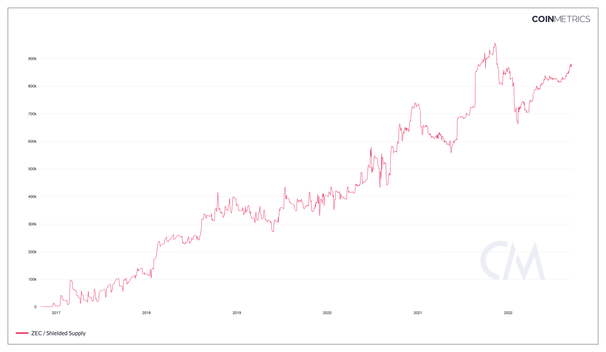

# Contents

* [Shielded Supply](subcategory.md#splyshld)

# Shielded Supply<a href="#splyshld" id="splyshld"></a>

## Definition

The sum of all native units being held in shielded pool(s).

| Name            | MetricID | Category | Subcategory | Type | Unit         | Interval |
| --------------- | -------- | -------- | ----------- | ---- | ------------ | -------- |
| Shielded Supply | SplyShld | Supply   | Shielded    | Sum  | Native units | All time |

## Details

* This metric takes into account all shielded pools that an asset may have.
* Shielded pools are where private transfers can happen in ZEC-like assets. Blockchain observers can only see coins coming in or out of the pool, but have no details about the transfers happening inside the pool.

## Chart

<figure><figcaption><p>Source: CM Network Data Charts</p></figcaption></figure>

## Asset-Specific Details

* Only relevant for ZEC and its derivatives.

## Release History

* Released in the 4.2 release of NDP

## See Also

* [Current Supply](https://docs.coinmetrics.io/asset-metrics/supply/splycur)
* [Shielded Tx Cnt](https://docs.coinmetrics.io/asset-metrics/transactions/txshldcnt)
* [Fully Shielded Tx Cnt](https://docs.coinmetrics.io/asset-metrics/transactions/txshldfullcnt)

## Availability for Assets




# API Endpoints

<Subcategory> metrics can be accessed using these endpoints:

* `timeseries/asset-metrics`

and by passing in the metric ID's `SplyShld` in the `metrics` parameter.


[openapi.yaml](../../.gitbook/assets/openapi.yaml)




```shell
curl --compressed "https://api.coinmetrics.io/v4/timeseries/asset-metrics?metrics=SplyShld&assets=btc&pretty=true&api_key=<your_key>"
```



```python
import requests
response = requests.get('https://api.coinmetrics.io/v4/timeseries/asset-metrics?metrics=SplyShld&assets=btc&pretty=true&api_key=<your_key>').json()
print(response)
```



```python
from coinmetrics.api_client import CoinMetricsClient

api_key = "<API_KEY>"
client = CoinMetricsClient(api_key)

print(
    client.get_asset_metrics(
        metrics="SplyShld", 
        assets="btc",
    ).to_dataframe()
)
```


