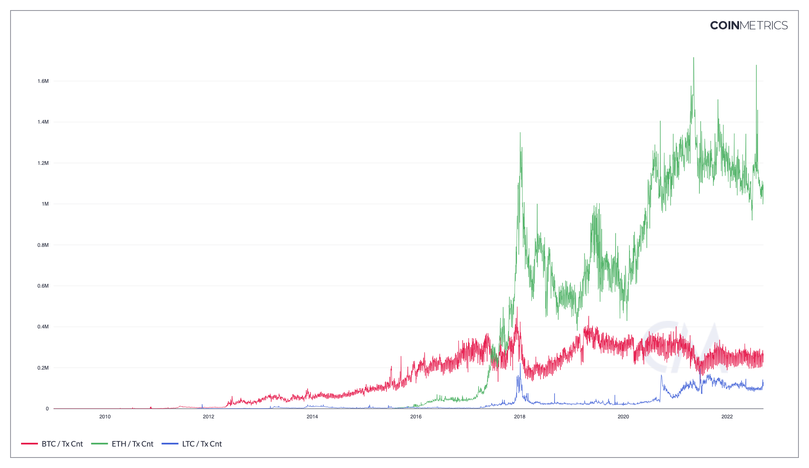

# Contents
* [Tx Cnt](transactions.md#txcnt)
* [Tx per Second Cnt](transactions.md#txcntsec)
* [Tx Mean Size](transactions.md#txmeanbyte.md)
* [OP\_RETURN Tx Cnt](transactions.md#txopretcnt)
* [Shielded Tx Cnt](transactions.md#txshldcnt)
* [Fully Shielded Tx Cnt](transactions.md#txshldfullcnt)

# Tx Cnt <a href="#txcnt" id="txcnt"></a>

## Definition

The sum count of transactions that day. Transactions represent a bundle of intended actions to alter the ledger initiated by a user (human or machine). On certain occasions, transactions are counted regardless of whether they result in the transfer of native units or not. As long as such transactions are recorded on the chain, they will be included in the calculation of this metric. Changes to the ledger algorithmically mandated by the protocol, such as coinbase transactions or post-launch new issuance, are not included here.

| Name   | MetricID | Category     | Subcategory  | Type | Unit         | Interval      |
| ------ | -------- | ------------ | ------------ | ---- | ------------ | ------------- |
| Tx Cnt | TxCnt    | Transactions | Transactions | Sum  | Transactions | 1 day, 1 hour |

## Details

* For UTXO chains, this metric doesn’t include coinbase transactions.

## Chart

<figure><figcaption><p>Source: Coin Metrics Network Data Chart</p></figcaption></figure>

## Release History

* Released in the 1.0 release of NDP

## Availability for Assets



# Tx per Second Cnt<a href="#txcntsec" id="txcntsec"></a>

## Definition

The sum count of transactions divided by the number of seconds that day.

| Name              | MetricID | Category     | Subcategory  | Type | Unit                    | Interval |
| ----------------- | -------- | ------------ | ------------ | ---- | ----------------------- | -------- |
| Tx per Second Cnt | TxCntSec | Transactions | Transactions | Sum  | Transactions per second | 1 day    |

## Details

* Computed as TxCnt / 86400

## Release History

* Released in the 1.0 release of NDP

## Availability for Assets



# EIP1559 Tx Cnt<a href="#txcntsec" id="txcntsec"></a>

## Definition

The sum count of transactions that have natively adopted EIP-1559 features by featuring a Base Fee and Miner Tip.

EIP1559 introduced a host of changes to Ethereum's fee mechanism. While this proposal was implemented as a hard fork, not all wallets have adopted this new transaction type upon activation.

Transactions that are EIP1559-compliant have two portions: a Miner Tip and a Base Fee. Miner Tips represent the portion of the total transaction fees that rewards miners. This serves as an optinal incentive mechanism for miners to prioritize transactions that have opted-in and paid a tip. Base Fees, on the other hand, are mandatory and represent the minimum amount needed to be paid for a transaction to be included in a block. After inclusion, the Base Fee is effectively taken out of circulation, and it is burnt (destroyed).&#x20;

| Name           | MetricID     | Category     | Subcategory  | Type | Unit         | Interval |
| -------------- | ------------ | ------------ | ------------ | ---- | ------------ | -------- |
| EIP1559 Tx Cnt | TxEIP1559Cnt | Transactions | Transactions | Sum  | Transactions | 1 day    |

## Details

* EIP1559 was a highly anticipated proposal that changes how transaction fees are priced in Ethereum, as well as the dynamics of block sizes.
* The proposal activated on the Ethereum Network in August of 2021 and marks one of the biggest changes in monetary policy in the history of cryptoassets.
* Instead of the legacy _gas price_, 1559 splits transaction fees into two distinct fields: a Base Fee and an optional Tip (also known as a _Priority Fee_).
* This metric calculates the total number of native EIP-1559 transactions that have occurred in the network over the measuring period (e.g. 1 day).
* For a thorough review of EIP1559 and the design of its pricing mechanism, please refer to [this paper](https://arxiv.org/pdf/2012.00854.pdf).

## Chart


Source: CM Network Data Charts


## Interpretation

* Not all wallets have implemented EIP-1559 upon activation, so this metric serves as a proxy for the native adoption of this new transaction type.
* While all transactions must abide by EIP-1559 at the blockchain consensus layer (and at the very least carry a Base Fee), not all wallets have natively adopted this transaction fomat.
* This metric serves a proxy to measure the native adoption of EIP1559 by wallets across the network.&#x20;
* The ratio of TxEIP1559Cnt and Tx Cnt provides a view of the adoption of 1559 natively, relative to all other transactiosn that have taken place in the network.&#x20;

## Release History

* Released in the 5.0 release of NDP (August, 2021)

## Availability for Assets



# Tx Mean Size <a href="#txmeanbyte" id="txmeanbyte"></a>

## Definition

The mean size (in bytes) per transaction for all transactions that interval.

| Name         | MetricID   | Category     | Subcategory  | Type | Unit  | Interval       |
| ------------ | ---------- | ------------ | ------------ | ---- | ----- | -------------- |
| Tx Mean Size | TxMeanByte | Transactions | Transactions | Mean | Bytes | 1 day, 1 block |

## Details

* Computed as BlkSizeByte / TxCnt

## Release History

* Released in the 1.0 release of NDP

## Availability for Assets



# OP\_RETURN Tx Cnt <a href="#txopretcnt" id="txopretcnt"></a>

## Definition

The sum count of transactions in that interval that included at least one OP\_RETURN output. OP\_RETURN outputs are used to embed data into the blockchain database.

| Name              | MetricID   | Category     | Subcategory  | Type | Unit         | Interval |
| ----------------- | ---------- | ------------ | ------------ | ---- | ------------ | -------- |
| OP\_RETURN Tx Cnt | TxOpRetCnt | Transactions | Transactions | Sum  | Transactions | 1 day    |

## Details

* Coinbase (i.e., miner reward) transactions are not included.
* This metric is only available for Bitcoin and its forks/derivatives.

## Release History

* Version 4.2 of CM Network Data Pro Daily Macro (End of Day)

## Availability for Assets



# Shielded Tx Cnt <a href="#txshldcnt" id="txshldcnt"></a>

## Definition

The sum count of transactions using opt-in privacy features that interval. All privacy related features are included (including fully shielding, shielding, deshielding or mixed transactions). Transactions represent a bundle of intended actions to alter the ledger initiated by a user (human or machine). Shielding a transaction hides some or all of the activity described by it to a blockchain observer.

| Name            | MetricID  | Category     | Subcategory  | Type | Unit         | Interval |
| --------------- | --------- | ------------ | ------------ | ---- | ------------ | -------- |
| Shielded Tx Cnt | TxShldCnt | Transactions | Transactions | Sum  | Transactions | 1 day    |

## Details

* Transactions in assets with opt-in privacy features can be of several types:
  * Fully shielding: all senders and all recipients are unknown
  * Shielding: all senders are known, all recipients are unknown
  * Deshielding: all senders are unknown, all recipients are known
  * Mixed: some senders are unknown or/and some recipients are unknown
  * Transparent: all senders and recipients are known
* This metric includes all transaction types except transparent

## Asset-Specific Details

* This metric is only available for assets that have opt-in privacy features like ZCash and its derivatives

## Release History

* Version 4.5 of CM Network Data Pro Daily Macro (End of Day)
* Date Last Modified: 2019-01-10

## Availability for Assets



# Fully Shielded Tx Cnt <a href="#txshldfullcnt" id="txshldfullcnt"></a>

## Definition

The sum count of transactions using fully shielding privacy features that interval. Only fully shielding transactions are included (transactions with partial or mixed shielding are not included). Transactions represent a bundle of intended actions to alter the ledger initiated by a user (human or machine). Fully shielding a transaction hides all of the activity of a transaction (except for the miner fee it paid).

| Name                  | MetricID      | Category     | Subcategory  | Type | Unit         | Interval |
| --------------------- | ------------- | ------------ | ------------ | ---- | ------------ | -------- |
| Fully Shielded Tx Cnt | TxShldFullCnt | Transactions | Transactions | Sum  | Transactions | 1 day    |

## Details

* Transactions in assets with opt-in privacy features can be of several types:
  * Fully shielding: all senders and all recipients are unknown
  * Shielding: all senders are known, all recipients are unknown
  * Deshielding: all senders are unknown, all recipients are known
  * Mixed: some senders are unknown or/and some recipients are unknown
  * Transparent: all senders and recipients are known
* This metric includes all transaction types except transparent

## Asset-Specific Details

* This metric is only available for assets that have opt-in privacy features like ZCash and its derivatives

## Release History

* Version 4.5 of CM Network Data Pro Daily Macro (End of Day)
* Date Last Modified: 2019-01-10

## Availability for Assets



# API Endpoints

Token Transaction metrics can be accessed using these endpoints:

* `timeseries/asset-metrics` 

and by passing in the metric ID's `TxTknCnt`, `TxERC721Cnt`, etc. in the `metrics` parameter.


[openapi.yaml](../../.gitbook/assets/openapi.yaml)




```shell
curl --compressed "https://api.coinmetrics.io/v4/timeseries/asset-metrics?metrics=TxTknCnt&assets=eth&pretty=true&api_key=<your_key>"
```



```python
import requests
response = requests.get('https://api.coinmetrics.io/v4/timeseries/asset-metrics?metrics=TxTknCnt&assets=eth&pretty=true&api_key=<your_key>').json()
print(response)
```



```python
from coinmetrics.api_client import CoinMetricsClient

api_key = "<API_KEY>"
client = CoinMetricsClient(api_key)

print(
    client.get_asset_metrics(
        metrics="TxTknCnt", 
        assets="eth",
    ).to_dataframe()
)
```

