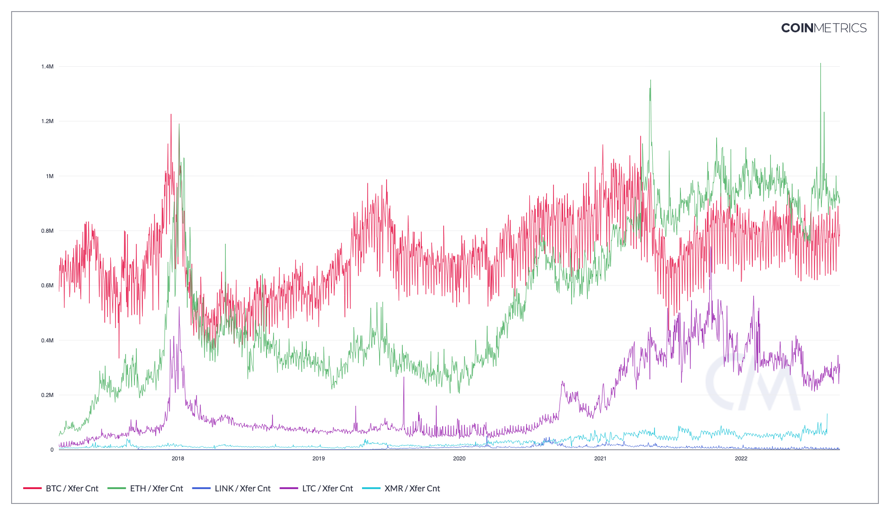

## Contents

* [Xfer Cnt](#txtfrcnt)
* [Token Xfer Cnt](#TxTfrTknCnt)
* [Xfer Mean Size](#txtfrmeanbyte)
* [Per Byte Xfer'd Mean Val, Adj (USD)](#txtfrvaladjbyte)
* [ERC-20 Xfer Cnt](#txtfrerc20cnt)
* [ERC-721 Xfer Cnt](#txtfrerc721cnt)
* [ERC-1155 Xfer Cnt](#txtfrerc1155cnt)

# Xfer Cnt <a href="#txtfrcnt" id="txtfrcnt"></a>

## Definition

The sum count of transfers that interval.

| Name     | MetricID | Category     | Subcategory | Type | Unit      | Interval |
| -------- | -------- | ------------ | ----------- | ---- | --------- | -------- |
| Xfer Cnt | TxTfrCnt | Transactions | Transfers   | Sum  | Transfers | 1 day    |

## Details

* A transaction is comprised of one or more transfers between different entities. A single transaction may contain dozens of distinct transfers, which represent the movements of native units from one ledger entity to another distinct ledger entity. Only transfers that have a positive (non-zero) value are counted. Transfers have been colloquially referred to as "payments".
* For ETH, we do not count failed transactions or self-sends towards TxTfrCnt. We do count internal transfers and do not distinguish them from top-level transfers. One way to think of TxTfrCnt is to count each time ETH effectively changes hands (excluding payment of fees and new issuance)

## Chart

<figure><figcaption><p>Source: CM Network Data Charts</p></figcaption></figure>

## Examples

Consider a single Bitcoin transaction that represents a company's payroll. The company broadcasting this transaction spends one input and generates 12 UTXOs, one for each of its employees. In this example, that transaction would entail 12 transfers.

## Release History

* Release Version: NDP-EOD 1.0

## Availability for Assets



# Token Xfer Cnt <a href="#txtfrtkncnt" id="txtfrtkncnt"></a>

## Definition

The sum count of token (ERC-20 or ERC-721) transfers in that interval. Only non-zero transfers between two distinct addresses are counted. All ERC-20 or ERC-721 contracts are counted, as long as their transfers follow the ERC-20 or ERC-721 specification.

| Name           | MetricID    | Category     | Subcategory | Type | Unit      | Interval |
| -------------- | ----------- | ------------ | ----------- | ---- | --------- | -------- |
| Token Xfer Cnt | TxTfrTknCnt | Transactions | Transfers   | Sum  | Transfers | 1 day    |

## Details

* This metric uses the ERC-20 or ERC-721 specification Transfer event as definition for ERC-20 transfer.

## Asset-Specific Details

* This metric is only available for ETH and ETC.

## Release History

* Version 4.2 of CM Network Data Pro Daily Macro (End of Day)

## Availability for Assets



# Xfer Mean Size <a href="#txtfrmeanbyte" id="txtfrmeanbyte"></a>

## Definition

The mean size (in bytes) per transfer that interval.

| Name           | MetricID      | Category     | Subcategory | Type | Unit  | Interval       |
| -------------- | ------------- | ------------ | ----------- | ---- | ----- | -------------- |
| Xfer Mean Size | TxTfrMeanByte | Transactions | Transfers   | Mean | Bytes | 1 day, 1 block |

## Details

* Computed as BlkSizeByte / TxTfr

## Release History

* Released in the 1.0 release of NDP

## Availability for Assets



# Per Byte Xfer'd Mean Val, Adj (USD) <a href="#txtfrvaladjbyte" id="txtfrvaladjbyte"></a>

## Definition

The mean USD value per byte transferred for all transfers that day removing noise and certain artifacts.

| Name                                | MetricID        | Category     | Subcategory | Type | Unit | Interval |
| ----------------------------------- | --------------- | ------------ | ----------- | ---- | ---- | -------- |
| Per Byte Xfer'd Mean Val, Adj (USD) | TxTfrValAdjByte | Transactions | Transfers   | Sum  | USD  | 1 day    |

## Details

* Computed as TxTfrValAdjNtv / BlkSizeByte
* This metric estimates the economical density of an asset.

## Release History

* Released in the 1.0 release of NDP

## Availability for Assets



# ERC-20 Xfer Cnt <a href="#txtfrerc20cnt" id="txtfrerc20cnt"></a>

## Definition

The sum count of ERC-20 transfers in that interval. Only non-zero transfers between two distinct addresses are counted. Contracts that contain all of the following are considered to be ERC-20 contracts: the balanceOf function, the transfer function, and the Transfer event hash.

| Name            | MetricID      | Category     | Subcategory | Type | Unit      | Interval |
| --------------- | ------------- | ------------ | ----------- | ---- | --------- | -------- |
| ERC-20 Xfer Cnt | TxTfrERC20Cnt | Transactions | Transfers   | Sum  | Transfers | 1 day    |

## Details

* This metric uses the ERC-20 specification Transfer event as the definition for ERC-20 transfer and only looks for transfers emitted by contracts detected as ERC-20 following the criteria outlined in Contracts, ERC-20, count.
* Full compliance with the ERC-20 standard is not required as only few ERC-20 tokens attain it. We therefore look for the bare minimum methods and events necessary for wallet integration of the token: balanceOf and transfer functions as well as the Transfer event. If a contract’s code has all of the following markers, it is considered to be ERC-20:
  * Signature of the balanceOf function: 6370a082311461
  * Signature of the transfer function: 63a9059cbb1461
  * Hash of the transfer event ddf252ad1be2c89b69c2b068fc378daa952ba7f163c4a11628f55a4df523b3ef

## Asset-Specific Details

* This metric is only available for ETH and ETC.

## Release History

* Version 4.3 of CM Network Data Pro Daily Macro (End of Day)

## Availability for Assets



# ERC-721 Xfer Cnt <a href="#txtfrerc721cnt" id="txtfrerc721cnt"></a>

## Definition

The sum count of ERC-721 transfers in that interval. Only transfers between two distinct addresses are counted. ERC-165 is used to determine a contract’s compliance with ERC-721.

| Name             | MetricID       | Category     | Subcategory | Type | Unit      | Interval |
| ---------------- | -------------- | ------------ | ----------- | ---- | --------- | -------- |
| ERC-721 Xfer Cnt | TxTfrERC721Cnt | Transactions | Transfers   | Sum  | Transfers | 1 day    |

## Details

* This metric uses the ERC-721 specification Transfer event as definition for ERC-721 transfer.
* ERC-721 contracts are detected if they implement the ERC-165-compatible interface defined in the ERC-721 specification using the procedure specified in the ERC-165 specification.

## Asset-Specific Details

* This metric is only available for ETH and ETC.

## Release History

* Version 4.3 of CM Network Data Pro Daily Macro (End of Day)

## Availability for Assets



# ERC-1155 Xfer Cnt <a href="#txtfrerc1155cnt" id="txtfrerc1155cnt"></a>

## Definition

The sum count of ERC-1155 transfers in that interval. Only transfers between two distinct addresses are counted. The ERC-1155 standard is an emerging standard for the issuance of both fungible and non-fungible tokens on Ethereum. As of this metric's release date, the standard has attained considerable traction in the ecosystem of Non-Fungible Tokens.&#x20;

| Name              | MetricID        | Category     | Subcategory | Type | Unit      | Interval |
| ----------------- | --------------- | ------------ | ----------- | ---- | --------- | -------- |
| ERC-1155 Xfer Cnt | TxTfrERC1155Cnt | Transactions | Transfers   | Sum  | Transfers | 1 day    |

## Details

* This metric is calculated by monitoring the blockchain for ERC-1155 _Transfer Events,_ as defined by the [EIP-1155 Standard Specification](https://eips.ethereum.org/EIPS/eip-1155).
* Like ERC-721 contracts, the activity of ERC-1155s is detected with the help of a secondary standard, ERC-165, which provides an interface for both 751 as well as 1155-compliant events.

## Asset-Specific Details

* As this metric is tailored to the Ethereum ecosystem, it is only available for ETH .

## Release History

* Released in Network Data Pro (NDP) version 5.1

## Availability for Assets



# API Endpoints

Token Transaction metrics can be accessed using these endpoints:

* `timeseries/asset-metrics`

and by passing in the metric ID's `TxTfr*`, etc. in the `metrics` parameter.


[openapi.yaml](../../.gitbook/assets/openapi.yaml)




```shell
curl --compressed "https://api.coinmetrics.io/v4/timeseries/asset-metrics?metrics=TxTfrERC20Cnt&assets=eth&pretty=true&api_key=<your_key>"
```



```python
import requests
response = requests.get('https://api.coinmetrics.io/v4/timeseries/asset-metrics?metrics=TxTfrERC20Cnt&assets=eth&pretty=true&api_key=<your_key>').json()
print(response)
```



```python
from coinmetrics.api_client import CoinMetricsClient

api_key = "<API_KEY>"
client = CoinMetricsClient(api_key)

print(
    client.get_asset_metrics(
        metrics="TxTfrERC20Cnt", 
        assets="eth",
    ).to_dataframe()
)
```


