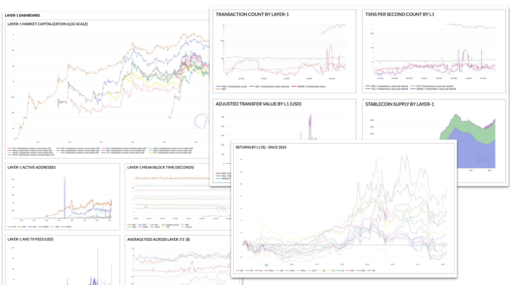
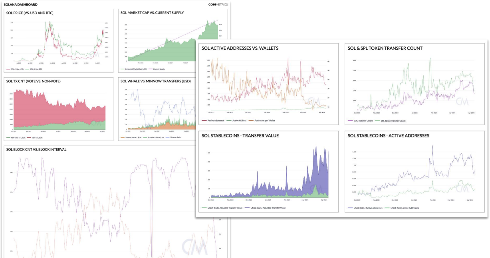
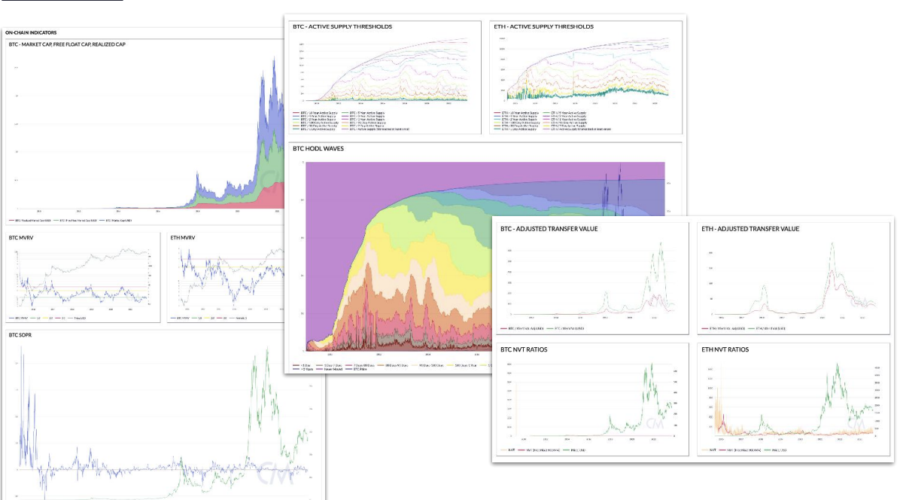
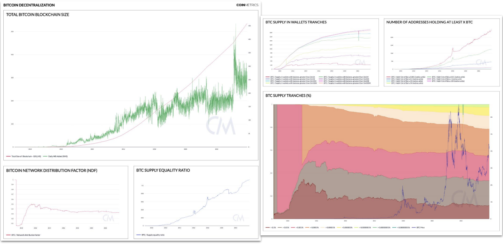
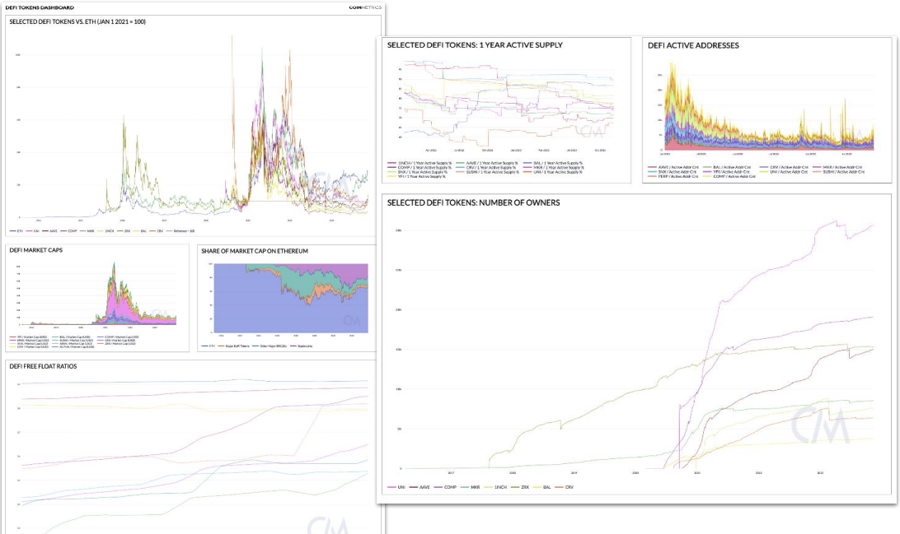
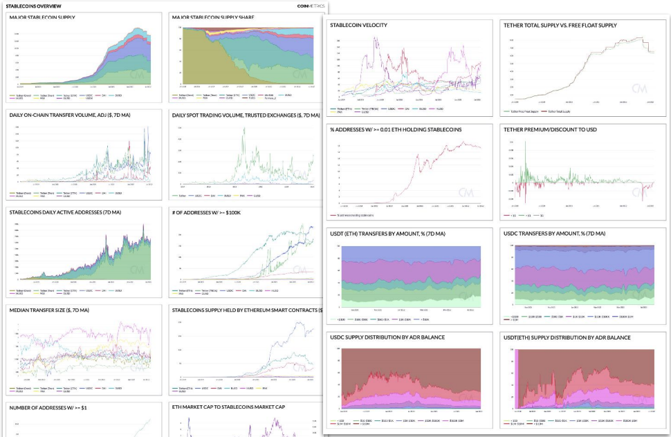
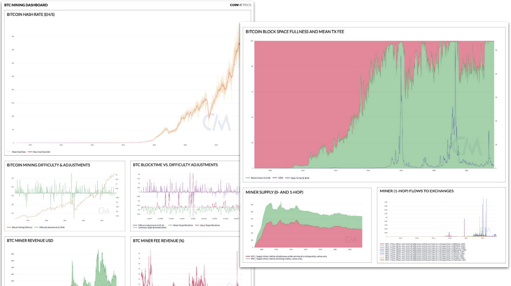
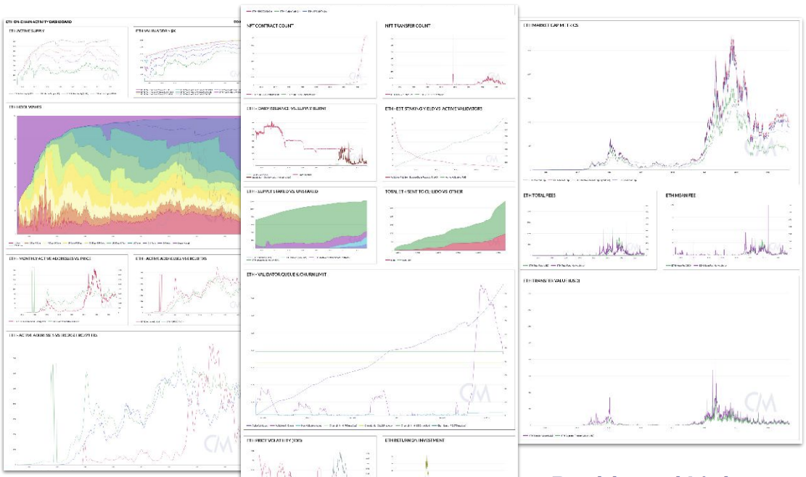
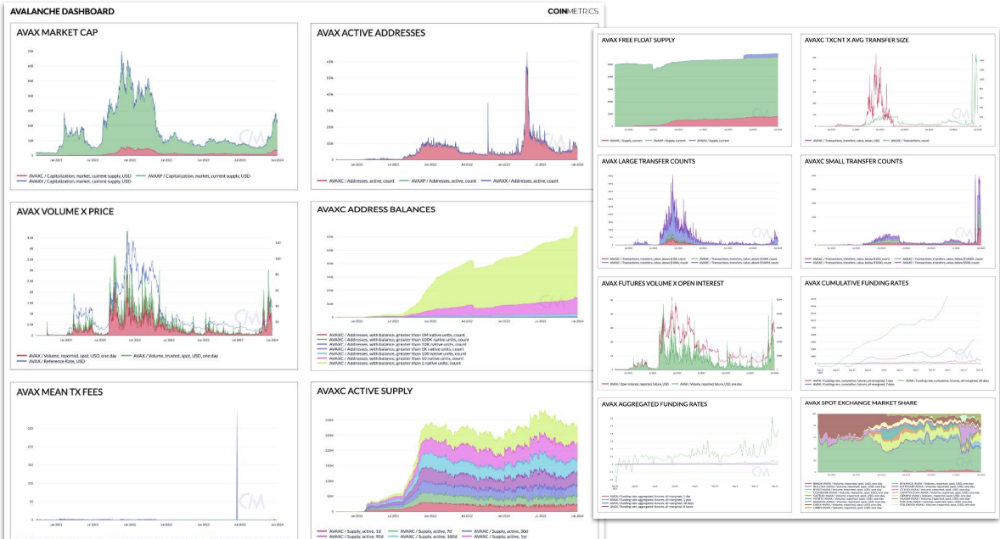
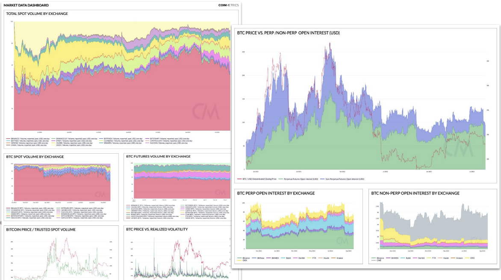

# Dashboard Examples

## Overview

This page showcases examples of what you can do using CM data visualization tools. For more information on how to use the charting tool, see our [data-visualization](../data-visualization/ "mention") guide.

<table><thead><tr><th width="215">Dashboard</th><th width="244">Summary</th><th>Personas</th><th>Use-Case</th></tr></thead><tbody><tr><td><a href="https://charts.coinmetrics.io/dashboard/?id=8591">Layer-1 Overview</a>*</td><td>The Layer-1 dashboard showcases various fundamental metrics for comparing base-layer blockchains, as detailed in State of the Network 256.</td><td>Researcher, Operations/Risk Analyst, Fund Administrator</td><td>Research, Asset Management, Risk Management</td></tr><tr><td><a href="https://charts.coinmetrics.io/dashboard/?id=9508">Solana Metrics</a>*</td><td>The Solana Metrics dashboard introduces Coin Metrics’ cutting-edge suite of SOL metrics, from Layer-1 health monitoring to Solana stablecoin fundamentals.</td><td>Researcher, Operations/Risk Analyst, Fund Administrator</td><td>Research, Asset Management, Risk Management</td></tr><tr><td><a href="https://charts.coinmetrics.io/dashboard/?id=8670">Stablecoins Overview</a>*</td><td>The Stablecoin Sector Overview dashboard explores fundamental stablecoin metrics across the sector, with a focus on top assets like USDC &#x26; USDT.</td><td>Researcher, Operations/ Risk Analyst</td><td>Research, Risk Management</td></tr><tr><td><a href="https://charts.coinmetrics.io/dashboard/?id=9002">On-Chain Indicators</a>*</td><td>The On-Chain Indicators dashboard provides a look at several fundamental on-chain metrics, as well as “valuation” indicators derived from these metrics, from MVRV to NVT.</td><td>Quant Trader, Researcher</td><td>Trading, Research</td></tr><tr><td><a href="https://charts.coinmetrics.io/dashboard/?id=8210">Bitcoin Decentralization</a>*</td><td>The Bitcoin Decentralization dashboard highlights metrics used to measure centralizing aspects of the ecosystem, from total blockchain storage size to wealth distribution metrics.</td><td>Researcher, Fund Admin</td><td>Research, Asset Management</td></tr><tr><td><a href="https://charts.coinmetrics.io/dashboard/?id=8121">DeFi Tokens</a>*</td><td>The DeFi Tokens dashboard highlights on-chain metrics for comparing health and performance of various DeFi governance tokens, drawing inspiration from SOTN 189.</td><td>Researcher, Fund Admin</td><td>Research, Asset Management</td></tr><tr><td><a href="https://charts.coinmetrics.io/dashboard/?id=7554">Stablecoins: BUSD Deep Dive</a>*</td><td>The Stablecoin BUSD Deep Dive dashboard displays some of our most useful stablecoin metrics, with a focus on the recent collapse of Binance USD (BUSD) as a case study.</td><td>Researcher, Operations/Risk Analyst</td><td>Research, Risk Management</td></tr><tr><td><a href="https://charts.coinmetrics.io/dashboard/?id=7965">Bitcoin Mining</a>*</td><td>The Bitcoin Mining dashboard highlights fundamental on-chain data types like hashrate, block time, and difficulty, in addition to entity-based metrics like miner supply and miner-exchange flows.</td><td>Researcher, Operations/Risk Analyst</td><td>Research, Risk Management</td></tr><tr><td><a href="https://charts.coinmetrics.io/dashboard/?id=7375">ETH On-Chain Activity</a>*</td><td>The ETH On-Chain Activity dashboard presents a comprehensive overview of Network Data metrics available for Ethereum, with smart contract metrics, staking data, transfer value, and many other categories covered.</td><td>Researcher</td><td>Research</td></tr><tr><td><a href="https://charts.coinmetrics.io/dashboard/?id=8195">Avalanche</a>*</td><td>The Avalanche (AVAX) dashboard highlights Coin Metrics’ new coverage of on-chain data for the Avalanche ecosystem, presenting various metrics across the 3 constituent blockchains: X-Chain, P-Chain, and C-Chain.</td><td>Researcher, Fund Admin</td><td>Research, Risk Management</td></tr><tr><td><a href="https://charts.coinmetrics.io/dashboard/?id=8006">Market Data</a></td><td>The Market Data dashboard showcases a variety of aggregated market data metrics, with a focus on BTC. Relevant charts include exchange volume share, realized volatility, perp vs. non-perp open interest, and more.</td><td>Researcher, Trading</td><td>Trading, Research</td></tr><tr><td><a href="https://charts.coinmetrics.io/dashboard/?id=9250">Solana - SPL Token Dashboard</a>*</td><td>The Solana - SPL dasboard showcases a variety of metrics for SPL tokens, Solana's token standard, highlighting areas such as ROI, active users and velocity</td><td>Researcher, Fund Admin</td><td>Research, Asset Management, </td></tr></tbody></table>

## Layer-1 Overview\*

The Layer-1 dashboard showcases various fundamental metrics for comparing base-layer blockchains, as detailed in State of the Network 256.

<figure><figcaption></figcaption></figure>



**Personas**

Researcher, Operations/Risk Analyst, Fund Administrator

**Use-Case**

Research, Asset Management, Risk Management

## Solana Metrics\*

The Solana Metrics dashboard introduces Coin Metrics’ cutting-edge suite of SOL metrics, from Layer-1 health monitoring to Solana stablecoin fundamentals.

<figure><figcaption></figcaption></figure>



**Personas**

Researcher, Operations/Risk Analyst, Fund Administrator

**Use-Case**

Research, Asset Management, Risk Management

## Stablecoins Overview\*

The Stablecoin Sector Overview dashboard explores fundamental stablecoin metrics across the sector, with a focus on top assets like USDC & USDT.

<figure><figcaption></figcaption></figure>



#### Personas

Researcher, Operations/Risk Analyst

#### Use-Case

Research, Risk Management

## On-Chain Indicators\*

The On-Chain Indicators dashboard provides a look at several fundamental on-chain metrics, as well as “valuation” indicators derived from these metrics, from MVRV to NVT.

<figure><figcaption></figcaption></figure>



**Personas**

Quant Trader, Researcher

**Use-Case**

Trading, Research

## Bitcoin Decentralization\*

The Bitcoin Decentralization dashboard highlights metrics used to measure centralizing aspects of the ecosystem, from total blockchain storage size to wealth distribution metrics.

<figure><figcaption></figcaption></figure>



**Personas**

Researcher, Fund Admin

**Use-Case**

Research, Asset Management

## DeFi Tokens\*

The DeFi Tokens dashboard highlights on-chain metrics for comparing health and performance of various DeFi governance tokens, drawing inspiration from SOTN 189.

<figure><figcaption></figcaption></figure>



**Personas**

Researcher, Fund Administrator

**Use-Case**

Research, Asset Management

## Stablecoins: BUSD Deep Dive\*

<figure><figcaption></figcaption></figure>

The Stablecoin BUSD Deep Dive dashboard displays some of our most useful stablecoin metrics, with a focus on the recent collapse of Binance USD (BUSD) as a case study.



**Personas**

Researcher, Operations/Risk Analyst

**Use-Case**

Research, Risk Management

## Bitcoin Mining\*

The Bitcoin Mining dashboard highlights fundamental on-chain data types like hashrate, block time, and difficulty, in addition to entity-based metrics like miner supply and miner-exchange flows.

<figure><figcaption></figcaption></figure>



**Personas**

Researcher, Operations/Risk Analyst

**Use-Case**

Research, Risk Management

## ETH On-Chain Activity\*

The ETH On-Chain Activity dashboard presents a comprehensive overview of Network Data metrics available for Ethereum, with smart contract metrics, staking data, transfer value, and many other categories covered.

<figure><figcaption></figcaption></figure>



**Personas**

Researcher

**Use-Case**

Research

## Avalanche\*

The Avalanche (AVAX) dashboard highlights Coin Metrics’ new coverage of on-chain data for the Avalanche ecosystem, presenting various metrics across the 3 constituent blockchains: X-Chain, P-Chain, and C-Chain.

<figure><figcaption></figcaption></figure>



**Personas**

Researcher, Fund Admin

**Use-Case**

Research, Risk Management

## Market Data

The Market Data dashboard showcases a variety of aggregated market data metrics, with a focus on BTC. Relevant charts include exchange volume share, realized volatility, perp vs. non-perp open interest, and more.

<figure><figcaption></figcaption></figure>



**Personas**

Researcher, Trader

**Use-Case**

Trading, Research

## Solana - SPL Tokens\*

The Solana - SPL dasboard showcases a variety of metrics for SPL tokens, Solana's token standard, highlighting areas such as ROI, active users and velocity

<figure><figcaption></figcaption></figure>


Solana - SPL Token Dashboard


**Personas**

Researcher, Fund Admin

**Use-Case**

Research, Asset Management

_\*Requires Pro CM API Key_
