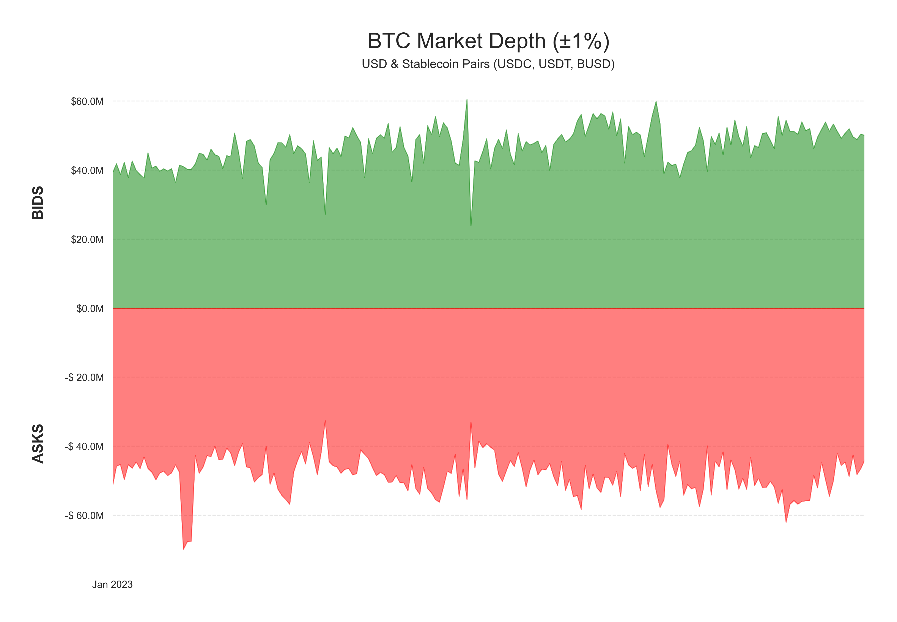

# Aggregating Orderbook Depth to Create Liquidity Metrics


A liquid order book (the collection of outstanding bids and asks for a market) is a necessary component of a mature financial asset. The ability to quickly enter and exit large positions with a small degree of price impact, or slippage, is a desirable feature for institutional market participants. Coin Metrics has been collecting order book snapshots for major crypto assets since 2019, and recently launched new liquidity metrics as part of our **Market Data Feed** offering to further enhance institutions’ view of the crypto markets. In this demo, we explore how these metrics can be used to quantify and aggregate order book depth across some of the most actively-traded BTC markets.

### Resources

This notebook demonstrates basic functionality offered by the Coin Metrics Python API Client and Market Data Feed.

Coin Metrics offers a vast assortment of data for hundreds of cryptoassets. The Python API Client allows for easy access to this data using Python without needing to create your own wrappers using `requests` and other such libraries.

To understand the data that Coin Metrics offers, feel free to peruse the resources below.

* The [Coin Metrics API v4](https://docs.coinmetrics.io/api/v4) website contains the full set of endpoints and data offered by Coin Metrics.
* The [Coin Metrics Knowledge Base](https://docs.coinmetrics.io/info) gives detailed, conceptual explanations of the data that Coin Metrics offers.
* The [API Spec](https://coinmetrics.github.io/api-client-python/site/api\_client.html) contains a full list of functions.


### File Download

Download the entire notebook as either a jupyter notebook to run yourself or as a pdf from the two links below






### Notebook Setup

```python
from os import environ
import sys
import pandas as pd
import seaborn as sns
import logging
from datetime import date, datetime, timedelta
from coinmetrics.api_client import CoinMetricsClient
import json
import logging
from pytz import timezone as timezone_conv
from datetime import timezone as timezone_info
import matplotlib
import matplotlib.dates as mdates
import matplotlib.ticker as ticker
from matplotlib.dates import MonthLocator, DateFormatter, YearLocator, AutoDateLocator
from matplotlib.ticker import NullFormatter
import matplotlib.pyplot as plt
import numpy as np
import plotly.express as px 
import matplotlib.ticker as mticker
import matplotlib as mpl
from matplotlib.offsetbox import OffsetImage, AnnotationBbox
import matplotlib.image as mpimg
%matplotlib inline
```

```python
sns.set_theme()
sns.set(rc={'figure.figsize':(14,8)})
```

```python
logging.basicConfig(
    format='%(asctime)s %(levelname)-8s %(message)s',
    level=logging.INFO,
    datefmt='%Y-%m-%d %H:%M:%S'
)
```

```python
# We recommend privately storing your API key in your local environment.
try:
    api_key = environ["CM_API_KEY"]
    logging.info("Using API key found in environment")
except KeyError:
    api_key = ""
    logging.info("API key not found. Using community client")

client = CoinMetricsClient(api_key)
```

```
2024-10-03 17:14:45 INFO     Using API key found in environment
```

```python
asset = 'btc'
```

```python
asset_markets = client.reference_data_markets(base=asset,type='spot').to_dataframe()
```

```python
asset_markets
```

|     | market                | exchange | base | quote | pair     | symbol    | type | size\_asset | margin\_asset | strike | ... | order\_amount\_min | order\_amount\_max | order\_price\_increment | order\_price\_min | order\_price\_max | order\_size\_min | order\_taker\_fee | order\_maker\_fee | margin\_trading\_enabled | experimental |
| --- | --------------------- | -------- | ---- | ----- | -------- | --------- | ---- | ----------- | ------------- | ------ | --- | ------------------ | ------------------ | ----------------------- | ----------------- | ----------------- | ---------------- | ----------------- | ----------------- | ------------------------ | ------------ |
| 0   | bibox-btc-gusd-spot   | bibox    | btc  | gusd  | btc-gusd | BTC\_GUSD | spot | \<NA>       | \<NA>         | \<NA>  | ... | \<NA>              | \<NA>              | \<NA>                   | \<NA>             | \<NA>             | \<NA>            | \<NA>             | \<NA>             | \<NA>                    | \<NA>        |
| 1   | bibox-btc-sai-spot    | bibox    | btc  | sai   | btc-sai  | BTC\_SAI  | spot | \<NA>       | \<NA>         | \<NA>  | ... | \<NA>              | \<NA>              | \<NA>                   | \<NA>             | \<NA>             | \<NA>            | \<NA>             | \<NA>             | \<NA>                    | \<NA>        |
| 2   | bibox-btc-usdc-spot   | bibox    | btc  | usdc  | btc-usdc | BTC\_USDC | spot | \<NA>       | \<NA>         | \<NA>  | ... | \<NA>              | \<NA>              | \<NA>                   | \<NA>             | \<NA>             | \<NA>            | \<NA>             | \<NA>             | \<NA>                    | \<NA>        |
| 3   | bibox-btc-usdt-spot   | bibox    | btc  | usdt  | btc-usdt | BTC\_USDT | spot | \<NA>       | \<NA>         | \<NA>  | ... | \<NA>              | \<NA>              | \<NA>                   | \<NA>             | \<NA>             | \<NA>            | \<NA>             | \<NA>             | \<NA>                    | \<NA>        |
| 4   | binance-btc-aeur-spot | binance  | btc  | aeur  | btc-aeur | BTCAEUR   | spot | \<NA>       | \<NA>         | \<NA>  | ... | 0.00001            | 9000.0             | 0.01                    | 0.01              | 1000000           | 5.0              | \<NA>             | \<NA>             | \<NA>                    | \<NA>        |
| ... | ...                   | ...      | ...  | ...   | ...      | ...       | ...  | ...         | ...           | ...    | ... | ...                | ...                | ...                     | ...               | ...               | ...              | ...               | ...               | ...                      | ...          |
| 393 | upbit-btc-usdt-spot   | upbit    | btc  | usdt  | btc-usdt | USDT-BTC  | spot | \<NA>       | \<NA>         | \<NA>  | ... | \<NA>              | \<NA>              | \<NA>                   | \<NA>             | \<NA>             | \<NA>            | \<NA>             | \<NA>             | \<NA>                    | \<NA>        |
| 394 | zb.com-btc-pax-spot   | zb.com   | btc  | pax   | btc-pax  | btc\_pax  | spot | \<NA>       | \<NA>         | \<NA>  | ... | \<NA>              | \<NA>              | \<NA>                   | \<NA>             | \<NA>             | \<NA>            | \<NA>             | \<NA>             | \<NA>                    | \<NA>        |
| 395 | zb.com-btc-qc-spot    | zb.com   | btc  | qc    | btc-qc   | btc\_qc   | spot | \<NA>       | \<NA>         | \<NA>  | ... | \<NA>              | \<NA>              | \<NA>                   | \<NA>             | \<NA>             | \<NA>            | \<NA>             | \<NA>             | \<NA>                    | \<NA>        |
| 396 | zb.com-btc-usdc-spot  | zb.com   | btc  | usdc  | btc-usdc | btc\_usdc | spot | \<NA>       | \<NA>         | \<NA>  | ... | \<NA>              | \<NA>              | \<NA>                   | \<NA>             | \<NA>             | \<NA>            | \<NA>             | \<NA>             | \<NA>                    | \<NA>        |
| 397 | zb.com-btc-usdt-spot  | zb.com   | btc  | usdt  | btc-usdt | btc\_usdt | spot | \<NA>       | \<NA>         | \<NA>  | ... | \<NA>              | \<NA>              | \<NA>                   | \<NA>             | \<NA>             | \<NA>            | \<NA>             | \<NA>             | \<NA>                    | \<NA>        |

398 rows × 37 columns

```python
selected_markets = asset_markets.loc[(asset_markets['base']==asset)]
```

```python
selected_markets
```

|     | market                | exchange | base | quote | pair     | symbol    | type | size\_asset | margin\_asset | strike | ... | order\_amount\_min | order\_amount\_max | order\_price\_increment | order\_price\_min | order\_price\_max | order\_size\_min | order\_taker\_fee | order\_maker\_fee | margin\_trading\_enabled | experimental |
| --- | --------------------- | -------- | ---- | ----- | -------- | --------- | ---- | ----------- | ------------- | ------ | --- | ------------------ | ------------------ | ----------------------- | ----------------- | ----------------- | ---------------- | ----------------- | ----------------- | ------------------------ | ------------ |
| 0   | bibox-btc-gusd-spot   | bibox    | btc  | gusd  | btc-gusd | BTC\_GUSD | spot | \<NA>       | \<NA>         | \<NA>  | ... | \<NA>              | \<NA>              | \<NA>                   | \<NA>             | \<NA>             | \<NA>            | \<NA>             | \<NA>             | \<NA>                    | \<NA>        |
| 1   | bibox-btc-sai-spot    | bibox    | btc  | sai   | btc-sai  | BTC\_SAI  | spot | \<NA>       | \<NA>         | \<NA>  | ... | \<NA>              | \<NA>              | \<NA>                   | \<NA>             | \<NA>             | \<NA>            | \<NA>             | \<NA>             | \<NA>                    | \<NA>        |
| 2   | bibox-btc-usdc-spot   | bibox    | btc  | usdc  | btc-usdc | BTC\_USDC | spot | \<NA>       | \<NA>         | \<NA>  | ... | \<NA>              | \<NA>              | \<NA>                   | \<NA>             | \<NA>             | \<NA>            | \<NA>             | \<NA>             | \<NA>                    | \<NA>        |
| 3   | bibox-btc-usdt-spot   | bibox    | btc  | usdt  | btc-usdt | BTC\_USDT | spot | \<NA>       | \<NA>         | \<NA>  | ... | \<NA>              | \<NA>              | \<NA>                   | \<NA>             | \<NA>             | \<NA>            | \<NA>             | \<NA>             | \<NA>                    | \<NA>        |
| 4   | binance-btc-aeur-spot | binance  | btc  | aeur  | btc-aeur | BTCAEUR   | spot | \<NA>       | \<NA>         | \<NA>  | ... | 0.00001            | 9000.0             | 0.01                    | 0.01              | 1000000           | 5.0              | \<NA>             | \<NA>             | \<NA>                    | \<NA>        |
| ... | ...                   | ...      | ...  | ...   | ...      | ...       | ...  | ...         | ...           | ...    | ... | ...                | ...                | ...                     | ...               | ...               | ...              | ...               | ...               | ...                      | ...          |
| 393 | upbit-btc-usdt-spot   | upbit    | btc  | usdt  | btc-usdt | USDT-BTC  | spot | \<NA>       | \<NA>         | \<NA>  | ... | \<NA>              | \<NA>              | \<NA>                   | \<NA>             | \<NA>             | \<NA>            | \<NA>             | \<NA>             | \<NA>                    | \<NA>        |
| 394 | zb.com-btc-pax-spot   | zb.com   | btc  | pax   | btc-pax  | btc\_pax  | spot | \<NA>       | \<NA>         | \<NA>  | ... | \<NA>              | \<NA>              | \<NA>                   | \<NA>             | \<NA>             | \<NA>            | \<NA>             | \<NA>             | \<NA>                    | \<NA>        |
| 395 | zb.com-btc-qc-spot    | zb.com   | btc  | qc    | btc-qc   | btc\_qc   | spot | \<NA>       | \<NA>         | \<NA>  | ... | \<NA>              | \<NA>              | \<NA>                   | \<NA>             | \<NA>             | \<NA>            | \<NA>             | \<NA>             | \<NA>                    | \<NA>        |
| 396 | zb.com-btc-usdc-spot  | zb.com   | btc  | usdc  | btc-usdc | btc\_usdc | spot | \<NA>       | \<NA>         | \<NA>  | ... | \<NA>              | \<NA>              | \<NA>                   | \<NA>             | \<NA>             | \<NA>            | \<NA>             | \<NA>             | \<NA>                    | \<NA>        |
| 397 | zb.com-btc-usdt-spot  | zb.com   | btc  | usdt  | btc-usdt | btc\_usdt | spot | \<NA>       | \<NA>         | \<NA>  | ... | \<NA>              | \<NA>              | \<NA>                   | \<NA>             | \<NA>             | \<NA>            | \<NA>             | \<NA>             | \<NA>                    | \<NA>        |

398 rows × 37 columns

```python
selected_quote_assets = ['usd', 'usdc', 'usdt', 'busd']
selected_quote_markets = selected_markets.loc[selected_markets['quote'].isin(selected_quote_assets)]
```

```python
selected_quote_markets
```

|     | market                       | exchange       | base | quote | pair     | symbol    | type | size\_asset | margin\_asset | strike | ... | order\_amount\_min | order\_amount\_max | order\_price\_increment | order\_price\_min | order\_price\_max | order\_size\_min | order\_taker\_fee | order\_maker\_fee | margin\_trading\_enabled | experimental |
| --- | ---------------------------- | -------------- | ---- | ----- | -------- | --------- | ---- | ----------- | ------------- | ------ | --- | ------------------ | ------------------ | ----------------------- | ----------------- | ----------------- | ---------------- | ----------------- | ----------------- | ------------------------ | ------------ |
| 2   | bibox-btc-usdc-spot          | bibox          | btc  | usdc  | btc-usdc | BTC\_USDC | spot | \<NA>       | \<NA>         | \<NA>  | ... | \<NA>              | \<NA>              | \<NA>                   | \<NA>             | \<NA>             | \<NA>            | \<NA>             | \<NA>             | \<NA>                    | \<NA>        |
| 3   | bibox-btc-usdt-spot          | bibox          | btc  | usdt  | btc-usdt | BTC\_USDT | spot | \<NA>       | \<NA>         | \<NA>  | ... | \<NA>              | \<NA>              | \<NA>                   | \<NA>             | \<NA>             | \<NA>            | \<NA>             | \<NA>             | \<NA>                    | \<NA>        |
| 10  | binance-btc-busd-spot        | binance        | btc  | busd  | btc-busd | BTCBUSD   | spot | \<NA>       | \<NA>         | \<NA>  | ... | 0.00001            | 9000.0             | 0.01                    | 0.01              | 1000000           | 10.0             | \<NA>             | \<NA>             | \<NA>                    | \<NA>        |
| 27  | binance-btc-usdc-spot        | binance        | btc  | usdc  | btc-usdc | BTCUSDC   | spot | \<NA>       | \<NA>         | \<NA>  | ... | 0.00001            | 9000.0             | 0.01                    | 0.01              | 1000000           | 5.0              | \<NA>             | \<NA>             | \<NA>                    | \<NA>        |
| 30  | binance-btc-usdt-spot        | binance        | btc  | usdt  | btc-usdt | BTCUSDT   | spot | \<NA>       | \<NA>         | \<NA>  | ... | 0.00001            | 9000.0             | 0.01                    | 0.01              | 1000000           | 5.0              | \<NA>             | \<NA>             | \<NA>                    | \<NA>        |
| ... | ...                          | ...            | ...  | ...   | ...      | ...       | ...  | ...         | ...           | ...    | ... | ...                | ...                | ...                     | ...               | ...               | ...              | ...               | ...               | ...                      | ...          |
| 389 | therocktrading-btc-usdc-spot | therocktrading | btc  | usdc  | btc-usdc | BTCUSDC   | spot | \<NA>       | \<NA>         | \<NA>  | ... | \<NA>              | \<NA>              | \<NA>                   | \<NA>             | \<NA>             | \<NA>            | \<NA>             | \<NA>             | \<NA>                    | \<NA>        |
| 390 | therocktrading-btc-usdt-spot | therocktrading | btc  | usdt  | btc-usdt | BTCUSDT   | spot | \<NA>       | \<NA>         | \<NA>  | ... | \<NA>              | \<NA>              | \<NA>                   | \<NA>             | \<NA>             | \<NA>            | \<NA>             | \<NA>             | \<NA>                    | \<NA>        |
| 393 | upbit-btc-usdt-spot          | upbit          | btc  | usdt  | btc-usdt | USDT-BTC  | spot | \<NA>       | \<NA>         | \<NA>  | ... | \<NA>              | \<NA>              | \<NA>                   | \<NA>             | \<NA>             | \<NA>            | \<NA>             | \<NA>             | \<NA>                    | \<NA>        |
| 396 | zb.com-btc-usdc-spot         | zb.com         | btc  | usdc  | btc-usdc | btc\_usdc | spot | \<NA>       | \<NA>         | \<NA>  | ... | \<NA>              | \<NA>              | \<NA>                   | \<NA>             | \<NA>             | \<NA>            | \<NA>             | \<NA>             | \<NA>                    | \<NA>        |
| 397 | zb.com-btc-usdt-spot         | zb.com         | btc  | usdt  | btc-usdt | btc\_usdt | spot | \<NA>       | \<NA>         | \<NA>  | ... | \<NA>              | \<NA>              | \<NA>                   | \<NA>             | \<NA>             | \<NA>            | \<NA>             | \<NA>             | \<NA>                    | \<NA>        |

81 rows × 37 columns

```python
selected_btc_usd_market_list = selected_quote_markets['market'].to_list()
```

```python
market_metrics = client.catalog_market_metrics_v2(markets=selected_btc_usd_market_list).to_dataframe()
```

```python
market_metrics
```

|    | market                   | metrics                                                  |
| -- | ------------------------ | -------------------------------------------------------- |
| 0  | binance-btc-busd-spot    | \[{'metric': 'liquidity\_bid\_ask\_spread\_percent\_...  |
| 1  | binance-btc-usdc-spot    | \[{'metric': 'liquidity\_bid\_ask\_spread\_percent\_...  |
| 2  | binance-btc-usdt-spot    | \[{'metric': 'liquidity\_bid\_ask\_spread\_percent\_...  |
| 3  | binance.us-btc-busd-spot | \[{'metric': 'liquidity\_bid\_ask\_spread\_percent\_...  |
| 4  | binance.us-btc-usd-spot  | \[{'metric': 'liquidity\_bid\_ask\_spread\_percent\_...  |
| 5  | binance.us-btc-usdc-spot | \[{'metric': 'liquidity\_bid\_ask\_spread\_percent\_...  |
| 6  | binance.us-btc-usdt-spot | \[{'metric': 'liquidity\_bid\_ask\_spread\_percent\_...  |
| 7  | bitfinex-btc-usd-spot    | \[{'metric': 'liquidity\_bid\_ask\_spread\_percent\_...  |
| 8  | bitfinex-btc-usdt-spot   | \[{'metric': 'liquidity\_bid\_ask\_spread\_percent\_...  |
| 9  | bitflyer-btc-usd-spot    | \[{'metric': 'liquidity\_bid\_ask\_spread\_percent\_...  |
| 10 | bitstamp-btc-usd-spot    | \[{'metric': 'liquidity\_bid\_ask\_spread\_percent\_...  |
| 11 | bitstamp-btc-usdc-spot   | \[{'metric': 'liquidity\_bid\_ask\_spread\_percent\_...  |
| 12 | bitstamp-btc-usdt-spot   | \[{'metric': 'liquidity\_bid\_ask\_spread\_percent\_...  |
| 13 | bittrex-btc-usd-spot     | \[{'metric': 'liquidity\_bid\_ask\_spread\_percent\_...  |
| 14 | bittrex-btc-usdc-spot    | \[{'metric': 'liquidity\_bid\_ask\_spread\_percent\_...  |
| 15 | bittrex-btc-usdt-spot    | \[{'metric': 'liquidity\_bid\_ask\_spread\_percent\_...  |
| 16 | bullish-btc-usd-spot     | \[{'metric': 'liquidity\_bid\_ask\_spread\_percent\_...  |
| 17 | bullish-btc-usdc-spot    | \[{'metric': 'liquidity\_bid\_ask\_spread\_percent\_...  |
| 18 | bullish-btc-usdt-spot    | \[{'metric': 'liquidity\_bid\_ask\_spread\_percent\_...  |
| 19 | bybit-btc-usdc-spot      | \[{'metric': 'liquidity\_bid\_ask\_spread\_percent\_...  |
| 20 | bybit-btc-usdt-spot      | \[{'metric': 'liquidity\_bid\_ask\_spread\_percent\_...  |
| 21 | cex.io-btc-usd-spot      | \[{'metric': 'liquidity\_bid\_ask\_spread\_percent\_...  |
| 22 | cex.io-btc-usdt-spot     | \[{'metric': 'liquidity\_bid\_ask\_spread\_percent\_...  |
| 23 | coinbase-btc-usd-spot    | \[{'metric': 'liquidity\_bid\_ask\_spread\_percent\_...  |
| 24 | coinbase-btc-usdc-spot   | \[{'metric': 'liquidity\_depth\_0\_1\_percent\_ask\_v... |
| 25 | coinbase-btc-usdt-spot   | \[{'metric': 'liquidity\_bid\_ask\_spread\_percent\_...  |
| 26 | crypto.com-btc-usd-spot  | \[{'metric': 'liquidity\_bid\_ask\_spread\_percent\_...  |
| 27 | crypto.com-btc-usdt-spot | \[{'metric': 'liquidity\_bid\_ask\_spread\_percent\_...  |
| 28 | erisx-btc-usd-spot       | \[{'metric': 'liquidity\_bid\_ask\_spread\_percent\_...  |
| 29 | ftx-btc-usd-spot         | \[{'metric': 'liquidity\_bid\_ask\_spread\_percent\_...  |
| 30 | ftx-btc-usdt-spot        | \[{'metric': 'liquidity\_bid\_ask\_spread\_percent\_...  |
| 31 | ftx.us-btc-usd-spot      | \[{'metric': 'liquidity\_bid\_ask\_spread\_percent\_...  |
| 32 | ftx.us-btc-usdt-spot     | \[{'metric': 'liquidity\_bid\_ask\_spread\_percent\_...  |
| 33 | gate.io-btc-usd-spot     | \[{'metric': 'liquidity\_bid\_ask\_spread\_percent\_...  |
| 34 | gate.io-btc-usdc-spot    | \[{'metric': 'liquidity\_bid\_ask\_spread\_percent\_...  |
| 35 | gate.io-btc-usdt-spot    | \[{'metric': 'liquidity\_bid\_ask\_spread\_percent\_...  |
| 36 | gemini-btc-usd-spot      | \[{'metric': 'liquidity\_bid\_ask\_spread\_percent\_...  |
| 37 | gemini-btc-usdt-spot     | \[{'metric': 'liquidity\_bid\_ask\_spread\_percent\_...  |
| 38 | hitbtc-btc-usdc-spot     | \[{'metric': 'liquidity\_bid\_ask\_spread\_percent\_...  |
| 39 | hitbtc-btc-usdt-spot     | \[{'metric': 'liquidity\_bid\_ask\_spread\_percent\_...  |
| 40 | huobi-btc-usdc-spot      | \[{'metric': 'liquidity\_bid\_ask\_spread\_percent\_...  |
| 41 | huobi-btc-usdt-spot      | \[{'metric': 'liquidity\_bid\_ask\_spread\_percent\_...  |
| 42 | itbit-btc-usd-spot       | \[{'metric': 'liquidity\_bid\_ask\_spread\_percent\_...  |
| 43 | kraken-btc-usd-spot      | \[{'metric': 'liquidity\_bid\_ask\_spread\_percent\_...  |
| 44 | kraken-btc-usdc-spot     | \[{'metric': 'liquidity\_bid\_ask\_spread\_percent\_...  |
| 45 | kraken-btc-usdt-spot     | \[{'metric': 'liquidity\_bid\_ask\_spread\_percent\_...  |
| 46 | kucoin-btc-usdc-spot     | \[{'metric': 'liquidity\_bid\_ask\_spread\_percent\_...  |
| 47 | kucoin-btc-usdt-spot     | \[{'metric': 'liquidity\_bid\_ask\_spread\_percent\_...  |
| 48 | liquid-btc-usd-spot      | \[{'metric': 'liquidity\_bid\_ask\_spread\_percent\_...  |
| 49 | liquid-btc-usdc-spot     | \[{'metric': 'liquidity\_bid\_ask\_spread\_percent\_...  |
| 50 | liquid-btc-usdt-spot     | \[{'metric': 'liquidity\_bid\_ask\_spread\_percent\_...  |
| 51 | lmax-btc-usd-spot        | \[{'metric': 'liquidity\_bid\_ask\_spread\_percent\_...  |
| 52 | mexc-btc-busd-spot       | \[{'metric': 'liquidity\_bid\_ask\_spread\_percent\_...  |
| 53 | mexc-btc-usdc-spot       | \[{'metric': 'liquidity\_bid\_ask\_spread\_percent\_...  |
| 54 | mexc-btc-usdt-spot       | \[{'metric': 'liquidity\_bid\_ask\_spread\_percent\_...  |
| 55 | okex-btc-usdc-spot       | \[{'metric': 'liquidity\_bid\_ask\_spread\_percent\_...  |
| 56 | okex-btc-usdt-spot       | \[{'metric': 'liquidity\_bid\_ask\_spread\_percent\_...  |
| 57 | poloniex-btc-usdc-spot   | \[{'metric': 'liquidity\_bid\_ask\_spread\_percent\_...  |
| 58 | poloniex-btc-usdt-spot   | \[{'metric': 'liquidity\_bid\_ask\_spread\_percent\_...  |

```python
available_btc_markets = list(set(market_metrics['market'].to_list()))
```

```python
available_btc_markets
```

```
['bittrex-btc-usdc-spot',
 'bullish-btc-usdc-spot',
 'bitfinex-btc-usd-spot',
 'binance.us-btc-usdc-spot',
 'ftx-btc-usd-spot',
 'kucoin-btc-usdt-spot',
 'bullish-btc-usd-spot',
 'binance.us-btc-usdt-spot',
 'cex.io-btc-usdt-spot',
 'mexc-btc-busd-spot',
 'coinbase-btc-usdc-spot',
 'hitbtc-btc-usdc-spot',
 'huobi-btc-usdt-spot',
 'okex-btc-usdc-spot',
 'binance-btc-busd-spot',
 'poloniex-btc-usdt-spot',
 'huobi-btc-usdc-spot',
 'kraken-btc-usdc-spot',
 'bitstamp-btc-usdt-spot',
 'binance-btc-usdc-spot',
 'coinbase-btc-usd-spot',
 'hitbtc-btc-usdt-spot',
 'kucoin-btc-usdc-spot',
 'coinbase-btc-usdt-spot',
 'mexc-btc-usdc-spot',
 'mexc-btc-usdt-spot',
 'kraken-btc-usdt-spot',
 'kraken-btc-usd-spot',
 'itbit-btc-usd-spot',
 'bittrex-btc-usd-spot',
 'crypto.com-btc-usd-spot',
 'lmax-btc-usd-spot',
 'bullish-btc-usdt-spot',
 'bitflyer-btc-usd-spot',
 'ftx-btc-usdt-spot',
 'binance.us-btc-busd-spot',
 'gemini-btc-usd-spot',
 'liquid-btc-usd-spot',
 'erisx-btc-usd-spot',
 'ftx.us-btc-usd-spot',
 'crypto.com-btc-usdt-spot',
 'bybit-btc-usdc-spot',
 'gate.io-btc-usdt-spot',
 'liquid-btc-usdt-spot',
 'okex-btc-usdt-spot',
 'poloniex-btc-usdc-spot',
 'binance.us-btc-usd-spot',
 'ftx.us-btc-usdt-spot',
 'binance-btc-usdt-spot',
 'bittrex-btc-usdt-spot',
 'bitfinex-btc-usdt-spot',
 'gate.io-btc-usdc-spot',
 'liquid-btc-usdc-spot',
 'bybit-btc-usdt-spot',
 'gemini-btc-usdt-spot',
 'bitstamp-btc-usd-spot',
 'gate.io-btc-usd-spot',
 'cex.io-btc-usd-spot',
 'bitstamp-btc-usdc-spot']
```

```python
start = '2023-01-01'
```

```python
metrics = ['liquidity_depth_1_percent_bid_volume_usd','liquidity_depth_1_percent_ask_volume_usd']
```

```python
df = client.get_market_metrics(
    markets=available_btc_markets,
    metrics=metrics,
    start_time=start,
    end_time='2023-01-08',
    frequency='1h'
).to_dataframe()
```

```python
for metric in metrics:
    df[metric] = pd.to_numeric(df[metric], errors='coerce')
```

```python
df
```

|      | market                 | time                      | liquidity\_depth\_1\_percent\_ask\_volume\_usd | liquidity\_depth\_1\_percent\_bid\_volume\_usd |
| ---- | ---------------------- | ------------------------- | ---------------------------------------------- | ---------------------------------------------- |
| 0    | binance-btc-busd-spot  | 2023-01-01 00:00:00+00:00 | 6573748.305412                                 | 5605136.435418                                 |
| 1    | binance-btc-busd-spot  | 2023-01-01 01:00:00+00:00 | 6913394.853095                                 | 6332381.748353                                 |
| 2    | binance-btc-busd-spot  | 2023-01-01 02:00:00+00:00 | 7214380.809388                                 | 6274423.20817                                  |
| 3    | binance-btc-busd-spot  | 2023-01-01 03:00:00+00:00 | 7523209.589182                                 | 5912474.16043                                  |
| 4    | binance-btc-busd-spot  | 2023-01-01 04:00:00+00:00 | 7449126.92636                                  | 6227347.505593                                 |
| ...  | ...                    | ...                       | ...                                            | ...                                            |
| 6345 | poloniex-btc-usdt-spot | 2023-01-08 19:00:00+00:00 | \<NA>                                          | \<NA>                                          |
| 6346 | poloniex-btc-usdt-spot | 2023-01-08 20:00:00+00:00 | 170301.788236                                  | \<NA>                                          |
| 6347 | poloniex-btc-usdt-spot | 2023-01-08 21:00:00+00:00 | \<NA>                                          | \<NA>                                          |
| 6348 | poloniex-btc-usdt-spot | 2023-01-08 22:00:00+00:00 | \<NA>                                          | \<NA>                                          |
| 6349 | poloniex-btc-usdt-spot | 2023-01-08 23:00:00+00:00 | \<NA>                                          | \<NA>                                          |

6350 rows × 4 columns

```python
df['liquidity_depth_1_percent_ask_volume_usd'] = df['liquidity_depth_1_percent_ask_volume_usd'] * -1
df = df.rename(columns={"liquidity_depth_1_percent_ask_volume_usd": "ASKS", "liquidity_depth_1_percent_bid_volume_usd": "BIDS"})
```

```python
df
```

|      | market                 | time                      | ASKS            | BIDS           |
| ---- | ---------------------- | ------------------------- | --------------- | -------------- |
| 0    | binance-btc-busd-spot  | 2023-01-01 00:00:00+00:00 | -6573748.305412 | 5605136.435418 |
| 1    | binance-btc-busd-spot  | 2023-01-01 01:00:00+00:00 | -6913394.853095 | 6332381.748353 |
| 2    | binance-btc-busd-spot  | 2023-01-01 02:00:00+00:00 | -7214380.809388 | 6274423.20817  |
| 3    | binance-btc-busd-spot  | 2023-01-01 03:00:00+00:00 | -7523209.589182 | 5912474.16043  |
| 4    | binance-btc-busd-spot  | 2023-01-01 04:00:00+00:00 | -7449126.92636  | 6227347.505593 |
| ...  | ...                    | ...                       | ...             | ...            |
| 6345 | poloniex-btc-usdt-spot | 2023-01-08 19:00:00+00:00 | \<NA>           | \<NA>          |
| 6346 | poloniex-btc-usdt-spot | 2023-01-08 20:00:00+00:00 | -170301.788236  | \<NA>          |
| 6347 | poloniex-btc-usdt-spot | 2023-01-08 21:00:00+00:00 | \<NA>           | \<NA>          |
| 6348 | poloniex-btc-usdt-spot | 2023-01-08 22:00:00+00:00 | \<NA>           | \<NA>          |
| 6349 | poloniex-btc-usdt-spot | 2023-01-08 23:00:00+00:00 | \<NA>           | \<NA>          |

6350 rows × 4 columns

```python
sum_bids = df.groupby('time')['BIDS'].sum()
sum_asks = df.groupby('time')['ASKS'].sum()
```

```python
sum_asks
```

```
time
2023-01-01 00:00:00+00:00     -51711674.3155
2023-01-01 01:00:00+00:00   -45829606.793167
2023-01-01 02:00:00+00:00   -45264924.078603
2023-01-01 03:00:00+00:00   -49672194.152268
2023-01-01 04:00:00+00:00   -45360291.558192
                                  ...       
2023-01-08 19:00:00+00:00   -48736064.951989
2023-01-08 20:00:00+00:00   -42514146.912984
2023-01-08 21:00:00+00:00   -48193752.138421
2023-01-08 22:00:00+00:00   -46457643.168556
2023-01-08 23:00:00+00:00   -43813017.641122
Name: ASKS, Length: 192, dtype: Float64
```

```python
average_df = pd.DataFrame(sum_bids).resample('24H').mean()
average_df
```

|                           | BIDS            |
| ------------------------- | --------------- |
| time                      |                 |
| 2023-01-01 00:00:00+00:00 | 40685734.237508 |
| 2023-01-02 00:00:00+00:00 | 44553368.623749 |
| 2023-01-03 00:00:00+00:00 | 45840972.696663 |
| 2023-01-04 00:00:00+00:00 | 46945175.243779 |
| 2023-01-05 00:00:00+00:00 | 47693943.93807  |
| 2023-01-06 00:00:00+00:00 | 50556717.234057 |
| 2023-01-07 00:00:00+00:00 | 47568723.68365  |
| 2023-01-08 00:00:00+00:00 | 51038802.179323 |

```python
# Create the figure and axes
plt.rcParams['font.family'] = 'arial'

fig, ax = plt.subplots(figsize=(15, 9))
ax.set_facecolor('white')

# # Add logo image
# logo_path = './cm-logo.png'
# logo_img = mpimg.imread(logo_path)
# logo_offset = OffsetImage(logo_img, zoom=0.1)
# logo_annotation = AnnotationBbox(logo_offset, xy=(0.1, 1.05), xycoords='axes fraction', 
#                                  bboxprops={'facecolor': 'white', 'edgecolor': 'none'})
# ax.add_artist(logo_annotation)

# Plot the area chart for BIDS (above x-axis) in green
ax.fill_between(sum_bids.index, sum_bids.astype(float), color='green', alpha=0.5)

# Plot the area chart for ASKS (below x-axis) in red
ax.fill_between(sum_asks.index, sum_asks.astype(float), color='red', alpha=0.5)

ax.set_xlabel('')
ax.set_ylabel('ASKS                                                   BIDS\n',fontweight='bold',fontsize=16)

ax.set_title(str(asset).upper() + ' Market Depth (\u00B11%)\n', fontsize=24)
plt.suptitle('       USD & Stablecoin Pairs (USDC, USDT, BUSD)', fontsize=13.5)

formatter = mticker.FuncFormatter(lambda x, pos: f'${x/1e6:.1f}M' if x >= 0 else f'-$ {abs(x)/1e6:.1f}M')

ax.yaxis.set_major_formatter(formatter)
ax.yaxis.grid(color='gray', linestyle='dashed', alpha=0.2)
ax.xaxis.set_major_formatter(mdates.DateFormatter('%b %Y'))
ax.xaxis.set_major_locator(mdates.MonthLocator(interval=1))

plt.xticks(rotation=0)
ax.set_xlim(df['time'].min(), df['time'].max())
plt.subplots_adjust(top=0.95, bottom=0.1)

plt.savefig('./' + str(asset).upper() + '-Market-Depth-1-Percent.png', dpi=300, bbox_inches='tight',pad_inches=0.5,facecolor='white')

plt.show()
```


<figure><figcaption></figcaption></figure>

