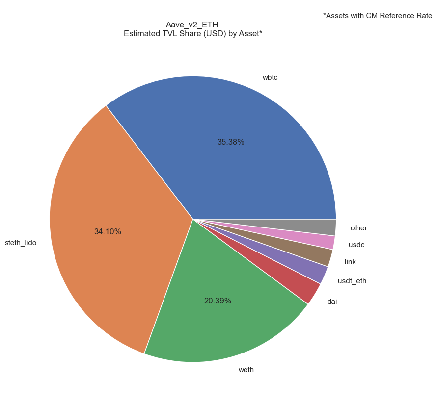
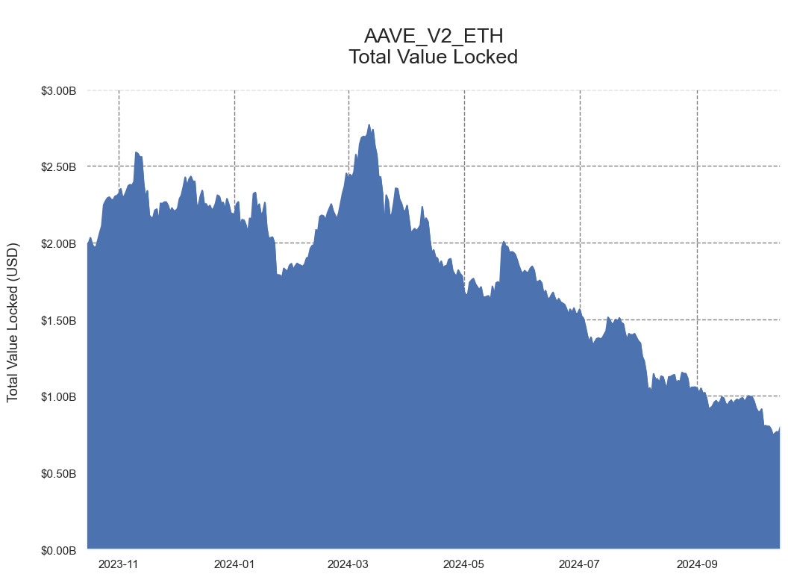

# Analyzing DeFi Protocol Balance Sheets


Decentralized Finance (DeFi) is a rapidly emerging ecosystem of applications and protocols used for trading, lending, and various other financial services. Rather than relying on centralized intermediaries, these protocols utilize permissionless blockchains such as Ethereum to conduct the majority of their activities and transactions on-chain. While these protocols offer an unprecedented level of transparency, complex smart contract code and overlapping on-chain transactions can be difficult to interpret. Coin Metrics **DeFi Balance Sheets** endpoint attempts to distill these operations into a traditional accounting format, presenting protocol assets and liabilities in an intuitive, easy-to-understand schema.

### Resources

This notebook demonstrates basic functionality offered by the Coin Metrics Python API Client.

Coin Metrics offers a vast assortment of data for hundreds of cryptoassets. The Python API Client allows for easy access to this data using Python without needing to create your own wrappers using `requests` and other such libraries.

To understand the data that Coin Metrics offers, feel free to peruse the resources below.

* The [Coin Metrics API v4](https://docs.coinmetrics.io/api/v4) website contains the full set of endpoints and data offered by Coin Metrics.
* The [Coin Metrics Product Documentation](https://docs.coinmetrics.io/info) gives detailed, conceptual explanations of the data that Coin Metrics offers.
* The [API Spec](https://coinmetrics.github.io/api-client-python/site/api\_client.html) contains a full list of functions.

### File Download

Download the entire notebook as either a jupyter notebook to run yourself or as a pdf from the two links below






### Notebook Setup

```python
from os import environ
import sys
import pandas as pd
import numpy as np
import seaborn as sns
import logging
from datetime import date, datetime, timedelta
from coinmetrics.api_client import CoinMetricsClient
import json
import logging
from pytz import timezone as timezone_conv
from datetime import timezone as timezone_info
import matplotlib.dates as mdates
from IPython.display import Markdown as md
import matplotlib.pyplot as plt
import requests
import locale
import ast
%matplotlib inline
```

```python
sns.set_theme()
sns.set(rc={'figure.figsize':(12,8)})
sns.set_style("whitegrid",{'axes.grid' : True,'grid.linestyle': '--', 'grid.color': 'gray','axes.edgecolor': 'white','font.family': ['arial']})
```

```python
logging.basicConfig(
    format='%(asctime)s %(levelname)-8s %(message)s',
    level=logging.INFO,
    datefmt='%Y-%m-%d %H:%M:%S'
)
```

```python
# We recommend privately storing your API key in your local environment.
try:
    api_key = environ["CM_API_KEY"]
    logging.info("Using API key found in environment")
except KeyError:
    api_key = ""
    logging.info("API key not found. Using community client")

client = CoinMetricsClient(api_key)
```

```
2024-10-16 09:31:03 INFO     Using API key found in environment
```

## Retrieve Balance Sheet

```python
aave_v2_eth = client.get_defi_balance_sheets(
    defi_protocols = "aave_v2_eth",
    start_time = '2023-10-15',
    end_time = '2024-10-15').to_dataframe()

# Creating Start and End Time Variables to Simplify Future Data Creation
start_time = pd.to_datetime('2023-10-15')
end_time = pd.to_datetime('2024-10-15')

number_of_days = (end_time - start_time).days

header_index = number_of_days

#Showing last few rows of our current DataFrame with time parameters
aave_v2_eth.tail()
```

|     | defi\_protocol | block\_height | time                      | assets\_total\_usd | assets\_total\_count | liabilities\_total\_usd | liabilities\_total\_count | loans\_lent\_total\_usd | tvl\_total\_usd | net\_working\_capital\_usd | assets                                              | liabilities                                         | protocol\_utilization\_ratio | liquid\_supply\_ratio | current\_ratio | debt\_to\_assets\_ratio |
| --- | -------------- | ------------- | ------------------------- | ------------------ | -------------------- | ----------------------- | ------------------------- | ----------------------- | --------------- | -------------------------- | --------------------------------------------------- | --------------------------------------------------- | ---------------------------- | --------------------- | -------------- | ----------------------- |
| 362 | aave\_v2\_eth  | 20938657      | 2024-10-11 00:00:00+00:00 | 1093532689.9828    | 49                   | 1093614333.6095         | 49                        | 351033529.7825          | 742499160.2003  | -351115173.4092            | \[{'asset': '1inch', 'total\_units': '56475.6927... | \[{'asset': '1inch', 'total\_units': '56085.2667... | 0.320985                     | 0.678941              | 0.678941       | 1.000075                |
| 363 | aave\_v2\_eth  | 20945811      | 2024-10-12 00:00:00+00:00 | 1111063638.7613    | 49                   | 1111174709.0494         | 49                        | 354732076.2007          | 756331562.5606  | -354843146.4888            | \[{'asset': '1inch', 'total\_units': '56476.3058... | \[{'asset': '1inch', 'total\_units': '56085.2668... | 0.319241                     | 0.68066               | 0.68066        | 1.0001                  |
| 364 | aave\_v2\_eth  | 20952957      | 2024-10-13 00:00:00+00:00 | 1124501751.5171    | 49                   | 1124630410.0842         | 49                        | 357832576.4653          | 766669175.0518  | -357961235.0324            | \[{'asset': '1inch', 'total\_units': '56476.9193... | \[{'asset': '1inch', 'total\_units': '56085.2669... | 0.318178                     | 0.681708              | 0.681708       | 1.000115                |
| 365 | aave\_v2\_eth  | 20960089      | 2024-10-14 00:00:00+00:00 | 1116858119.0506    | 49                   | 1117027224.2051         | 49                        | 356159715.5002          | 760698403.5504  | -356328820.6547            | \[{'asset': '1inch', 'total\_units': '56477.5331... | \[{'asset': '1inch', 'total\_units': '56085.2669... | 0.318847                     | 0.681003              | 0.681003       | 1.000152                |
| 366 | aave\_v2\_eth  | 20967244      | 2024-10-15 00:00:00+00:00 | 1167546255.9893    | 49                   | 1167839749.2056         | 49                        | 365325202.3638          | 802221053.6255  | -365618695.5801            | \[{'asset': '1inch', 'total\_units': '56478.1472... | \[{'asset': '1inch', 'total\_units': '56085.2670... | 0.312822                     | 0.686928              | 0.686928       | 1.000252                |

```python
last_row = pd.DataFrame(aave_v2_eth.sort_values(by='time',ascending=False).iloc[0])
last_row
```

|                              | 366                                                 |
| ---------------------------- | --------------------------------------------------- |
| defi\_protocol               | aave\_v2\_eth                                       |
| block\_height                | 20967244                                            |
| time                         | 2024-10-15 00:00:00+00:00                           |
| assets\_total\_usd           | 1167546255.9893                                     |
| assets\_total\_count         | 49                                                  |
| liabilities\_total\_usd      | 1167839749.2056                                     |
| liabilities\_total\_count    | 49                                                  |
| loans\_lent\_total\_usd      | 365325202.3638                                      |
| tvl\_total\_usd              | 802221053.6255                                      |
| net\_working\_capital\_usd   | -365618695.5801                                     |
| assets                       | \[{'asset': '1inch', 'total\_units': '56478.1472... |
| liabilities                  | \[{'asset': '1inch', 'total\_units': '56085.2670... |
| protocol\_utilization\_ratio | 0.312822                                            |
| liquid\_supply\_ratio        | 0.686928                                            |
| current\_ratio               | 0.686928                                            |
| debt\_to\_assets\_ratio      | 1.000252                                            |

```python
assets = last_row.loc["assets"].astype("str")
assets = assets.apply(lambda x: ast.literal_eval(x))
assets = assets.apply(pd.Series)
assets = assets.transpose()
assets = pd.json_normalize(assets[header_index])
assets = assets.set_index('asset').astype(float).sort_values('tvl_usd', ascending=False)
assets
```

|               | total\_units | loans\_lent\_units | tvl\_units   | total\_usd   | loans\_lent\_usd | tvl\_usd     | total\_share | loans\_lent\_share | tvl\_share |
| ------------- | ------------ | ------------------ | ------------ | ------------ | ---------------- | ------------ | ------------ | ------------------ | ---------- |
| asset         |              |                    |              |              |                  |              |              |                    |            |
| wbtc          | 4.848282e+03 | 5.466126e+02       | 4.301669e+03 | 3.198977e+08 | 3.606640e+07     | 2.838313e+08 | 0.273991     | 0.098724           | 0.353807   |
| steth\_lido   | 1.040132e+05 | NaN                | 1.040132e+05 | 2.735189e+08 | NaN              | 2.735189e+08 | 0.234268     | NaN                | 0.340952   |
| weth          | 9.980952e+04 | 3.763314e+04       | 6.217638e+04 | 2.625917e+08 | 9.901010e+07     | 1.635816e+08 | 0.224909     | 0.271019           | 0.203911   |
| dai           | 4.809159e+07 | 2.683005e+07       | 2.126154e+07 | 4.808146e+07 | 2.682440e+07     | 2.125706e+07 | 0.041182     | 0.073426           | 0.026498   |
| usdt\_eth     | 1.032573e+08 | 8.644445e+07       | 1.681281e+07 | 1.032206e+08 | 8.641379e+07     | 1.680685e+07 | 0.088408     | 0.236539           | 0.020950   |
| link          | 1.464885e+06 | 5.475866e+04       | 1.410127e+06 | 1.649758e+07 | 6.166937e+05     | 1.588089e+07 | 0.014130     | 0.001688           | 0.019796   |
| usdc          | 1.271867e+08 | 1.148692e+08       | 1.231756e+07 | 1.271589e+08 | 1.148440e+08     | 1.231486e+07 | 0.108911     | 0.314361           | 0.015351   |
| aave          | 4.722557e+04 | NaN                | 4.722557e+04 | 7.681909e+06 | NaN              | 7.681909e+06 | 0.006580     | NaN                | 0.009576   |
| mkr           | 1.280425e+03 | 1.074842e+00       | 1.279350e+03 | 1.783592e+06 | 1.497221e+03     | 1.782095e+06 | 0.001528     | 0.000004           | 0.002221   |
| crv           | 2.539174e+06 | 7.895537e+03       | 2.531279e+06 | 6.821795e+05 | 2.121230e+03     | 6.800583e+05 | 0.000584     | 0.000006           | 0.000848   |
| uni           | 8.171202e+04 | 2.884203e+03       | 7.882782e+04 | 6.628549e+05 | 2.339690e+04     | 6.394580e+05 | 0.000568     | 0.000064           | 0.000797   |
| snx           | 4.090228e+05 | 2.623178e+03       | 4.063996e+05 | 6.343925e+05 | 4.068537e+03     | 6.303239e+05 | 0.000543     | 0.000011           | 0.000786   |
| busd          | 7.909986e+05 | 2.157098e+05       | 5.752888e+05 | 7.890753e+05 | 2.151853e+05     | 5.738900e+05 | 0.000676     | 0.000589           | 0.000715   |
| frax          | 5.869414e+05 | 8.315375e+04       | 5.037876e+05 | 5.850664e+05 | 8.288812e+04     | 5.021783e+05 | 0.000501     | 0.000227           | 0.000626   |
| tusd          | 5.113231e+05 | 1.365453e+05       | 3.747778e+05 | 5.101233e+05 | 1.362249e+05     | 3.738985e+05 | 0.000437     | 0.000373           | 0.000466   |
| gusd          | 5.928732e+05 | 2.691468e+05       | 3.237263e+05 | 5.923533e+05 | 2.689108e+05     | 3.234425e+05 | 0.000507     | 0.000736           | 0.000403   |
| yfi           | 4.882787e+01 | 5.700117e-02       | 4.877086e+01 | 2.460453e+05 | 2.872309e+02     | 2.457580e+05 | 0.000211     | 0.000001           | 0.000306   |
| mana          | 9.075228e+05 | 1.570493e+05       | 7.504735e+05 | 2.807515e+05 | 4.858480e+04     | 2.321667e+05 | 0.000240     | 0.000133           | 0.000289   |
| rai           | 7.827556e+04 | 1.651545e+04       | 6.176010e+04 | 2.383428e+05 | 5.028824e+04     | 1.880546e+05 | 0.000204     | 0.000138           | 0.000234   |
| susd          | 3.454224e+05 | 1.701397e+05       | 1.752826e+05 | 3.448540e+05 | 1.698598e+05     | 1.749942e+05 | 0.000295     | 0.000465           | 0.000218   |
| ens           | 9.499343e+03 | 3.318105e+01       | 9.466162e+03 | 1.728763e+05 | 6.038542e+02     | 1.722725e+05 | 0.000148     | 0.000002           | 0.000215   |
| ust           | 6.382869e+06 | 2.446807e+05       | 6.138189e+06 | 1.395150e+05 | 5.348164e+03     | 1.341669e+05 | 0.000119     | 0.000015           | 0.000167   |
| pax           | 2.320820e+05 | 1.059562e+05       | 1.261257e+05 | 2.318035e+05 | 1.058291e+05     | 1.259744e+05 | 0.000199     | 0.000290           | 0.000157   |
| bal           | 6.257505e+04 | 3.488278e+03       | 5.908677e+04 | 1.290957e+05 | 7.196507e+03     | 1.218992e+05 | 0.000111     | 0.000020           | 0.000152   |
| zrx           | 2.935068e+05 | 5.396759e+03       | 2.881101e+05 | 9.856175e+04 | 1.812271e+03     | 9.674948e+04 | 0.000084     | 0.000005           | 0.000121   |
| lusd          | 1.440150e+05 | 5.852579e+04       | 8.548924e+04 | 1.437232e+05 | 5.840718e+04     | 8.531598e+04 | 0.000123     | 0.000160           | 0.000106   |
| ren           | 1.739052e+06 | 6.816859e+03       | 1.732235e+06 | 6.742399e+04 | 2.642933e+02     | 6.715970e+04 | 0.000058     | 0.000001           | 0.000084   |
| cvx           | 3.273132e+04 | 1.463298e+02       | 3.258499e+04 | 6.226566e+04 | 2.783670e+02     | 6.198729e+04 | 0.000053     | 0.000001           | 0.000077   |
| bat           | 3.405090e+05 | 6.836504e+03       | 3.336725e+05 | 6.146868e+04 | 1.234126e+03     | 6.023455e+04 | 0.000053     | 0.000003           | 0.000075   |
| enj           | 2.973739e+05 | 9.736583e+04       | 2.000080e+05 | 4.734441e+04 | 1.550145e+04     | 3.184295e+04 | 0.000041     | 0.000042           | 0.000040   |
| 1inch         | 5.647815e+04 | 1.121128e+03       | 5.535702e+04 | 1.533170e+04 | 3.043444e+02     | 1.502736e+04 | 0.000013     | 0.000001           | 0.000019   |
| ampl          | 2.545603e+05 | 2.457468e+05       | 8.813521e+03 | 3.521378e+05 | 3.399459e+05     | 1.219190e+04 | 0.000302     | 0.000931           | 0.000015   |
| knc           | 3.358496e+04 | 1.393234e+04       | 1.965262e+04 | 1.582542e+04 | 6.564995e+03     | 9.260421e+03 | 0.000014     | 0.000018           | 0.000012   |
| fei\_eth      | 1.075374e+04 | 3.299947e+03       | 7.453792e+03 | 1.045299e+04 | 3.207657e+03     | 7.245332e+03 | 0.000009     | 0.000009           | 0.000009   |
| BptBALWETH    | 2.422182e-09 | NaN                | 2.422182e-09 | NaN          | NaN              | NaN          | NaN          | NaN                | NaN        |
| BptWBTCWETH   | 3.185679e-03 | NaN                | 3.185679e-03 | NaN          | NaN              | NaN          | NaN          | NaN                | NaN        |
| GUniDAIUSDC   | 3.743267e+00 | NaN                | 3.743267e+00 | NaN          | NaN              | NaN          | NaN          | NaN                | NaN        |
| GUniUSDCUSDT  | 9.999975e-02 | NaN                | 9.999975e-02 | NaN          | NaN              | NaN          | NaN          | NaN                | NaN        |
| Univ2AAVEWETH | 1.346558e-01 | NaN                | 1.346558e-01 | NaN          | NaN              | NaN          | NaN          | NaN                | NaN        |
| Univ2CRVWETH  | 4.136273e-05 | NaN                | 4.136273e-05 | NaN          | NaN              | NaN          | NaN          | NaN                | NaN        |
| Univ2DAIUSDC  | 9.089043e-06 | NaN                | 9.089043e-06 | NaN          | NaN              | NaN          | NaN          | NaN                | NaN        |
| Univ2DAIWETH  | 3.669936e-01 | NaN                | 3.669936e-01 | NaN          | NaN              | NaN          | NaN          | NaN                | NaN        |
| Univ2LINKWETH | 8.050459e+01 | NaN                | 8.050459e+01 | NaN          | NaN              | NaN          | NaN          | NaN                | NaN        |
| Univ2UNIWETH  | 1.210293e+00 | NaN                | 1.210293e+00 | NaN          | NaN              | NaN          | NaN          | NaN                | NaN        |
| Univ2USDCWETH | 3.099794e-07 | NaN                | 3.099794e-07 | NaN          | NaN              | NaN          | NaN          | NaN                | NaN        |
| Univ2WBTCWETH | 1.887777e-07 | NaN                | 1.887777e-07 | NaN          | NaN              | NaN          | NaN          | NaN                | NaN        |
| dpi           | 8.275005e+02 | 4.202049e+02       | 4.072956e+02 | NaN          | NaN              | NaN          | NaN          | NaN                | NaN        |
| renfil        | 6.387879e+03 | 6.162561e+03       | 2.253174e+02 | NaN          | NaN              | NaN          | NaN          | NaN                | NaN        |
| xsushi        | 4.261961e+05 | 3.357735e+02       | 4.258604e+05 | NaN          | NaN              | NaN          | NaN          | NaN                | NaN        |

```python
assets_tvl_totals = assets['tvl_usd']
```

```python
#the top 7
assets_tvl_top7 = assets_tvl_totals[:7].copy()
# other
assets_tvl_top7.loc['other'] = assets['tvl_usd'][7:].sum()
```

```python
df = pd.DataFrame(assets_tvl_top7)
df['tvl_usd'] = df['tvl_usd'].apply(lambda x: "${:,.2f}".format((x)))
df
```

|             | tvl\_usd        |
| ----------- | --------------- |
| asset       |                 |
| wbtc        | $283,831,271.42 |
| steth\_lido | $273,518,949.72 |
| weth        | $163,581,616.37 |
| dai         | $21,257,057.15  |
| usdt\_eth   | $16,806,852.06  |
| link        | $15,880,889.36  |
| usdc        | $12,314,862.37  |
| other       | $15,029,555.17  |

```python
def my_autopct(pct):
    return ('%.2f' % pct + '%') if pct > 7 else ''

axes = assets_tvl_top7.plot(kind='pie', autopct=my_autopct, figsize=(16, 16), subplots=True, layout=(2, 2), legend=False, labeldistance=1.1)

for ax in axes.flat:
    yl = ax.get_ylabel()
    ax.set(ylabel='', title=yl)
    ax.set_title('Aave_v2_ETH \nEstimated TVL Share (USD) by Asset*',size=20, font='arial')

fig = axes[0, 0].get_figure()
fig.suptitle('\n*Assets with CM Reference Rate',size=11, font='arial')

fig.tight_layout()
plt.rcParams['font.size'] = 15.0
```

<figure><figcaption></figcaption></figure>


```python
aave_v2_eth.index = (pd.to_datetime(aave_v2_eth.time)).dt.date
aave_v2_eth["Total Value Locked (USD)"] = aave_v2_eth.tvl_total_usd.astype(float)
aave_tvl = aave_v2_eth[['defi_protocol','Total Value Locked (USD)']]
```

```python
aave_tvl
```

|            | defi\_protocol | Total Value Locked (USD) |
| ---------- | -------------- | ------------------------ |
| time       |                |                          |
| 2023-10-15 | aave\_v2\_eth  | 1.989641e+09             |
| 2023-10-16 | aave\_v2\_eth  | 1.995368e+09             |
| 2023-10-17 | aave\_v2\_eth  | 2.032416e+09             |
| 2023-10-18 | aave\_v2\_eth  | 1.987327e+09             |
| 2023-10-19 | aave\_v2\_eth  | 1.970314e+09             |
| ...        | ...            | ...                      |
| 2024-10-11 | aave\_v2\_eth  | 7.424992e+08             |
| 2024-10-12 | aave\_v2\_eth  | 7.563316e+08             |
| 2024-10-13 | aave\_v2\_eth  | 7.666692e+08             |
| 2024-10-14 | aave\_v2\_eth  | 7.606984e+08             |
| 2024-10-15 | aave\_v2\_eth  | 8.022211e+08             |

367 rows × 2 columns

```python
ax = aave_tvl.plot.area()
plt.xlim([aave_tvl.index[0], aave_tvl.index[-1]])
plt.title('\n' + str(aave_tvl.defi_protocol.iloc[0]).upper() + '\n Total Value Locked \n',fontdict={'fontsize':19.5})
ax.set_xlabel("")
ax.set_ylabel("Total Value Locked (USD) \n",fontdict={'fontsize':13.5})
ax.yaxis.set_ticks(plt.gca().get_yticks())
ax.get_legend().remove()
plt.gca().set_yticklabels(['${:,.2f}B'.format(x/1000000000) for x in plt.gca().get_yticks()]);
```

<figure><figcaption></figcaption></figure>

