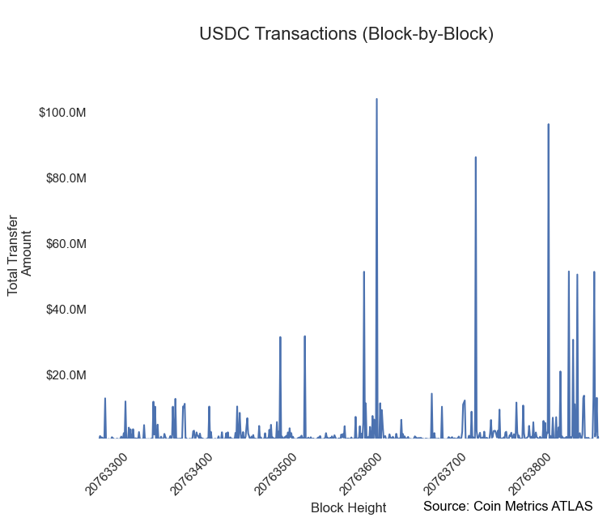
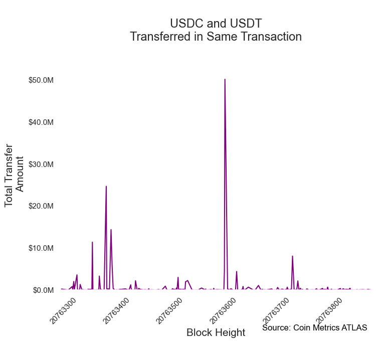
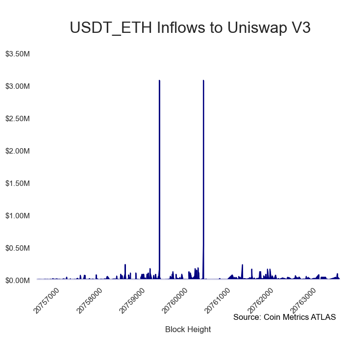
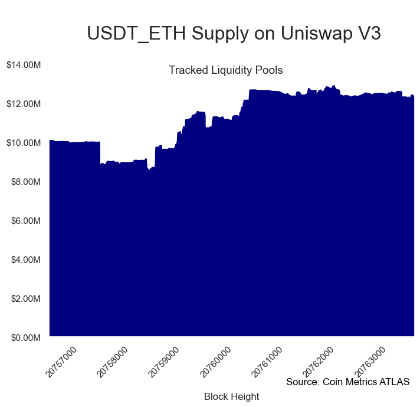

# NDP: Creating Custom Network Data Metrics Using ATLAS


While Coin Metrics **Network Data Pro** offers users the ability to analyze aggregated on-chain metrics for a variety of cryptoassets, some power users may require additional customization and granularity. Coin Metrics **ATLAS search engine** equips users with the on-chain analytical toolset they need to workshop their own custom metrics.

### Resources

This notebook demonstrates basic functionality offered by the Coin Metrics Python API Client, ATLAS, and Network Data Pro.

Coin Metrics offers a vast assortment of data for hundreds of cryptoassets. The Python API Client allows for easy access to this data using Python without needing to create your own wrappers using `requests` and other such libraries.

To understand the data that Coin Metrics offers, feel free to peruse the resources below.

* The [Coin Metrics API v4](https://docs.coinmetrics.io/api/v4) website contains the full set of endpoints and data offered by Coin Metrics.
* The [Coin Metrics Knowledge Base](https://docs.coinmetrics.io/info) gives detailed, conceptual explanations of the data that Coin Metrics offers.
* The [API Spec](https://coinmetrics.github.io/api-client-python/site/api\_client.html) contains a full list of functions.

### Notebook Setup

```python
from os import environ
import pandas as pd
import logging
from datetime import date, datetime, timedelta
from coinmetrics.api_client import CoinMetricsClient
import json
import logging
import seaborn as sns
import matplotlib.pyplot as plt
%matplotlib inline
from IPython.display import Markdown as md
```

```python
sns.set_theme()
sns.set(rc={'figure.figsize':(8,6)})
sns.set_style("whitegrid",{'axes.grid' : False,'grid.linestyle': '--', 'grid.color': 'black','axes.edgecolor': 'white','font.family': ['sans-serif']})
```

```python
logging.basicConfig(
    format='%(asctime)s %(levelname)-8s %(message)s',
    level=logging.INFO,
    datefmt='%Y-%m-%d %H:%M:%S'
)
```

```python
# We recommend privately storing your API key in your local environment.
try:
    api_key = environ["CM_API_KEY"]
    logging.info("Using API key found in environment")
except KeyError:
    api_key = ""
    logging.info("API key not found. Using community client")

client = CoinMetricsClient(api_key)
```

```
2024-09-16 14:50:24 INFO     Using API key found in environment
```

## Block-by-Block Metrics

With **Network Data Pro**, block-by-block metrics are offered for both BTC and ETH. With **ATLAS**, however, we have the ability to retrieve block-by-block metrics for any asset in ATLAS coverage.

In this example, we quantify the total amount of USDC and USDT transferred on a block-by-block basis.

```python
hours = 2
end = datetime.now()
start = end - timedelta(hours=hours)
```

```python
# Retrieving data for both USDC and USDT (ETH chain)
asset_list = ['usdc','usdt_eth']
```

```python
for asset in asset_list:
    print('Fetching ' + asset.upper() + ' transactions...')
    
    # ATLAS 'Get List of Transactions' function
    vars()[asset + '_tx'] = client.get_list_of_transactions_v2(
            asset=asset,
            start_time=start,
            end_time=end
    ).to_dataframe().drop_duplicates(subset=['txid'],keep='last')
```

```
Fetching USDC transactions...
Fetching USDT_ETH transactions...
```

#### USDC Transactions

```python
usdc_tx.tail()
```

|      | txid                                              | consensus\_time           | tx\_position      | n\_balance\_updates | amount       | block\_hash                                       | height   | miner\_time               | min\_chain\_sequence\_number | max\_chain\_sequence\_number | fee |
| ---- | ------------------------------------------------- | ------------------------- | ----------------- | ------------------- | ------------ | ------------------------------------------------- | -------- | ------------------------- | ---------------------------- | ---------------------------- | --- |
| 4839 | e4349a2d37cb71ea25068fdae029f99903585d3c221281... | 2024-09-16 14:50:23+00:00 | 89180189833035782 | 2                   | 1047.039959  | 0a590f6b2dd842efa8a7f1a0ebce2746cdb20a2c069bb8... | 20763881 | 2024-09-16 14:50:23+00:00 | 89180189833035790            | 89180189833035791            | 0   |
| 4840 | 9c224f0fd2e8a82561351ace87d0b4db0e382d948ec8fe... | 2024-09-16 14:50:23+00:00 | 89180189833035783 | 2                   | 560.0        | 0a590f6b2dd842efa8a7f1a0ebce2746cdb20a2c069bb8... | 20763881 | 2024-09-16 14:50:23+00:00 | 89180189833035792            | 89180189833035793            | 0   |
| 4841 | 559ba39db4ccd441c3a22ac6de2536567b7e9c78280925... | 2024-09-16 14:50:23+00:00 | 89180189833035784 | 2                   | 82426.032272 | 0a590f6b2dd842efa8a7f1a0ebce2746cdb20a2c069bb8... | 20763881 | 2024-09-16 14:50:23+00:00 | 89180189833035794            | 89180189833035795            | 0   |
| 4842 | fe0d66654af63c8c31f2f012daae75efaff9d91f85be58... | 2024-09-16 14:50:23+00:00 | 89180189833035785 | 2                   | 1455.127734  | 0a590f6b2dd842efa8a7f1a0ebce2746cdb20a2c069bb8... | 20763881 | 2024-09-16 14:50:23+00:00 | 89180189833035796            | 89180189833035797            | 0   |
| 4843 | 8651c23909accf78b1ad45cadc85eb74aeb4afe2031f50... | 2024-09-16 14:50:23+00:00 | 89180189833035786 | 2                   | 30.0         | 0a590f6b2dd842efa8a7f1a0ebce2746cdb20a2c069bb8... | 20763881 | 2024-09-16 14:50:23+00:00 | 89180189833035798            | 89180189833035799            | 0   |

```python
# Transform balance updates into block-by-block transfer metrics with one line of code
usdc_tx_bbb = pd.DataFrame(usdc_tx.groupby('height')['amount'].sum())
usdc_tx_bbb.head()
```

|          | amount        |
| -------- | ------------- |
| height   |               |
| 20763288 | 113663.822406 |
| 20763289 | 99292.054782  |
| 20763290 | 7651.824353   |
| 20763291 | 1018865.93048 |
| 20763292 | 384271.09176  |

```python
ax = sns.lineplot(
    data=usdc_tx_bbb,
    y=usdc_tx_bbb['amount'],
    x=usdc_tx_bbb.index
)
ax.set_xlabel("Block Height", fontsize = 12)
ax.set_ylabel("Total Transfer \nAmount", fontsize = 12)
plt.setp(ax.get_xticklabels(), rotation=45)
ax.xaxis.set_ticks(plt.gca().get_xticks())
plt.gca().set_xticklabels(['{:.0f}'.format(x) for x in plt.gca().get_xticks()])
ax.yaxis.set_ticks(plt.gca().get_yticks())
plt.gca().set_yticklabels(['${:,.1f}M'.format(y/1000000) for y in plt.gca().get_yticks()])
plt.ylim([usdc_tx_bbb['amount'].min(), usdc_tx_bbb['amount'].max()*1.1])
plt.xlim([usdc_tx_bbb.index[0], usdc_tx_bbb.index[-1]])
plt.annotate(
    'Source: Coin Metrics ATLAS',
    xy=(1, -0.195),
    xycoords='axes fraction',
    color='black',xytext=(-8, 0),
    textcoords='offset pixels',
    horizontalalignment='right',
    verticalalignment='bottom'
)
ax.set_title('\nUSDC Transactions (Block-by-Block) \n', fontsize = 16)
plt.show()
```

<figure><figcaption></figcaption></figure>

```
largest_tx = usdc_tx.loc[usdc_tx['amount'].idxmax()]
```

```python
largest_tx
```

```
txid                         ca9d6c9c2e86a71c5482845abf9a8821d743bd2923fb73...
consensus_time                                       2024-09-16 14:43:11+00:00
tx_position                                                  89180035214213128
n_balance_updates                                                           10
amount                                                          50893857.89172
block_hash                   19e68e57ad114250502478a0e337ea9ee681f5d0730496...
height                                                                20763845
miner_time                                           2024-09-16 14:43:11+00:00
min_chain_sequence_number                                    89180035214213140
max_chain_sequence_number                                    89180035214213149
fee                                                                          0
Name: 4549, dtype: object
```

```python
md('<br><font size="3.5">Transaction info can also be viewed in the **ATLAS** graphical user interface:<br><br>**Largest Transaction:** <br>https://atlas.coinmetrics.io/transaction-details?asset=usdc&tx_hash=' + str(largest_tx.txid) )
```

\
Transaction info can also be viewed in the **ATLAS** graphical user interface:\
\
**Largest Transaction:**\
https://atlas.coinmetrics.io/transaction-details?asset=usdc\&tx\_hash=ca9d6c9c2e86a71c5482845abf9a8821d743bd2923fb73cb87177e6e83d86d9e

#### USDT Transactions

```python
usdt_eth_tx.tail()
```

|       | txid                                              | consensus\_time           | tx\_position      | n\_balance\_updates | amount     | block\_hash                                       | height   | miner\_time               | min\_chain\_sequence\_number | max\_chain\_sequence\_number | fee |
| ----- | ------------------------------------------------- | ------------------------- | ----------------- | ------------------- | ---------- | ------------------------------------------------- | -------- | ------------------------- | ---------------------------- | ---------------------------- | --- |
| 15151 | 0493f4f094032f2fc01a6a67d1bb7b18cad05d6b3727eb... | 2024-09-16 14:50:23+00:00 | 89180189833035822 | 2                   | 0.111413   | 0a590f6b2dd842efa8a7f1a0ebce2746cdb20a2c069bb8... | 20763881 | 2024-09-16 14:50:23+00:00 | 89180189833035890            | 89180189833035891            | 0   |
| 15152 | 616e8f6cbb50ed258575820c0cdac2b4d768bbb7c4cd7a... | 2024-09-16 14:50:23+00:00 | 89180189833035823 | 2                   | 75.0       | 0a590f6b2dd842efa8a7f1a0ebce2746cdb20a2c069bb8... | 20763881 | 2024-09-16 14:50:23+00:00 | 89180189833035892            | 89180189833035893            | 0   |
| 15153 | bdb7bee6537d63c72055b0b015f9a07e6129aff9fb2c43... | 2024-09-16 14:50:23+00:00 | 89180189833035824 | 2                   | 5.0        | 0a590f6b2dd842efa8a7f1a0ebce2746cdb20a2c069bb8... | 20763881 | 2024-09-16 14:50:23+00:00 | 89180189833035894            | 89180189833035895            | 0   |
| 15154 | 38988bf92c9a968df5d7db4c0307a08a3c857d6879e7c0... | 2024-09-16 14:50:23+00:00 | 89180189833035825 | 2                   | 211.714933 | 0a590f6b2dd842efa8a7f1a0ebce2746cdb20a2c069bb8... | 20763881 | 2024-09-16 14:50:23+00:00 | 89180189833035896            | 89180189833035897            | 0   |
| 15155 | 562fc4b718a681f189cf9aa452937d49527fce7a265193... | 2024-09-16 14:50:23+00:00 | 89180189833035826 | 2                   | 300.0      | 0a590f6b2dd842efa8a7f1a0ebce2746cdb20a2c069bb8... | 20763881 | 2024-09-16 14:50:23+00:00 | 89180189833035898            | 89180189833035899            | 0   |

```python
# Transform balance updates into block-by-block transfer metrics with one line of code
usdt_tx_bbb = pd.DataFrame(usdt_eth_tx.groupby('height')['amount'].sum())
usdt_tx_bbb.head()
```

|          | amount         |
| -------- | -------------- |
| height   |                |
| 20763288 | 523600.540279  |
| 20763289 | 149740.436168  |
| 20763290 | 143192.868507  |
| 20763291 | 79358.83167    |
| 20763292 | 1944483.921281 |

```python
ax = sns.lineplot(
    data=usdt_tx_bbb,
    y=usdt_tx_bbb['amount'],
    x=usdt_tx_bbb.index,
    color='green'
)
ax.set_xlabel("Block Height", fontsize = 15)
ax.set_ylabel("Total Transfer \nAmount", fontsize = 15)
plt.setp(ax.get_xticklabels(), rotation=45)
ax.xaxis.set_ticks(plt.gca().get_xticks())
plt.gca().set_xticklabels(['{:.0f}'.format(x) for x in plt.gca().get_xticks()])
ax.yaxis.set_ticks(plt.gca().get_yticks())
plt.gca().set_yticklabels(['${:,.1f}M'.format(y/1000000) for y in plt.gca().get_yticks()])
plt.ylim([usdt_tx_bbb['amount'].min(), usdt_tx_bbb['amount'].max()*1.1])
plt.xlim([usdt_tx_bbb.index[0], usdt_tx_bbb.index[-1]])
plt.annotate(
    'Source: Coin Metrics ATLAS',
    xy=(1, -0.195), 
    xycoords='axes fraction',color='black',
    xytext=(-8, 6), 
    textcoords='offset pixels',
    horizontalalignment='right',
    verticalalignment='bottom'
)
ax.set_title('\nUSDT Transactions (Block-by-Block) \n', fontsize = 17);

```

<figure><figcaption></figcaption></figure>

```

largest_usdt_tx = usdt_eth_tx.loc[usdt_eth_tx['amount'].idxmax()]
largest_usdt_tx
```

```
txid                         ec6ca03c17cea5c528378bbfa65ef1fb7471395c74a6e8...
consensus_time                                       2024-09-16 13:01:47+00:00
tx_position                                                  89177883435597842
n_balance_updates                                                            2
amount                                                              65000000.0
block_hash                   20c5ffdb60ac0aecbe1827788f2d448c8f0d8ab72827f3...
height                                                                20763344
miner_time                                           2024-09-16 13:01:47+00:00
min_chain_sequence_number                                    89177883435597866
max_chain_sequence_number                                    89177883435597867
fee                                                                          0
Name: 1462, dtype: object
```

```python
md('<br><font size="3.5">Transaction info can also be viewed in the **ATLAS** graphical user interface:<br><br>**Largest Transaction:** <br>https://atlas.coinmetrics.io/transaction-details?asset=usdt_eth&tx_hash=' + str(largest_usdt_tx.txid) )
```

\
Transaction info can also be viewed in the **ATLAS** graphical user interface:\
\
**Largest Transaction:**\
https://atlas.coinmetrics.io/transaction-details?asset=usdt\_eth\&tx\_hash=ec6ca03c17cea5c528378bbfa65ef1fb7471395c74a6e89d7344be0932c94a1c

## Cross-Asset Metrics

With **Network Data Pro**, users have the ability to retrieve aggregated daily transfers for specific assets such as USDC and USDT. With **ATLAS**, however, we have the ability to create more customized, granular metrics.

In this example, we quantify the total size of **transactions where USDT and USDC are transferred simultaneously**, on a block-by-block basis.

```python
usdc_tx['USDC Amount'] = usdc_tx['amount']
usdt_eth_tx['USDT Amount'] = usdt_eth_tx['amount']

merged = pd.merge(usdc_tx[['height','USDC Amount','txid']], usdt_eth_tx[['USDT Amount','txid']], on ='txid')
merged['Total Amount'] = merged['USDT Amount'] + merged['USDC Amount']
```

```python
merged.tail()
```

|     | height   | USDC Amount  | txid                                              | USDT Amount  | Total Amount |
| --- | -------- | ------------ | ------------------------------------------------- | ------------ | ------------ |
| 310 | 20763867 | 149.890998   | 6288646aa12f6e17854e0e567d33e59baadb000fcccaa7... | 225.073709   | 374.964707   |
| 311 | 20763868 | 20.215977    | 33b82dd5137e8610868966f7738467b3cca7aadee525f0... | 40.291364    | 60.507341    |
| 312 | 20763872 | 59998.50869  | 973b87937c485db542909d2c69730a3d5ce41f78cfe01e... | 60000.0      | 119998.50869 |
| 313 | 20763877 | 160.087258   | 97d6b653d389cb1b1a31e26d555e1e9f182633295b0e88... | 2087.301319  | 2247.388577  |
| 314 | 20763878 | 56908.231643 | 8bd1605839db7cf700ac524012a09c71cf9add77d0edec... | 23055.975936 | 79964.207579 |

```python
last_tx = merged.iloc[-1]
txhash = last_tx.txid
```

```python
md('<br><font size="3.5">Transaction info can also be viewed in the **ATLAS** graphical user interface:<br><br>**USDC:** <br>https://atlas.coinmetrics.io/transaction-details?asset=usdc&tx_hash=' + str(txhash) + '<br>**USDT:** <br>https://atlas.coinmetrics.io/transaction-details?asset=usdt_eth&tx_hash=' + str(txhash))
```

\
Transaction info can also be viewed in the **ATLAS** graphical user interface:\
\
**USDC:**\
https://atlas.coinmetrics.io/transaction-details?asset=usdc\&tx\_hash=8bd1605839db7cf700ac524012a09c71cf9add77d0edec1b81a8342285d092db\
**USDT:**\
https://atlas.coinmetrics.io/transaction-details?asset=usdt\_eth\&tx\_hash=8bd1605839db7cf700ac524012a09c71cf9add77d0edec1b81a8342285d092db

```python
# Determine total amount of USDT + USDC transferred on a block-by-block basis
both_tx_bbb = pd.DataFrame(merged.groupby('height')['Total Amount'].sum())
both_tx_bbb
```

|          | Total Amount  |
| -------- | ------------- |
| height   |               |
| 20763294 | 161872.380601 |
| 20763296 | 195635.133756 |
| 20763306 | 28362.220094  |
| 20763309 | 7325.095764   |
| 20763316 | 796760.645528 |
| ...      | ...           |
| 20763867 | 374.964707    |
| 20763868 | 60.507341     |
| 20763872 | 119998.50869  |
| 20763877 | 2247.388577   |
| 20763878 | 79964.207579  |

240 rows × 1 columns

```python
ax = sns.lineplot(
    data=both_tx_bbb,
    y=both_tx_bbb['Total Amount'],
    x=both_tx_bbb.index,
    color='purple'
)
ax.set_xlabel("Block Height", fontsize = 15)
ax.set_ylabel("Total Transfer \nAmount", fontsize = 15)
plt.setp(ax.get_xticklabels(), rotation=45)
ax.xaxis.set_ticks(plt.gca().get_xticks())
plt.gca().set_xticklabels(['{:.0f}'.format(x) for x in plt.gca().get_xticks()])
ax.yaxis.set_ticks(plt.gca().get_yticks())
plt.gca().set_yticklabels(['${:,.1f}M'.format(y/1000000) for y in plt.gca().get_yticks()])
plt.ylim([both_tx_bbb['Total Amount'].min(), both_tx_bbb['Total Amount'].max()*1.1])
plt.xlim([both_tx_bbb.index[0], both_tx_bbb.index[-1]])
plt.annotate(
    'Source: Coin Metrics ATLAS',
    xy=(1, -0.195),
    xycoords='axes fraction',
    color='black',
    xytext=(-8, 6), 
    textcoords='offset pixels',
    horizontalalignment='right',
    verticalalignment='bottom'
)
ax.set_title('\nUSDC and USDT\nTransferred in Same Transaction\n', fontsize = 17);
```

<figure><figcaption></figcaption></figure>

## Entity-Based Metrics

With **ATLAS,** we can derived our own metrics based on externally-sourced tagged addresses.

In this example, we leverage our catalog of Uniswap liquidity pool contract addresses to **estimate USDC inflows and DEX Supply** for major trading pairs.

#### Retrieving DEX Markets

```python
defi_mkts = client.reference_data_markets(
    exchange="uniswap_v3_eth",
    asset="usdc",
    page_size=1000
).to_dataframe()
```

```python
defi_mkts.tail()
```

|     | market                                      | exchange         | base         | quote | pair              | symbol | type | size\_asset | margin\_asset | strike | ... | order\_amount\_min | order\_amount\_max | order\_price\_increment | order\_price\_min | order\_price\_max | order\_size\_min | order\_taker\_fee | order\_maker\_fee | margin\_trading\_enabled | experimental |
| --- | ------------------------------------------- | ---------------- | ------------ | ----- | ----------------- | ------ | ---- | ----------- | ------------- | ------ | --- | ------------------ | ------------------ | ----------------------- | ----------------- | ----------------- | ---------------- | ----------------- | ----------------- | ------------------------ | ------------ |
| 372 | uniswap\_v3\_eth-agg-wbtc-usdc-spot         | uniswap\_v3\_eth | wbtc         | usdc  | wbtc-usdc         | \<NA>  | spot | \<NA>       | \<NA>         | \<NA>  | ... | \<NA>              | \<NA>              | \<NA>                   | \<NA>             | \<NA>             | \<NA>            | \<NA>             | \<NA>             | \<NA>                    | True         |
| 373 | uniswap\_v3\_eth-agg-wsteth-usdc-spot       | uniswap\_v3\_eth | wsteth       | usdc  | wsteth-usdc       | \<NA>  | spot | \<NA>       | \<NA>         | \<NA>  | ... | \<NA>              | \<NA>              | \<NA>                   | \<NA>             | \<NA>             | \<NA>            | \<NA>             | \<NA>             | \<NA>                    | True         |
| 374 | uniswap\_v3\_eth-agg-xaut\_2\_eth-usdc-spot | uniswap\_v3\_eth | xaut\_2\_eth | usdc  | xaut\_2\_eth-usdc | \<NA>  | spot | \<NA>       | \<NA>         | \<NA>  | ... | \<NA>              | \<NA>              | \<NA>                   | \<NA>             | \<NA>             | \<NA>            | \<NA>             | \<NA>             | \<NA>                    | True         |
| 375 | uniswap\_v3\_eth-agg-xsgd\_eth-usdc-spot    | uniswap\_v3\_eth | xsgd\_eth    | usdc  | xsgd\_eth-usdc    | \<NA>  | spot | \<NA>       | \<NA>         | \<NA>  | ... | \<NA>              | \<NA>              | \<NA>                   | \<NA>             | \<NA>             | \<NA>            | \<NA>             | \<NA>             | \<NA>                    | True         |
| 376 | uniswap\_v3\_eth-agg-yfi-usdc-spot          | uniswap\_v3\_eth | yfi          | usdc  | yfi-usdc          | \<NA>  | spot | \<NA>       | \<NA>         | \<NA>  | ... | \<NA>              | \<NA>              | \<NA>                   | \<NA>             | \<NA>             | \<NA>            | \<NA>             | \<NA>             | \<NA>                    | True         |

5 rows × 37 columns

```python
defi_list = defi_mkts.contract_address.dropna().tolist()
defi_list[0:5]
```

```
['2ee7e6e459fffbbc655f09f2e1b3131abf98c397',
 '735a26a57a0a0069dfabd41595a970faf5e1ee8b',
 'bafead7c60ea473758ed6c6021505e8bbd7e8e5d',
 '5e35c4eba72470ee1177dcb14dddf4d9e6d915f4',
 '0eff06710d737c7548c8177ba42e3abdcf3477a7']
```

```python
len(defi_list)
```

```
262
```

```python
day_end = datetime.now()
day_start = day_end - timedelta(days=1)
```

```python
defi_balance = client.get_list_of_balance_updates_v2(
    asset=asset,
    accounts=defi_list,
    start_time=day_start,
    end_time=day_end,
    page_size=10000
).to_dataframe()
```

```python
defi_balance
```

|      | chain\_sequence\_number | account                                  | account\_creation\_height | change        | previous\_balance | new\_balance    | transaction\_sequence\_number | n\_debits | n\_credits | block\_hash                                       | height   | consensus\_time           | credit | total\_received    | total\_sent        | previous\_debit\_height | previous\_credit\_height | previous\_chain\_sequence\_number | txid                                              |
| ---- | ----------------------- | ---------------------------------------- | ------------------------- | ------------- | ----------------- | --------------- | ----------------------------- | --------- | ---------- | ------------------------------------------------- | -------- | ------------------------- | ------ | ------------------ | ------------------ | ----------------------- | ------------------------ | --------------------------------- | ------------------------------------------------- |
| 0    | 89149553831313431       | 3416cf6c708da44db2624d63ea0aaef7113527c6 | 13609065                  | 0.496         | 8838821.586622    | 8838822.082622  | 1                             | 449800    | 479578     | 7ed29942135604bafad3c2820bd06b9757c2ef380e1a87... | 20756748 | 2024-09-15 14:55:23+00:00 | True   | 52777858266.775307 | 52769019444.692688 | 20756718                | 20756719                 | 89149429277261831                 | fa419c42e98bb83b53529891a8ba32768709eb8b254fc2... |
| 1    | 89149738514907201       | 3416cf6c708da44db2624d63ea0aaef7113527c6 | 13609065                  | 588.944621    | 8838822.082622    | 8839411.027243  | 0                             | 449800    | 479579     | 304588d181e196c16aedf2a9721aa6e27ae16484662d13... | 20756791 | 2024-09-15 15:03:59+00:00 | True   | 52777858855.719925 | 52769019444.692688 | 20756718                | 20756748                 | 89149553831313431                 | 9c6bfbf5f155940e832deb6150585f4022f5b07d65c8c8... |
| 2    | 89149777169612812       | 3416cf6c708da44db2624d63ea0aaef7113527c6 | 13609065                  | -287.318755   | 8839411.027243    | 8839123.708488  | 0                             | 449801    | 479579     | 19b757a736ac358fe9f269806a985eb32a8549b01ebfa3... | 20756800 | 2024-09-15 15:05:47+00:00 | False  | 52777858855.719925 | 52769019732.011436 | 20756718                | 20756791                 | 89149738514907201                 | 2095dd79f657e109c82e0589c610a313b873cfa5c5e874... |
| 3    | 89149794349482033       | 3416cf6c708da44db2624d63ea0aaef7113527c6 | 13609065                  | 1801.0        | 8839123.708488    | 8840924.708488  | 0                             | 449801    | 479580     | 148424378d89962dee8f9bd2c63de38cb13ff02297ed31... | 20756804 | 2024-09-15 15:06:35+00:00 | True   | 52777860656.719925 | 52769019732.011436 | 20756800                | 20756791                 | 89149777169612812                 | 09498f7b3ec4307371fc300365d99a0d9eba79a5c69b68... |
| 4    | 89149957558239248       | 3416cf6c708da44db2624d63ea0aaef7113527c6 | 13609065                  | -399.070421   | 8840924.708488    | 8840525.638067  | 0                             | 449802    | 479580     | c51c6f67d2af4dcb65c712c13ed8bfc6f87051b60e2e50... | 20756842 | 2024-09-15 15:14:11+00:00 | False  | 52777860656.719925 | 52769020131.081856 | 20756800                | 20756804                 | 89149794349482033                 | 3c89ecbd238ff474415db6b9d5b4f1821667ea4cb08061... |
| ...  | ...                     | ...                                      | ...                       | ...           | ...               | ...             | ...                           | ...       | ...        | ...                                               | ...      | ...                       | ...    | ...                | ...                | ...                     | ...                      | ...                               | ...                                               |
| 1031 | 89179966494736406       | 3416cf6c708da44db2624d63ea0aaef7113527c6 | 13609065                  | -2.047597     | 11071334.757652   | 11071332.710055 | 0                             | 450269    | 480108     | 9468ed9db151616d84f3206a3c865f15cd1a844d1dabce... | 20763829 | 2024-09-16 14:39:59+00:00 | False  | 52795130311.495941 | 52784058978.785889 | 20763827                | 20763803                 | 89179957904801814                 | b7292f6c1fa6f8e32b9f0934ed1f2ae3564335bee8f755... |
| 1032 | 89179970789703720       | 3416cf6c708da44db2624d63ea0aaef7113527c6 | 13609065                  | -57.627626    | 11071332.710055   | 11071275.082429 | 0                             | 450270    | 480108     | 6db5093f808e69f6e0871973efb6ef56e845c595c7b357... | 20763830 | 2024-09-16 14:40:11+00:00 | False  | 52795130311.495941 | 52784059036.413513 | 20763829                | 20763803                 | 89179966494736406                 | 3aaf4aa1784b63c9498315d8d3e6efb39b81bb95cd03c7... |
| 1033 | 89180005149442094       | 3416cf6c708da44db2624d63ea0aaef7113527c6 | 13609065                  | -28863.215208 | 11071275.082429   | 11042411.867221 | 1                             | 450271    | 480108     | 1edac3c91bbe0bb36fb8c807ed9e41b8f7ee200f16df59... | 20763838 | 2024-09-16 14:41:47+00:00 | False  | 52795130311.495941 | 52784087899.628723 | 20763830                | 20763803                 | 89179970789703720                 | 4756f0560c8b10673f64b914c1bdc938fd14166a0fbfd6... |
| 1034 | 89180005149442110       | 3416cf6c708da44db2624d63ea0aaef7113527c6 | 13609065                  | -29995.561842 | 11042411.867221   | 11012416.305379 | 0                             | 450272    | 480108     | 1edac3c91bbe0bb36fb8c807ed9e41b8f7ee200f16df59... | 20763838 | 2024-09-16 14:41:47+00:00 | False  | 52795130311.495941 | 52784117895.190559 | 20763838                | 20763803                 | 89180005149442094                 | b9ea155e1f0d6e98a1cb085f4fd4b4efcd5e7df9bbdd35... |
| 1035 | 89180056689049603       | 3416cf6c708da44db2624d63ea0aaef7113527c6 | 13609065                  | 4160.547575   | 11012416.305379   | 11016576.852954 | 1                             | 450272    | 480109     | 2b8cab87607901cf45b8739a8ac88ff4c80b3edf3e2bed... | 20763850 | 2024-09-16 14:44:11+00:00 | True   | 52795134472.043518 | 52784117895.190559 | 20763838                | 20763803                 | 89180005149442110                 | 2184156b4af099618f7ce8773c06881027e3ebf711768b... |

1036 rows × 19 columns

#### Retrieve DEX Inflows

```python
defi_inflow = defi_balance[defi_balance.change > 0]
```

```python
largest_inflow = defi_balance.loc[defi_balance['change'].idxmax()]
largest_inflow
```

```
chain_sequence_number                                             89166329973571601
account                                    3416cf6c708da44db2624d63ea0aaef7113527c6
account_creation_height                                                    13609065
change                                                               2561701.979951
previous_balance                                                     8861581.886413
new_balance                                                         11423283.866364
transaction_sequence_number                                                       2
n_debits                                                                     450061
n_credits                                                                    479906
block_hash                        bbce1f72a7384588aaafd053e449b38c93cd07c5d8e997...
height                                                                     20760654
consensus_time                                            2024-09-16 03:59:35+00:00
credit                                                                         True
total_received                                                   52791531415.555038
total_sent                                                       52780108131.688683
previous_debit_height                                                      20760654
previous_credit_height                                                     20760654
previous_chain_sequence_number                                    89166329973571599
txid                              efdc8d8347d53459d3a581d9700b291cb75311f63289ea...
Name: 608, dtype: object
```

```python
largest_inflow.txid
md('<br><font size="3.5">Transaction info can also be viewed in the **ATLAS** graphical user interface:<br><br>**Largest Transaction:** <br>https://atlas.coinmetrics.io/transaction-details?asset=usdc&tx_hash=' + str(largest_inflow.txid) )
```

\
Transaction info can also be viewed in the **ATLAS** graphical user interface:\
\
**Largest Transaction:**\
https://atlas.coinmetrics.io/transaction-details?asset=usdc\&tx\_hash=efdc8d8347d53459d3a581d9700b291cb75311f63289ea0d1859b358d91d8b7f

```python
defi_inflow = pd.DataFrame(defi_inflow[['consensus_time','account','change','height']])
defi_inflow_sum = pd.DataFrame(defi_inflow.groupby('height')['change'].sum())
```

```python
defi_inflow_sum
```

|          | change       |
| -------- | ------------ |
| height   |              |
| 20756748 | 0.496        |
| 20756791 | 588.944621   |
| 20756804 | 1801.0       |
| 20756883 | 20.0         |
| 20756906 | 28.88709     |
| ...      | ...          |
| 20763786 | 90000.0      |
| 20763794 | 1000.0       |
| 20763798 | 33356.45     |
| 20763803 | 25530.595361 |
| 20763850 | 4160.547575  |

510 rows × 1 columns

```python
ax = defi_inflow_sum['change'].plot.area(color='navy')
plt.title('\n ' + asset.upper() + ' Inflows to Uniswap V3\n',fontdict={'fontsize':23})
ax.set_xlabel("\nBlock Height")
ax.yaxis.set_ticks(plt.gca().get_yticks())
plt.setp(ax.get_xticklabels(), rotation=45)
ax.xaxis.set_ticks(plt.gca().get_xticks())
plt.gca().set_xticklabels(['{:.0f}'.format(x) for x in plt.gca().get_xticks()])
plt.xlim([defi_inflow_sum.index[0], defi_inflow_sum.index[-1]])
plt.annotate(
    'Source: Coin Metrics ATLAS',
    xy=(1, -0.195),
    xycoords='axes fraction',
    color='black',
    xytext=(-8, 6),
    textcoords='offset pixels',
    horizontalalignment='right',
    verticalalignment='bottom'
)
plt.gca().set_yticklabels(['${:,.2f}M'.format(x/1000000) for x in plt.gca().get_yticks()]);
```

<figure><figcaption></figcaption></figure>

#### Retrieve DEX Supply

```python
defi_new_bal = pd.DataFrame(defi_balance[['consensus_time','account','new_balance','height']])
defi_new_bal = defi_new_bal.sort_values(by='height')
defi_new_bal = pd.DataFrame(defi_new_bal.drop_duplicates(subset=['account','height'],keep='last'))
```

```python
defi_new_bal
```

|      | consensus\_time           | account                                  | new\_balance    | height   |
| ---- | ------------------------- | ---------------------------------------- | --------------- | -------- |
| 0    | 2024-09-15 14:55:23+00:00 | 3416cf6c708da44db2624d63ea0aaef7113527c6 | 8838822.082622  | 20756748 |
| 1    | 2024-09-15 15:03:59+00:00 | 3416cf6c708da44db2624d63ea0aaef7113527c6 | 8839411.027243  | 20756791 |
| 2    | 2024-09-15 15:05:47+00:00 | 3416cf6c708da44db2624d63ea0aaef7113527c6 | 8839123.708488  | 20756800 |
| 3    | 2024-09-15 15:06:35+00:00 | 3416cf6c708da44db2624d63ea0aaef7113527c6 | 8840924.708488  | 20756804 |
| 4    | 2024-09-15 15:14:11+00:00 | 3416cf6c708da44db2624d63ea0aaef7113527c6 | 8840525.638067  | 20756842 |
| ...  | ...                       | ...                                      | ...             | ...      |
| 1030 | 2024-09-16 14:39:35+00:00 | 3416cf6c708da44db2624d63ea0aaef7113527c6 | 11071334.757652 | 20763827 |
| 1031 | 2024-09-16 14:39:59+00:00 | 3416cf6c708da44db2624d63ea0aaef7113527c6 | 11071332.710055 | 20763829 |
| 1032 | 2024-09-16 14:40:11+00:00 | 3416cf6c708da44db2624d63ea0aaef7113527c6 | 11071275.082429 | 20763830 |
| 1033 | 2024-09-16 14:41:47+00:00 | 3416cf6c708da44db2624d63ea0aaef7113527c6 | 11042411.867221 | 20763838 |
| 1035 | 2024-09-16 14:44:11+00:00 | 3416cf6c708da44db2624d63ea0aaef7113527c6 | 11016576.852954 | 20763850 |

933 rows × 4 columns

```python
bal_updates_pivot = defi_new_bal.pivot(index="height",columns="account",values="new_balance")
bal_updates_pivot = bal_updates_pivot.ffill()
bal_updates_pivot = bal_updates_pivot.bfill()
```

```python
bal_updates_w_zeros = bal_updates_pivot.fillna(0)
```

```python
column_list = list(bal_updates_w_zeros)
bal_updates_w_zeros["sum"] =bal_updates_w_zeros[column_list].sum(axis=1)
```

```python
bal_updates_w_zeros
```

| account  | 3416cf6c708da44db2624d63ea0aaef7113527c6 | 7858e59e0c01ea06df3af3d20ac7b0003275d4bf | ee4cf3b78a74affa38c6a926282bcd8b5952818d | sum          |
| -------- | ---------------------------------------- | ---------------------------------------- | ---------------------------------------- | ------------ |
| height   |                                          |                                          |                                          |              |
| 20756748 | 8838822.082622                           | 1201350.942506                           | 9178.353003                              | 1.004935e+07 |
| 20756791 | 8839411.027243                           | 1201350.942506                           | 9178.353003                              | 1.004994e+07 |
| 20756800 | 8839123.708488                           | 1201350.942506                           | 9178.353003                              | 1.004965e+07 |
| 20756804 | 8840924.708488                           | 1201350.942506                           | 9178.353003                              | 1.005145e+07 |
| 20756842 | 8840525.638067                           | 1201350.942506                           | 9178.353003                              | 1.005105e+07 |
| ...      | ...                                      | ...                                      | ...                                      | ...          |
| 20763827 | 11071334.757652                          | 1250073.026459                           | 9178.353003                              | 1.233059e+07 |
| 20763829 | 11071332.710055                          | 1250073.026459                           | 9178.353003                              | 1.233058e+07 |
| 20763830 | 11071275.082429                          | 1250073.026459                           | 9178.353003                              | 1.233053e+07 |
| 20763838 | 11042411.867221                          | 1250073.026459                           | 9178.353003                              | 1.230166e+07 |
| 20763850 | 11016576.852954                          | 1250073.026459                           | 9178.353003                              | 1.227583e+07 |

926 rows × 4 columns

```python
ax = bal_updates_w_zeros['sum'].plot.area(color='navy')
plt.title('\n ' + asset.upper() + ' Supply on Uniswap V3\n',fontdict={'fontsize':23})
plt.suptitle('\n\n\nTracked Liquidity Pools\n',size=13.5)
ax.set_xlabel("\nBlock Height")
ax.yaxis.set_ticks(plt.gca().get_yticks())
plt.setp(ax.get_xticklabels(), rotation=45)
ax.xaxis.set_ticks(plt.gca().get_xticks())
plt.gca().set_xticklabels(['{:.0f}'.format(x) for x in plt.gca().get_xticks()])
plt.xlim([bal_updates_w_zeros.index[0], bal_updates_w_zeros.index[-1]])
plt.annotate('Source: Coin Metrics ATLAS',xy=(1, -0.195), xycoords='axes fraction',color='black',xytext=(-8, 6), textcoords='offset pixels',horizontalalignment='right',verticalalignment='bottom')
plt.gca().set_yticklabels(['${:,.2f}M'.format(x/1000000) for x in plt.gca().get_yticks()]);
```

<figure><figcaption></figcaption></figure>
