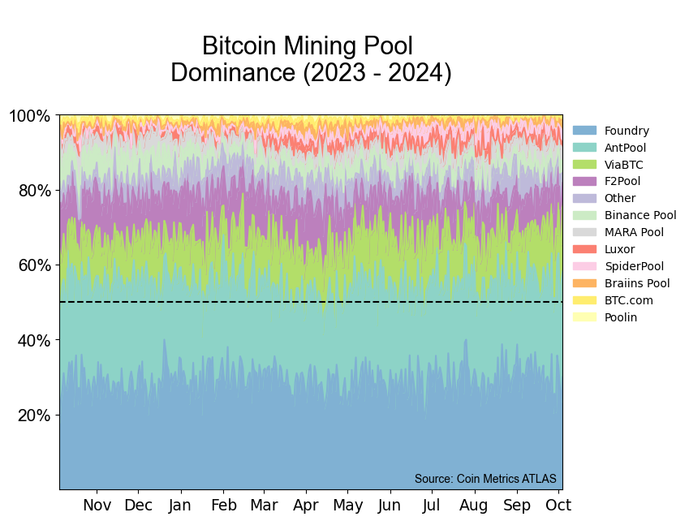
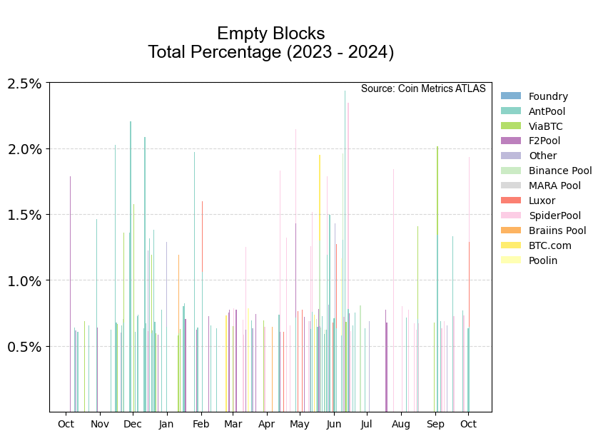
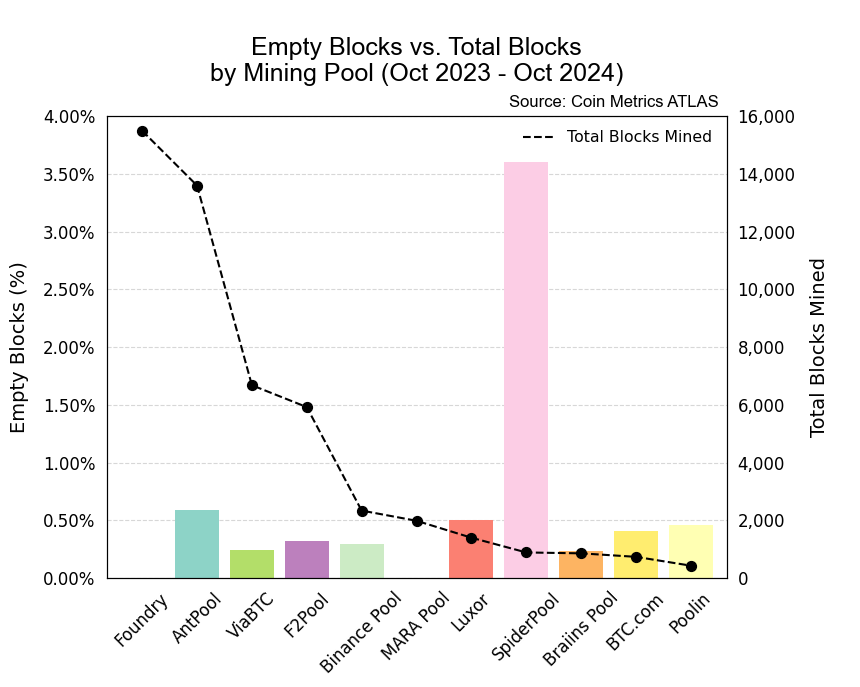

# Atlas: Mining Pool Dominance

<figure><figcaption></figcaption></figure>

For much of its history, the Bitcoin mining industry has been notoriously opaque. Luckily, it has become a common practice for many BTC mining pools to leave a subtle "miner signature" in each block's coinbase transaction (not to be confused with the popular crypto exchange by the same name). This transaction contains the miner reward— currently 6.25 BTC per block—but also leaves some extra space for arbitrary data, allowing the pool to publicly assert their claim. Using ATLAS v2, we're able to extract this miner signature, enabling us to derive a variety of mining pool metrics.

### Resources

This notebook demonstrates basic functionality offered by the Coin Metrics Python API Client and ATLAS blockchain search engine.

Coin Metrics offers a vast assortment of data for hundreds of cryptoassets. The Python API Client allows for easy access to this data using Python without needing to create your own wrappers using `requests` and other such libraries.

To understand the data that Coin Metrics offers, feel free to peruse the resources below.

* The [Coin Metrics API v4](https://docs.coinmetrics.io/api/v4) website contains the full set of endpoints and data offered by Coin Metrics.
* The [Coin Metrics Knowledge Base](https://docs.coinmetrics.io/info) gives detailed, conceptual explanations of the data that Coin Metrics offers.
* The [API Spec](https://coinmetrics.github.io/api-client-python/site/api\_client.html) contains a full list of functions.

### File Download

Download the entire notebook as either a jupyter notebook to run yourself or as a pdf from the two links below


PDF Version of notebook for easy offline viewing



Jupyter notebook to run code locally


### Notebook Setup

```python
from os import environ
import sys
import pandas as pd
import numpy as np
import logging
from datetime import date, datetime, timedelta
from coinmetrics.api_client import CoinMetricsClient
import json
import logging
import matplotlib.dates as mdates
import matplotlib.pyplot as plt
import matplotlib.ticker as mtick
from matplotlib.ticker import FormatStrFormatter, FuncFormatter
from matplotlib import font_manager
import cmasher as cmr
import re
%matplotlib inline
import plotly
from plotly.subplots import make_subplots
```

```python
logging.basicConfig(
    format='%(asctime)s %(levelname)-8s %(message)s',
    level=logging.INFO,
    datefmt='%Y-%m-%d %H:%M:%S'
)
```

```python
# We recommend privately storing your API key in your local environment.
try:
    api_key = environ["CM_API_KEY"]
    logging.info("Using API key found in environment")
except KeyError:
    api_key = ""
    logging.info("API key not found. Using community client")

client = CoinMetricsClient(api_key)
```

```
2024-10-04 13:46:00 INFO     Using API key found in environment
```

```python
colors = np.unique(cmr.take_cmap_colors('Set3', 15, return_fmt='hex'))
colors
```

```
array(['#80B1D3', '#8DD3C7', '#B3DE69', '#BC80BD', '#BEBADA', '#CCEBC5',
       '#D9D9D9', '#FB8072', '#FCCDE5', '#FDB462', '#FFED6F', '#FFFFB3'],
      dtype='<U7')
```

## ATLAS V2

### Retrieve Block Info

```python
block_info = client.get_list_of_blocks_v2(
    asset='btc',
    start_time=datetime.now()-timedelta(days=365),
    page_size=10000
).parallel(time_increment=timedelta(days=1)).to_dataframe()
block_info['extra_data'] = block_info['extra_data'].astype(str)
```

```
Exporting to dataframe type: 100%|██████████| 366/366 [00:06<00:00, 58.56it/s] 
```

```python
block_info.head()
```

|   | block\_hash                                       | height | consensus\_time           | miner\_time               | n\_transactions | n\_balance\_updates | parent\_block\_hash                               | nonce    | extra\_data                                       | version   | difficulty            | physical\_size | consensus\_size | consensus\_size\_limit |
| - | ------------------------------------------------- | ------ | ------------------------- | ------------------------- | --------------- | ------------------- | ------------------------------------------------- | -------- | ------------------------------------------------- | --------- | --------------------- | -------------- | --------------- | ---------------------- |
| 0 | 00000000000000000003cd8c9919b1073bab32cee67bfb... | 810761 | 2023-10-05 13:54:00+00:00 | 2023-10-05 15:21:03+00:00 | 3658            | 22668               | 00000000000000000002667c723b1a1f559ed920504ab6... | 3789b287 | 03095f0c1b4d696e656420627920416e74506f6f6c3830... | 545259520 | 57321508229258.039062 | 1543713        | 3993396         | 4000000                |
| 1 | 000000000000000000000d070d5b4fb5c69ee6bae4bab6... | 810762 | 2023-10-05 14:04:54+00:00 | 2023-10-05 15:26:11+00:00 | 2689            | 18732               | 00000000000000000003cd8c9919b1073bab32cee67bfb... | 388afcd5 | 030a5f0c45022f62696e616e63652f323139fabe6d6d6d... | 536993792 | 57321508229258.039062 | 1494856        | 3993547         | 4000000                |
| 2 | 00000000000000000004090783eb83951d6d9c91dd88f3... | 810763 | 2023-10-05 14:28:43+00:00 | 2023-10-05 15:33:08+00:00 | 2528            | 17306               | 000000000000000000000d070d5b4fb5c69ee6bae4bab6... | 9b7ba148 | 030b5f0c192f5669614254432f4d696e6564206279207a... | 536928256 | 57321508229258.039062 | 1422613        | 3993322         | 4000000                |
| 3 | 00000000000000000004cd165ee9f93e68460c37173027... | 810764 | 2023-10-05 14:36:46+00:00 | 2023-10-05 15:40:56+00:00 | 3227            | 20335               | 00000000000000000004090783eb83951d6d9c91dd88f3... | 003804fb | 030c5f0c194d696e656420627920416e74506f6f6c20f8... | 805298176 | 57321508229258.039062 | 1572755        | 3993278         | 4000000                |
| 4 | 00000000000000000000fb654d8199a1fc240af3bbc173... | 810765 | 2023-10-05 14:57:48+00:00 | 2023-10-05 15:50:03+00:00 | 3078            | 19352               | 00000000000000000004cd165ee9f93e68460c37173027... | 903b489a | 030d5f0c2cfabe6d6d0d426074ccdd9e3b0fe208ab9af1... | 538968064 | 57321508229258.039062 | 1515726        | 3997698         | 4000000                |

```python
# Assign 'empty' to rows where n_transactions == 1
block_info.loc[block_info['n_transactions'] == 1, 'category'] = 'Empty'

# Assign 'not empty' to remaining rows
block_info.loc[block_info['n_transactions'] != 1, 'category'] = 'Not Empty'
```

```python
block_info['extra_data'][0]
```

```
'03095f0c1b4d696e656420627920416e74506f6f6c383036f800c8022ace0b75fabe6d6d7a90b864b377b7d7de125f87ab7890c46a47d58edcd9d602a6758485a2d7a7c2020000000000000026bb0000d455000000000000'
```

```python
def convert_to_human_readable_ascii(s):
    # Check if the input string is a valid hexadecimal string
    if all(c in '0123456789abcdefABCDEF' for c in s):
        # Convert the input string to bytes
        b = bytes.fromhex(s)
        # Decode the bytes using the ISO-8859-1 encoding
        result = b.decode('ISO-8859-1')
        return result
    else:
        # Return an error message if the input string is not a valid hexadecimal string
        return 'Error: input is not a valid hexadecimal string'
```

```python
block_info['miner_tag'] = block_info['extra_data'].apply(convert_to_human_readable_ascii)
```

```python
block_signed = pd.DataFrame(block_info[['miner_tag','height','consensus_time','category']])
block_signed
```

|       | miner\_tag                                          | height | consensus\_time           | category  |
| ----- | --------------------------------------------------- | ------ | ------------------------- | --------- |
| 0     | \t\_ Mined by AntPool806ø�È\*Î uú¾mmz¸d³w·×Þ... | 810761 | 2023-10-05 13:54:00+00:00 | Not Empty |
| 1     | \n\_ E/binance/219ú¾mmm¡¾¼a04Vy>‚IC°˜Jgò ¡Ð0...  | 810762 | 2023-10-05 14:04:54+00:00 | Not Empty |
| 2     |  \_ /ViaBTC/Mined by z180203/,ú¾mmžñÊ1ä¾Ú!³K...  | 810763 | 2023-10-05 14:28:43+00:00 | Not Empty |
| 3     |  \_ Mined by AntPool ø�¢1ê%-ú¾mm»âHjéZ¾®¨!M...  | 810764 | 2023-10-05 14:36:46+00:00 | Not Empty |
| 4     | \r\_ ,ú¾mm\rB\`tÌݞ;â«šñ\tÆ¢èür¹³a\rmá\rÚ... | 810765 | 2023-10-05 14:57:48+00:00 | Not Empty |
| ...   | ...                                                 | ...    | ...                       | ...       |
| 53385 | ’/\r< OCEAN.XYZ >3OD�ã.ˆ–³Lð\n������        | 864146 | 2024-10-04 15:50:04+00:00 | Not Empty |
| 53386 | “/\r,ú¾mm‘…÷$@oȗ$\~œ¸ÑÆn‘¹Ô3 ñîõ䈑 ¼‘���...  | 864147 | 2024-10-04 15:51:50+00:00 | Not Empty |
| 53387 | ”/\rc�g/Foundry USA Pool #dropgold/+J�½­�...   | 864148 | 2024-10-04 15:56:39+00:00 | Not Empty |
| 53388 | •/\rMined by AntPool èA”x®øú¾mm6úœq2i’F...   | 864149 | 2024-10-04 15:56:44+00:00 | Not Empty |
| 53389 | –/\rMined by AntPool �ž„µóú¾mm¹ýŒ½kØ]Œ"...   | 864150 | 2024-10-04 16:22:20+00:00 | Not Empty |

53390 rows × 4 columns

```python
# List of strings included in coinbase signature
miners = ['AntPool', 'ViaBTC', 'binance', 'Binance', 'Foundry', 'Luxor', 
          'SlushPool', 'slush', 'BTC.com','BTC.COM','btc.com','btccom',
          'bitdeer','btcpool', 'F2Pool', 'poolin','xxxxxx.com','CKPool', 
          'BTC.TOP', 'BTCC', 'MARA Pool', 'Mara Pool', 'SpiderPool']
```

```python
def detect_keywords(df, column, keywords):
    # Create a new column called 'miner'
    df['miner'] = None
    # Iterate over the miner names
    for miner in miners:
        # Use the update method to detect the miner name in the specified column
        # df['miner'].update(df[column].str.extract(rf'({miner})', expand=False))
        df.update({'miner':df[column].str.extract(rf'({miner})', expand=False)})
    # Replace any rows where the 'miner' column is None with 'Unknown'
    df['miner'] = df['miner'].replace({None: 'Other'})
    return df
```

```python
miners_tagged = detect_keywords(block_signed, 'miner_tag', miners)
miners_tagged = miners_tagged.set_index('consensus_time')
miners_tagged
```

|                           | miner\_tag                                          | height | category  | miner   |
| ------------------------- | --------------------------------------------------- | ------ | --------- | ------- |
| consensus\_time           |                                                     |        |           |         |
| 2023-10-05 13:54:00+00:00 | \t\_ Mined by AntPool806ø�È\*Î uú¾mmz¸d³w·×Þ... | 810761 | Not Empty | AntPool |
| 2023-10-05 14:04:54+00:00 | \n\_ E/binance/219ú¾mmm¡¾¼a04Vy>‚IC°˜Jgò ¡Ð0...  | 810762 | Not Empty | binance |
| 2023-10-05 14:28:43+00:00 |  \_ /ViaBTC/Mined by z180203/,ú¾mmžñÊ1ä¾Ú!³K...  | 810763 | Not Empty | ViaBTC  |
| 2023-10-05 14:36:46+00:00 |  \_ Mined by AntPool ø�¢1ê%-ú¾mm»âHjéZ¾®¨!M...  | 810764 | Not Empty | AntPool |
| 2023-10-05 14:57:48+00:00 | \r\_ ,ú¾mm\rB\`tÌݞ;â«šñ\tÆ¢èür¹³a\rmá\rÚ... | 810765 | Not Empty | F2Pool  |
| ...                       | ...                                                 | ...    | ...       | ...     |
| 2024-10-04 15:50:04+00:00 | ’/\r< OCEAN.XYZ >3OD�ã.ˆ–³Lð\n������        | 864146 | Not Empty | Other   |
| 2024-10-04 15:51:50+00:00 | “/\r,ú¾mm‘…÷$@oȗ$\~œ¸ÑÆn‘¹Ô3 ñîõ䈑 ¼‘���...  | 864147 | Not Empty | F2Pool  |
| 2024-10-04 15:56:39+00:00 | ”/\rc�g/Foundry USA Pool #dropgold/+J�½­�...   | 864148 | Not Empty | Foundry |
| 2024-10-04 15:56:44+00:00 | •/\rMined by AntPool èA”x®øú¾mm6úœq2i’F...   | 864149 | Not Empty | AntPool |
| 2024-10-04 16:22:20+00:00 | –/\rMined by AntPool �ž„µóú¾mm¹ýŒ½kØ]Œ"...   | 864150 | Not Empty | AntPool |

53390 rows × 4 columns

```python
def transform_index_to_date(index):
    datetime_index = pd.to_datetime(index)
    date_index = [datetime.date(datetime_obj) for datetime_obj in datetime_index]
    return date_index
```

```python
date_index = transform_index_to_date(miners_tagged.index)
miners_tagged.index = pd.to_datetime(date_index)
```

```python
miners_tagged
```

|            | miner\_tag                                          | height | category  | miner   |
| ---------- | --------------------------------------------------- | ------ | --------- | ------- |
| 2023-10-05 | \t\_ Mined by AntPool806ø�È\*Î uú¾mmz¸d³w·×Þ... | 810761 | Not Empty | AntPool |
| 2023-10-05 | \n\_ E/binance/219ú¾mmm¡¾¼a04Vy>‚IC°˜Jgò ¡Ð0...  | 810762 | Not Empty | binance |
| 2023-10-05 |  \_ /ViaBTC/Mined by z180203/,ú¾mmžñÊ1ä¾Ú!³K...  | 810763 | Not Empty | ViaBTC  |
| 2023-10-05 |  \_ Mined by AntPool ø�¢1ê%-ú¾mm»âHjéZ¾®¨!M...  | 810764 | Not Empty | AntPool |
| 2023-10-05 | \r\_ ,ú¾mm\rB\`tÌݞ;â«šñ\tÆ¢èür¹³a\rmá\rÚ... | 810765 | Not Empty | F2Pool  |
| ...        | ...                                                 | ...    | ...       | ...     |
| 2024-10-04 | ’/\r< OCEAN.XYZ >3OD�ã.ˆ–³Lð\n������        | 864146 | Not Empty | Other   |
| 2024-10-04 | “/\r,ú¾mm‘…÷$@oȗ$\~œ¸ÑÆn‘¹Ô3 ñîõ䈑 ¼‘���...  | 864147 | Not Empty | F2Pool  |
| 2024-10-04 | ”/\rc�g/Foundry USA Pool #dropgold/+J�½­�...   | 864148 | Not Empty | Foundry |
| 2024-10-04 | •/\rMined by AntPool èA”x®øú¾mm6úœq2i’F...   | 864149 | Not Empty | AntPool |
| 2024-10-04 | –/\rMined by AntPool �ž„µóú¾mm¹ýŒ½kØ]Œ"...   | 864150 | Not Empty | AntPool |

53390 rows × 4 columns

```python
other_miners = miners_tagged.loc[miners_tagged['miner'] == 'Other']
other_miners
```

|            | miner\_tag                                         | height | category  | miner |
| ---------- | -------------------------------------------------- | ------ | --------- | ----- |
| 2023-10-05 |  \_ F°,ñ¿����/NiceHash/                        | 810784 | Not Empty | Other |
| 2023-10-06 | ¬\_ /ultimus/783p�?�DòuÄú¾mm(0„³4yï@×ì7HWlù»... | 810924 | Not Empty | Other |
| 2023-10-06 | Ë\_  \t\t\t \t\t \t\_‡‰\[����                | 810955 | Not Empty | Other |
| 2023-10-06 | Ö\_ /ultimus/787p�\ÏD­ú¾mmàÀ.,±r}?^º¿ŸrE¨æ... | 810966 | Not Empty | Other |
| 2023-10-07 | \` w !e/SBICrypto.com Pool/ø³bS�����         | 811027 | Not Empty | Other |
| ...        | ...                                                | ...    | ...       | ...   |
| 2024-10-03 | /\rMined by SecPool›�)Õ Ÿ­ú¾mmÑÀ”)Ñgò2e...  | 864005 | Not Empty | Other |
| 2024-10-03 | /\rMined by SecPool›�9ÕuRíú¾mm(5L,±kÏä½...  | 864006 | Not Empty | Other |
| 2024-10-04 | C/\r \t\t\t \t\t \tÉ��„\n���                 | 864067 | Not Empty | Other |
| 2024-10-04 | l/\rdÏÿf/SBICrypto.com Pool/\r$²v������        | 864108 | Not Empty | Other |
| 2024-10-04 | ’/\r< OCEAN.XYZ >3OD�ã.ˆ–³Lð\n������       | 864146 | Not Empty | Other |

3060 rows × 4 columns

```python
miners_tagged['miner'] = miners_tagged['miner'].replace('xxxxxx.com', 'Poolin')
miners_tagged['miner'] = miners_tagged['miner'].replace('poolin', 'Poolin')
miners_tagged['miner'] = miners_tagged['miner'].replace('btccom', 'BTC.com')
miners_tagged['miner'] = miners_tagged['miner'].replace('btc.com', 'BTC.com')
miners_tagged['miner'] = miners_tagged['miner'].replace('btcpool', 'BTC.com')
miners_tagged['miner'] = miners_tagged['miner'].replace('bitdeer', 'BTC.com')
miners_tagged['miner'] = miners_tagged['miner'].replace('slush', 'Braiins Pool')
miners_tagged['miner'] = miners_tagged['miner'].replace('binance', 'Binance Pool')
miners_tagged['miner'] = miners_tagged['miner'].replace('Binance', 'Binance Pool')
miners_tagged['miner'] = miners_tagged['miner'].replace('Mara Pool', 'MARA Pool')
```

```python
# Group the data by the date and calculate the relative proportions of each category
data = miners_tagged.groupby(miners_tagged.index.date)['miner'].value_counts(normalize=True)
data = data.unstack()

averages = data.sum()
averages = pd.DataFrame(averages.sort_values(ascending=False))
averages = averages.index.tolist()
data = data[averages]
```

```python
data
```

| miner      | Foundry  | AntPool  | ViaBTC   | F2Pool   | Other    | Binance Pool | MARA Pool | Luxor    | SpiderPool | Braiins Pool | BTC.com  | Poolin   |
| ---------- | -------- | -------- | -------- | -------- | -------- | ------------ | --------- | -------- | ---------- | ------------ | -------- | -------- |
| 2023-10-05 | 0.178571 | 0.303571 | 0.160714 | 0.160714 | 0.017857 | 0.125000     | 0.017857  | 0.035714 | NaN        | NaN          | NaN      | NaN      |
| 2023-10-06 | 0.237500 | 0.256250 | 0.112500 | 0.143750 | 0.018750 | 0.081250     | 0.062500  | 0.043750 | NaN        | 0.006250     | 0.012500 | 0.025000 |
| 2023-10-07 | 0.263158 | 0.280702 | 0.087719 | 0.122807 | 0.046784 | 0.046784     | 0.040936  | 0.035088 | NaN        | 0.011696     | 0.046784 | 0.017544 |
| 2023-10-08 | 0.310811 | 0.250000 | 0.121622 | 0.108108 | 0.033784 | 0.067568     | 0.027027  | 0.027027 | NaN        | 0.033784     | 0.013514 | 0.006757 |
| 2023-10-09 | 0.269231 | 0.250000 | 0.115385 | 0.115385 | 0.038462 | 0.108974     | 0.038462  | 0.019231 | NaN        | 0.012821     | 0.019231 | 0.012821 |
| ...        | ...      | ...      | ...      | ...      | ...      | ...          | ...       | ...      | ...        | ...          | ...      | ...      |
| 2024-09-30 | 0.357664 | 0.255474 | 0.065693 | 0.131387 | 0.058394 | 0.021898     | 0.021898  | 0.007299 | 0.058394   | 0.007299     | NaN      | 0.014599 |
| 2024-10-01 | 0.324841 | 0.305732 | 0.133758 | 0.095541 | 0.057325 | 0.012739     | 0.019108  | 0.019108 | 0.006369   | 0.025478     | NaN      | NaN      |
| 2024-10-02 | 0.270968 | 0.219355 | 0.174194 | 0.083871 | 0.064516 | 0.032258     | 0.064516  | 0.025806 | 0.032258   | 0.012903     | 0.012903 | 0.006452 |
| 2024-10-03 | 0.234177 | 0.316456 | 0.101266 | 0.107595 | 0.082278 | 0.037975     | 0.037975  | 0.012658 | 0.031646   | 0.025316     | 0.012658 | NaN      |
| 2024-10-04 | 0.300000 | 0.281818 | 0.181818 | 0.054545 | 0.027273 | 0.027273     | 0.009091  | 0.036364 | 0.018182   | 0.045455     | 0.018182 | NaN      |

366 rows × 12 columns

```python
# Plot the data as an area chart
ax = data.plot.area(figsize=(8, 6),fontsize=13.5,color=colors)
ax.xaxis.set_major_formatter(mdates.DateFormatter('%b'))
ax.set_title('\nBitcoin Mining Pool \nDominance (2023 - 2024)\n',fontsize=22,fontdict={'font':'arial'})
ax.axhline(0.5, linestyle='--', color='black')
plt.xlim([miners_tagged.index[0],miners_tagged.index[-1]])
plt.ylim(0,1)
plt.yticks([0.2, 0.4, 0.6, 0.8, 1.0], ['20%','40%','60%','80%','100%'],fontdict={'font':'arial','size':15})
plt.legend(bbox_to_anchor=(1,1),frameon=False)
plt.annotate('Source: Coin Metrics ATLAS',weight='book',font='arial',xy=(1.001, 0.001), xycoords='axes fraction',color='black',xytext=(-8, 6), textcoords='offset pixels',horizontalalignment='right',verticalalignment='bottom')
plt.savefig('./Pool-Dominance.png',facecolor='white',dpi=100)
plt.show()
```

<figure><figcaption></figcaption></figure>

```python
total_blocks = pd.DataFrame(miners_tagged.index.value_counts())
total_blocks.rename(columns={total_blocks.columns[0]: 'Total Blocks'}, inplace=True)
total_blocks
```

|            | Total Blocks |
| ---------- | ------------ |
| 2024-02-02 | 188          |
| 2024-01-25 | 181          |
| 2024-03-07 | 180          |
| 2024-07-22 | 179          |
| 2024-02-12 | 179          |
| ...        | ...          |
| 2024-01-15 | 114          |
| 2024-06-23 | 112          |
| 2024-10-04 | 110          |
| 2024-09-11 | 108          |
| 2023-10-05 | 56           |

366 rows × 1 columns

```python
empty_blocks = miners_tagged.groupby([miners_tagged.index.date,miners_tagged.miner])['category'].value_counts()
empty_blocks = empty_blocks.unstack()
```

```python
empty_blocks = pd.DataFrame(empty_blocks.reset_index()).fillna(0).set_index('level_0')
empty_blocks
```

| category   | miner        | Empty | Not Empty |
| ---------- | ------------ | ----- | --------- |
| level\_0   |              |       |           |
| 2023-10-05 | AntPool      | 0.0   | 17.0      |
| 2023-10-05 | Binance Pool | 0.0   | 7.0       |
| 2023-10-05 | F2Pool       | 1.0   | 8.0       |
| 2023-10-05 | Foundry      | 0.0   | 10.0      |
| 2023-10-05 | Luxor        | 0.0   | 2.0       |
| ...        | ...          | ...   | ...       |
| 2024-10-04 | Luxor        | 0.0   | 4.0       |
| 2024-10-04 | MARA Pool    | 0.0   | 1.0       |
| 2024-10-04 | Other        | 0.0   | 3.0       |
| 2024-10-04 | SpiderPool   | 0.0   | 2.0       |
| 2024-10-04 | ViaBTC       | 0.0   | 20.0      |

4004 rows × 3 columns

```python
df_pivot = empty_blocks.pivot_table(index=empty_blocks.index, columns="miner", values="Empty")
df_pivot = df_pivot.join(total_blocks[['Total Blocks']])
df_pivot = df_pivot.fillna(0)
df_pivot
```

|            | AntPool | BTC.com | Binance Pool | Braiins Pool | F2Pool | Foundry | Luxor | MARA Pool | Other | Poolin | SpiderPool | ViaBTC | Total Blocks |
| ---------- | ------- | ------- | ------------ | ------------ | ------ | ------- | ----- | --------- | ----- | ------ | ---------- | ------ | ------------ |
| level\_0   |         |         |              |              |        |         |       |           |       |        |            |        |              |
| 2023-10-05 | 0.0     | 0.0     | 0.0          | 0.0          | 1.0    | 0.0     | 0.0   | 0.0       | 0.0   | 0.0    | 0.0        | 0.0    | 56           |
| 2023-10-06 | 0.0     | 0.0     | 0.0          | 0.0          | 0.0    | 0.0     | 0.0   | 0.0       | 0.0   | 0.0    | 0.0        | 0.0    | 160          |
| 2023-10-07 | 0.0     | 0.0     | 0.0          | 0.0          | 0.0    | 0.0     | 0.0   | 0.0       | 0.0   | 0.0    | 0.0        | 0.0    | 171          |
| 2023-10-08 | 0.0     | 0.0     | 0.0          | 0.0          | 0.0    | 0.0     | 0.0   | 0.0       | 0.0   | 0.0    | 0.0        | 0.0    | 148          |
| 2023-10-09 | 1.0     | 0.0     | 0.0          | 0.0          | 0.0    | 0.0     | 0.0   | 0.0       | 0.0   | 0.0    | 0.0        | 0.0    | 156          |
| ...        | ...     | ...     | ...          | ...          | ...    | ...     | ...   | ...       | ...   | ...    | ...        | ...    | ...          |
| 2024-09-30 | 0.0     | 0.0     | 0.0          | 0.0          | 0.0    | 0.0     | 0.0   | 0.0       | 0.0   | 0.0    | 0.0        | 0.0    | 137          |
| 2024-10-01 | 1.0     | 0.0     | 0.0          | 0.0          | 0.0    | 0.0     | 0.0   | 0.0       | 0.0   | 0.0    | 0.0        | 0.0    | 157          |
| 2024-10-02 | 1.0     | 0.0     | 0.0          | 0.0          | 0.0    | 0.0     | 1.0   | 0.0       | 0.0   | 0.0    | 1.0        | 0.0    | 155          |
| 2024-10-03 | 0.0     | 0.0     | 0.0          | 0.0          | 0.0    | 0.0     | 0.0   | 0.0       | 0.0   | 0.0    | 0.0        | 0.0    | 158          |
| 2024-10-04 | 0.0     | 0.0     | 0.0          | 0.0          | 0.0    | 0.0     | 0.0   | 0.0       | 0.0   | 0.0    | 0.0        | 0.0    | 110          |

366 rows × 13 columns

```python
df_empty = df_pivot.iloc[:,0:].div(df_pivot['Total Blocks'], axis=0)
df_empty = df_empty.drop(df_empty.columns[-1:], axis=1)
```

```python
df_empty = df_empty[averages]
df_empty
```

|            | Foundry | AntPool  | ViaBTC | F2Pool   | Other | Binance Pool | MARA Pool | Luxor    | SpiderPool | Braiins Pool | BTC.com | Poolin |
| ---------- | ------- | -------- | ------ | -------- | ----- | ------------ | --------- | -------- | ---------- | ------------ | ------- | ------ |
| level\_0   |         |          |        |          |       |              |           |          |            |              |         |        |
| 2023-10-05 | 0.0     | 0.000000 | 0.0    | 0.017857 | 0.0   | 0.0          | 0.0       | 0.000000 | 0.000000   | 0.0          | 0.0     | 0.0    |
| 2023-10-06 | 0.0     | 0.000000 | 0.0    | 0.000000 | 0.0   | 0.0          | 0.0       | 0.000000 | 0.000000   | 0.0          | 0.0     | 0.0    |
| 2023-10-07 | 0.0     | 0.000000 | 0.0    | 0.000000 | 0.0   | 0.0          | 0.0       | 0.000000 | 0.000000   | 0.0          | 0.0     | 0.0    |
| 2023-10-08 | 0.0     | 0.000000 | 0.0    | 0.000000 | 0.0   | 0.0          | 0.0       | 0.000000 | 0.000000   | 0.0          | 0.0     | 0.0    |
| 2023-10-09 | 0.0     | 0.006410 | 0.0    | 0.000000 | 0.0   | 0.0          | 0.0       | 0.000000 | 0.000000   | 0.0          | 0.0     | 0.0    |
| ...        | ...     | ...      | ...    | ...      | ...   | ...          | ...       | ...      | ...        | ...          | ...     | ...    |
| 2024-09-30 | 0.0     | 0.000000 | 0.0    | 0.000000 | 0.0   | 0.0          | 0.0       | 0.000000 | 0.000000   | 0.0          | 0.0     | 0.0    |
| 2024-10-01 | 0.0     | 0.006369 | 0.0    | 0.000000 | 0.0   | 0.0          | 0.0       | 0.000000 | 0.000000   | 0.0          | 0.0     | 0.0    |
| 2024-10-02 | 0.0     | 0.006452 | 0.0    | 0.000000 | 0.0   | 0.0          | 0.0       | 0.006452 | 0.006452   | 0.0          | 0.0     | 0.0    |
| 2024-10-03 | 0.0     | 0.000000 | 0.0    | 0.000000 | 0.0   | 0.0          | 0.0       | 0.000000 | 0.000000   | 0.0          | 0.0     | 0.0    |
| 2024-10-04 | 0.0     | 0.000000 | 0.0    | 0.000000 | 0.0   | 0.0          | 0.0       | 0.000000 | 0.000000   | 0.0          | 0.0     | 0.0    |

366 rows × 12 columns

```python
fig, ax = plt.subplots(figsize=(8, 6))
cumval = 0
i = 0
for col in df_empty.columns:
    plt.bar(df_empty.index, df_empty[col], bottom=cumval, label=col, color=colors[i])
    cumval = cumval+df_empty[col]
    i += 1
ax.xaxis.set_major_locator(mdates.MonthLocator())
ax.xaxis.set_major_formatter(mdates.DateFormatter('%b'))
plt.title('\nEmpty Blocks\nTotal Percentage (2023 - 2024)\n', fontdict = {'size':18, 'font': 'arial'})
plt.xticks(rotation=0)
plt.xlabel('')
plt.legend(bbox_to_anchor=(1,1),frameon=False)
plt.yticks([0.005, 0.010, 0.015, 0.02, 0.025], ['0.5%','1.0%','1.5%','2.0%','2.5%'],fontdict={'size':14})
plt.grid(True, axis='y',linestyle='--',alpha=0.5)
plt.annotate('Source: Coin Metrics ATLAS',weight='book',font='arial',xy=(1.00, 0.953), xycoords='axes fraction',color='black',xytext=(-8, 6), textcoords='offset pixels',horizontalalignment='right',verticalalignment='bottom')
plt.savefig('./Empty-Blocks-Total-2023-2024.png',facecolor='white',dpi=100)
plt.xlabel('');
```

<figure><figcaption></figcaption></figure>

```python
empty_blocks_total = pd.DataFrame(miners_tagged.groupby([miners_tagged.miner])['category'].value_counts(normalize=True))
empty_blocks_total = empty_blocks_total.unstack().fillna(0)
empty_blocks_total.columns = empty_blocks_total.columns.droplevel(0)
empty_blocks_total = empty_blocks_total.reindex(averages)
empty_blocks_total
```

| category     | Empty    | Not Empty |
| ------------ | -------- | --------- |
| miner        |          |           |
| Foundry      | 0.000000 | 1.000000  |
| AntPool      | 0.005885 | 0.994115  |
| ViaBTC       | 0.002395 | 0.997605  |
| F2Pool       | 0.003208 | 0.996792  |
| Other        | 0.003595 | 0.996405  |
| Binance Pool | 0.002993 | 0.997007  |
| MARA Pool    | 0.000000 | 1.000000  |
| Luxor        | 0.005000 | 0.995000  |
| SpiderPool   | 0.035996 | 0.964004  |
| Braiins Pool | 0.002331 | 0.997669  |
| BTC.com      | 0.004071 | 0.995929  |
| Poolin       | 0.004640 | 0.995360  |

```python
pool_total_blocks = pd.DataFrame(miners_tagged['miner'].value_counts())
pool_total_blocks = pool_total_blocks.drop('Other')
pool_total_blocks.rename(columns={pool_total_blocks.columns[0]: 'Total Blocks Mined'}, inplace=True)
pool_total_blocks
```

|              | Total Blocks Mined |
| ------------ | ------------------ |
| miner        |                    |
| Foundry      | 15492              |
| AntPool      | 13595              |
| ViaBTC       | 6680               |
| F2Pool       | 5923               |
| Binance Pool | 2339               |
| MARA Pool    | 1986               |
| Luxor        | 1400               |
| SpiderPool   | 889                |
| Braiins Pool | 858                |
| BTC.com      | 737                |
| Poolin       | 431                |

```python
row_num = empty_blocks_total.index.get_loc('Other')
colors_no_other = np.delete(colors, row_num)
empty_blocks_total = empty_blocks_total.drop('Other')
```

```python
pool_total_blocks.reset_index()
```

|    | miner        | Total Blocks Mined |
| -- | ------------ | ------------------ |
| 0  | Foundry      | 15492              |
| 1  | AntPool      | 13595              |
| 2  | ViaBTC       | 6680               |
| 3  | F2Pool       | 5923               |
| 4  | Binance Pool | 2339               |
| 5  | MARA Pool    | 1986               |
| 6  | Luxor        | 1400               |
| 7  | SpiderPool   | 889                |
| 8  | Braiins Pool | 858                |
| 9  | BTC.com      | 737                |
| 10 | Poolin       | 431                |

```python
ax = empty_blocks_total['Empty'].plot.bar(figsize=(8, 6),stacked=True,fontsize=12,color=colors_no_other,width=0.8,zorder=2)
def format_percent(x, pos):
    return '{:.2%}'.format(x)
formatter = FuncFormatter(format_percent)
ax.yaxis.set_major_formatter(formatter)
plt.xticks(rotation=45,size=12)
plt.yticks(rotation=0,size=12)
plt.title('\nEmpty Blocks vs. Total Blocks\nby Mining Pool (Oct 2023 - Oct 2024)\n', fontdict = {'size':18, 'font': 'arial'})
plt.xlabel('');
plt.ylabel('Empty Blocks (%)',fontsize=14,labelpad=10);
plt.tick_params(axis='both', which='both', length=0, pad=8)
plt.ylim(0,0.04)
ax.grid(True, axis='y',linestyle='--',zorder=1,alpha=0.5)
ax2 = ax.twinx()
pool_total_blocks.plot.line(ax=ax2,color='black',linestyle='--',legend=True)
pool_total_blocks.reset_index().plot.scatter(x='miner',y='Total Blocks Mined',ax=ax2,color='black', s=50)
ax2.set_yticks([0,2000,4000,6000,8000,10000,12000,14000,16000])
plt.ylim(0,16000)
ax2.yaxis.set_major_formatter(mtick.StrMethodFormatter('{x:,.0f}'))
plt.legend(bbox_to_anchor=(1,1.0),frameon=False,fontsize=11.3)
plt.tick_params(axis='both', which='both', length=0, pad=8)
plt.yticks(rotation=0,size=12)
plt.ylabel('Total Blocks Mined\n',fontsize=14,labelpad=10);
plt.annotate(
    'Source: Coin Metrics ATLAS',
    weight='book',
    font='arial',
    fontsize=12,
    xy=(1.0, 1.0),
    xycoords='axes fraction',
    color='black',
    xytext=(-8, 6),
    textcoords='offset pixels',
    horizontalalignment='right',
    verticalalignment='bottom'
)
plt.savefig('./Empty-Blocks-by-Pool.png',facecolor='white',dpi=100)
```

<figure><figcaption></figcaption></figure>
