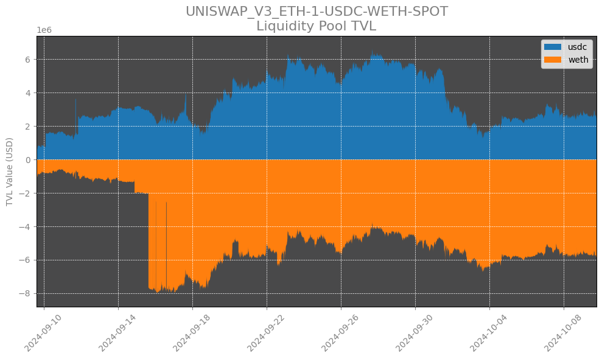
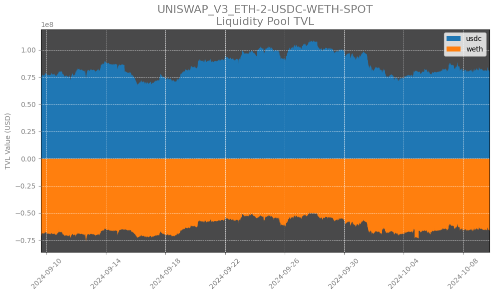
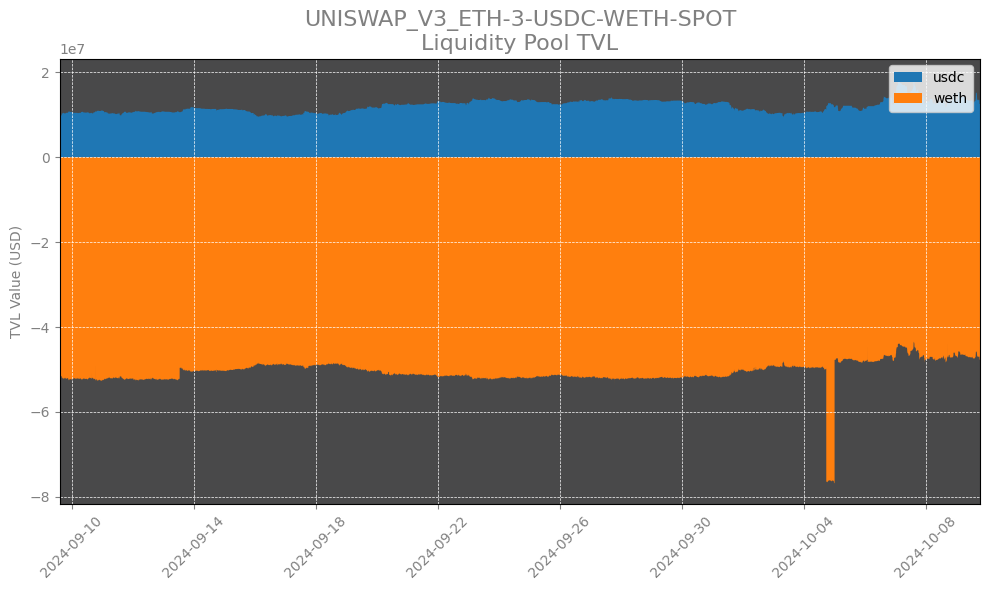
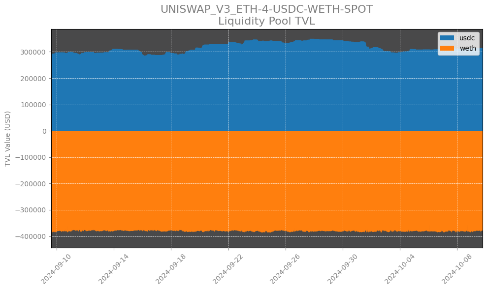

# Calculating Total Value Locked in Liquidity Pools using DEX Data


Automated Market Makers (AMMs) are an innovative new class of smart contracts introduced in decentralized exchange protocols like Uniswap, allowing users to permissionlessly provision liquidity for digital asset trading activity without needing a traditional central order book. However, an important aspect of providing users of these pools is understanding how the total USD value of the assets allocated to the contract can fluctuate over time, leading to impermanent loss for liquidity providers. In this notebook, we explore how Coin Metrics DEX market metadata can be combined with Reference Rates and ATLAS search engine capabilities to construct a timeseries representation pool TVL, allowing market participants to make more informed decisions about DEX market making and trading.

### Resources

This notebook demonstrates basic functionality offered by the Coin Metrics Python API Client, ATLAS blockchain search engine, and DEX Market Data.

Coin Metrics offers a vast assortment of data for hundreds of cryptoassets. The Python API Client allows for easy access to this data using Python without needing to create your own wrappers using `requests` and other such libraries.

To understand the data that Coin Metrics offers, feel free to peruse the resources below.

* The [Coin Metrics API v4](https://docs.coinmetrics.io/api/v4) website contains the full set of endpoints and data offered by Coin Metrics.
* The [Coin Metrics Knowledge Base](https://docs.coinmetrics.io/info) gives detailed, conceptual explanations of the data that Coin Metrics offers.
* The [API Spec](https://coinmetrics.github.io/api-client-python/site/api\_client.html) contains a full list of functions.

### File Download

Download the entire notebook as either a jupyter notebook to run yourself or as a pdf from the two links below






### Notebook Setup

```python
from os import environ
import sys
import pandas as pd
import numpy as np
import logging
from datetime import date, datetime, timedelta
from coinmetrics.api_client import CoinMetricsClient
import plotly.graph_objs as go
import logging
from pytz import timezone as timezone_conv
from datetime import timezone as timezone_info
from dateutil.relativedelta import relativedelta
import matplotlib.dates as mdates
import matplotlib.pyplot as plt
%matplotlib inline
```

```python
logging.basicConfig(
    format='%(asctime)s %(levelname)-8s %(message)s',
    level=logging.INFO,
    datefmt='%Y-%m-%d %H:%M:%S'
)
```

```python
# We recommend privately storing your API key in your local environment.
try:
    api_key = environ["CM_API_KEY"]
    logging.info("Using API key found in environment")
except KeyError:
    api_key = ""
    logging.info("API key not found. Using community client")
    
client = CoinMetricsClient(api_key)
```

```
2024-10-09 14:36:29 INFO     Using API key found in environment
```

## DEX Market Reference Data

The _reference-data/markets_ endpoint returns a list of available markets meeting specified criteria. Users can pass in a list of markets, exchanges, or market types (spot, futures, options). For DEX markets, the endpoint also returns key liquidity pool metadata, such as fee tier and pool contract address.

```python
uni_v3_markets = client.reference_data_markets(
    exchange = 'uniswap_v3_eth'
).to_dataframe()
```

```python
uni_v3_markets
```

|      | market                                        | exchange         | base       | quote      | pair                  | symbol | type | size\_asset | margin\_asset | strike | ... | order\_price\_increment | order\_price\_min | order\_price\_max | order\_size\_min | order\_taker\_fee | order\_maker\_fee | margin\_trading\_enabled | experimental | base\_native | quote\_native |
| ---- | --------------------------------------------- | ---------------- | ---------- | ---------- | --------------------- | ------ | ---- | ----------- | ------------- | ------ | --- | ----------------------- | ----------------- | ----------------- | ---------------- | ----------------- | ----------------- | ------------------------ | ------------ | ------------ | ------------- |
| 0    | uniswap\_v3\_eth-1-1inch-dai-spot             | uniswap\_v3\_eth | 1inch      | dai        | 1inch-dai             | \<NA>  | spot | \<NA>       | \<NA>         | \<NA>  | ... | \<NA>                   | \<NA>             | \<NA>             | \<NA>            | \<NA>             | \<NA>             | \<NA>                    | True         | \<NA>        | \<NA>         |
| 1    | uniswap\_v3\_eth-1-1inch-usdc-spot            | uniswap\_v3\_eth | 1inch      | usdc       | 1inch-usdc            | \<NA>  | spot | \<NA>       | \<NA>         | \<NA>  | ... | \<NA>                   | \<NA>             | \<NA>             | \<NA>            | \<NA>             | \<NA>             | \<NA>                    | True         | \<NA>        | \<NA>         |
| 2    | uniswap\_v3\_eth-1-1inch-weth-spot            | uniswap\_v3\_eth | 1inch      | weth       | 1inch-weth            | \<NA>  | spot | \<NA>       | \<NA>         | \<NA>  | ... | \<NA>                   | \<NA>             | \<NA>             | \<NA>            | \<NA>             | \<NA>             | \<NA>                    | True         | \<NA>        | \<NA>         |
| 3    | uniswap\_v3\_eth-1-ageur\_eth-eurcv\_eth-spot | uniswap\_v3\_eth | ageur\_eth | eurcv\_eth | ageur\_eth-eurcv\_eth | \<NA>  | spot | \<NA>       | \<NA>         | \<NA>  | ... | \<NA>                   | \<NA>             | \<NA>             | \<NA>            | \<NA>             | \<NA>             | \<NA>                    | True         | \<NA>        | \<NA>         |
| 4    | uniswap\_v3\_eth-1-ageur\_eth-usdc-spot       | uniswap\_v3\_eth | ageur\_eth | usdc       | ageur\_eth-usdc       | \<NA>  | spot | \<NA>       | \<NA>         | \<NA>  | ... | \<NA>                   | \<NA>             | \<NA>             | \<NA>            | \<NA>             | \<NA>             | \<NA>                    | True         | \<NA>        | \<NA>         |
| ...  | ...                                           | ...              | ...        | ...        | ...                   | ...    | ...  | ...         | ...           | ...    | ... | ...                     | ...               | ...               | ...              | ...               | ...               | ...                      | ...          | ...          | ...           |
| 1638 | uniswap\_v3\_eth-agg-yfi-cvx-spot             | uniswap\_v3\_eth | yfi        | cvx        | yfi-cvx               | \<NA>  | spot | \<NA>       | \<NA>         | \<NA>  | ... | \<NA>                   | \<NA>             | \<NA>             | \<NA>            | \<NA>             | \<NA>             | \<NA>                    | True         | \<NA>        | \<NA>         |
| 1639 | uniswap\_v3\_eth-agg-yfi-link-spot            | uniswap\_v3\_eth | yfi        | link       | yfi-link              | \<NA>  | spot | \<NA>       | \<NA>         | \<NA>  | ... | \<NA>                   | \<NA>             | \<NA>             | \<NA>            | \<NA>             | \<NA>             | \<NA>                    | True         | \<NA>        | \<NA>         |
| 1640 | uniswap\_v3\_eth-agg-yfi-usdc-spot            | uniswap\_v3\_eth | yfi        | usdc       | yfi-usdc              | \<NA>  | spot | \<NA>       | \<NA>         | \<NA>  | ... | \<NA>                   | \<NA>             | \<NA>             | \<NA>            | \<NA>             | \<NA>             | \<NA>                    | True         | \<NA>        | \<NA>         |
| 1641 | uniswap\_v3\_eth-agg-yfi-wbtc-spot            | uniswap\_v3\_eth | yfi        | wbtc       | yfi-wbtc              | \<NA>  | spot | \<NA>       | \<NA>         | \<NA>  | ... | \<NA>                   | \<NA>             | \<NA>             | \<NA>            | \<NA>             | \<NA>             | \<NA>                    | True         | \<NA>        | \<NA>         |
| 1642 | uniswap\_v3\_eth-agg-yfi-weth-spot            | uniswap\_v3\_eth | yfi        | weth       | yfi-weth              | \<NA>  | spot | \<NA>       | \<NA>         | \<NA>  | ... | \<NA>                   | \<NA>             | \<NA>             | \<NA>            | \<NA>             | \<NA>             | \<NA>                    | True         | \<NA>        | \<NA>         |

1643 rows × 39 columns

```python
weth_usdc_markets = uni_v3_markets.loc[(uni_v3_markets['base']=='usdc') & (uni_v3_markets['quote']=='weth')]
```

```python
weth_usdc_pools = weth_usdc_markets.dropna(subset=['contract_address'])
weth_usdc_pools
```

|      | market                            | exchange         | base | quote | pair      | symbol | type | size\_asset | margin\_asset | strike | ... | order\_price\_increment | order\_price\_min | order\_price\_max | order\_size\_min | order\_taker\_fee | order\_maker\_fee | margin\_trading\_enabled | experimental | base\_native | quote\_native |
| ---- | --------------------------------- | ---------------- | ---- | ----- | --------- | ------ | ---- | ----------- | ------------- | ------ | --- | ----------------------- | ----------------- | ----------------- | ---------------- | ----------------- | ----------------- | ------------------------ | ------------ | ------------ | ------------- |
| 72   | uniswap\_v3\_eth-1-usdc-weth-spot | uniswap\_v3\_eth | usdc | weth  | usdc-weth | \<NA>  | spot | \<NA>       | \<NA>         | \<NA>  | ... | \<NA>                   | \<NA>             | \<NA>             | \<NA>            | \<NA>             | \<NA>             | \<NA>                    | True         | \<NA>        | \<NA>         |
| 281  | uniswap\_v3\_eth-2-usdc-weth-spot | uniswap\_v3\_eth | usdc | weth  | usdc-weth | \<NA>  | spot | \<NA>       | \<NA>         | \<NA>  | ... | \<NA>                   | \<NA>             | \<NA>             | \<NA>            | \<NA>             | \<NA>             | \<NA>                    | True         | \<NA>        | \<NA>         |
| 650  | uniswap\_v3\_eth-3-usdc-weth-spot | uniswap\_v3\_eth | usdc | weth  | usdc-weth | \<NA>  | spot | \<NA>       | \<NA>         | \<NA>  | ... | \<NA>                   | \<NA>             | \<NA>             | \<NA>            | \<NA>             | \<NA>             | \<NA>                    | True         | \<NA>        | \<NA>         |
| 1045 | uniswap\_v3\_eth-4-usdc-weth-spot | uniswap\_v3\_eth | usdc | weth  | usdc-weth | \<NA>  | spot | \<NA>       | \<NA>         | \<NA>  | ... | \<NA>                   | \<NA>             | \<NA>             | \<NA>            | \<NA>             | \<NA>             | \<NA>                    | True         | \<NA>        | \<NA>         |

4 rows × 39 columns

### Fetch contract balances over time with ATLAS

Now that we have a list of target liquidity pool contracts, we can use ATLAS blockchain search engine to query for balance updates in the pool for each asset.

```python
assets = ['usdc','weth']
pools = weth_usdc_pools['contract_address'].to_list()
pools_tvl = pd.DataFrame()
start = datetime.now() - timedelta(days=30)

for asset in assets:
    tvl = client.get_list_of_balance_updates_v2(
        asset=asset,
        accounts=pools,
        start_time = start
    ).parallel(max_workers=10,time_increment=relativedelta(days=1)).to_dataframe()
    
    # Add the asset name to a new 'asset' column
    tvl['asset'] = asset
    pools_tvl = pd.concat([pools_tvl, tvl], axis=0)
```

```
Exporting to dataframe type: 100%|█████████████████████████████████████████████████████████████| 31/31 [00:28<00:00,  1.09it/s]
Exporting to dataframe type: 100%|█████████████████████████████████████████████████████████████| 31/31 [00:41<00:00,  1.34s/it]
```

```python
# Create a mapping from contract_address to market
contract_to_market = weth_usdc_pools.set_index('contract_address')['market']
contract_to_market
```

```
contract_address
e0554a476a092703abdb3ef35c80e0d76d32939f    uniswap_v3_eth-1-usdc-weth-spot
88e6a0c2ddd26feeb64f039a2c41296fcb3f5640    uniswap_v3_eth-2-usdc-weth-spot
8ad599c3a0ff1de082011efddc58f1908eb6e6d8    uniswap_v3_eth-3-usdc-weth-spot
7bea39867e4169dbe237d55c8242a8f2fcdcc387    uniswap_v3_eth-4-usdc-weth-spot
Name: market, dtype: string
```

```python
pools_tvl['market'] = pools_tvl['account'].map(contract_to_market)
```

```python
pools_tvl
```

|        | chain\_sequence\_number | account                                  | account\_creation\_height | change        | previous\_balance | new\_balance    | transaction\_sequence\_number | n\_debits | n\_credits | block\_hash                                       | ... | consensus\_time           | credit | total\_received     | total\_sent         | previous\_debit\_height | previous\_credit\_height | previous\_chain\_sequence\_number | txid                                              | asset | market                            |
| ------ | ----------------------- | ---------------------------------------- | ------------------------- | ------------- | ----------------- | --------------- | ----------------------------- | --------- | ---------- | ------------------------------------------------- | --- | ------------------------- | ------ | ------------------- | ------------------- | ----------------------- | ------------------------ | --------------------------------- | ------------------------------------------------- | ----- | --------------------------------- |
| 0      | 88964646899286016       | 88e6a0c2ddd26feeb64f039a2c41296fcb3f5640 | 12376729                  | -60426.466497 | 72674047.982769   | 72613621.516272 | 0                             | 4019999   | 3619510    | 96131a3e3702feb38e1ce25c71773962cdf6ed8beb5ee2... | ... | 2024-09-09 14:37:23+00:00 | False  | 738732040663.426392 | 738659427041.910034 | 20713695                | 20713694                 | 88964642604318722                 | a8f5e44bb9ae9f93a3d1b11b5fce58fe2bcad8ba73561f... | usdc  | uniswap\_v3\_eth-2-usdc-weth-spot |
| 1      | 88964646899286022       | 88e6a0c2ddd26feeb64f039a2c41296fcb3f5640 | 12376729                  | -551.745218   | 72613621.516272   | 72613069.771054 | 0                             | 4020000   | 3619510    | 96131a3e3702feb38e1ce25c71773962cdf6ed8beb5ee2... | ... | 2024-09-09 14:37:23+00:00 | False  | 738732040663.426392 | 738659427593.655396 | 20713696                | 20713694                 | 88964646899286016                 | 3072cd48442d1e61b7232590812737dabdd52d60ed2181... | usdc  | uniswap\_v3\_eth-2-usdc-weth-spot |
| 2      | 88964651194253318       | 88e6a0c2ddd26feeb64f039a2c41296fcb3f5640 | 12376729                  | -1189.382003  | 72613069.771054   | 72611880.389051 | 0                             | 4020001   | 3619510    | d1b93582ac0242d6c4d78a2e15fa7a14cb8f23cdd315a7... | ... | 2024-09-09 14:37:35+00:00 | False  | 738732040663.426392 | 738659428783.037231 | 20713696                | 20713694                 | 88964646899286022                 | 785845bb01a0c4c95a4fce1a5b684b607eff59db5e35a0... | usdc  | uniswap\_v3\_eth-2-usdc-weth-spot |
| 3      | 88964651194253320       | e0554a476a092703abdb3ef35c80e0d76d32939f | 13616454                  | -1185.605465  | 601863.20449      | 600677.599025   | 1                             | 231967    | 225267     | d1b93582ac0242d6c4d78a2e15fa7a14cb8f23cdd315a7... | ... | 2024-09-09 14:37:35+00:00 | False  | 5991391248.046802   | 5990790570.447777   | 20713695                | 20713695                 | 88964642604318733                 | 785845bb01a0c4c95a4fce1a5b684b607eff59db5e35a0... | usdc  | uniswap\_v3\_eth-1-usdc-weth-spot |
| 4      | 88964651194253338       | 88e6a0c2ddd26feeb64f039a2c41296fcb3f5640 | 12376729                  | -1178.099514  | 72611880.389051   | 72610702.289537 | 0                             | 4020002   | 3619510    | d1b93582ac0242d6c4d78a2e15fa7a14cb8f23cdd315a7... | ... | 2024-09-09 14:37:35+00:00 | False  | 738732040663.426392 | 738659429961.136841 | 20713697                | 20713694                 | 88964651194253318                 | e8c9bf688ee4d41f22d95f34936a425edb4f61244318b7... | usdc  | uniswap\_v3\_eth-2-usdc-weth-spot |
| ...    | ...                     | ...                                      | ...                       | ...           | ...               | ...             | ...                           | ...       | ...        | ...                                               | ... | ...                       | ...    | ...                 | ...                 | ...                     | ...                      | ...                               | ...                                               | ...   | ...                               |
| 273787 | 89893038440054825       | e0554a476a092703abdb3ef35c80e0d76d32939f | 13616454                  | 11.45984      | 2397.232798       | 2408.692638     | 1                             | 292522    | 301912     | de4360d0ae6f824e4ca7525da2268497de62906fec744c... | ... | 2024-10-09 18:33:11+00:00 | True   | 4128265.590843      | 4125856.898204      | 20929853                | 20929850                 | 89893034145087672                 | aefc38b1fa84766bb2e50b8565d7e6b23031d98a28ccd8... | weth  | uniswap\_v3\_eth-1-usdc-weth-spot |
| 273788 | 89893038440054892       | e0554a476a092703abdb3ef35c80e0d76d32939f | 13616454                  | -0.015523     | 2408.692638       | 2408.677115     | 0                             | 292523    | 301912     | de4360d0ae6f824e4ca7525da2268497de62906fec744c... | ... | 2024-10-09 18:33:11+00:00 | False  | 4128265.590843      | 4125856.913727      | 20929853                | 20929854                 | 89893038440054825                 | 9b83a0daab76cd6db6aedbafc5f1e61adc0f5d31e72e47... | weth  | uniswap\_v3\_eth-1-usdc-weth-spot |
| 273789 | 89893038440054968       | 88e6a0c2ddd26feeb64f039a2c41296fcb3f5640 | 12376729                  | -2.123209     | 27357.193086      | 27355.069877    | 0                             | 3685872   | 4078043    | de4360d0ae6f824e4ca7525da2268497de62906fec744c... | ... | 2024-10-09 18:33:11+00:00 | False  | 378530260.402821    | 378502905.332944    | 20929852                | 20929854                 | 89893038440054823                 | e79fe9981166fccb9fb15b872da4ee5f8ea4f581a86e0d... | weth  | uniswap\_v3\_eth-2-usdc-weth-spot |
| 273790 | 89893051324956808       | 88e6a0c2ddd26feeb64f039a2c41296fcb3f5640 | 12376729                  | -0.119392     | 27355.069877      | 27354.950485    | 0                             | 3685873   | 4078043    | 2823efc897ab6e43f4382e7670f1cfa4aa621571e79d9d... | ... | 2024-10-09 18:33:47+00:00 | False  | 378530260.402821    | 378502905.452336    | 20929854                | 20929854                 | 89893038440054968                 | a46cab246dea451a42d4b26c79994c5fc06ce1a10a53a7... | weth  | uniswap\_v3\_eth-2-usdc-weth-spot |
| 273791 | 89893051324956894       | 88e6a0c2ddd26feeb64f039a2c41296fcb3f5640 | 12376729                  | -0.825174     | 27354.950485      | 27354.125311    | 0                             | 3685874   | 4078043    | 2823efc897ab6e43f4382e7670f1cfa4aa621571e79d9d... | ... | 2024-10-09 18:33:47+00:00 | False  | 378530260.402821    | 378502906.27751     | 20929857                | 20929854                 | 89893051324956808                 | 3004b50008190b1b36f5cdf602b63b9f9792267d89f2fe... | weth  | uniswap\_v3\_eth-2-usdc-weth-spot |

547648 rows × 21 columns

```python
# Sort by 'consensus_time', 'market', and 'chain_sequence_number'
pools_tvl_sorted = pools_tvl.sort_values(by=['consensus_time', 'market', 'chain_sequence_number'], ascending=[True, True, False])

# Drop duplicates, keeping only the first occurrence (in this case, the highest 'chain_sequence_number')
pools_tvl_deduplicated = pools_tvl_sorted.drop_duplicates(subset=['consensus_time', 'market','asset'], keep='first')
```

```python
pools_tvl_clean = pools_tvl_deduplicated[['market','consensus_time','asset','new_balance']].copy()
pools_tvl_clean['new_balance'] = pools_tvl_clean.apply(
    lambda row: -row['new_balance'] if row['asset'] == 'weth' else row['new_balance'],
    axis=1
)
pools_tvl_clean
```

|        | market                            | consensus\_time           | asset | new\_balance  |
| ------ | --------------------------------- | ------------------------- | ----- | ------------- |
| 1      | uniswap\_v3\_eth-2-usdc-weth-spot | 2024-09-09 14:37:23+00:00 | weth  | -3.126659e+04 |
| 1      | uniswap\_v3\_eth-2-usdc-weth-spot | 2024-09-09 14:37:23+00:00 | usdc  | 7.261307e+07  |
| 3      | uniswap\_v3\_eth-1-usdc-weth-spot | 2024-09-09 14:37:35+00:00 | weth  | -4.664425e+02 |
| 3      | uniswap\_v3\_eth-1-usdc-weth-spot | 2024-09-09 14:37:35+00:00 | usdc  | 6.006776e+05  |
| 4      | uniswap\_v3\_eth-2-usdc-weth-spot | 2024-09-09 14:37:35+00:00 | weth  | -3.126763e+04 |
| ...    | ...                               | ...                       | ...   | ...           |
| 273850 | uniswap\_v3\_eth-2-usdc-weth-spot | 2024-10-09 18:36:11+00:00 | usdc  | 8.006068e+07  |
| 273853 | uniswap\_v3\_eth-1-usdc-weth-spot | 2024-10-09 18:36:23+00:00 | usdc  | 2.503766e+06  |
| 273851 | uniswap\_v3\_eth-2-usdc-weth-spot | 2024-10-09 18:36:23+00:00 | usdc  | 8.005964e+07  |
| 273854 | uniswap\_v3\_eth-2-usdc-weth-spot | 2024-10-09 18:36:47+00:00 | usdc  | 8.005916e+07  |
| 273855 | uniswap\_v3\_eth-1-usdc-weth-spot | 2024-10-09 18:36:59+00:00 | usdc  | 2.493272e+06  |

382679 rows × 4 columns

```python
df = pd.DataFrame(pools_tvl_clean)
df['consensus_time'] = pd.to_datetime(df['consensus_time'])
# Split the DataFrame by market and store in a dictionary
market_dfs = {market: group.pivot(index='consensus_time', columns='asset', values='new_balance').ffill()
              for market, group in df.groupby('market')}
```

```python
display(market_dfs)
```

```
{'uniswap_v3_eth-1-usdc-weth-spot': asset                              usdc         weth
 consensus_time                                      
 2024-09-09 14:37:35+00:00  6.006776e+05  -466.442498
 2024-09-09 14:37:47+00:00  5.927582e+05  -469.913266
 2024-09-09 14:38:11+00:00  5.834235e+05  -474.007791
 2024-09-09 14:38:23+00:00  5.852796e+05  -473.193522
 2024-09-09 14:38:35+00:00  5.783144e+05  -476.250599
 ...                                 ...          ...
 2024-10-09 18:35:11+00:00  2.504156e+06 -2408.677115
 2024-10-09 18:35:35+00:00  2.507156e+06 -2408.677115
 2024-10-09 18:36:11+00:00  2.503081e+06 -2408.677115
 2024-10-09 18:36:23+00:00  2.503766e+06 -2408.677115
 2024-10-09 18:36:59+00:00  2.493272e+06 -2408.677115
 
 [93275 rows x 2 columns],
 'uniswap_v3_eth-2-usdc-weth-spot': asset                              usdc          weth
 consensus_time                                       
 2024-09-09 14:37:23+00:00  7.261307e+07 -31266.590416
 2024-09-09 14:37:35+00:00  7.261070e+07 -31267.627526
 2024-09-09 14:37:47+00:00  7.244846e+07 -31338.733700
 2024-09-09 14:37:59+00:00  7.240161e+07 -31359.275300
 2024-09-09 14:38:11+00:00  7.227468e+07 -31414.964479
 ...                                 ...           ...
 2024-10-09 18:34:47+00:00  7.997092e+07 -27354.125311
 2024-10-09 18:35:35+00:00  7.998951e+07 -27354.125311
 2024-10-09 18:36:11+00:00  8.006068e+07 -27354.125311
 2024-10-09 18:36:23+00:00  8.005964e+07 -27354.125311
 2024-10-09 18:36:47+00:00  8.005916e+07 -27354.125311
 
 [89932 rows x 2 columns],
 'uniswap_v3_eth-3-usdc-weth-spot': asset                              usdc          weth
 consensus_time                                       
 2024-09-09 14:40:11+00:00  9.802691e+06 -22517.703981
 2024-09-09 15:06:59+00:00  9.815312e+06 -22512.198607
 2024-09-09 15:07:11+00:00  9.836937e+06 -22502.771507
 2024-09-09 15:13:23+00:00  9.817752e+06 -22511.184829
 2024-09-09 15:13:47+00:00  9.797839e+06 -22519.924545
 ...                                 ...           ...
 2024-10-09 18:15:47+00:00  1.306390e+07 -19482.217019
 2024-10-09 18:16:59+00:00  1.293324e+07 -19536.165795
 2024-10-09 18:17:11+00:00  1.276007e+07 -19607.732168
 2024-10-09 18:18:23+00:00  1.255446e+07 -19692.807793
 2024-10-09 18:23:47+00:00  1.255437e+07 -19692.792301
 
 [7850 rows x 2 columns],
 'uniswap_v3_eth-4-usdc-weth-spot': asset                               usdc        weth
 consensus_time                                      
 2024-09-09 15:17:35+00:00  288875.833924 -166.205531
 2024-09-09 16:12:35+00:00  291361.212465 -165.137952
 2024-09-09 16:56:47+00:00  293088.964462 -164.400079
 2024-09-09 17:10:23+00:00  293188.964462 -164.357478
 2024-09-09 19:54:35+00:00  293683.964462 -164.146777
 ...                                  ...         ...
 2024-10-08 21:45:59+00:00  311219.129512 -157.116899
 2024-10-08 21:56:11+00:00  311402.896623 -157.042040
 2024-10-09 01:33:23+00:00  312960.239993 -156.409115
 2024-10-09 01:38:11+00:00  314224.468721 -155.897241
 2024-10-09 18:30:11+00:00  313919.457241 -156.023085
 
 [435 rows x 2 columns]}
```

### Retrieve Reference Rates to calculate the equivalent USD value for TVL

To normalize pool TVL into USD-denominated terms, we'll leverage the Coin Metrics Reference Rate, which represents a volume-weighted median price across a subset of the asset's most highly-liquid markets.

```python
ref_rate = client.get_asset_metrics(
    assets=['usdc','weth'],
    metrics='ReferenceRateUSD',
    start_time=start,
    frequency='1m'
).parallel(max_workers=10,time_increment=relativedelta(days=1)).to_dataframe()
```

```
Exporting to dataframe type: 100%|█████████████████████████████████████████████████████████████| 62/62 [00:06<00:00,  8.93it/s]
```

```python
ref_rate = ref_rate.pivot(index='time', columns='asset', values='ReferenceRateUSD')
ref_rate
```

| asset                     | usdc     | weth        |
| ------------------------- | -------- | ----------- |
| time                      |          |             |
| 2024-09-09 14:38:00+00:00 | 1.000228 | 2281.628477 |
| 2024-09-09 14:39:00+00:00 | 1.000066 | 2278.047686 |
| 2024-09-09 14:40:00+00:00 | 0.99975  | 2279.877181 |
| 2024-09-09 14:41:00+00:00 | 0.999917 | 2278.211943 |
| 2024-09-09 14:42:00+00:00 | 0.999867 | 2279.118291 |
| ...                       | ...      | ...         |
| 2024-10-09 18:34:00+00:00 | 0.999862 | 2422.199211 |
| 2024-10-09 18:35:00+00:00 | 0.999822 | 2418.294121 |
| 2024-10-09 18:36:00+00:00 | 0.999827 | 2420.816853 |
| 2024-10-09 18:37:00+00:00 | 0.999789 | 2420.182517 |
| 2024-10-09 18:38:00+00:00 | 0.999873 | 2421.764058 |

43441 rows × 2 columns

```python
# Iterate over each market DataFrame
for market, df in market_dfs.items():
    # Resample the DataFrame to 1-minute intervals
    df_resampled = df.resample('min').last().dropna()

    # Reindex the market DataFrame to the ref_rate DataFrame's index
    aligned_df = df_resampled.reindex(ref_rate.index, method='nearest')

    # Multiply the 'usdc' and 'weth' columns by the corresponding rate
    aligned_df['usdc'] = aligned_df['usdc'] * ref_rate['usdc']
    aligned_df['weth'] = aligned_df['weth'] * ref_rate['weth']

    # Replace the original DataFrame in the dictionary with the updated one
    market_dfs[market] = aligned_df
```

```python
first_pool_key = list(market_dfs.keys())[0]
first_pool = market_dfs[first_pool_key]  
first_pool
```

| asset                     | usdc           | weth            |
| ------------------------- | -------------- | --------------- |
| time                      |                |                 |
| 2024-09-09 14:38:00+00:00 | 580007.558512  | -1085063.725878 |
| 2024-09-09 14:39:00+00:00 | 591547.333378  | -1071736.155646 |
| 2024-09-09 14:40:00+00:00 | 591664.869298  | -1072292.759274 |
| 2024-09-09 14:41:00+00:00 | 584444.264977  | -1078824.970611 |
| 2024-09-09 14:42:00+00:00 | 604433.557236  | -1059255.13815  |
| ...                       | ...            | ...             |
| 2024-10-09 18:34:00+00:00 | 2480138.279715 | -5834295.808101 |
| 2024-10-09 18:35:00+00:00 | 2506710.799699 | -5824889.708489 |
| 2024-10-09 18:36:00+00:00 | 2492840.090089 | -5830966.153299 |
| 2024-10-09 18:37:00+00:00 | 2492746.887517 | -5829438.242635 |
| 2024-10-09 18:38:00+00:00 | 2492954.27474  | -5833247.665283 |

43441 rows × 2 columns

### Plot USD-denominated TVL for target liquidity pools

```python
def generate_area_figure(df, layout, columns, diverging_colors=False):
    traces = []
    for series in columns:
        traces.append(
            go.Scatter(
                x=df.index,
                y=df[series],
                name=series,
                fill='tozeroy'  # Ensures filling to the zero line on the y-axis
            ))
    return go.Figure(data=traces, layout=layout)
```

```python
# Plotting for each market using Matplotlib
market_to_contract = contract_to_market.reset_index().set_index('market')
for market, data in market_dfs.items():
    address = market_to_contract.loc[market, 'contract_address']
    print(f'{market}')
    print(f'{address}')
    print(f'USDC: https://atlas.coinmetrics.io/address-details?asset=usdc&address={address}')
    print(f'WETH: https://atlas.coinmetrics.io/address-details?asset=weth&address={address}')

    # Create the figure and axis
    fig, ax = plt.subplots(figsize=(10, 6))

    # Plot the area chart for each series in the data
    for column in data.columns:
        ax.fill_between(data.index, data[column], label=column)

    # Set chart title and labels
    ax.set_title(f'{market.upper()}\nLiquidity Pool TVL', fontsize=16, color='grey')
    ax.set_xlabel('', color='grey')
    ax.set_ylabel('TVL Value (USD)', color='grey')

    # Set grid and background colors
    ax.set_facecolor('#49494a')
    ax.grid(True, color='white', linestyle='--', linewidth=0.5)

    # Customize tick parameters (color and size)
    ax.tick_params(axis='x', colors='grey', rotation=45)
    ax.tick_params(axis='y', colors='grey')
    ax.xaxis.set_major_locator(mdates.DayLocator(interval=4))
    ax.set_xlim([data.index.min(), data.index.max()])

    # Set legend and its appearance
    ax.legend(loc='upper right', fontsize=10)

    # Adjust the plot layout
    plt.tight_layout()

    # Show the plot
    plt.show()
```

```
uniswap_v3_eth-1-usdc-weth-spot
e0554a476a092703abdb3ef35c80e0d76d32939f
USDC: https://atlas.coinmetrics.io/address-details?asset=usdc&address=e0554a476a092703abdb3ef35c80e0d76d32939f
WETH: https://atlas.coinmetrics.io/address-details?asset=weth&address=e0554a476a092703abdb3ef35c80e0d76d32939f


```

```
uniswap_v3_eth-2-usdc-weth-spot
88e6a0c2ddd26feeb64f039a2c41296fcb3f5640
USDC: https://atlas.coinmetrics.io/address-details?asset=usdc&address=88e6a0c2ddd26feeb64f039a2c41296fcb3f5640
WETH: https://atlas.coinmetrics.io/address-details?asset=weth&address=88e6a0c2ddd26feeb64f039a2c41296fcb3f5640


```

```
uniswap_v3_eth-3-usdc-weth-spot
8ad599c3a0ff1de082011efddc58f1908eb6e6d8
USDC: https://atlas.coinmetrics.io/address-details?asset=usdc&address=8ad599c3a0ff1de082011efddc58f1908eb6e6d8
WETH: https://atlas.coinmetrics.io/address-details?asset=weth&address=8ad599c3a0ff1de082011efddc58f1908eb6e6d8


```

```
uniswap_v3_eth-4-usdc-weth-spot
7bea39867e4169dbe237d55c8242a8f2fcdcc387
USDC: https://atlas.coinmetrics.io/address-details?asset=usdc&address=7bea39867e4169dbe237d55c8242a8f2fcdcc387
WETH: https://atlas.coinmetrics.io/address-details?asset=weth&address=7bea39867e4169dbe237d55c8242a8f2fcdcc387


```

<figure><figcaption></figcaption></figure>

<figure><figcaption></figcaption></figure>

<figure><figcaption></figcaption></figure>

<figure><figcaption></figcaption></figure>


