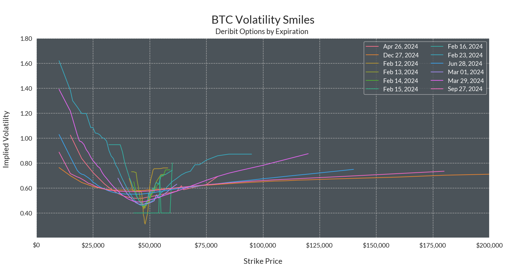
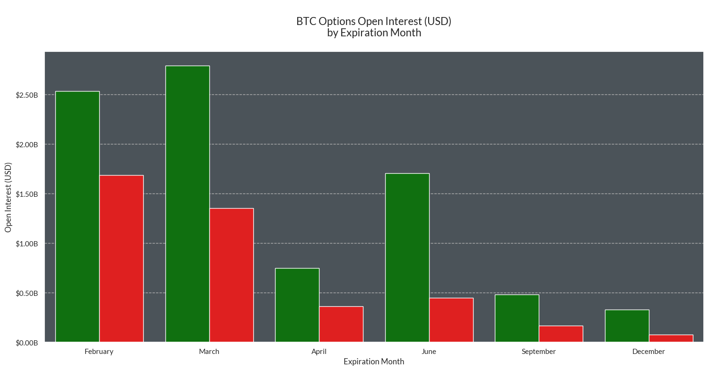

# Exploring Options, Open Interest, and Volatility Data


Options contracts have become an increasingly liquid segment of crypytoasset derivatives. Coin Metrics currently offers options data through various endpoints in our Market Data Feed offering. Available endpoints include market greeks, implied volatility, contract prices, market quotes, open interest, and more.

### Resources

This notebook demonstrates basic functionality offered by the Coin Metrics Python API Client and Market Data Feed.

Coin Metrics offers a vast assortment of data for hundreds of cryptoassets. The Python API Client allows for easy access to this data using Python without needing to create your own wrappers using `requests` and other such libraries.

To understand the data that Coin Metrics offers, feel free to peruse the resources below.

* The [Coin Metrics API v4](https://docs.coinmetrics.io/api/v4) website contains the full set of endpoints and data offered by Coin Metrics.
* The [Coin Metrics Product Documentation](https://docs.coinmetrics.io/info) gives detailed, conceptual explanations of the data that Coin Metrics offers.
* The [API Spec](https://coinmetrics.github.io/api-client-python/site/api\_client.html) contains a full list of functions.

### File Download

Download the entire notebook as either a jupyter notebook to run yourself or as a pdf from the two links below






## Notebook Setup

```python
from os import environ
import pandas as pd
import numpy as np
import seaborn as sns
import logging
from datetime import date, timedelta
from coinmetrics.api_client import CoinMetricsClient
import logging
import calendar
from datetime import date
import matplotlib.ticker as mtick
import matplotlib.pyplot as plt
%matplotlib inline
```

```python
sns.set_theme()
sns.set(rc={'figure.figsize':(18,8)})
sns.set_palette("YlGn",3)
sns.set_style("ticks", {"xtick.major.size":20,"ytick.major.size":20})
sns.set_style("whitegrid",{'axes.grid' : True,'grid.linestyle': '--', 'grid.color': '#b0b0b0','axes.edgecolor': 'white',
              'font.family': ['arial'],'axes.facecolor':'#4b5359'})
```

```python
logging.basicConfig(
    format='%(asctime)s %(levelname)-8s %(message)s',
    level=logging.INFO,
    datefmt='%Y-%m-%d %H:%M:%S'
)
```

```python
# We recommend privately storing your API key in your local environment.
try:
    api_key = environ["CM_API_KEY"]
    logging.info("Using API key found in environment")
except KeyError:
    api_key = ""
    logging.info("API key not found. Using community client")
client = CoinMetricsClient(api_key)
```

```
2024-02-13 13:17:42 INFO     Using API key found in environment
```

## Query Examples

#### Retrieving Market Greeks

***

```python
greeks_deribit = client.get_market_greeks(
    markets='deribit-BTC-30DEC22-*-option',
    limit_per_market=1
).to_dataframe()
greeks_deribit.head()
```

|   | market                              | time                      | database\_time                   | vega      | theta     | rho        | delta    | gamma   | exchange\_time                   |
| - | ----------------------------------- | ------------------------- | -------------------------------- | --------- | --------- | ---------- | -------- | ------- | -------------------------------- |
| 0 | deribit-BTC-30DEC22-10000-C-option  | 2022-05-11 14:09:00+00:00 | 2022-05-11 14:09:14.701194+00:00 | 12.95354  | -2.40646  | 58.03478   | 0.97893  | 0.0     | 2022-05-11 14:09:13.336000+00:00 |
| 1 | deribit-BTC-30DEC22-10000-P-option  | 2022-05-11 14:09:00+00:00 | 2022-05-11 14:09:14.701194+00:00 | 12.95354  | -2.40646  | -5.73063   | -0.02107 | 0.0     | 2022-05-11 14:09:13.329000+00:00 |
| 2 | deribit-BTC-30DEC22-100000-C-option | 2021-12-30 08:02:00+00:00 | 2021-12-30 08:02:03.247339+00:00 | 158.05411 | -14.17178 | 86.78939   | 0.24002  | 0.00001 | 2021-12-30 08:02:02.591000+00:00 |
| 3 | deribit-BTC-30DEC22-100000-P-option | 2021-12-30 08:02:00+00:00 | 2021-12-30 08:02:04.257489+00:00 | 156.75983 | -13.9386  | -914.15583 | -0.76354 | 0.00001 | 2021-12-30 08:02:03.416000+00:00 |
| 4 | deribit-BTC-30DEC22-11000-C-option  | 2022-11-16 09:06:00+00:00 | 2022-11-16 09:06:40.873351+00:00 | 9.65147   | -11.41404 | 10.99731   | 0.90588  | 0.00003 | 2022-11-16 09:06:40.094000+00:00 |

#### Retrieving Market Quotes

***

```python
quotes_deribit = client.get_market_quotes(
    markets='deribit-BTC-30DEC22-*-option',
    limit_per_market=1,
).to_dataframe()
quotes_deribit.head()
```

|   | market                              | time                      | coin\_metrics\_id  | ask\_price | ask\_size | bid\_price | bid\_size |
| - | ----------------------------------- | ------------------------- | ------------------ | ---------- | --------- | ---------- | --------- |
| 0 | deribit-BTC-30DEC22-10000-C-option  | 2022-05-11 14:09:00+00:00 | 1652278140000000-0 | 0.0        | 0.0       | 0.0        | 0.0       |
| 1 | deribit-BTC-30DEC22-10000-P-option  | 2022-05-11 14:09:00+00:00 | 1652278140000000-0 | 0.012      | 1.9       | 0.01       | 2.3       |
| 2 | deribit-BTC-30DEC22-100000-C-option | 2021-12-30 08:02:00+00:00 | 1640851320000000-0 | 0.0        | 0.0       | 0.0185     | 2.5       |
| 3 | deribit-BTC-30DEC22-100000-P-option | 2021-12-30 08:02:00+00:00 | 1640851320000000-0 | 0.0        | 0.0       | 0.0        | 0.0       |
| 4 | deribit-BTC-30DEC22-11000-C-option  | 2022-11-16 09:06:00+00:00 | 1668589560000000-0 | 0.0        | 0.0       | 0.0        | 0.0       |

#### Retrieving Contract Prices

***

```python
prices_deribit = client.get_market_contract_prices(
    markets='deribit-BTC-30DEC22-*-option',
    limit_per_market=1,
).to_dataframe()
prices_deribit.head()
```

|   | market                              | time                      | database\_time                   | mark\_price | index\_price | exchange\_time                   |
| - | ----------------------------------- | ------------------------- | -------------------------------- | ----------- | ------------ | -------------------------------- |
| 0 | deribit-BTC-30DEC22-10000-C-option  | 2022-05-11 14:09:00+00:00 | 2022-05-11 14:09:14.701194+00:00 | 0.695       | 31350.76     | 2022-05-11 14:09:13.336000+00:00 |
| 1 | deribit-BTC-30DEC22-10000-P-option  | 2022-05-11 14:09:00+00:00 | 2022-05-11 14:09:14.701194+00:00 | 0.007       | 31350.76     | 2022-05-11 14:09:13.329000+00:00 |
| 2 | deribit-BTC-30DEC22-100000-C-option | 2021-12-30 08:02:00+00:00 | 2021-12-30 08:02:03.247339+00:00 | 0.069329    | 47033.61     | 2021-12-30 08:02:02.591000+00:00 |
| 3 | deribit-BTC-30DEC22-100000-P-option | 2021-12-30 08:02:00+00:00 | 2021-12-30 08:02:04.257489+00:00 | 1.034568    | 47034.05     | 2021-12-30 08:02:03.416000+00:00 |
| 4 | deribit-BTC-30DEC22-11000-C-option  | 2022-11-16 09:06:00+00:00 | 2022-11-16 09:06:40.873351+00:00 | 0.3547      | 16744.61     | 2022-11-16 09:06:40.094000+00:00 |

#### Retrieving Open Interest

***

```python
oi_deribit = client.get_market_open_interest(
    markets='deribit-BTC-30DEC22-*-option',
    limit_per_market=1,
).to_dataframe()
oi_deribit.head()
```

|   | market                              | time                      | contract\_count | value\_usd | database\_time                   | exchange\_time            |
| - | ----------------------------------- | ------------------------- | --------------- | ---------- | -------------------------------- | ------------------------- |
| 0 | deribit-BTC-30DEC22-10000-C-option  | 2022-05-11 14:09:00+00:00 | 0               | 0          | 2022-05-11 14:09:39.584165+00:00 | 2022-05-11 14:09:00+00:00 |
| 1 | deribit-BTC-30DEC22-10000-P-option  | 2022-05-11 14:09:00+00:00 | 0               | 0          | 2022-05-11 14:09:39.584165+00:00 | 2022-05-11 14:09:00+00:00 |
| 2 | deribit-BTC-30DEC22-100000-C-option | 2021-12-30 08:02:00+00:00 | 0               | 0          | 2021-12-30 08:02:35.912527+00:00 | 2021-12-30 08:02:00+00:00 |
| 3 | deribit-BTC-30DEC22-100000-P-option | 2021-12-30 08:02:00+00:00 | 0               | 0          | 2021-12-30 08:02:37.918026+00:00 | 2021-12-30 08:02:00+00:00 |
| 4 | deribit-BTC-30DEC22-11000-C-option  | 2022-11-16 09:06:00+00:00 | 0               | 0          | 2022-11-16 09:06:24.566250+00:00 | 2022-11-16 09:06:00+00:00 |

## Plotting Options 'Volatility Smiles'

***

'Volatility smiles' are a popular options data visualization tool that help traders understand predicted asset volatility across various contract expiration dates. The 'smile' is plotted by mapping the strike price and implied volatility of a group of options with the same underlying asset and expiration date.

```python
asset = 'btc'
```

#### Catalog Endpoint

The Coin Metrics API contains two types of catalog endpoints (Python client functions in paranthesis): the `catalog` (`catalog_*`) and `catalog-all` (`catalog_full_*`). The `catalog` endpoint displays the set of data available to your API key. The `catalog-all` endpoint displays the full set of data for CM Pro users.

Catalog objects return a list of dictionaries. For `catalog_full_market_implied_volatility_v2`, each element of the list is an option market that supports implied volatility data.

```python
markets_deribit = client.catalog_full_market_implied_volatility_v2(
    exchange='deribit',
    market_type='option',
    base=asset,
    page_size=10000
).to_dataframe()
```

```python
markets_deribit.sort_values(by='max_time')
```

|       | market                             | min\_time                 | max\_time                 |
| ----- | ---------------------------------- | ------------------------- | ------------------------- |
| 29064 | deribit-BTC-2SEP21-53000-C-option  | 2021-09-01 13:24:00+00:00 | 2021-09-02 08:00:00+00:00 |
| 29049 | deribit-BTC-2SEP21-45000-P-option  | 2021-09-01 13:24:00+00:00 | 2021-09-02 08:00:00+00:00 |
| 29048 | deribit-BTC-2SEP21-45000-C-option  | 2021-09-01 13:24:00+00:00 | 2021-09-02 08:00:00+00:00 |
| 29046 | deribit-BTC-2SEP21-44000-C-option  | 2021-09-01 13:24:00+00:00 | 2021-09-02 08:00:00+00:00 |
| 29045 | deribit-BTC-2SEP21-43000-P-option  | 2021-09-01 13:24:00+00:00 | 2021-09-02 08:00:00+00:00 |
| ...   | ...                                | ...                       | ...                       |
| 24053 | deribit-BTC-27DEC24-61000-P-option | 2024-01-02 11:29:00+00:00 | 2024-02-13 17:43:00+00:00 |
| 24054 | deribit-BTC-27DEC24-62000-C-option | 2024-01-08 22:41:00+00:00 | 2024-02-13 17:43:00+00:00 |
| 24055 | deribit-BTC-27DEC24-62000-P-option | 2024-01-08 22:41:00+00:00 | 2024-02-13 17:43:00+00:00 |
| 24049 | deribit-BTC-27DEC24-59000-P-option | 2024-01-02 03:35:00+00:00 | 2024-02-13 17:43:00+00:00 |
| 27297 | deribit-BTC-29MAR24-26000-P-option | 2023-03-30 08:03:00+00:00 | 2024-02-13 17:43:00+00:00 |

40442 rows × 3 columns

```python
markets_deribit["min_time"] = pd.to_datetime(markets_deribit.min_time)
markets_deribit["max_time"] = pd.to_datetime(markets_deribit.max_time)
```

```python
# Select contracts that are still trading as of yesterday
end_date = (date.today() - timedelta(days=1)).strftime("%Y-%m-%d") 
deribit_current = markets_deribit.loc[(markets_deribit["max_time"] >= end_date)]
```

#### Collect Contract Reference Data

```python
ref_data = client.reference_data_markets(
    exchange = 'deribit',
    type = 'option',
    base = asset,
    page_size=10000
).to_dataframe()
```

```python
ref_data.head()
```

|   | market                            | exchange | type   | base | quote | pair    | symbol             | size\_asset | strike | option\_contract\_type | is\_european | contract\_size | listing                        | expiration                     | settlement\_price | status  | order\_amount\_min | order\_price\_increment | order\_taker\_fee | order\_maker\_fee |
| - | --------------------------------- | -------- | ------ | ---- | ----- | ------- | ------------------ | ----------- | ------ | ---------------------- | ------------ | -------------- | ------------------------------ | ------------------------------ | ----------------- | ------- | ------------------ | ----------------------- | ----------------- | ----------------- |
| 0 | deribit-BTC-10APR20-4750-C-option | deribit  | option | btc  | usd   | btc-usd | BTC-10APR20-4750-C | btc         | 4750   | call                   | True         | 1              | 2020-03-28T03:21:00.000000000Z | 2020-04-10T08:00:00.000000000Z | 6931.78           | offline | 0.1                | 0.0005                  | 0.0004            | 0.0004            |
| 1 | deribit-BTC-10APR20-4750-P-option | deribit  | option | btc  | usd   | btc-usd | BTC-10APR20-4750-P | btc         | 4750   | put                    | True         | 1              | 2020-03-28T03:21:00.000000000Z | 2020-04-10T08:00:00.000000000Z | 6931.78           | offline | 0.1                | 0.0005                  | 0.0004            | 0.0004            |
| 2 | deribit-BTC-10APR20-5000-C-option | deribit  | option | btc  | usd   | btc-usd | BTC-10APR20-5000-C | btc         | 5000   | call                   | True         | 1              | 2020-03-26T08:19:00.000000000Z | 2020-04-10T08:00:00.000000000Z | 6931.78           | offline | 0.1                | 0.0005                  | 0.0004            | 0.0004            |
| 3 | deribit-BTC-10APR20-5000-P-option | deribit  | option | btc  | usd   | btc-usd | BTC-10APR20-5000-P | btc         | 5000   | put                    | True         | 1              | 2020-03-26T08:19:00.000000000Z | 2020-04-10T08:00:00.000000000Z | 6931.78           | offline | 0.1                | 0.0005                  | 0.0004            | 0.0004            |
| 4 | deribit-BTC-10APR20-5250-P-option | deribit  | option | btc  | usd   | btc-usd | BTC-10APR20-5250-P | btc         | 5250   | put                    | True         | 1              | 2020-03-26T08:00:08.000000000Z | 2020-04-10T08:00:00.000000000Z | 6931.78           | offline | 0.1                | 0.0005                  | 0.0004            | 0.0004            |

```python
deribit_current = pd.merge(deribit_current, ref_data[['market','expiration','option_contract_type','strike']], on='market', how='left')
```

```python
# Set max expiration date
max_expiry = (date.today() + timedelta(days=365)).strftime("%Y-%m-%d")
max_expiry = (pd.to_datetime(max_expiry)).strftime("%Y-%m-%d")
deribit_current = pd.DataFrame(deribit_current.loc[(deribit_current["expiration"] < max_expiry)])
```

```python
deribit_current = deribit_current.sort_values(by=['expiration'])
```

```python
deribit_current
```

|     | market                              | min\_time                 | max\_time                 | expiration                     | option\_contract\_type | strike |
| --- | ----------------------------------- | ------------------------- | ------------------------- | ------------------------------ | ---------------------- | ------ |
| 0   | deribit-BTC-12FEB24-41000-C-option  | 2024-02-09 08:03:00+00:00 | 2024-02-12 08:00:00+00:00 | 2024-02-12T08:00:00.000000000Z | call                   | 41000  |
| 36  | deribit-BTC-12FEB24-48750-C-option  | 2024-02-11 08:03:00+00:00 | 2024-02-12 08:00:00+00:00 | 2024-02-12T08:00:00.000000000Z | call                   | 48750  |
| 37  | deribit-BTC-12FEB24-48750-P-option  | 2024-02-11 08:03:00+00:00 | 2024-02-12 08:00:00+00:00 | 2024-02-12T08:00:00.000000000Z | put                    | 48750  |
| 38  | deribit-BTC-12FEB24-49000-C-option  | 2024-02-09 08:03:00+00:00 | 2024-02-12 08:00:00+00:00 | 2024-02-12T08:00:00.000000000Z | call                   | 49000  |
| 39  | deribit-BTC-12FEB24-49000-P-option  | 2024-02-09 08:03:00+00:00 | 2024-02-12 08:00:00+00:00 | 2024-02-12T08:00:00.000000000Z | put                    | 49000  |
| ... | ...                                 | ...                       | ...                       | ...                            | ...                    | ...    |
| 557 | deribit-BTC-27DEC24-120000-P-option | 2023-12-28 08:02:00+00:00 | 2024-02-13 17:43:00+00:00 | 2024-12-27T08:00:00.000000000Z | put                    | 120000 |
| 558 | deribit-BTC-27DEC24-125000-C-option | 2023-12-28 08:02:00+00:00 | 2024-02-13 17:43:00+00:00 | 2024-12-27T08:00:00.000000000Z | call                   | 125000 |
| 559 | deribit-BTC-27DEC24-125000-P-option | 2023-12-28 08:02:00+00:00 | 2024-02-13 17:43:00+00:00 | 2024-12-27T08:00:00.000000000Z | put                    | 125000 |
| 547 | deribit-BTC-27DEC24-10000-P-option  | 2023-12-28 08:02:00+00:00 | 2024-02-13 17:43:00+00:00 | 2024-12-27T08:00:00.000000000Z | put                    | 10000  |
| 579 | deribit-BTC-27DEC24-28000-P-option  | 2023-12-28 18:57:00+00:00 | 2024-02-13 17:43:00+00:00 | 2024-12-27T08:00:00.000000000Z | put                    | 28000  |

1008 rows × 6 columns

### Retrieve Implied Volatility

```python
iv_asset_contracts = client.get_market_implied_volatility(
    markets='deribit-*-option',
    start_time = end_date,
    limit_per_market=1,
    page_size=10000
).to_dataframe()
```

```python
iv_asset_contracts = iv_asset_contracts.loc[iv_asset_contracts['market'].isin(deribit_current['market'].to_list())]
iv_asset_contracts
```

|      | market                             | time                      | database\_time                   | iv\_bid | iv\_ask | iv\_mark | exchange\_time                   |
| ---- | ---------------------------------- | ------------------------- | -------------------------------- | ------- | ------- | -------- | -------------------------------- |
| 0    | deribit-BTC-12FEB24-41000-C-option | 2024-02-12 00:00:00+00:00 | 2024-02-12 00:00:15.649992+00:00 | 0.0     | 0.0     | 0.677    | 2024-02-12 00:00:13.899000+00:00 |
| 1    | deribit-BTC-12FEB24-41000-P-option | 2024-02-12 00:00:00+00:00 | 2024-02-12 00:00:14.602653+00:00 | 0.0     | 2.1273  | 0.677    | 2024-02-12 00:00:13.900000+00:00 |
| 2    | deribit-BTC-12FEB24-42000-C-option | 2024-02-12 00:00:00+00:00 | 2024-02-12 00:00:03.599239+00:00 | 0.0     | 3.0076  | 0.6176   | 2024-02-12 00:00:02.821000+00:00 |
| 3    | deribit-BTC-12FEB24-42000-P-option | 2024-02-12 00:00:00+00:00 | 2024-02-12 00:00:03.599239+00:00 | 0.0     | 2.1175  | 0.6176   | 2024-02-12 00:00:00.808000+00:00 |
| 4    | deribit-BTC-12FEB24-42500-C-option | 2024-02-12 00:00:00+00:00 | 2024-02-12 00:00:12.040598+00:00 | 0.0     | 0.0     | 0.5786   | 2024-02-12 00:00:09.872000+00:00 |
| ...  | ...                                | ...                       | ...                              | ...     | ...     | ...      | ...                              |
| 1001 | deribit-BTC-29MAR24-80000-P-option | 2024-02-12 00:00:00+00:00 | 2024-02-12 00:00:16.038858+00:00 | 0.0     | 0.8866  | 0.6928   | 2024-02-12 00:00:13.898000+00:00 |
| 1002 | deribit-BTC-29MAR24-85000-C-option | 2024-02-12 00:00:00+00:00 | 2024-02-12 00:00:04.033371+00:00 | 0.7072  | 0.7288  | 0.7195   | 2024-02-12 00:00:03.827000+00:00 |
| 1003 | deribit-BTC-29MAR24-85000-P-option | 2024-02-12 00:00:00+00:00 | 2024-02-12 00:00:10.038068+00:00 | 0.0     | 0.8934  | 0.7194   | 2024-02-12 00:00:08.863000+00:00 |
| 1004 | deribit-BTC-29MAR24-90000-C-option | 2024-02-12 00:00:00+00:00 | 2024-02-12 00:00:04.033371+00:00 | 0.7248  | 0.7476  | 0.7409   | 2024-02-12 00:00:02.820000+00:00 |
| 1005 | deribit-BTC-29MAR24-90000-P-option | 2024-02-12 00:00:00+00:00 | 2024-02-12 00:00:11.038214+00:00 | 0.0     | 0.9518  | 0.7408   | 2024-02-12 00:00:09.870000+00:00 |

1006 rows × 7 columns

```python
iv_only = iv_asset_contracts.drop(['time', 'database_time','iv_bid','iv_ask','exchange_time'], axis=1).drop_duplicates()
iv_only
```

|      | market                             | iv\_mark |
| ---- | ---------------------------------- | -------- |
| 0    | deribit-BTC-12FEB24-41000-C-option | 0.677    |
| 1    | deribit-BTC-12FEB24-41000-P-option | 0.677    |
| 2    | deribit-BTC-12FEB24-42000-C-option | 0.6176   |
| 3    | deribit-BTC-12FEB24-42000-P-option | 0.6176   |
| 4    | deribit-BTC-12FEB24-42500-C-option | 0.5786   |
| ...  | ...                                | ...      |
| 1001 | deribit-BTC-29MAR24-80000-P-option | 0.6928   |
| 1002 | deribit-BTC-29MAR24-85000-C-option | 0.7195   |
| 1003 | deribit-BTC-29MAR24-85000-P-option | 0.7194   |
| 1004 | deribit-BTC-29MAR24-90000-C-option | 0.7409   |
| 1005 | deribit-BTC-29MAR24-90000-P-option | 0.7408   |

1006 rows × 2 columns

```python
merged = pd.merge(deribit_current, iv_only, on="market").drop_duplicates()
```

```python
calls = pd.DataFrame(merged.loc[merged['option_contract_type'] == 'call'])
```

```python
calls['expiration'] = pd.to_datetime(calls['expiration']).dt.strftime('%b %d, %Y')
calls = calls.dropna(subset=['strike'])
calls['strike'] = calls['strike'].astype('int64')
calls['iv_mark'] = calls['iv_mark'].astype('float64')
calls['expiration'] = calls['expiration'].astype('category')
calls = calls.dropna(subset=['strike', 'iv_mark'])
calls = calls[np.isfinite(calls['strike']) & np.isfinite(calls['iv_mark'])]
calls
```

|      | market                              | min\_time                 | max\_time                 | expiration   | option\_contract\_type | strike | iv\_mark |
| ---- | ----------------------------------- | ------------------------- | ------------------------- | ------------ | ---------------------- | ------ | -------- |
| 0    | deribit-BTC-12FEB24-41000-C-option  | 2024-02-09 08:03:00+00:00 | 2024-02-12 08:00:00+00:00 | Feb 12, 2024 | call                   | 41000  | 0.6770   |
| 1    | deribit-BTC-12FEB24-48750-C-option  | 2024-02-11 08:03:00+00:00 | 2024-02-12 08:00:00+00:00 | Feb 12, 2024 | call                   | 48750  | 0.3703   |
| 3    | deribit-BTC-12FEB24-49000-C-option  | 2024-02-09 08:03:00+00:00 | 2024-02-12 08:00:00+00:00 | Feb 12, 2024 | call                   | 49000  | 0.3908   |
| 5    | deribit-BTC-12FEB24-49250-C-option  | 2024-02-11 08:14:00+00:00 | 2024-02-12 08:00:00+00:00 | Feb 12, 2024 | call                   | 49250  | 0.4235   |
| 7    | deribit-BTC-12FEB24-49500-C-option  | 2024-02-09 08:03:00+00:00 | 2024-02-12 08:00:00+00:00 | Feb 12, 2024 | call                   | 49500  | 0.4815   |
| ...  | ...                                 | ...                       | ...                       | ...          | ...                    | ...    | ...      |
| 994  | deribit-BTC-27DEC24-105000-C-option | 2023-12-28 08:02:00+00:00 | 2024-02-13 17:43:00+00:00 | Dec 27, 2024 | call                   | 105000 | 0.6558   |
| 996  | deribit-BTC-27DEC24-110000-C-option | 2023-12-28 08:02:00+00:00 | 2024-02-13 17:43:00+00:00 | Dec 27, 2024 | call                   | 110000 | 0.6580   |
| 998  | deribit-BTC-27DEC24-115000-C-option | 2023-12-28 08:02:00+00:00 | 2024-02-13 17:43:00+00:00 | Dec 27, 2024 | call                   | 115000 | 0.6633   |
| 1000 | deribit-BTC-27DEC24-120000-C-option | 2023-12-28 08:02:00+00:00 | 2024-02-13 17:43:00+00:00 | Dec 27, 2024 | call                   | 120000 | 0.6656   |
| 1002 | deribit-BTC-27DEC24-125000-C-option | 2023-12-28 08:02:00+00:00 | 2024-02-13 17:43:00+00:00 | Dec 27, 2024 | call                   | 125000 | 0.6690   |

503 rows × 7 columns

```python
calls = calls.sort_values(by='expiration')
```

```python
calls.dtypes
```

```
market                       string[python]
min_time                datetime64[ns, UTC]
max_time                datetime64[ns, UTC]
expiration                         category
option_contract_type         string[python]
strike                                int64
iv_mark                             float64
dtype: object
```

```python
l = sns.lineplot(data=calls, x="strike", y="iv_mark", hue='expiration')
l.set_xlabel("\nStrike Price", fontsize = 17)
l.set_ylabel("Implied Volatility \n", fontsize = 17)
l.set_xlim([0, calls['strike'].max()])

l.set_xticks(l.get_xticks().tolist())
l.set_xticklabels(['${:,.0f}'.format(x) for x in l.get_xticks().tolist()],fontsize=14)
l.set_yticks(l.get_yticks().tolist())
l.set_yticklabels(['{:.2f}'.format(y) for y in l.get_yticks().tolist()],fontsize=14)
plt.setp(l.get_yticklabels()[0], visible=False)    
leg = plt.legend(loc='upper right',ncol=2,fontsize=13.5)
for text in leg.get_texts():
    text.set_color("white")
l.set_title('\n' + asset.upper() + ' Volatility Smiles\n', fontsize = 25)
plt.suptitle('\n\n         Deribit Options by Expiration',fontsize=16);
```

<figure><figcaption></figcaption></figure>


## Plotting Calls vs. Puts by Open Interest

```python
options_oi = client.get_market_open_interest(
    markets='deribit-*-option',
    limit_per_market=1,
    paging_from='end',
    start_time=end_date,
    page_size=10000
).to_dataframe()
```

```python
options_oi['value_usd'] = pd.to_numeric(options_oi['value_usd'])
options_oi = options_oi.loc[options_oi['value_usd'] > 0]
```

```python
options_oi = options_oi.sort_values('value_usd',ascending=False)
```

```python
oi_only = options_oi[['market','contract_count','value_usd']]
```

```python
oi_only
```

|      | market                             | contract\_count | value\_usd    |
| ---- | ---------------------------------- | --------------- | ------------- |
| 1356 | deribit-ETH-23FEB24-2400-C-option  | 97938.0         | 256834569.96  |
| 972  | deribit-BTC-29MAR24-50000-C-option | 5204.3          | 254888763.251 |
| 992  | deribit-BTC-29MAR24-60000-C-option | 4830.8          | 236604371.64  |
| 1716 | deribit-ETH-29MAR24-3000-C-option  | 86689.0         | 227343636.28  |
| 994  | deribit-BTC-29MAR24-65000-C-option | 4572.5          | 223940793.825 |
| ...  | ...                                | ...             | ...           |
| 1511 | deribit-ETH-27DEC24-6000-P-option  | 1.0             | 2622.57       |
| 1599 | deribit-ETH-27SEP24-7500-P-option  | 1.0             | 2622.53       |
| 1593 | deribit-ETH-27SEP24-6000-P-option  | 1.0             | 2622.52       |
| 1177 | deribit-ETH-15FEB24-2200-P-option  | 1.0             | 2622.37       |
| 1737 | deribit-ETH-29MAR24-5000-P-option  | 1.0             | 2622.27       |

1387 rows × 3 columns

```python
asset_deribit_oi = deribit_current[['market','expiration','strike','option_contract_type']]
```

```python
oi_merged = pd.merge(asset_deribit_oi, oi_only, on="market").drop_duplicates()
```

```python
oi_merged
```

|     | market                              | expiration                     | strike | option\_contract\_type | contract\_count | value\_usd  |
| --- | ----------------------------------- | ------------------------------ | ------ | ---------------------- | --------------- | ----------- |
| 0   | deribit-BTC-12FEB24-48750-C-option  | 2024-02-12T08:00:00.000000000Z | 48750  | call                   | 61.3            | 2959931.187 |
| 1   | deribit-BTC-12FEB24-48750-P-option  | 2024-02-12T08:00:00.000000000Z | 48750  | put                    | 4.7             | 226944.294  |
| 2   | deribit-BTC-12FEB24-49000-C-option  | 2024-02-12T08:00:00.000000000Z | 49000  | call                   | 141.1           | 6813157.422 |
| 3   | deribit-BTC-12FEB24-49250-C-option  | 2024-02-12T08:00:00.000000000Z | 49250  | call                   | 6.6             | 318687.732  |
| 4   | deribit-BTC-12FEB24-49500-C-option  | 2024-02-12T08:00:00.000000000Z | 49500  | call                   | 28.6            | 1380979.028 |
| ... | ...                                 | ...                            | ...    | ...                    | ...             | ...         |
| 820 | deribit-BTC-27DEC24-120000-P-option | 2024-12-27T08:00:00.000000000Z | 120000 | put                    | 1.3             | 63681.397   |
| 821 | deribit-BTC-27DEC24-125000-C-option | 2024-12-27T08:00:00.000000000Z | 125000 | call                   | 37.9            | 1856453.805 |
| 822 | deribit-BTC-27DEC24-125000-P-option | 2024-12-27T08:00:00.000000000Z | 125000 | put                    | 1.6             | 78372.704   |
| 823 | deribit-BTC-27DEC24-10000-P-option  | 2024-12-27T08:00:00.000000000Z | 10000  | put                    | 20.7            | 1013795.748 |
| 824 | deribit-BTC-27DEC24-28000-P-option  | 2024-12-27T08:00:00.000000000Z | 28000  | put                    | 132.1           | 6470647.695 |

825 rows × 6 columns

```python
oi_merged.expiration = pd.to_datetime(oi_merged.expiration).dt.strftime('%b %d, %Y')
oi_merged
```

|     | market                              | expiration   | strike | option\_contract\_type | contract\_count | value\_usd  |
| --- | ----------------------------------- | ------------ | ------ | ---------------------- | --------------- | ----------- |
| 0   | deribit-BTC-12FEB24-48750-C-option  | Feb 12, 2024 | 48750  | call                   | 61.3            | 2959931.187 |
| 1   | deribit-BTC-12FEB24-48750-P-option  | Feb 12, 2024 | 48750  | put                    | 4.7             | 226944.294  |
| 2   | deribit-BTC-12FEB24-49000-C-option  | Feb 12, 2024 | 49000  | call                   | 141.1           | 6813157.422 |
| 3   | deribit-BTC-12FEB24-49250-C-option  | Feb 12, 2024 | 49250  | call                   | 6.6             | 318687.732  |
| 4   | deribit-BTC-12FEB24-49500-C-option  | Feb 12, 2024 | 49500  | call                   | 28.6            | 1380979.028 |
| ... | ...                                 | ...          | ...    | ...                    | ...             | ...         |
| 820 | deribit-BTC-27DEC24-120000-P-option | Dec 27, 2024 | 120000 | put                    | 1.3             | 63681.397   |
| 821 | deribit-BTC-27DEC24-125000-C-option | Dec 27, 2024 | 125000 | call                   | 37.9            | 1856453.805 |
| 822 | deribit-BTC-27DEC24-125000-P-option | Dec 27, 2024 | 125000 | put                    | 1.6             | 78372.704   |
| 823 | deribit-BTC-27DEC24-10000-P-option  | Dec 27, 2024 | 10000  | put                    | 20.7            | 1013795.748 |
| 824 | deribit-BTC-27DEC24-28000-P-option  | Dec 27, 2024 | 28000  | put                    | 132.1           | 6470647.695 |

825 rows × 6 columns

```python
oi_merged_sum = oi_merged.groupby(
        ['expiration', 'option_contract_type']).value_usd.sum().reset_index()
```

```python
oi_merged_sum
```

|    | expiration   | option\_contract\_type | value\_usd     |
| -- | ------------ | ---------------------- | -------------- |
| 0  | Apr 26, 2024 | call                   | 746759409.804  |
| 1  | Apr 26, 2024 | put                    | 362391927.898  |
| 2  | Dec 27, 2024 | call                   | 327845484.001  |
| 3  | Dec 27, 2024 | put                    | 76852459.777   |
| 4  | Feb 12, 2024 | call                   | 61221827.396   |
| 5  | Feb 12, 2024 | put                    | 53636084.351   |
| 6  | Feb 13, 2024 | call                   | 60612528.457   |
| 7  | Feb 13, 2024 | put                    | 55888112.274   |
| 8  | Feb 14, 2024 | call                   | 62115453.667   |
| 9  | Feb 14, 2024 | put                    | 47578321.782   |
| 10 | Feb 15, 2024 | call                   | 15652452.769   |
| 11 | Feb 15, 2024 | put                    | 19036582.686   |
| 12 | Feb 16, 2024 | call                   | 486055096.137  |
| 13 | Feb 16, 2024 | put                    | 407674392.781  |
| 14 | Feb 23, 2024 | call                   | 1849252067.898 |
| 15 | Feb 23, 2024 | put                    | 1101826630.192 |
| 16 | Jun 28, 2024 | call                   | 1703153232.984 |
| 17 | Jun 28, 2024 | put                    | 446922981.015  |
| 18 | Mar 01, 2024 | call                   | 150328051.677  |
| 19 | Mar 01, 2024 | put                    | 105881633.482  |
| 20 | Mar 29, 2024 | call                   | 2641595742.536 |
| 21 | Mar 29, 2024 | put                    | 1245411237.802 |
| 22 | Sep 27, 2024 | call                   | 480871248.568  |
| 23 | Sep 27, 2024 | put                    | 169771991.037  |

```python
calls_oi = pd.DataFrame(oi_merged_sum.loc[oi_merged_sum['option_contract_type'] == 'call'])
puts_oi = pd.DataFrame(oi_merged_sum.loc[oi_merged_sum['option_contract_type'] == 'put'])
```

```python
# Convert 'expiration' to datetime and extract month
calls_oi['expiration'] = pd.to_datetime(calls_oi['expiration'])
calls_oi['Expiration Month'] = calls_oi['expiration'].dt.month

puts_oi['expiration'] = pd.to_datetime(puts_oi['expiration'])
puts_oi['Expiration Month'] = puts_oi['expiration'].dt.month

# Group by 'expiration_month' and sum 'value_usd'
calls_oi_grouped = calls_oi.groupby('Expiration Month')['value_usd'].sum()
puts_oi_grouped = puts_oi.groupby('Expiration Month')['value_usd'].sum()

# Convert Series to DataFrame and reset index
calls_oi_df = calls_oi_grouped.reset_index()
puts_oi_df = puts_oi_grouped.reset_index()

# Replace month numbers with month names
calls_oi_df['Expiration Month'] = calls_oi_df['Expiration Month'].apply(lambda x: calendar.month_name[x])
puts_oi_df['Expiration Month'] = puts_oi_df['Expiration Month'].apply(lambda x: calendar.month_name[x])
```

```python
calls_oi_df
```

|   | Expiration Month | value\_usd     |
| - | ---------------- | -------------- |
| 0 | February         | 2534909426.324 |
| 1 | March            | 2791923794.213 |
| 2 | April            | 746759409.804  |
| 3 | June             | 1703153232.984 |
| 4 | September        | 480871248.568  |
| 5 | December         | 327845484.001  |

```python
# Add a new column to distinguish between calls and puts
calls_oi_df['type'] = 'calls'
puts_oi_df['type'] = 'puts'

# Concatenate the dataframes
df = pd.concat([calls_oi_df, puts_oi_df])
df = df.rename(columns={"value_usd": "Open Interest (USD)"})

# Plot the bars side by side
p = sns.barplot(data=df, x='Expiration Month', y='Open Interest (USD)', hue='type', palette=['green', 'red'])
p.set_title('\nBTC Options Open Interest (USD)\nby Expiration Month\n',fontsize=16)
# Format y-axis in billions
fmt = '${x:,.0f}B'
p.legend_.remove()

tick = mtick.FuncFormatter(lambda x, pos: '${:,.2f}B'.format(x*1e-9))
p.yaxis.set_major_formatter(tick)
```

```
2024-02-13 13:18:16 INFO     Using categorical units to plot a list of strings that are all parsable as floats or dates. If these strings should be plotted as numbers, cast to the appropriate data type before plotting.
2024-02-13 13:18:16 INFO     Using categorical units to plot a list of strings that are all parsable as floats or dates. If these strings should be plotted as numbers, cast to the appropriate data type before plotting.

```

<figure><figcaption></figcaption></figure>

