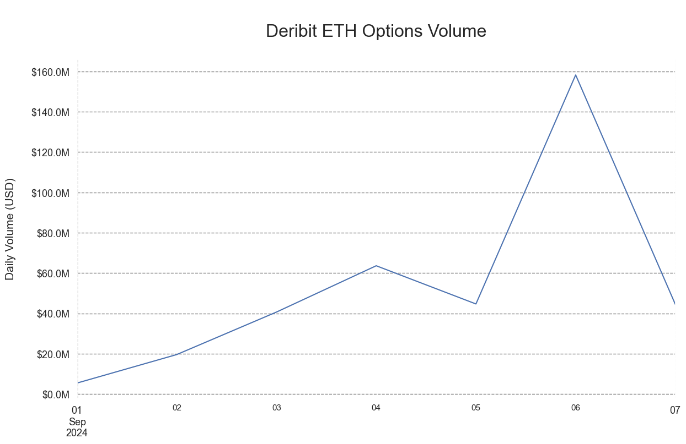
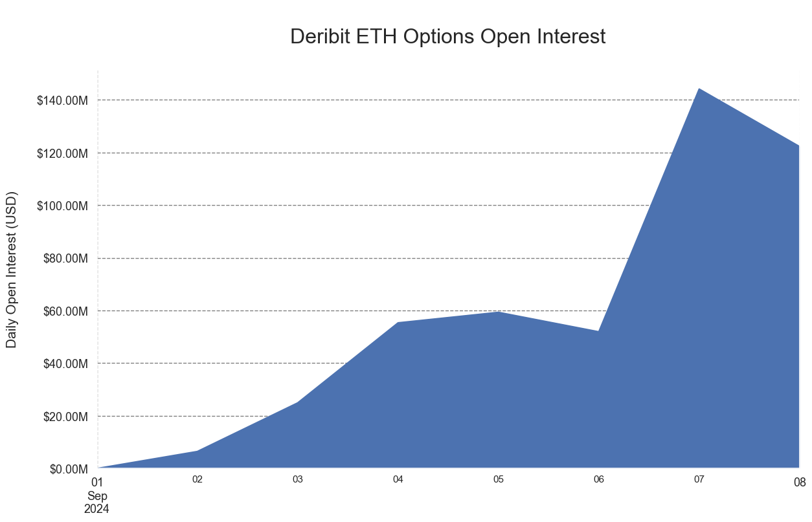
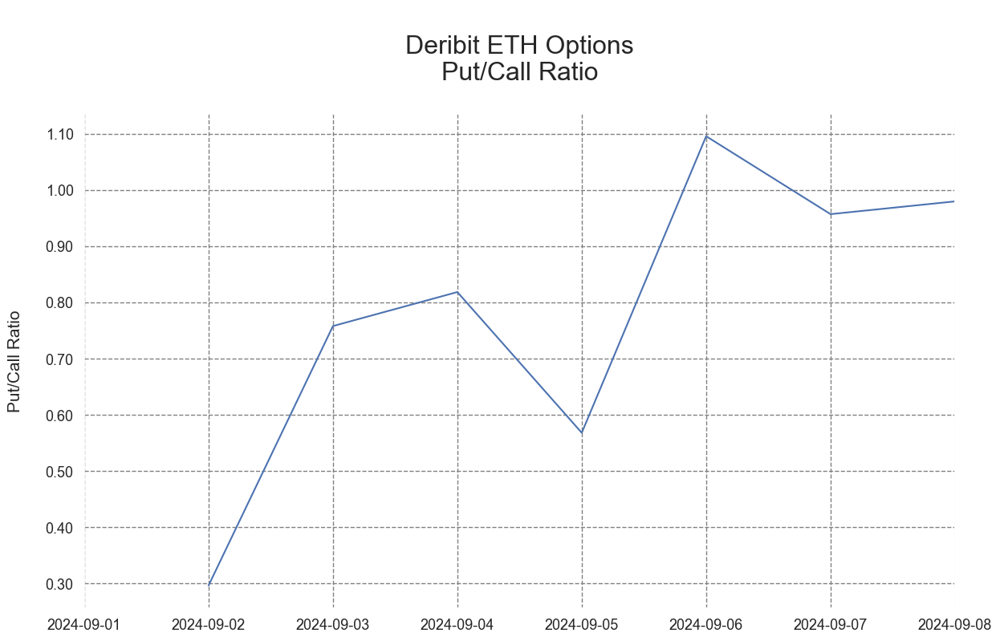

# Aggregating Options Data

## Coin Metrics Options Data Aggregation

This notebook demonstrates basic functionality offered by the Coin Metrics Python API Client and Market Data Feed.

Coin Metrics offers a vast assortment of data for hundreds of cryptoassets. The Python API Client allows for easy access to this data using Python without needing to create your own wrappers using `requests` and other such libraries.

### Resources

To understand the data that Coin Metrics offers, feel free to peruse the resources below.

* The [Coin Metrics API v4](https://docs.coinmetrics.io/api/v4) website contains the full set of endpoints and data offered by Coin Metrics.
* The [Coin Metrics Product Documentation](https://docs.coinmetrics.io/info) gives detailed, conceptual explanations of the data that Coin Metrics offers.
* The [API Spec](https://coinmetrics.github.io/api-client-python/site/api\_client.html) contains a full list of functions.


### File Download

Download the entire notebook as either a jupyter notebook to run yourself or as a pdf from the two links below






### Notebook Setup

```python
import os
from os import environ
import sys
import pandas as pd
import numpy as np
import seaborn as sns
import logging
from datetime import date, datetime, timedelta
from coinmetrics.api_client import CoinMetricsClient
import json
import logging
from datetime import timezone as timezone_info
import matplotlib.ticker as mticker
from matplotlib.ticker import ScalarFormatter
import matplotlib.pyplot as plt
import matplotlib.dates as mdates
%matplotlib inline
from plotly import graph_objects as go
```

```python
sns.set_theme()
sns.set(rc={'figure.figsize':(14,8)})
sns.set_style("whitegrid",{'axes.grid' : True,'grid.linestyle': '--', 'grid.color': 'gray','axes.edgecolor': 'white'})
```

```python
logging.basicConfig(
    format='%(asctime)s %(levelname)-8s %(message)s',
    level=logging.INFO,
    datefmt='%Y-%m-%d %H:%M:%S'
)
```

```python
# We recommend privately storing your API key in your local environment.
try:
    api_key = environ["CM_API_KEY"]
    logging.info("Using API key found in environment")
except KeyError:
    api_key = ""
    logging.info("API key not found. Using community client")

client = CoinMetricsClient(api_key)
```

```
2024-09-12 08:53:59 INFO     Using API key found in environment
```

#### Set start and end time

```python
end = datetime.utcnow()
start = '2024-09-01'
end = '2024-09-08'
asset = 'eth'
```

### OPTIONS CATALOG

To simplify some of the complexity around options contract size, we will investigate only options markets on Deribit, the largest options exchange by volume.

```python
asset_options = client.reference_data_markets(
    type='option',
    exchange='deribit',
    base='eth',
    quote='usd',
    page_size=10000
).to_list()
```

```python
print('Total number of supported options markets: ' + str(len(asset_options)))
```

```
Total number of supported options markets: 74827
```

#### Filter out expired/inactive contracts

```python
df_asset_options = pd.DataFrame(asset_options)
```

```python
df_asset_options.head()
```

|   | market                           | exchange | type   | base | quote | pair    | symbol            | size\_asset | strike | option\_contract\_type | ... | listing                        | expiration                     | settlement\_price | status  | order\_amount\_min | order\_price\_increment | order\_taker\_fee | order\_maker\_fee | base\_native | quote\_native |
| - | -------------------------------- | -------- | ------ | ---- | ----- | ------- | ----------------- | ----------- | ------ | ---------------------- | --- | ------------------------------ | ------------------------------ | ----------------- | ------- | ------------------ | ----------------------- | ----------------- | ----------------- | ------------ | ------------- |
| 0 | deribit-ETH-10APR20-100-P-option | deribit  | option | eth  | usd   | eth-usd | ETH-10APR20-100-P | eth         | 100    | put                    | ... | 2020-03-26T08:00:02.000000000Z | 2020-04-10T08:00:00.000000000Z | 158.1             | offline | 1                  | 0.0005                  | 0.0004            | 0.0004            | NaN          | NaN           |
| 1 | deribit-ETH-10APR20-110-P-option | deribit  | option | eth  | usd   | eth-usd | ETH-10APR20-110-P | eth         | 110    | put                    | ... | 2020-03-26T08:00:02.000000000Z | 2020-04-10T08:00:00.000000000Z | 158.1             | offline | 1                  | 0.0005                  | 0.0004            | 0.0004            | NaN          | NaN           |
| 2 | deribit-ETH-10APR20-120-C-option | deribit  | option | eth  | usd   | eth-usd | ETH-10APR20-120-C | eth         | 120    | call                   | ... | 2020-03-26T08:00:02.000000000Z | 2020-04-10T08:00:00.000000000Z | 158.1             | offline | 1                  | 0.0005                  | 0.0004            | 0.0004            | NaN          | NaN           |
| 3 | deribit-ETH-10APR20-120-P-option | deribit  | option | eth  | usd   | eth-usd | ETH-10APR20-120-P | eth         | 120    | put                    | ... | 2020-03-26T08:00:02.000000000Z | 2020-04-10T08:00:00.000000000Z | 158.1             | offline | 1                  | 0.0005                  | 0.0004            | 0.0004            | NaN          | NaN           |
| 4 | deribit-ETH-10APR20-130-C-option | deribit  | option | eth  | usd   | eth-usd | ETH-10APR20-130-C | eth         | 130    | call                   | ... | 2020-03-26T08:00:02.000000000Z | 2020-04-10T08:00:00.000000000Z | 158.1             | offline | 1                  | 0.0005                  | 0.0004            | 0.0004            | NaN          | NaN           |

5 rows × 22 columns

```python
df_asset_options.info()
```

```
<class 'pandas.core.frame.DataFrame'>
RangeIndex: 74827 entries, 0 to 74826
Data columns (total 22 columns):
 #   Column                 Non-Null Count  Dtype 
---  ------                 --------------  ----- 
 0   market                 74827 non-null  object
 1   exchange               74827 non-null  object
 2   type                   74827 non-null  object
 3   base                   74827 non-null  object
 4   quote                  74827 non-null  object
 5   pair                   74827 non-null  object
 6   symbol                 74827 non-null  object
 7   size_asset             74827 non-null  object
 8   strike                 74827 non-null  object
 9   option_contract_type   74827 non-null  object
 10  is_european            74827 non-null  bool  
 11  contract_size          74827 non-null  object
 12  listing                74827 non-null  object
 13  expiration             74827 non-null  object
 14  settlement_price       74117 non-null  object
 15  status                 74827 non-null  object
 16  order_amount_min       74827 non-null  object
 17  order_price_increment  74827 non-null  object
 18  order_taker_fee        74827 non-null  object
 19  order_maker_fee        74827 non-null  object
 20  base_native            3558 non-null   object
 21  quote_native           3558 non-null   object
dtypes: bool(1), object(21)
memory usage: 12.1+ MB
```

```python
df_asset_options['listing'] = pd.to_datetime(df_asset_options['listing'])
df_asset_options['expiration'] = pd.to_datetime(df_asset_options['expiration'])

df_asset_options = df_asset_options.loc[((df_asset_options.listing > start) & (df_asset_options.listing < end))]
df_asset_options
```

|       | market                            | exchange | type   | base | quote | pair    | symbol             | size\_asset | strike | option\_contract\_type | ... | listing                   | expiration                | settlement\_price | status  | order\_amount\_min | order\_price\_increment | order\_taker\_fee | order\_maker\_fee | base\_native | quote\_native |
| ----- | --------------------------------- | -------- | ------ | ---- | ----- | ------- | ------------------ | ----------- | ------ | ---------------------- | --- | ------------------------- | ------------------------- | ----------------- | ------- | ------------------ | ----------------------- | ----------------- | ----------------- | ------------ | ------------- |
| 2384  | deribit-ETH-10SEP24-1950-C-option | deribit  | option | eth  | usd   | eth-usd | ETH-10SEP24-1950-C | eth         | 1950   | call                   | ... | 2024-09-07 08:00:09+00:00 | 2024-09-10 08:00:00+00:00 | 2360.48           | offline | 1                  | 0.0001                  | 0.0003            | 0.0003            | ETH          | USD           |
| 2385  | deribit-ETH-10SEP24-1950-P-option | deribit  | option | eth  | usd   | eth-usd | ETH-10SEP24-1950-P | eth         | 1950   | put                    | ... | 2024-09-07 08:00:09+00:00 | 2024-09-10 08:00:00+00:00 | 2360.48           | offline | 1                  | 0.0001                  | 0.0003            | 0.0003            | ETH          | USD           |
| 2386  | deribit-ETH-10SEP24-2000-C-option | deribit  | option | eth  | usd   | eth-usd | ETH-10SEP24-2000-C | eth         | 2000   | call                   | ... | 2024-09-07 08:00:09+00:00 | 2024-09-10 08:00:00+00:00 | 2360.48           | offline | 1                  | 0.0001                  | 0.0003            | 0.0003            | ETH          | USD           |
| 2387  | deribit-ETH-10SEP24-2000-P-option | deribit  | option | eth  | usd   | eth-usd | ETH-10SEP24-2000-P | eth         | 2000   | put                    | ... | 2024-09-07 08:00:09+00:00 | 2024-09-10 08:00:00+00:00 | 2360.48           | offline | 1                  | 0.0001                  | 0.0003            | 0.0003            | ETH          | USD           |
| 2388  | deribit-ETH-10SEP24-2050-C-option | deribit  | option | eth  | usd   | eth-usd | ETH-10SEP24-2050-C | eth         | 2050   | call                   | ... | 2024-09-07 08:00:09+00:00 | 2024-09-10 08:00:00+00:00 | 2360.48           | offline | 1                  | 0.0001                  | 0.0003            | 0.0003            | ETH          | USD           |
| ...   | ...                               | ...      | ...    | ...  | ...   | ...     | ...                | ...         | ...    | ...                    | ... | ...                       | ...                       | ...               | ...     | ...                | ...                     | ...               | ...               | ...          | ...           |
| 74822 | deribit-ETH-9SEP24-2800-P-option  | deribit  | option | eth  | usd   | eth-usd | ETH-9SEP24-2800-P  | eth         | 2800   | put                    | ... | 2024-09-06 08:00:10+00:00 | 2024-09-09 08:00:00+00:00 | 2311.75           | offline | 1                  | 0.0001                  | 0.0003            | 0.0003            | ETH          | USD           |
| 74823 | deribit-ETH-9SEP24-2850-C-option  | deribit  | option | eth  | usd   | eth-usd | ETH-9SEP24-2850-C  | eth         | 2850   | call                   | ... | 2024-09-06 08:00:10+00:00 | 2024-09-09 08:00:00+00:00 | 2311.75           | offline | 1                  | 0.0001                  | 0.0003            | 0.0003            | ETH          | USD           |
| 74824 | deribit-ETH-9SEP24-2850-P-option  | deribit  | option | eth  | usd   | eth-usd | ETH-9SEP24-2850-P  | eth         | 2850   | put                    | ... | 2024-09-06 08:00:10+00:00 | 2024-09-09 08:00:00+00:00 | 2311.75           | offline | 1                  | 0.0001                  | 0.0003            | 0.0003            | ETH          | USD           |
| 74825 | deribit-ETH-9SEP24-2900-C-option  | deribit  | option | eth  | usd   | eth-usd | ETH-9SEP24-2900-C  | eth         | 2900   | call                   | ... | 2024-09-06 10:37:00+00:00 | 2024-09-09 08:00:00+00:00 | 2311.75           | offline | 1                  | 0.0001                  | 0.0003            | 0.0003            | ETH          | USD           |
| 74826 | deribit-ETH-9SEP24-2900-P-option  | deribit  | option | eth  | usd   | eth-usd | ETH-9SEP24-2900-P  | eth         | 2900   | put                    | ... | 2024-09-06 10:37:00+00:00 | 2024-09-09 08:00:00+00:00 | 2311.75           | offline | 1                  | 0.0001                  | 0.0003            | 0.0003            | ETH          | USD           |

376 rows × 22 columns

## TRADE VOLUME

On Deribit, each option contract provides notional exposure to 1 unit of the underlying asset (i.e. 1 BTC or 1 ETH). To calculate options volume, we must multiply the 'amount' field (representing the number of contracts traded) by the USD price of the underlying asset.

```python
list_options_markets = list(df_asset_options.market.unique())
```

```python
full_vol = pd.DataFrame()
batch_size = 420

for i in range(0, len(list_options_markets),batch_size):
    mkt_batch = list_options_markets[i:i+batch_size]
    print(str('Retrieving batch of trades for markets ' + str(i) + ' - ' + str(i+batch_size) + '...'))

    vol_batch = client.get_market_trades(
        markets=mkt_batch,
        start_time = start,
        end_time= end,
        page_size=10000
    ).to_dataframe()
    print('Retrieved batch of ' + str(len(vol_batch)) + ' trades')
    
    full_vol = pd.concat((full_vol, vol_batch), axis = 0, ignore_index=False)
    print('Total of ' + str(len(full_vol)) + ' trades\n')

full_vol = full_vol.reset_index(drop=True)
```

```
Retrieving batch of trades for markets 0 - 420...


Retrieved batch of 12012 trades
Total of 12012 trades
```

```python
full_vol = full_vol[['market','time','amount']]
full_vol = full_vol[~(full_vol['time'] > end)]
full_vol.sort_values('time')
```

|       | market                           | time                             | amount |
| ----- | -------------------------------- | -------------------------------- | ------ |
| 1071  | deribit-ETH-3SEP24-2375-P-option | 2024-09-01 06:55:13.947000+00:00 | 1      |
| 1072  | deribit-ETH-3SEP24-2375-P-option | 2024-09-01 08:04:42.145000+00:00 | 1      |
| 1073  | deribit-ETH-3SEP24-2375-P-option | 2024-09-01 08:07:41.254000+00:00 | 3      |
| 2429  | deribit-ETH-4SEP24-2550-C-option | 2024-09-01 08:33:21.911000+00:00 | 1      |
| 2805  | deribit-ETH-4SEP24-2700-C-option | 2024-09-01 08:47:26.803000+00:00 | 14     |
| ...   | ...                              | ...                              | ...    |
| 11208 | deribit-ETH-9SEP24-2300-C-option | 2024-09-07 23:54:16.170000+00:00 | 9      |
| 9225  | deribit-ETH-8SEP24-2325-C-option | 2024-09-07 23:54:52.991000+00:00 | 2      |
| 8166  | deribit-ETH-8SEP24-2050-P-option | 2024-09-07 23:57:33.509000+00:00 | 2      |
| 9650  | deribit-ETH-8SEP24-2400-C-option | 2024-09-07 23:58:04.697000+00:00 | 1      |
| 9651  | deribit-ETH-8SEP24-2400-C-option | 2024-09-07 23:58:53.038000+00:00 | 1      |

10824 rows × 3 columns

#### Retrieve 1-minute Reference Rate

```python
df_refrate = client.get_asset_metrics(
    assets=asset,
    frequency='1m',
    metrics='ReferenceRateUSD',
    start_time=start,
    end_time=end
).to_dataframe()
```

```python
df_refrate = df_refrate.set_index('time').sort_index().drop(columns=['asset'])
df_refrate
```

|                           | ReferenceRateUSD |
| ------------------------- | ---------------- |
| time                      |                  |
| 2024-09-01 00:00:00+00:00 | 2512.79          |
| 2024-09-01 00:01:00+00:00 | 2512.41          |
| 2024-09-01 00:02:00+00:00 | 2510.65          |
| 2024-09-01 00:03:00+00:00 | 2513.37          |
| 2024-09-01 00:04:00+00:00 | 2511.32          |
| ...                       | ...              |
| 2024-09-08 23:55:00+00:00 | 2298.15          |
| 2024-09-08 23:56:00+00:00 | 2297.49          |
| 2024-09-08 23:57:00+00:00 | 2294.79          |
| 2024-09-08 23:58:00+00:00 | 2296.77          |
| 2024-09-08 23:59:00+00:00 | 2298.61          |

11520 rows × 1 columns

```python
full_vol['time'] = full_vol['time'].round('T')

# Merge trades data with 1s reference rate
full_vol = full_vol.merge(df_refrate.reset_index(),how='left', on='time')
```

#### Calculate USD value of trades

```python
full_vol['USD Volume'] = full_vol['amount'] * full_vol['ReferenceRateUSD']
```

```python
full_vol
```

|       | market                            | time                      | amount | ReferenceRateUSD | USD Volume |
| ----- | --------------------------------- | ------------------------- | ------ | ---------------- | ---------- |
| 0     | deribit-ETH-10SEP24-1950-P-option | 2024-09-07 09:06:00+00:00 | 5      | 2293.8           | 11469.0    |
| 1     | deribit-ETH-10SEP24-1950-P-option | 2024-09-07 09:43:00+00:00 | 10     | 2279.45          | 22794.5    |
| 2     | deribit-ETH-10SEP24-1950-P-option | 2024-09-07 09:43:00+00:00 | 9      | 2279.45          | 20515.05   |
| 3     | deribit-ETH-10SEP24-1950-P-option | 2024-09-07 09:43:00+00:00 | 1      | 2279.45          | 2279.45    |
| 4     | deribit-ETH-10SEP24-1950-P-option | 2024-09-07 11:42:00+00:00 | 5      | 2285.0           | 11425.0    |
| ...   | ...                               | ...                       | ...    | ...              | ...        |
| 10819 | deribit-ETH-9SEP24-2750-C-option  | 2024-09-06 17:38:00+00:00 | 1      | 2235.41          | 2235.41    |
| 10820 | deribit-ETH-9SEP24-2750-C-option  | 2024-09-07 17:02:00+00:00 | 5      | 2288.46          | 11442.3    |
| 10821 | deribit-ETH-9SEP24-2750-C-option  | 2024-09-07 18:21:00+00:00 | 45     | 2278.46          | 102530.7   |
| 10822 | deribit-ETH-9SEP24-2750-C-option  | 2024-09-07 18:21:00+00:00 | 23     | 2278.46          | 52404.58   |
| 10823 | deribit-ETH-9SEP24-2800-P-option  | 2024-09-06 17:37:00+00:00 | 1      | 2233.79          | 2233.79    |

10824 rows × 5 columns

```python
vol_sum = full_vol.groupby(pd.Grouper(key='time', axis=0, freq='1D', sort=True)).sum()
```

```python
vol_sum.to_csv('./deribit_' + str(asset).upper() + '_options_vol_' + str(start) + '_to_' + str(end) + '.csv')
```

```python
vol_sum[['USD Volume']]
```

|                           | USD Volume   |
| ------------------------- | ------------ |
| time                      |              |
| 2024-09-01 00:00:00+00:00 | 5424658.14   |
| 2024-09-02 00:00:00+00:00 | 19562749.43  |
| 2024-09-03 00:00:00+00:00 | 40646881.35  |
| 2024-09-04 00:00:00+00:00 | 63609486.54  |
| 2024-09-05 00:00:00+00:00 | 44657679.33  |
| 2024-09-06 00:00:00+00:00 | 158263998.37 |
| 2024-09-07 00:00:00+00:00 | 44401580.5   |

```python
v = vol_sum.plot.line(y='USD Volume')
v.set_xlabel("Date", fontsize = 15)
plt.setp(v.get_yticklabels(), fontsize=13)
plt.setp(v.get_xticklabels(), fontsize=13)
v.set_xlabel("")
plt.xlim([vol_sum.index[0], vol_sum.index[-1]])
v.set_ylabel("Daily Volume (USD)\n", fontsize = 15)
v.set_title(('\nDeribit ' + str(asset).upper() + ' Options Volume\n'),fontsize=23)
v.get_legend().remove()
v.yaxis.set_major_formatter(mticker.FuncFormatter(lambda x, pos: '${:,.1f}'.format(x/1000000) + 'M'))
```

<figure><figcaption></figcaption></figure>

## OPEN INTEREST

Open interest represents the number of contracts that are currently outstanding and not settled for a specific derivatives market.

```python
```

```python
# Drop markets without open interest data
oi_cat = df_asset_options.loc[df_asset_options.listing < end, 'market'].tolist()
len(oi_cat)
```

```
376
```

```python
full_oi = pd.DataFrame()
batch_size = 420

for i in range(0, len(oi_cat),batch_size):
    mkt_batch = oi_cat[i:i+batch_size]
    print(str('\nRetrieving EOD open interest for markets ' + str(i) + ' through ' + str(i+batch_size) + '...'))
    
    start_date = pd.to_datetime(start)
    end_date = pd.to_datetime(end)
    delta = timedelta(days=1)
    print(str(start_date) + '\n...')
    
    while start_date <= end_date:
        
        oi_batch = client.get_market_open_interest(
            markets=mkt_batch,
            start_time = start_date.strftime("%Y-%m-%d"),
            limit_per_market = 1,
            paging_from='start',
            timezone='America/New_York'
        ).to_dataframe()
        #print(oi_batch)
        full_oi = pd.concat((full_oi, oi_batch), axis = 0, ignore_index=False)
        start_date += delta
        
    print(start_date)
```

```
Retrieving EOD open interest for markets 0 through 420...
2024-09-01 00:00:00
...


2024-09-09 00:00:00
```

```python
full_oi.info()
```

```
<class 'pandas.core.frame.DataFrame'>
Index: 2534 entries, 0 to 193
Data columns (total 6 columns):
 #   Column          Non-Null Count  Dtype              
---  ------          --------------  -----              
 0   market          2534 non-null   string             
 1   time            2534 non-null   datetime64[ns, UTC]
 2   contract_count  2534 non-null   Int64              
 3   value_usd       2534 non-null   Float64            
 4   database_time   2534 non-null   datetime64[ns, UTC]
 5   exchange_time   2534 non-null   datetime64[ns, UTC]
dtypes: Float64(1), Int64(1), datetime64[ns, UTC](3), string(1)
memory usage: 143.5 KB
```

```python
oi_sum = full_oi.groupby(pd.Grouper(key='time', axis=0, freq='1D', sort=True))['value_usd'].sum()
```

```python
oi_sum.to_csv('./deribit_' + str(asset).upper() + '_options_oi_' + str(start) + '_to_' + str(end) + '.csv')
oi_sum
```

```
time
2024-09-01 00:00:00+00:00             0.0
2024-09-02 00:00:00+00:00      6467612.33
2024-09-03 00:00:00+00:00     24927750.02
2024-09-04 00:00:00+00:00     55323320.59
2024-09-05 00:00:00+00:00     59305999.71
2024-09-06 00:00:00+00:00      51922555.8
2024-09-07 00:00:00+00:00    144108764.26
2024-09-08 00:00:00+00:00    122269418.49
Freq: D, Name: value_usd, dtype: Float64
```

```python
#p = sns.lineplot(data=vol_sum, x="time", y="USD Volume")
oi = oi_sum.plot.area(y='value_usd')
oi.set_xlabel("Date", fontsize = 15)
plt.setp(oi.get_yticklabels(), fontsize=13)
plt.setp(oi.get_xticklabels(), fontsize=13)
oi.set_xlabel("")
plt.xlim([oi_sum.index[0], oi_sum.index[-1]])
oi.set_ylabel("Daily Open Interest (USD)\n", fontsize = 15)
oi.set_title(('\nDeribit ' + str(asset).upper() + ' Options Open Interest\n'),fontsize=23)
# oi.get_legend().remove()
oi.yaxis.set_major_formatter(mticker.FuncFormatter(lambda x, pos: '${:,.2f}'.format(x/1_000_000) + 'M'))
```

<figure><figcaption></figcaption></figure>

### Split into Calls/Puts

```python
full_oi_split = full_oi.merge(df_asset_options[['market','option_contract_type']],how='left', on='market')
```

```python
full_oi_split
```

|      | market                            | time                      | contract\_count | value\_usd | database\_time                   | exchange\_time            | option\_contract\_type |
| ---- | --------------------------------- | ------------------------- | --------------- | ---------- | -------------------------------- | ------------------------- | ---------------------- |
| 0    | deribit-ETH-10SEP24-1950-C-option | 2024-09-07 08:00:00+00:00 | 0               | 0.0        | 2024-09-07 08:00:19.312717+00:00 | 2024-09-07 08:00:00+00:00 | call                   |
| 1    | deribit-ETH-10SEP24-1950-P-option | 2024-09-07 08:00:00+00:00 | 0               | 0.0        | 2024-09-07 08:00:18.188738+00:00 | 2024-09-07 08:00:00+00:00 | put                    |
| 2    | deribit-ETH-10SEP24-2000-C-option | 2024-09-07 08:00:00+00:00 | 0               | 0.0        | 2024-09-07 08:00:18.188738+00:00 | 2024-09-07 08:00:00+00:00 | call                   |
| 3    | deribit-ETH-10SEP24-2000-P-option | 2024-09-07 08:00:00+00:00 | 0               | 0.0        | 2024-09-07 08:00:18.708225+00:00 | 2024-09-07 08:00:00+00:00 | put                    |
| 4    | deribit-ETH-10SEP24-2050-C-option | 2024-09-07 08:00:00+00:00 | 0               | 0.0        | 2024-09-07 08:00:18.708225+00:00 | 2024-09-07 08:00:00+00:00 | call                   |
| ...  | ...                               | ...                       | ...             | ...        | ...                              | ...                       | ...                    |
| 2529 | deribit-ETH-9SEP24-2800-P-option  | 2024-09-08 04:00:00+00:00 | 1               | 2285.35    | 2024-09-08 04:00:06.461248+00:00 | 2024-09-08 04:00:00+00:00 | put                    |
| 2530 | deribit-ETH-9SEP24-2850-C-option  | 2024-09-08 04:00:00+00:00 | 0               | 0.0        | 2024-09-08 04:00:01.855497+00:00 | 2024-09-08 04:00:00+00:00 | call                   |
| 2531 | deribit-ETH-9SEP24-2850-P-option  | 2024-09-08 04:00:00+00:00 | 0               | 0.0        | 2024-09-08 04:00:03.353208+00:00 | 2024-09-08 04:00:00+00:00 | put                    |
| 2532 | deribit-ETH-9SEP24-2900-C-option  | 2024-09-08 04:00:00+00:00 | 0               | 0.0        | 2024-09-08 04:00:04.393566+00:00 | 2024-09-08 04:00:00+00:00 | call                   |
| 2533 | deribit-ETH-9SEP24-2900-P-option  | 2024-09-08 04:00:00+00:00 | 0               | 0.0        | 2024-09-08 04:00:02.869006+00:00 | 2024-09-08 04:00:00+00:00 | put                    |

2534 rows × 7 columns

```python
calls = full_oi_split.loc[(full_oi_split.option_contract_type == 'call')]
call_sum_split = calls.groupby(pd.Grouper(key='time', axis=0, freq='1D', sort=True))[['value_usd']].sum()
puts = full_oi_split.loc[(full_oi_split.option_contract_type == 'put')]
put_sum_split = puts.groupby(pd.Grouper(key='time', axis=0, freq='1D', sort=True))[['value_usd']].sum()
```

```python
put_sum_split = put_sum_split.rename(columns={"value_usd": "Puts - USD Value", "contract_count": "Puts - Contract Count" })
call_sum_split = call_sum_split.rename(columns={"value_usd": "Calls - USD Value", "contract_count": "Calls - Contract Count" })
```

```python
full_oi_split = call_sum_split.merge(put_sum_split,how='left', on='time')
full_oi_split
```

|                           | Calls - USD Value | Puts - USD Value |
| ------------------------- | ----------------- | ---------------- |
| time                      |                   |                  |
| 2024-09-01 00:00:00+00:00 | 0.0               | 0.0              |
| 2024-09-02 00:00:00+00:00 | 4987937.59        | 1479674.74       |
| 2024-09-03 00:00:00+00:00 | 14177673.6        | 10750076.42      |
| 2024-09-04 00:00:00+00:00 | 30418324.31       | 24904996.28      |
| 2024-09-05 00:00:00+00:00 | 37814891.94       | 21491107.77      |
| 2024-09-06 00:00:00+00:00 | 24772293.7        | 27150262.1       |
| 2024-09-07 00:00:00+00:00 | 73624086.44       | 70484677.82      |
| 2024-09-08 00:00:00+00:00 | 61750871.09       | 60518547.4       |

```python
full_oi_split['Put/Call Ratio'] = full_oi_split['Puts - USD Value'] / full_oi_split['Calls - USD Value']
full_oi_split[['Put/Call Ratio']]
```

|                           | Put/Call Ratio |
| ------------------------- | -------------- |
| time                      |                |
| 2024-09-01 00:00:00+00:00 | NaN            |
| 2024-09-02 00:00:00+00:00 | 0.296651       |
| 2024-09-03 00:00:00+00:00 | 0.75824        |
| 2024-09-04 00:00:00+00:00 | 0.81875        |
| 2024-09-05 00:00:00+00:00 | 0.568324       |
| 2024-09-06 00:00:00+00:00 | 1.095993       |
| 2024-09-07 00:00:00+00:00 | 0.957359       |
| 2024-09-08 00:00:00+00:00 | 0.980044       |

```python
full_oi_split.to_csv('./deribit_' + str(asset).upper() + '_options_oi_calls_puts_' + str(start) + '_to_' + str(end) + '.csv')
```

```python
pc = sns.lineplot(data=full_oi_split[['Put/Call Ratio']], x="time", y="Put/Call Ratio")
pc.set_xlabel("Date", fontsize = 15)
plt.setp(pc.get_yticklabels(), fontsize=13)
plt.setp(pc.get_xticklabels(), fontsize=13)
pc.set_xlabel("")
plt.xlim([full_oi_split.index[0], full_oi_split.index[-1]])
pc.set_ylabel("Put/Call Ratio\n", fontsize = 15)
pc.set_title(('\nDeribit ' + str(asset).upper() + ' Options\nPut/Call Ratio\n'),fontsize=23)
pc.yaxis.set_major_formatter(mticker.FuncFormatter(lambda x, pos: '{:,.2f}'.format(x)))
```

<figure><figcaption></figcaption></figure>
