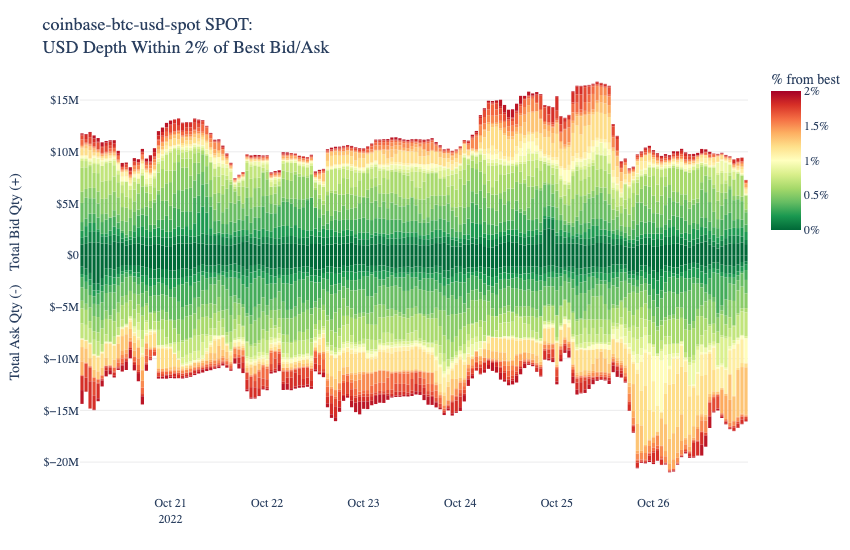

# Examining Orderbook Depth


Exchange order book data is one of the most foundational data types in the crypto asset industry— arguably, even more foundational than trades data, as two orders must be matched for a trade to occur. Order book data is useful for various entities, including market makers, systematic or quantitative traders, and funds studying trade execution patterns. The Coin Metrics **Market Data Feed** offering includes various API endpoints that allow users to retrieve order book snapshots and updates across a collection of top crypto exchanges.

### Resources

This notebook demonstrates basic functionality offered by the Coin Metrics Python API Client and Market Data Feed.

Coin Metrics offers a vast assortment of data for hundreds of cryptoassets. The Python API Client allows for easy access to this data using Python without needing to create your own wrappers using `requests` and other such libraries.

To understand the data that Coin Metrics offers, feel free to peruse the resources below.

* The [Coin Metrics API v4](https://docs.coinmetrics.io/api/v4) website contains the full set of endpoints and data offered by Coin Metrics.
* The [Coin Metrics Knowledge Base](https://docs.coinmetrics.io/info) gives detailed, conceptual explanations of the data that Coin Metrics offers.
* The [API Spec](https://coinmetrics.github.io/api-client-python/site/api\_client.html) contains a full list of functions.

### File Download

Download the entire notebook as either a jupyter notebook to run yourself or as a pdf from the two links below






### Notebook Setup

```python
import os
from os import environ
import sys
import pandas as pd
import numpy as np
import seaborn as sns
import logging
from datetime import date, datetime, timedelta
from coinmetrics.api_client import CoinMetricsClient
import json
import logging
from pytz import timezone as timezone_conv
from datetime import timezone as timezone_info
import matplotlib.ticker as mticker
from matplotlib.ticker import ScalarFormatter
import matplotlib.pyplot as plt
import matplotlib.dates as mdates
%matplotlib inline
import ast
import plotly.express as px
from tqdm import tqdm
from plotly import graph_objects as go
```

```python
sns.set_theme()
sns.set(rc={'figure.figsize':(12,8)})
```

```python
logging.basicConfig(
    format='%(asctime)s %(levelname)-8s %(message)s',
    level=logging.INFO,
    datefmt='%Y-%m-%d %H:%M:%S'
)
now = datetime.utcnow()
last_day_date_time = now - timedelta(hours = 24)
```

```python
# We recommend privately storing your API key in your local environment.
try:
    api_key = environ["CM_API_KEY"]
    logging.info("Using API key found in environment")
except KeyError:
    api_key = ""
    logging.info("API key not found. Using community client")

client = CoinMetricsClient(api_key)
```

```
2024-09-16 16:02:07 INFO     Using API key found in environment
```

## Order Book Depth

Coin Metrics collects and serves 3 types of order book snapshots.

* One type (_depth\_limit=100_) consists of a snapshot of the top 100 bids and top 100 asks taken once every 10 seconds for major markets.
* The second type (_depth\_limit=10pct\_mid\_price_) includes all levels where the price is within 10 percent of the midprice taken once every 10 seconds.
* The third type (_depth\_limit=full\_book_) consists of a full order book snapshot (every bid and every ask) taken once every hour for all markets that we are collecting order book data for . All of these snapshots are served through our HTTP API endpoint /timeseries/market-orderbooks.

```python
def get_order_books(market,start_time,end_time,depth_limit='full_book'):
    df = client.get_market_orderbooks(markets=market,
                                      start_time=start_time,
                                      end_time=end_time,
                                      depth_limit=depth_limit).to_dataframe()
    df.sort_values(by='time',inplace=True)
    return df
```

```python
market = 'coinbase-btc-usd-spot'
start_time = '2022-10-20'
end_time = '2022-10-26'
depth_limit = 'full_book'

df = get_order_books(market,start_time,end_time,depth_limit)
df.tail()
```

|     | market                | time                      | coin\_metrics\_id | asks                                               | bids                                               | database\_time                   |
| --- | --------------------- | ------------------------- | ----------------- | -------------------------------------------------- | -------------------------------------------------- | -------------------------------- |
| 163 | coinbase-btc-usd-spot | 2022-10-26 19:00:00+00:00 | 48876152429       | \[{'price': '20682.21', 'size': '0.001'}, {'pri... | \[{'price': '20680.45', 'size': '0.01098864'}, ... | 2022-10-26 19:02:04.331554+00:00 |
| 164 | coinbase-btc-usd-spot | 2022-10-26 20:00:00+00:00 | 48880595574       | \[{'price': '20777.57', 'size': '0.00182293'}, ... | \[{'price': '20776.49', 'size': '0.01019999'}, ... | 2022-10-26 20:01:16.705315+00:00 |
| 165 | coinbase-btc-usd-spot | 2022-10-26 21:00:00+00:00 | 48885094324       | \[{'price': '20748.12', 'size': '0.004'}, {'pri... | \[{'price': '20747.05', 'size': '0.00207858'}, ... | 2022-10-26 21:00:31.916195+00:00 |
| 166 | coinbase-btc-usd-spot | 2022-10-26 22:00:00+00:00 | 48888140842       | \[{'price': '20741.88', 'size': '0.47814895'}, ... | \[{'price': '20741.87', 'size': '0.00007231'}, ... | 2022-10-26 22:02:24.185607+00:00 |
| 167 | coinbase-btc-usd-spot | 2022-10-26 23:00:00+00:00 | 48892147093       | \[{'price': '20819.81', 'size': '0.03138949'}, ... | \[{'price': '20817.37', 'size': '0.09902'}, {'p... | 2022-10-26 23:01:42.564517+00:00 |

```python
def get_depth(df_orderbook,within=2):
    """
    Takes orderbook as returned by API and returns
    cumulative qty bid/offered at each snapshot and where the liquidity is: how far from best
    """
    dfs=[]
    for row in df_orderbook.itertuples():
        timestamp_ = row.time
        #asks
        asks = pd.DataFrame(ast.literal_eval(row.asks))
        asks["price"]=asks.price.apply(float)
        best_ask = float(asks.price.min())
        asks["size"]=asks['size'].apply(float)*-1
        asks["percent_from_best"]=((asks.price/best_ask)-1)*100
        #asks["best_ask"] = best_ask
        asks["time"] = timestamp_
        asks["side"] = "ask"
        asks["position"] = range(len(asks))
        asks["cumulative_vol"] = asks['size'].cumsum()
        asks["size_usd"] = asks["size"] * asks["price"]
        asks["cumulative_vol_usd"] = asks.size_usd.cumsum()
        #bids
        bids = pd.DataFrame(ast.literal_eval(row.bids))
        bids["price"]=bids.price.apply(float)
        best_bid = float(bids.price.max())
        bids["size"]=bids['size'].apply(float)
        bids["percent_from_best"]=abs(((bids.price/best_bid)-1)*100)
        #bids["best_bid"] = best_bid
        bids["time"] = timestamp_
        bids['side'] = 'bid'
        bids["position"] = range(len(bids))
        bids["cumulative_vol"] = bids['size'].cumsum()
        bids["size_usd"] = bids["size"] * bids["price"]
        bids["cumulative_vol_usd"] = bids.size_usd.cumsum()
        # within depth limit - default 2%
        asks = asks[asks.percent_from_best <= within]
        bids = bids[bids.percent_from_best <= within]
        # group into bins of 0.01% (1 bps)
        bids['grouping'] = pd.cut(bids.percent_from_best,bins=20,include_lowest=True,precision=1)
        asks['grouping'] = pd.cut(asks.percent_from_best,bins=20,include_lowest=True,precision=1)
        # collapse
        bids = bids.groupby('grouping').agg({"size":[sum],"size_usd":[sum]})#.cumsum()
        bids.index = [x/100 for x in range(1,201,10)]
        bids['side']='bid'

        asks = asks.groupby('grouping').agg({"size":[sum],"size_usd":[sum]})#.cumsum()
        asks.index = [x/100 for x in range(1,201,10)]
        asks['side']='asks'
        
        #concat together
        bids_asks = pd.concat([bids,asks])
        dfs.append(bids_asks)
    df_liquidity = pd.concat(dfs)
    df_liquidity['time'] = df_orderbook.time.iloc[0]
    df_liquidity.columns = ["size_ntv","size_usd","side","time"]
    #df_resampled_hourly = df_liquidity.groupby(['side','position']).resample('1h',on='time').mean()
    return df_liquidity
```

```python
# collapse into depth by distance from best bid/ask 
print("Getting order book data for {}...".format(market))
dfs=[]
for i in tqdm(range(len(df))):
    dfs.append(get_depth(df.iloc[i:i+1]))
    
# get rolling 3 hour window
df_aggregated = pd.concat(dfs)    
df_aggregated['pct_from_best'] = df_aggregated.index
df_aggregated.sort_values(["side","pct_from_best","time"],inplace=True)
df_aggregated['rolling_3hr_usd'] = df_aggregated.reset_index().groupby(['side','pct_from_best']).size_usd.rolling(3).mean().values
df_aggregated = df_aggregated[df_aggregated['rolling_3hr_usd'].notnull()].copy()
```

```
Getting order book data for coinbase-btc-usd-spot...


100%|█████████████████████████████████████████████████████████████████████████████| 168/168 [02:21<00:00,  1.19it/s]
```

```python
df_aggregated
```

|      | size\_ntv   | size\_usd     | side | time                      | pct\_from\_best | rolling\_3hr\_usd |
| ---- | ----------- | ------------- | ---- | ------------------------- | --------------- | ----------------- |
| 0.01 | -77.155769  | -1.470296e+06 | asks | 2022-10-20 02:00:00+00:00 | 0.01            | -1.105986e+06     |
| 0.01 | -66.058756  | -1.259527e+06 | asks | 2022-10-20 03:00:00+00:00 | 0.01            | -1.295243e+06     |
| 0.01 | -126.462072 | -2.409340e+06 | asks | 2022-10-20 04:00:00+00:00 | 0.01            | -1.713054e+06     |
| 0.01 | -230.090826 | -4.417017e+06 | asks | 2022-10-20 05:00:00+00:00 | 0.01            | -2.695295e+06     |
| 0.01 | -67.504299  | -1.292230e+06 | asks | 2022-10-20 06:00:00+00:00 | 0.01            | -2.706196e+06     |
| ...  | ...         | ...           | ...  | ...                       | ...             | ...               |
| 1.91 | 3.150618    | 6.389480e+04  | bid  | 2022-10-26 19:00:00+00:00 | 1.91            | 4.899971e+04      |
| 1.91 | 0.284205    | 5.790217e+03  | bid  | 2022-10-26 20:00:00+00:00 | 1.91            | 4.139945e+04      |
| 1.91 | 2.058624    | 4.189135e+04  | bid  | 2022-10-26 21:00:00+00:00 | 1.91            | 3.719212e+04      |
| 1.91 | 1.328615    | 2.703422e+04  | bid  | 2022-10-26 22:00:00+00:00 | 1.91            | 2.490526e+04      |
| 1.91 | 0.243678    | 4.974376e+03  | bid  | 2022-10-26 23:00:00+00:00 | 1.91            | 2.463332e+04      |

6640 rows × 6 columns

```python
def generate_depth_bar(df,title):
    fig = px.bar(df,
                 x=df.time,
                 y="rolling_3hr_usd",
                 height=550,
                 width=850,
                 color=df.index,
                 color_continuous_scale=px.colors.diverging.RdYlGn[::-1],
                 range_color=[0,2])
    fig.update_yaxes(matches=None, showticklabels=True, visible=True)
    fig.update_layout(
        title={
            'text': title,
            'font': {'family': 'arial', 'size': 18 }
        },
        font = { 'family': 'arial' },
        margin=dict(b=0),
        plot_bgcolor = 'white',
        yaxis_showgrid=True)
    fig.update_traces(marker_line_width=0)
    fig.update_yaxes(title="Total Ask Qty (-)    Total Bid Qty (+)", gridwidth=1, gridcolor='#ECECED')
    fig.update_xaxes(title="",matches=None, showticklabels=True, visible=True)
    fig.update_layout(coloraxis_colorbar=dict(
        title="% from best",
        thicknessmode="pixels", thickness=30,
        lenmode="pixels", len=180,
        yanchor="top", y=1, ticksuffix="%"
    ))
    fig.for_each_yaxis(lambda yaxis: yaxis.update(tickprefix="$"))
    return go.Figure(fig,layout=go.Layout(margin={'t': 30,'r': 10,'b': 0,'l': 30,'pad': 2,
    }))
```

```python
depth_chart = generate_depth_bar(df_aggregated,f"{market} SPOT:<br>USD Depth Within 2% of Best Bid/Ask")
```

<figure><figcaption></figcaption></figure>
