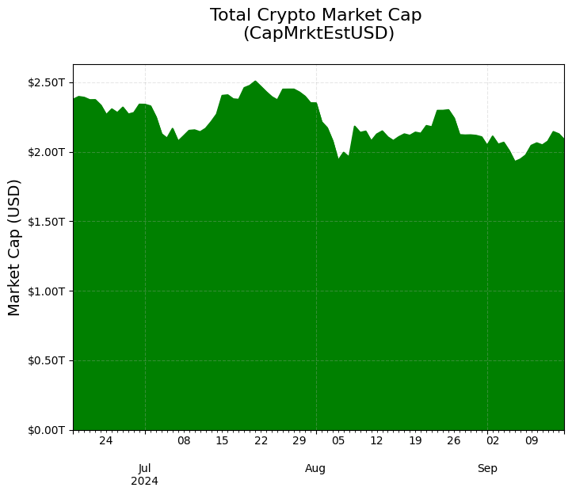

# Applying Different Types of Marketcap Metrics


This notebook demonstrates basic functionality offered by the Coin Metrics Python API Client and Network Data Pro.

Coin Metrics offers a vast assortment of data for hundreds of cryptoassets. The Python API Client allows for easy access to this data using Python without needing to create your own wrappers using `requests` and other such libraries.

### Resources

To understand the data that Coin Metrics offers, feel free to peruse the resources below.

* The [Coin Metrics API v4](https://docs.coinmetrics.io/api/v4) website contains the full set of endpoints and data offered by Coin Metrics.
* The [Coin Metrics Product Documentation](https://docs.coinmetrics.io/info) gives detailed, conceptual explanations of the data that Coin Metrics offers.
* The [API Spec](https://coinmetrics.github.io/api-client-python/site/api\_client.html) contains a full list of functions.

### File Download

Download the entire notebook as either a jupyter notebook to run yourself or as a pdf from the two links below






### Setup

```python
from os import environ
import sys
import pandas as pd
import numpy as np
import seaborn as sns
import logging
from datetime import date, datetime, timedelta
from coinmetrics.api_client import CoinMetricsClient
import json
import logging
import matplotlib.ticker as mticker
from matplotlib.dates import DateFormatter
from matplotlib.ticker import FuncFormatter
import matplotlib.pyplot as plt
import matplotlib.dates as mdates
%matplotlib inline
```

```python
logging.basicConfig(
    format='%(asctime)s %(levelname)-8s %(message)s',
    level=logging.INFO,
    datefmt='%Y-%m-%d %H:%M:%S'
)
```

```python
end_time = datetime.today().date()
start_time = end_time - timedelta(days=90)
```

```python
```

```python
# We recommend privately storing your API key in your local environment.
try:
    api_key = environ["CM_API_KEY"]
    logging.info("Using API key found in environment")
except KeyError:
    api_key = ""
    logging.info("API key not found. Using community client")


client = CoinMetricsClient(api_key)
```

```
2024-09-16 15:00:54 INFO     Using API key found in environment
```

## Market Cap Based on Verified On-Chain Supply

In order to trustlessly verify market capitalization, Coin Metrics directly indexes the blockchain to independently validate the amount of circulating supply.

The **CapMrktCurUSD** metric offers the most reliable measure of asset supply, with the trade-off of slightly limited asset coverage.

```python
df_reference_capmkrtcur = client.reference_data_asset_metrics(metrics='CapMrktCurUSD').to_dataframe()
```

```python
df_reference_capmkrtcur
```

|   | metric        | full\_name                                  | description                                       | product      | category | subcategory           | unit | data\_type | type    |
| - | ------------- | ------------------------------------------- | ------------------------------------------------- | ------------ | -------- | --------------------- | ---- | ---------- | ------- |
| 0 | CapMrktCurUSD | Capitalization, market, current supply, USD | The sum USD value of the current supply. Also ... | Network Data | Market   | Market Capitalization | USD  | decimal    | Product |

```python
list_capmrktcur_assets = [a['asset'] for a in client.catalog_asset_metrics_v2(metrics='CapMrktCurUSD')]
```

```python
print(f"Number of assets with Market Cap: {len(list_capmrktcur_assets)}")
```

```
Number of assets with Market Cap: 153
```

```python
capmrktcur = client.get_asset_metrics(
    assets=list_capmrktcur_assets,
    metrics='CapMrktCurUSD',
    start_time=start_time,
    end_time=end_time,
    page_size=1000
).to_dataframe()
```

```python
capmrktcur.head()
```

|   | asset | time                      | CapMrktCurUSD    |
| - | ----- | ------------------------- | ---------------- |
| 0 | 1inch | 2024-06-18 00:00:00+00:00 | 601806926.332868 |
| 1 | 1inch | 2024-06-19 00:00:00+00:00 | 669292018.418909 |
| 2 | 1inch | 2024-06-20 00:00:00+00:00 | 638964090.844949 |
| 3 | 1inch | 2024-06-21 00:00:00+00:00 | 602574091.306198 |
| 4 | 1inch | 2024-06-22 00:00:00+00:00 | 614578628.290457 |

```python
capmrktcur_pivot = capmrktcur.pivot(index='time',columns='asset',values='CapMrktCurUSD')
```

```python
capmrktcur_pivot['Total Cap'] = capmrktcur_pivot.sum(axis=1)
```

```python
capmrktcur_pivot
```

| asset                     | 1inch            | aave              | ada                | ae\_eth        | algo             | alpha           | ant              | avaxc             | avaxp              | avaxx            | ... | xem              | xlm                | xmr               | xrp                | xvg               | yfi              | zec              | zil\_eth       | zrx              | Total Cap    |
| ------------------------- | ---------------- | ----------------- | ------------------ | -------------- | ---------------- | --------------- | ---------------- | ----------------- | ------------------ | ---------------- | --- | ---------------- | ------------------ | ----------------- | ------------------ | ----------------- | ---------------- | ---------------- | -------------- | ---------------- | ------------ |
| time                      |                  |                   |                    |                |                  |                 |                  |                   |                    |                  |     |                  |                    |                   |                    |                   |                  |                  |                |                  |              |
| 2024-06-18 00:00:00+00:00 | 601806926.332868 | 1306437999.295638 | 13424730961.241064 | 8832610.158148 | 1339360258.68476 | 80619082.899196 | 352010549.615121 | 2388322499.746325 | 12838611730.911514 | 713309094.675862 | ... | 126980953.174033 | 9610695086.9286    | 3054203115.691232 | 49052418232.612778 | 6724446390.59112  | 212203308.017145 | 311270858.886043 | 2305684.889749 | 336195840.86146  | 2.229542e+12 |
| 2024-06-19 00:00:00+00:00 | 669292018.418909 | 1400637382.569757 | 13423644078.574947 | 9099450.288229 | 1382363720.84246 | 81094309.783218 | 356082846.868479 | 2414215130.39066  | 12984873845.978542 | 721319158.751801 | ... | 126674840.822162 | 9820585062.035196  | 3020726381.652565 | 49268483622.64537  | 6829094885.807176 | 217383791.66592  | 303049562.236562 | 2343771.624651 | 353937035.765548 | 2.237127e+12 |
| 2024-06-20 00:00:00+00:00 | 638964090.844949 | 1358825403.114587 | 13453912813.410269 | 9227041.800181 | 1383256522.94337 | 84522774.743021 | 350618174.842791 | 2471190230.800348 | 13321331442.85092  | 739621942.386422 | ... | 132373773.581515 | 9896582194.97669   | 3046146822.064857 | 48866370533.68499  | 6940480158.50313  | 216572442.484699 | 303519008.658101 | 2350164.716928 | 360417663.325525 | 2.231134e+12 |
| 2024-06-21 00:00:00+00:00 | 602574091.306198 | 1310711198.734895 | 13174182377.372046 | 9316984.240167 | 1391489499.4855  | 82641066.611264 | 353348338.081292 | 2456046637.217133 | 13261561451.744013 | 738741018.612855 | ... | 129064560.654881 | 9697203679.229527  | 2863904454.917198 | 48889782361.155952 | 6827462838.701295 | 213908822.241556 | 304438515.678476 | 2329727.25247  | 359650229.244396 | 2.214003e+12 |
| 2024-06-22 00:00:00+00:00 | 614578628.290457 | 1303628383.546602 | 13475267480.649416 | 9080680.725316 | 1339705315.54913 | 81442254.171929 | 351060582.670069 | 2342337218.532271 | 12381600154.273886 | 639220357.617559 | ... | 129465576.97741  | 9581669381.902111  | 2995259845.285223 | 48655540991.974068 | 7013277883.554922 | 214667247.899236 | 304854610.414748 | 2373452.370937 | 359377609.401009 | 2.213118e+12 |
| ...                       | ...              | ...               | ...                | ...            | ...              | ...             | ...              | ...               | ...                | ...              | ... | ...              | ...                | ...               | ...                | ...               | ...              | ...              | ...            | ...              | ...          |
| 2024-09-11 00:00:00+00:00 | 370795675.998745 | 2394157493.994128 | \<NA>              | 7086282.571463 | 1272138738.08548 | 55696931.758843 | 236080888.610476 | 2381194755.211256 | 11102231898.578779 | 561574500.581236 | ... | 150087591.429489 | 9790016731.104605  | 3120199983.171181 | 53527147783.98262  | 6095473842.098846 | 178156431.46414  | 459255827.96882  | 1810381.365383 | 277605159.385683 | 1.915254e+12 |
| 2024-09-12 00:00:00+00:00 | 384232522.92621  | 2327005794.360288 | \<NA>              | 7371122.985217 | 1299855257.21774 | 57785093.830921 | 236071341.779449 | 2452806790.290408 | 11431048630.015509 | 578191291.778559 | ... | 154361726.733294 | 9997934147.338022  | 3105706133.057552 | 56215867452.010078 | 6267860632.323607 | 178663216.244342 | 454920192.594087 | 1848757.475975 | 287032283.247654 | 1.939759e+12 |
| 2024-09-13 00:00:00+00:00 | 400557336.250521 | 2311665536.23392  | \<NA>              | 7832592.091806 | 1330044901.28941 | 58858736.968168 | 240512223.869399 | 2545118411.801699 | 11866069991.509184 | 600182210.371027 | ... | 157141907.013232 | 10153491708.845804 | 3064948299.210351 | 57221528978.257057 | 6405467690.943713 | 179478034.544076 | 473244206.395726 | 1885345.54056  | 297832199.512269 | 2.004984e+12 |
| 2024-09-14 00:00:00+00:00 | 393157001.05276  | 2244118799.251264 | \<NA>              | 7425554.562711 | 1312275710.52702 | 59357434.029832 | 241324187.737431 | 2585622436.498027 | 12055268780.843508 | 609742449.013718 | ... | 163021038.424844 | 10239633535.133228 | 3044883873.886052 | 59683009523.175056 | 6404671209.191757 | 180551959.332886 | 474742175.553408 | 1876469.594495 | 293961123.7075   | 1.991043e+12 |
| 2024-09-15 00:00:00+00:00 | 368561790.184033 | 2297900163.986864 | \<NA>              | 7423784.032991 | 1265330435.59742 | 56307463.023177 | 237024036.656687 | 2436809618.506954 | 11348207028.418108 | 574093158.696821 | ... | 160791667.882743 | 10027244938.128235 | 3063351773.476915 | 57120501674.456192 | 6073655509.257232 | 179087880.508707 | 453729407.723865 | 1816117.52146  | 286316863.361929 | 1.950918e+12 |

90 rows × 137 columns

```python
current_market_cap_last = capmrktcur_pivot['Total Cap'][-1]

formatted_market_cap = '${:,.2f}'.format(current_market_cap_last)

print('Current Market Cap based on verified on-chain supply: ' + formatted_market_cap)
```

```
Current Market Cap based on verified on-chain supply: $1,950,918,193,666.17
```

```python
plt.figure(figsize=(8, 6))
capmrktcur_pivot['Total Cap'].plot(kind='area', stacked=True)

# Set the title and labels
plt.title('Total Crypto Market Cap \n(CapMrktCurUSD)\n',fontsize=16)
plt.xlabel('') 
plt.ylabel('Market Cap (USD)',fontsize=14)
plt.grid(True, alpha=0.3, linestyle='--')
formatter = mticker.FuncFormatter(lambda x, pos: '${:,.2f}T'.format(x/1000000000000))
plt.gca().yaxis.set_major_formatter(formatter)

plt.savefig("ndp_capmrktcurusd.png");
```

<figure><figcaption></figcaption></figure>

## Estimated Market Cap

Due to the complexity of running blockchain nodes, some assets pose additional challenges in directly verifying supply data. Coin Metrics partners with CoinGecko to offer a "estimated supply" metric, sourced from a variety of third-party sources like token projects or blockchain explorers.

The **CapMrktEstUSD** metric offers slightly wider asset coverage, with the trade-off of leveraging more "trusted" sources for supply.

```python
df_reference_capmrktest = client.reference_data_asset_metrics(metrics='CapMrktEstUSD').to_dataframe()
```

```python
df_reference_capmrktest
```

|   | metric        | full\_name                                    | description                                       | product      | category | subcategory           | unit | data\_type | type    |
| - | ------------- | --------------------------------------------- | ------------------------------------------------- | ------------ | -------- | --------------------- | ---- | ---------- | ------- |
| 0 | CapMrktEstUSD | Capitalization, market, estimated supply, USD | The sum USD value of the estimated supply in c... | Network Data | Market   | Market Capitalization | USD  | decimal    | Product |

```python
list_capmrktest_assets = [a['asset'] for a in client.catalog_asset_metrics_v2(metrics='CapMrktEstUSD')]
```

```python
capmrktest = client.get_asset_metrics(
    assets=list_capmrktest_assets,
    metrics='CapMrktEstUSD',
    start_time=start_time,
    end_time=end_time,
    page_size=10000
).to_dataframe()
```

```python
capmrktest_pivot = capmrktest.pivot(index='time',columns='asset',values='CapMrktEstUSD')
```

```python
capmrktest_pivot['Total Cap'] = capmrktest_pivot.sum(axis=1)
```

```python
est_market_cap_last = capmrktest_pivot['Total Cap'][-1]

formatted_est_market_cap = '${:,.2f}'.format(est_market_cap_last)

print('Estimated Market Cap based on estimated supply (3rd-party sources): ' + formatted_est_market_cap)
```

```
Estimated Market Cap based on estimated supply (3rd-party sources): $2,084,782,376,216.38
```

```python
plt.figure(figsize=(8, 6))

capmrktest_pivot['Total Cap'].plot(kind='area', stacked=True, color='green')
plt.title('Total Crypto Market Cap \n(CapMrktEstUSD)\n',fontsize=16)
plt.xlabel('') 
plt.ylabel('Market Cap (USD)',fontsize=14)
plt.grid(True, alpha=0.3, linestyle='--')

formatter = mticker.FuncFormatter(lambda x, pos: '${:,.2f}T'.format(x/1000000000000))
plt.gca().yaxis.set_major_formatter(formatter)

plt.show()
```

<figure><figcaption></figcaption></figure>

## Free Float Market Cap

While traditional market capitalization metrics rely on circulating supply to quantify the aggregate value of an asset, circulating supply may not necessarily be the appropriate metric for measuring the liquid, readily-available count of units available on the markert.

Free Float Market Capitalization, or **CapMrktFFUSD**, is a measure of the market value of an asset’s supply that is issued and available to market participants. This excludes supply that is held by insiders (i.e. protocol treasuries), controlling investors, and long term strategic holders (units with 5+ years of inactivity).

```python
df_reference_capmrktffusd = client.reference_data_asset_metrics(metrics='CapMrktFFUSD').to_dataframe()
```

```python
df_reference_capmrktffusd
```

|   | metric       | full\_name                              | description                                       | product      | category | subcategory           | unit | data\_type | type    |
| - | ------------ | --------------------------------------- | ------------------------------------------------- | ------------ | -------- | --------------------- | ---- | ---------- | ------- |
| 0 | CapMrktFFUSD | Capitalization, market, free float, USD | The sum USD value of the current free float su... | Network Data | Market   | Market Capitalization | USD  | decimal    | Product |

```python
catalog_ff = client.catalog_asset_metrics_v2(metrics='CapMrktFFUSD').to_list()
```

```python
catalog_ff[:5]
```

```
[{'asset': '1inch',
  'metrics': [{'metric': 'CapMrktFFUSD',
    'frequencies': [{'frequency': '1d',
      'min_time': '2020-12-26T00:00:00.000000000Z',
      'max_time': '2024-09-15T00:00:00.000000000Z',
      'community': True}]}]},
 {'asset': 'aave',
  'metrics': [{'metric': 'CapMrktFFUSD',
    'frequencies': [{'frequency': '1d',
      'min_time': '2020-10-10T00:00:00.000000000Z',
      'max_time': '2024-09-15T00:00:00.000000000Z',
      'community': True}]}]},
 {'asset': 'ada',
  'metrics': [{'metric': 'CapMrktFFUSD',
    'frequencies': [{'frequency': '1d',
      'min_time': '2017-12-01T00:00:00.000000000Z',
      'max_time': '2024-09-08T00:00:00.000000000Z',
      'community': True}]}]},
 {'asset': 'aion_eth',
  'metrics': [{'metric': 'CapMrktFFUSD',
    'frequencies': [{'frequency': '1d',
      'min_time': '2017-12-22T00:00:00.000000000Z',
      'max_time': '2023-03-03T00:00:00.000000000Z',
      'community': True}]}]},
 {'asset': 'algo',
  'metrics': [{'metric': 'CapMrktFFUSD',
    'frequencies': [{'frequency': '1d',
      'min_time': '2019-06-22T00:00:00.000000000Z',
      'max_time': '2024-09-15T00:00:00.000000000Z',
      'community': True}]}]}]
```

#### Comparing BTC market capitalization with BTC free float market capitalization

```python
btc_ff_and_cur = client.get_asset_metrics(
    assets='btc',
    metrics=['CapMrktFFUSD','CapMrktCurUSD'],
    start_time=start_time,
    end_time=end_time
).to_dataframe()
```

```python
btc_ff_and_cur
```

|     | asset | time                      | CapMrktCurUSD        | CapMrktFFUSD        |
| --- | ----- | ------------------------- | -------------------- | ------------------- |
| 0   | btc   | 2024-06-18 00:00:00+00:00 | 1283620750458.029053 | 892930547450.634399 |
| 1   | btc   | 2024-06-19 00:00:00+00:00 | 1279047103315.121094 | 889718923157.247559 |
| 2   | btc   | 2024-06-20 00:00:00+00:00 | 1279448394407.814453 | 889934057173.784424 |
| 3   | btc   | 2024-06-21 00:00:00+00:00 | 1263474830674.393311 | 878772804275.674194 |
| 4   | btc   | 2024-06-22 00:00:00+00:00 | 1266898089628.073975 | 881035407234.292114 |
| ... | ...   | ...                       | ...                  | ...                 |
| 85  | btc   | 2024-09-11 00:00:00+00:00 | 1133986205007.474609 | 785339554938.315308 |
| 86  | btc   | 2024-09-12 00:00:00+00:00 | 1148145814023.138916 | 795139187847.963867 |
| 87  | btc   | 2024-09-13 00:00:00+00:00 | 1195818457804.406494 | 828180803304.224121 |
| 88  | btc   | 2024-09-14 00:00:00+00:00 | 1185380845498.997314 | 820893975766.963257 |
| 89  | btc   | 2024-09-15 00:00:00+00:00 | 1168079552742.053711 | 808927520410.375    |

90 rows × 4 columns

```python
plt.figure(figsize=(8, 6))

plt.plot(btc_ff_and_cur['time'], btc_ff_and_cur['CapMrktCurUSD'] / 1e9, label='Market Cap', color='blue')
plt.plot(btc_ff_and_cur['time'], btc_ff_and_cur['CapMrktFFUSD'] / 1e9, label='Free Float Market Cap', color='green')

plt.title('Bitcoin Market Cap Over Time\n(Circulating vs. Free Float Supply)\n', fontsize=16)
plt.xlabel('')
plt.ylabel('Market Cap (USD)', fontsize=14)
plt.grid(True, alpha=0.3, linestyle='--')

formatter = mticker.FuncFormatter(lambda x, pos: '${:,.0f}B'.format(x))
plt.gca().yaxis.set_major_formatter(formatter)
plt.gca().xaxis.set_major_locator(mdates.AutoDateLocator())
plt.gca().xaxis.set_major_formatter(mdates.ConciseDateFormatter(mdates.AutoDateLocator()))

plt.legend()

plt.show()

```

<figure><figcaption></figcaption></figure>
